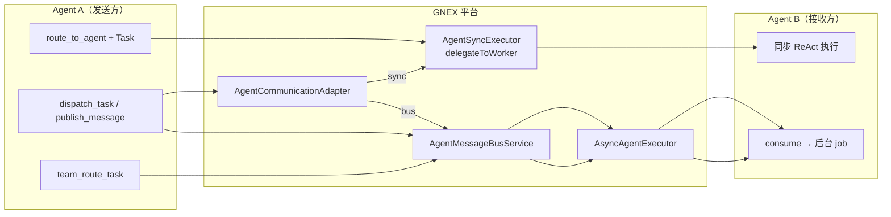
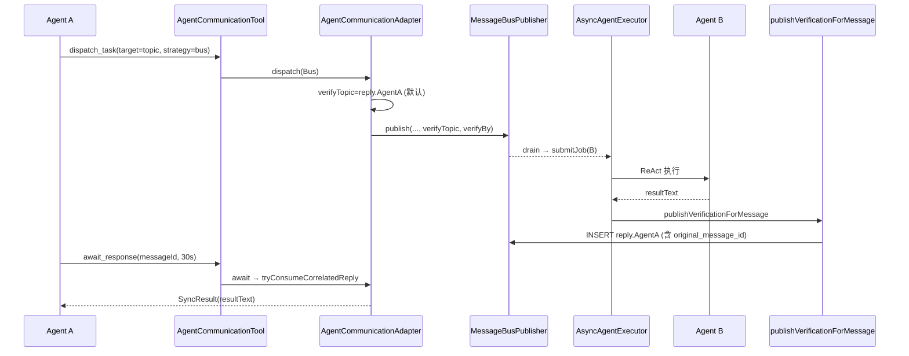

# Agent 间通信链路

本文档描述 GNEX 中 Agent 之间如何通信：**不直连**，全部经平台运行时（同步委派 / 消息总线 / 统一通信层）。

相关文档：[BUSINESS-ARCHITECTURE.md](./BUSINESS-ARCHITECTURE.md) §5 团队协作用、[DEV-PLAN.md](../DEV-PLAN.md) Phase 13。
**⚠️ v1.0 已知约束**：[V1-CODE-REALITY.md](./V1-CODE-REALITY.md) §3.2 记录了 PlanExecutor 异步 dispatch 失败的教训，设计消息总线时须参考。

---

## 总览：三条通信路径



| 路径 | 工具入口 | 是否阻塞发送方 | 典型场景 |
|------|----------|----------------|----------|
| **同步委派** | `route_to_agent` → `Task` / `delegateToWorker` | 是 | 明确知道找谁，要等结果 |
| **消息总线** | `publish_message` / `dispatch_task(strategy=bus)` | 否 | 事件广播、团队 topic、多订阅者 |
| **批量并行** | `dispatch_task(strategy=batch)` | 异步 join | 同一团队多任务并行 |

### 三种机制选择规则

```
任务需要多个 agent 协作？
│
├─ 调用者知道找哪个 agent、需要等结果 → 直接委派（route_to_agent → Task）
├─ 调用者知道要做什么但不知道谁做、需要等结果 → spawn subagent / batch 并行
└─ 异步/持久/多对多/事件驱动 → Agent Teams + 消息总线
```

**约束**：同一协作场景只用一种机制，不混用同步委派与消息总线。

---

## 链路 1：同步委派（`route_to_agent` → `Task`）

**场景**：Coordinator 明确知道找谁，**阻塞等结果**。

```mermaid
sequenceDiagram
    participant LLM as Coordinator LLM
    participant Router as AgentRouterTool
    participant Task as TaskTool
    participant Sub as SubAgentExecutorAdapter
    participant Sync as AgentSyncExecutor
    participant Loop as ReActLoop
    participant Worker as Worker Agent

    LLM->>Router: route_to_agent(task)
    Router-->>LLM: MATCH agent=code-reviewer
    LLM->>Task: Task(subagent_type, prompt)
    Task->>Sub: execute(TaskCall)
    Sub->>Sync: delegateToWorker(agent, task)
    Sync->>Sync: VirtualThread + timeout join
    Sync->>Loop: syncExecute → reactLoop.execute
    Loop->>Worker: 多轮 tool 调用
    Worker-->>Loop: 最终文本
    Loop-->>Sync: ReActResult
    Sync-->>Task: 摘要字符串
    Task-->>LLM: 返回父 context
```

### 调用步骤

| 步 | 组件 | 说明 |
|----|------|------|
| 1 | `AgentRouterTool.routeToAgent` | 语义匹配 Worker，返回 `MATCH: agent=xxx` |
| 2 | `TaskTool` | LLM 同轮调用 `Task(subagent_type=xxx)` |
| 3 | `SubAgentExecutorAdapter.execute` | 桥接到 `AgentRuntimePort.delegateToWorker` |
| 4 | `AgentSyncExecutor.delegateToWorker` | Virtual Thread 异步跑，**父线程 join 等结果** |
| 5 | `AgentSyncExecutor.syncExecute` | 加载 Agent、沙箱校验、建 Worker tools |
| 6 | `ReActLoop.execute` | Worker 完整 ReAct 循环 |
| 7 | 返回 | 摘要文本回到 Coordinator 的 tool result |

### 关键代码路径

```
d3-orchestration/.../AgentRouterTool.java          route_to_agent
gnex-core/.../SubAgentExecutorAdapter.java       Task → delegateToWorker
gnex-core/.../AgentSyncExecutor.java               syncExecute → ReActLoop
d4-runtime/.../ReActLoop.java                      Worker 多轮执行
```

- `delegateToWorker` 可配置 `gnex.delegate-timeout-ms`；超时返回 `ERROR: Delegation timed out`
- Worker 中间推理**不回流**父 context，父 Agent 只看到 `result.text()` 摘要
- WorkFlow SQUAD 节点、团队 batch 底层也走 `delegateToWorker`

---

## 链路 2：消息总线（`publish_message`，不等结果）

**场景**：按 topic 广播，多个订阅者各自后台处理；发送方不等待。

```mermaid
sequenceDiagram
    participant A as Agent A (发送方)
    participant Tool as AgentMessageBusTool
    participant Pub as MessageBusPublisher
    participant DB as agent_message_bus
    participant Drain as MessageBusBacklogDrainer
    participant Con as MessageBusConsumer
    participant Job as AsyncAgentExecutor
    participant Loop as ReActLoop
    participant B as Agent B (接收方)

    A->>Tool: publish_message(sender, topic, payload)
    Tool->>Pub: publish(...)
    Pub->>Pub: 匹配 message_subscription
    Pub->>DB: 每个订阅者 INSERT 一条 PENDING
    Pub->>Drain: triggerBacklogDrainAfterCommit(B)
    Drain->>Con: consume(B, dispatch=true)
    Con->>DB: claim PENDING 消息
    Con->>Job: submitJob(B, taskFromPayload)
    Job->>Loop: executeInBackground → ReActLoop
    Loop->>B: Worker 执行
    Note over A,B: Agent A 不等待，继续自己的循环
```

### 调用步骤

| 步 | 组件 | 说明 |
|----|------|------|
| 1 | `AgentMessageBusTool.publishMessage` | Agent 工具入口 |
| 2 | `MessageBusPublisher.publish` | 反压检查 → 匹配 `message_subscription` |
| 3 | `MessageBusMessageStore.insertMessage` | Fan-out：每个订阅 agent 各一条；competing 模式 `target_agent=null` |
| 4 | `MessageBusBacklogDrainer.drainAgentInbox` | 事务提交后自动拉 inbox（通常无需手动 `consume_message`） |
| 5 | `MessageBusConsumer.consume` | 取 oldest pending → claim（fan-out 或 competing 乐观锁） |
| 6 | `MessageBusSupport.buildTaskFromMessage` | payload 包成 ReAct 任务文本 |
| 7 | `AsyncAgentExecutor.submitJob` | 登记 `agent_job` → Virtual Thread 后台跑 |
| 8 | `ReActLoop.execute` | 接收方 Agent 独立执行 |

### 消息转任务格式

```
[Message Bus] topic={topic}, from={senderAgent}

{payload}
```

### Topic 约定

| Topic | 含义 |
|-------|------|
| `team.{teamId}` | 成员加入团队时**自动订阅**（`AgentTeamService.autoSubscribe`） |
| `reply.{agentName}` | Cross-Check 回复收件箱（`MessageBusTopics.agentReply`） |
| `actions.{tenant}.{sandbox}` | 沙箱动作事件 |
| 自定义 + 通配符 | `team.*`、`alerts.**` 等 |

### 关键代码路径

```
d8-bus/.../AgentMessageBusTool.java
d8-bus/.../MessageBusPublisher.java
d8-bus/.../MessageBusConsumer.java
d8-bus/.../MessageBusBacklogDrainer.java
d3-orchestration/.../AsyncAgentExecutor.java
```

### 物理数据流

```
message_subscription (agent ↔ topic pattern)
        ↓ publish 匹配
agent_message_bus (status=PENDING → CONSUMED / DEAD)
        ↓ consume + dispatch
agent_job (jobId) + TaskRepository
        ↓
ReActLoop → execution_log
```

---

## 链路 3：发任务 + 等回复（`dispatch_task` → `await_response`）

**场景**：走总线异步投递，发送方通过 Cross-Check **阻塞等结果**。



### 调用步骤

| 步 | 说明 |
|----|------|
| 1 | `dispatch_task` → `AgentCommunicationAdapter.dispatchBus` |
| 2 | 默认 `awaitReply=true` → `verifyTopic = reply.{sender}` |
| 3 | 消息写入 DB，`taskHandles` 登记 messageId |
| 4 | B 后台跑完 → `AsyncAgentExecutor.publishVerificationIfNeeded` |
| 5 | `MessageBusPublisher.publishVerificationForMessage` 往 `reply.{sender}` 写 JSON（含 `original_message_id`） |
| 6 | A 调 `await_response` → 轮询 `tryConsumeCorrelatedReply` |
| 7 | 解析 `MessageBusVerificationReplies` 返回给 A |

### 失败与重试

- Job 失败（非用户 cancel）→ `requeueMessage` 原消息重新 `PENDING`
- 消费失败超限 → `DEAD` 死信，运营 UI 可复活
- 团队 pause → 订阅不参与 fan-out，`consume` 拒绝

### 关键代码路径

```
d8-bus/.../AgentCommunicationTool.java
d8-bus/.../AgentCommunicationAdapter.java
d8-bus/.../MessageBusPublisher.java          publishVerificationForMessage
d3-orchestration/.../AsyncAgentExecutor.java publishVerificationIfNeeded
gnex-contracts/.../MessageBusTopics.java     agentReply(sender)
```

---

## 链路 4：平台代发（WorkFlow SQUAD / 团队路由）

**场景**：非 Agent 主动调工具，由工作流或 Chat 触发。

```
WorkflowEngine (SQUAD 节点)
  → WorkflowSquadExecutor.execute
  → parseConfig("teamId:tag:task")
  → AgentTeamService.routeTask / routeToLeader
       → TeamTaskRouter（标签 → 健康度 → 负载 → Leader）
  → AgentRuntimePort.delegateToWorker(member, task)   // 回到链路 1
  → 结果写入 workflow context
```

### SQUAD 配置语法

| 配置 | 含义 |
|------|------|
| `teamId:tag:task` | 按 tag 路由成员 |
| `teamId::task` | 无 tag → `routeToLeader` |
| `teamId:tag:task:parallel:N` | N 路并行，每路 `delegateToWorker` |
| `teamId:tag:task:batch:N` | N 个任务 `executeBatchAsync` |

### Chat `@Team`

`ChatController.resolveTeamMentions` + `ChatInput` 自动补全 → 注入 orchestrator 输入 → 可走团队路由。

### 关键代码路径

```
d3-orchestration/.../WorkflowSquadExecutor.java
d3-orchestration/.../TeamTaskRouter.java
d3-orchestration/.../AgentTeamService.java
```

---

## Agent 工具面（链路入口）

在 `AgentToolBootstrap` 注册，经 `CoordinatorToolPolicy` 过滤后 Coordinator 仅保留编排类工具。

### 底层总线

| 工具 | 作用 |
|------|------|
| `publish_message` | 发布到 topic |
| `consume_message` | 拉取 inbox（默认触发后台 job） |
| `subscribe` / `unsubscribe` | 订阅 / 取消 topic pattern |

### 高层抽象（推荐）

| 工具 | 作用 |
|------|------|
| `dispatch_task` | 按 strategy 路由 sync / bus / batch |
| `await_response` | 阻塞等 task_id 结果 |
| `listen_for_events` / `stop_listening` | 订阅 / 取消 |
| `cancel_task` | 取消 batch |

### 团队专用

| 工具 | 作用 |
|------|------|
| `team_route_task` | 选成员（不直接执行，常配合 `publish_message`） |
| `team_resolve_tag` | `@tag` → agent 名 |
| `team_health` / `team_list_members` | 可观测 |

### 同步委派

| 工具 | 作用 |
|------|------|
| `route_to_agent` | 语义路由，返回 MATCH |
| `Task` / `TaskOutput` | 实际委派与查异步 job 结果 |

---

## `AgentCommunicationAdapter` 策略

| strategy | 后端 |
|----------|------|
| `SYNC_DELEGATE` | `AgentRuntimePort.delegateToWorker` |
| `MESSAGE_BUS` | `AgentMessageBusService.publish` |
| `BATCH_DELEGATE` | `TeamTaskRoutingPort.executeBatchAsync` |
| `AUTO` | `metadata.batch` → batch；`metadata.async/bus` 或 topic 含 `.`/`*` → bus；否则 sync |

---

## 三条链路对比

| | 链路 1 同步委派 | 链路 2 消息总线 | 链路 3 dispatch+await |
|--|----------------|----------------|----------------------|
| **入口工具** | `Task` | `publish_message` | `dispatch_task` + `await_response` |
| **执行器** | `AgentSyncExecutor` | `AsyncAgentExecutor` | Bus + Async |
| **发送方阻塞** | 是 | 否 | 是（await 轮询） |
| **持久化** | 无（内存 Future） | `agent_message_bus` | 同链路 2 + reply topic |
| **结果回传** | tool result 直接返回 | 不回传（可用 `TaskOutput` 查 job） | `reply.{sender}` Cross-Check |

---

## 可靠性机制

| 机制 | 说明 |
|------|------|
| 持久化 | SQLite `agent_message_bus`，重启不丢 |
| 反压 | 单 agent pending 超限拒绝 publish |
| 死信 | 指数退避重试，超限 `DEAD` |
| 暂停 | 团队 pause → 订阅不参与 fan-out |
| 竞争消费 | competing 消息，乐观锁 `claimed_by`，先 claim 先处理 |
| 预算 | `AsyncAgentExecutor.submitJob` 前 `budgetPort.checkBudget` |

---

## 模块归属

| 包 / 模块 | 职责 |
|-----------|------|
| `d8-bus` | 消息总线、`AgentCommunicationAdapter` |
| `d3-orchestration` | `AgentTeamService`、`AsyncAgentExecutor`、`WorkflowSquadExecutor` |
| `gnex-core` | `AgentSyncExecutor`、`SubAgentExecutorAdapter`、`AgentToolBootstrap` |
| `d4-runtime` | `ReActLoop`、`CoordinatorToolPolicy` |
| `gnex-contracts` | `AgentCommunicationPort`、`MessageBusTopics` |
| `d9-platform` | `agent_message_bus`、`message_subscription` 实体与 Mapper |

---

## 相关 REST API

| 端点 | 用途 |
|------|------|
| `POST /api/agent-teams/{id}/route` | 调试团队路由 |
| `POST /api/agent-teams/{id}/batch/execute` | 异步批量委派 |
| `POST /api/agent-teams/{id}/pause\|resume` | 团队级干预 |
| Message Bus Controller | 运营：订阅、死信、重试 |

---

## 延伸阅读

- [TEAM-MODULE-SPLIT.md](./TEAM-MODULE-SPLIT.md) — M3 编排与协作模块
- [DEV-PLAN.md](../DEV-PLAN.md) — Phase 13 Agent Teams 完整清单
- [TECHNICAL-ARCHITECTURE.md](./TECHNICAL-ARCHITECTURE.md) — Chat / ReAct 主链路
- [RUNTIME-EVOLUTION.md](./RUNTIME-EVOLUTION.md) — SessionLoop（Netty 启发）、Worker 总线总控、72h 长任务稳定性（设计定稿）
- [SESSION-EVENT-LOOP.md](./SESSION-EVENT-LOOP.md) — **SessionLoop 架构 SSOT**（组件、Pipeline、时序、迁移）

---

## Worker 经消息总线收发（设计方向）

当前 **已落地** 能力：

- Worker 调用 `publish_message` 向 topic 广播（未被 Coordinator 沙箱禁止）
- 订阅者 inbox → `MessageBusBacklogDrainer` → `AsyncAgentExecutor` → Virtual Thread → `ReActLoop`
- `dispatch_task(strategy=bus)` + `await_response` 可异步投递并等待 Cross-Check 回复

**规划演进**（见 [RUNTIME-EVOLUTION.md §3](./RUNTIME-EVOLUTION.md)）：

- **Per-Agent EventLoop**：每个 Agent inbox 串行消费，避免 drain while 竞态
- **control topic**：`run.control.{runId}` 承载 CANCEL / PAUSE / STEERING（跨 session、跨节点）
- **与 Chat steering 分工**：UI 低延迟改向仍走 session `MessageQueue`（Phase 2 合并为 PriorityInboundQueue）；团队/后台/长任务走 bus

**不宜**用消息总线完全替代主 Chat 的同步 Task 与 turn 边界 steering — latency 与 UX 要求不同。

---

## 长任务（72h+）与消息总线

72 小时级任务 **不能** 依赖单条 SSE 或单次 `AsyncAgentExecutor` Future 跑到底。稳定模型：

1. 持久 **LongRun** 状态（扩展 `agent_job` 或新表）
2. **分片** ReAct（每片有限 turn）→ checkpoint → `publish(run.continue)`
3. **租约 + Watchdog** 检测 STALLED → requeue
4. 用户通过 `GET /api/runs/{id}` 轮询或 webhook，而非 72h SSE

详见 [RUNTIME-EVOLUTION.md §4](./RUNTIME-EVOLUTION.md)。Always-On 周期循环与 WorkFlow 多步审批为另外两条已存在的长任务路径。
