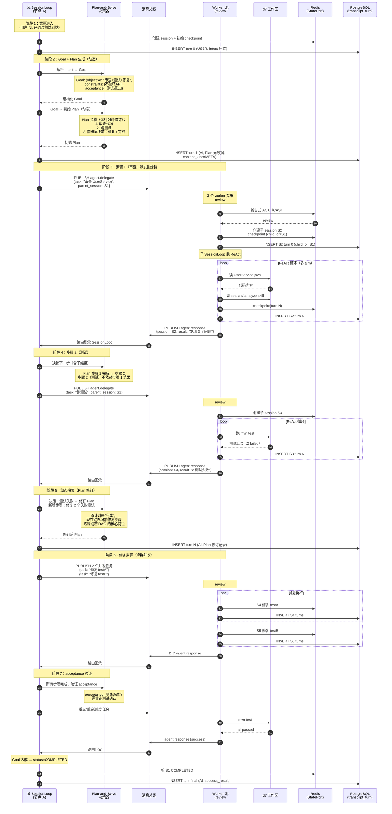

# gnex-agent-service + gnex-agent-sdk 设计文档

> **版本**：v2.3（2026-07-03）— §4/§5/§10 标 v2.0/v2.1+ 范围；新增 §10.7 v2.0 范围澄清
> **执行内核 SSOT**：[SESSION-EVENT-LOOP.md](./SESSION-EVENT-LOOP.md)（**SessionLoop** 统一会话调度；**无独立外环 / 无双循环**）
> **文档角色**：agent-service + agent-sdk 合体模块地图与演进路线图；③ 见 [ORCHESTRATION-LAYER.md](./ORCHESTRATION-LAYER.md)，④ 见 [RUNTIME-LAYER.md](./RUNTIME-LAYER.md)
> **设计依据**：~~[GNexCore架构设计_2.1.html](../GNexCore架构设计_2.1.html)~~（⚠️ 外部 HTML 已不在仓库，相关内容已内化到 [ARCHITECTURE.md](./ARCHITECTURE.md)）· [INTELLIGENT-ENGINE-INTERFACES.md](./INTELLIGENT-ENGINE-INTERFACES.md)
> **关联接口**：[ORCHESTRATION-INTERFACE-REFERENCE.md](./ORCHESTRATION-INTERFACE-REFERENCE.md) · [RUNTIME-INTERFACE-REFERENCE.md](./RUNTIME-INTERFACE-REFERENCE.md)

> **Phase 编号说明**：本文 §10 用 **`Cap-Phase-N`**（capability，能力演进：5=SDK 抽离 / 6=SessionLoop 落地 / 7=StatePort / 8+=Agentic）。与 [AGENTOS-SPLIT.md](./AGENTOS-SPLIT.md) §9 的 **`Split-Phase-N`**（代码搬迁 + 中间件引入：3=Redis Stream / 6=代码拆分 / 7=多副本 / 7+=跨节点 P2）语义不同，跨文档引用时统一用命名空间前缀避免歧义。

> **⚠️ v1.0 代码对照**：[V1-CODE-REALITY.md](./V1-CODE-REALITY.md)——内置 agent 名是 `default-worker`（Java 常量）而非 `assistant.md` 文件；§5.3 的"执行树可观测 / 环检测"已部分落地

---

## 0. 一句话定位

**gnex-agent-service + gnex-agent-sdk** 共同承载 GNEX Agent 热路径：agent-service 是 Spring Boot 门面（③ 编排 + 适配 + Port 实现），agent-sdk 是执行内核（**SessionLoop** 调度 + **ReActTurnLoop** 单轮推理 + 记忆 + 安全）。两者经 `gnex-contracts` Port 解耦。

**会话调度模型（定稿）**：Chat / steering / follow-up / 消息总线入站，统一经 `SessionLoop`（`SessionChannel` + `PriorityInboundQueue` + `runOneTurn()`）。详见 [SESSION-EVENT-LOOP.md](./SESSION-EVENT-LOOP.md)。

| 2.1 产品模块 | Owner | 说明 |
|-------------|:----------:|------|
| 推理引擎 · 记忆 · 动作派发 | agent-sdk | ④ 运行时 |
| 意图识别 · 任务编排 · Team/Workflow | agent-service（+ platform-service Workflow） | ③ 编排 |
| HTTP/SSE 入口 | agent-service `controller/`（迁移期；目标态归 ②） | [LAYER-ARCHITECTURE.md](./LAYER-ARCHITECTURE.md) |

### 0.1 核心能力清单

| 能力 | 实现 | SSOT |
|------|------|------|
| **会话调度** | `SessionLoop` · `PriorityInboundQueue` · `SessionChannel` | [SESSION-EVENT-LOOP.md](./SESSION-EVENT-LOOP.md) |
| **单轮 ReAct** | `ReActTurnLoop`（PREP→think→act→observe），由 `runOneTurn()` 调用 | 本文 §3.2 · [RUNTIME-LAYER.md](./RUNTIME-LAYER.md) |
| **Steering / cancel** | 高优 `InboundEvent` 入队 + WebSocket cancel | SESSION-EVENT-LOOP §5.2 |
| **状态持久化** | `StatePort` + checkpoint（dev：SQLite；prod：Redis + PG） | [INTELLIGENT-ENGINE-INTERFACES.md §5](./INTELLIGENT-ENGINE-INTERFACES.md) |
| **Agent 间协作** | `AgentCommunicationPort` → bus Topic | 本文 §5 · [INTERFACES §4](./INTELLIGENT-ENGINE-INTERFACES.md) |
| **SDK 边界** | Enforcer 零 service import | 本文 §11 |

---

## 1. 与 2.1 产品架构对齐

| 2.1 模块 | Owner | 物理模块 | 核心类 |
|----------|-------|----------|--------|
| **意图识别** | agent-service（③） | `runtime/AgentRouter.java` | bigram + token boost |
| **推理引擎** | agent-sdk（④） | `loop/` + `react/ReActTurnLoop` | SessionLoop → runOneTurn → ReActTurnLoop |
| **任务编排** | agent-service + platform-service | `team/` + `workflow/` | Team* · **`WorkflowEngine`** |
| **记忆与上下文** | agent-sdk + adapter | `memory/` + Port 适配 | GnexMemoryService · ContextCompactor · ReActCheckpointService |
| **任务执行（派发）** | agent-sdk | `boundary/` | InspectorChain · SandboxPort |

```
② 控制层·Agent引擎              gnex-agent-service
   ├── 编排                         Orchestrator
   ├── 会话调度 + ReAct 单轮         agent-sdk SessionLoop → ReActTurnLoop
   ├── Agent 间协作                   AgentCommunicationPort → bus
   └── 意图识别 / 校验                AgentRouter · governance Port

③ 网关层·模型网关                  LlmConfigPort
④ 执行层·沙箱池                    sandbox-runtime + SandboxPort
```

---

## 2. 两 artifact 的职责边界

```
gnex-agent-service                    gnex-agent-sdk
│                                     │
├─ Controller (REST/SSE) [迁移期]    ├─ loop/ SessionLoop（会话调度 SSOT）
├─ Orchestrator / AgentRouter        ├─ runtime/ ReActTurnLoop（单轮引擎）
├─ Team / PlanExecutor                 ├─ PhasedAgentLoop / AgentRuntime
├─ AgentSyncExecutor [glue→SDK]       ├─ PriorityInboundQueue · SessionChannel
├─ AgentCollaborator                  ├─ ContextCompactor / ReActCheckpointService
├─ Adapter / tools / Port 适配器      ├─ boundary/ InspectorChain
└─ SSE (RunEventPublisher)            └─ memory/ · Hook · GnexMemoryService
```

| 维度 | gnex-agent-service | gnex-agent-sdk |
|------|-------------------|----------------|
| **角色** | 门面 + 编排 + 适配 | SessionLoop + ReAct 单轮引擎 |
| **调度** | 经 `SessionLoopPort.fireInbound` 触发 | Owner：`SessionLoop` |
| **依赖方向** | 依赖 SDK | 零依赖 service |

**边界铁律：**
- SDK 不得 import service / platform / bus 具体类；一律 contracts Port
- agent-service 不直接操作 ReActTurnLoop 内部状态；经 `SessionLoopPort` / `CoordinatorRuntimePort` 调用

---

## 3. 内部模块架构

### 3.1 gnex-agent-service

```
com.gnex.agent
├── controller/       ← ChatController · ChatControlController（fireInbound）
├── runtime/          ← Orchestrator · AgentRouter · PlanExecutor · AgentCollaborator
│                       AgentSyncExecutor · SessionManager · AlwaysOnRunner
├── team/             ← AgentTeamService · TeamBatchExecutor · AgentRoomService
├── adapter/ · tools/ · service/ · workspace/ · budget/ · output/
```

### 3.2 gnex-agent-sdk

```
com.gnex.agent
├── loop/                  ← SSOT：[SESSION-EVENT-LOOP.md](./SESSION-EVENT-LOOP.md)
│   ├── SessionLoop              ← 唯一会话调度循环
│   ├── SessionChannel           ← IDLE/RUNNING/YIELD/PAUSED/FAILED
│   ├── SessionLoopRegistry
│   ├── PriorityInboundQueue     ← steering > chat > follow-up > bus
│   ├── InboundEvent / InboundKind / TurnResult
│   ├── InboundPipeline          ← Classify/Cancel/Inject/ReActTurn/Completion
│   ├── OutboundDispatcher
│   ├── SessionLoopChatConcurrency  ← I1 不变量（Wave 4 后接管 MessageQueue 并发槽）
│   ├── RunLeaseService / TaskLeaseService  ← 租约 + PausableTask 持久化（Wave 5）
│   └── SliceYieldHandler
│
├── react/                 ← 单轮 ReAct（被 runOneTurn() 调用，非独立外环）
│   ├── ReActTurnLoop · ReActTurnPreamble · ReActLlmInvoker · ReActToolActPhase
│   ├── ReActLoop / AgentRuntime (harness/)
│   ├── ReActCheckpointService · ReActTurnEngine · ReActTurnLifecycle
│   └── PreReasoningHook · PostReasoningHook · PostTurnHook
│
├── boundary/               ← InspectorChain · PathInspector · SecurityInspector · RiskInspector · LoopInspector · SandboxEnforcer
├── memory/ · config/ · service/ · output/ · harness/ · workspace/ · tools/ · context/
```

> **遗留清理（已完成）**：`FollowUpContinuationLoop`、`PhasedAgentLoop`、`MessageQueue`、`EvidenceGate`、`SteeringSuppliers` 等 1.0 旧调度类已在 Wave 4 物理删除。详见 SESSION-EVENT-LOOP §10.1 + EXECUTION-ENGINE-SPEC §13.2。
>
> **`AgentInboxLoop` 实际位置**：Phase 2b 的 `AgentInboxLoop` 落在 `services/gnex-agent-service/runtime/`（不在 SDK），因为它依赖 `AgentJobExecutor`（bus 契约）；SDK 侧 `loop/` 只持有会话调度本体。

---

## 4. 三层执行结构

```
第一层 · 会话调度 + 单轮 ReAct    SessionLoop.runOneTurn() → ReActTurnLoop    agent-sdk
第二层 · 复合操作                 AgentSyncExecutor · Team* · PlanExecutor     agent-service
第三层 · 原子原语                 SandboxPort → sandbox-runtime
```

Orchestrator 选择编排模式（Workflow / Team DAG / 完全动态 ReAct），执行面统一进入 `SessionLoop`。

---

## 5. 多 Agent 协作

> **术语澄清**：Agent 是**身份定义**（注册在 Registry）；Worker / Coordinator 是**运行时角色**（由调用栈决定）。同一 Agent 在不同调用中可扮演不同角色——`code-refactor` 被编排 Agent 派活时是 Worker，自己再 delegate 给子 Agent 时是 Coordinator。

### 5.0 拓扑与 DAG 维度对照

本节用**两个维度**描述多 Agent 协作，互不替代：

| 维度 | 描述什么 | 对应小节 |
|------|---------|---------|
| **拓扑形状** | Agent 之间怎么连（编排器-Worker / 流水线 / handoff / 递归） | §5.0.1 |
| **DAG 决策来源** | DAG 谁画的（人/LLM/混合） | §5.3 |

**Agent 间通信**：走 `AgentCommunicationPort`，分版本范围：

- **v2.0**：仅 `AUTO` / `SYNC_DELEGATE`——同 JVM 内调用，**不引入跨节点消息总线**
- **v2.1+**：`MESSAGE_BUS` / `BATCH_DELEGATE` + `AgentInboxLoop` 跨节点订阅

> **v2.0 不做跨节点 Agent 委派的依据**：同一用户 session 走节点亲和性（sticky session），整个 session 在单节点，子 Agent 也在同节点——同 JVM 委派足够覆盖绝大多数业务。跨节点委派占比 < 10%，复杂度高、收益低。Session 跨节点**故障转移**仍由租约 + checkpoint 保证，与 Agent 委派无关。详见 [INTELLIGENT-ENGINE-INTERFACES.md §4](./INTELLIGENT-ENGINE-INTERFACES.md)。

**父子 session 关联**：异步委派时父 Agent 创建子 sessionId（经 `SessionLoopPort.fork(parentId, observationScope)`，详见 [SESSION-EVENT-LOOP.md §6](./SESSION-EVENT-LOOP.md)），子 sessionId 携带 `parentId` 形成执行树；父 COMPLETED/CANCELLED 时取消传播到所有子 sessionId。

#### 5.0.1 拓扑形状

| 拓扑 | 实现 | 状态 |
|------|------|:----:|
| 编排器-Worker | Orchestrator → CoordinatorRuntimePort / delegateToWorker | ✅ |
| 流水线 / 并行 | TeamBatchExecutor | ✅ / 🔄 |
| handoff | AgentCollaborator + HandoffArtifactPort | ☐ |
| 层级递归 | `depth/maxDepth` | ⚠️ 受限（仅预注册 Agent 池内递归，非真正 Agentic） |

> **层级递归当前是"受限递归"**：`depth/maxDepth` 控制深度，但子 Agent 必须在 Registry 预注册——不等同于 Agentic AI 的"运行时动态 spawn 子 Agent"。真正的 Agentic 递归需要 §5.3 列的 `createEphemeral` 能力，目前 ❌。

### 5.1 兜底 Assistant 与 orphan Skill

生产环境往往没有足够多的领域专家 agent，所有未命中其他 agent 路由的请求都落到 assistant——它是**兜底+万能工具人**。

| 概念 | 含义 |
|------|------|
| **orphan skill** | Skill Registry 中 `owner_agent=NULL` 的 skill——无归属 agent |
| **assistant 可见集** | 显式绑定的 skill **+ 所有 orphan** |
| **assistant 不可见** | 其他 agent 显式绑定的非 orphan skill |

**设计约束**：

- **动态加载**：orphan skill 数量大时，不一次性注入 system prompt；每 turn 按用户意图检索（向量 / 关键词）相关 skill 描述，只把命中的注入。`SkillsTool` 充当按需加载入口。
- **安全边界不短路**：assistant 加载 orphan skill **仍走完整 InspectorChain**——兜底不等于绕过权限/路径/风险检查。CRITICAL 风险仍走 `ConfirmationGateway` 弹窗。
- **记忆按 domain 隔离**：AutoMemoryTools 写入时打 domain tag；召回时按当前 turn 的 domain filter，避免跨域污染（如查邮件时召回半年前的代码重构记忆）。

### 5.2 Assistant 拆分时机

Assistant 是否拆分取决于 4 个判断点（任一答"是"才考虑拆）：

| 判断点 | 不拆 | 拆 |
|-------|------|---|
| orphan skill 单 turn system prompt 装得下 | < 50 skill / < 4k token | > 100 skill，动态加载后仍爆 |
| system prompt 个性化 | 通用 prompt 够用 | 不同 domain 需要不同推理风格 |
| 记忆跨域污染 | 按 tag filter 拦得住 | filter 拦不住 |
| 路由可靠性 | —— | LLM/规则路由准确率 > 80% |

**拆法（按代价从小到大）**：

| 模式 | 形态 | 队列拓扑 | 何时用 |
|------|------|---------|-------|
| **多 persona** | 单 agentName，按 turn 切 system prompt 模板 + skill 子集 | 1 队列 1 Loop | 早期生产，无路由错误风险 |
| **子 agent** | `assistant.code` / `assistant.doc` 等独立 agentName，各有 AgentInboxLoop | N 队列 N Loop（按 agentName） | 规模化，domain 差异明显 |
| **实例分片** | `assistant#1` / `assistant#2` 同一定义，按 `tenant_id` 哈希；键变 `<agentName>#<shardId>` | N 队列 N Loop（按 shard） | 真有 AgentInboxLoop 并发瓶颈才用；租户内串行、跨租户并行 |
| **蜂群（competing consumers）** | 单 agentName，N 个 worker 实例竞争**同一队列**，每 worker 独立 context | 1 队列 N Loop（broker competing） | 同 agent 的异步任务**彼此独立**（写不同文件、审不同 PR），谁有空谁干。**与 DAG 形态的组合见 §5.3 组合矩阵** |

> **抽象层级**：AgentInboxLoop 不限定并发模型——它只是"Agent 的消息处理循环"。串行/分片/蜂群三种模型都是「N 个 Loop 实例 + M 个队列」的组合，区别在 broker 投递策略（topic 分区 vs 共享订阅），不在 Loop 抽象本身。

> **反模式警告**：永远**不要为了"并发"而拆 assistant**。用户路径的并发由 SessionLoop（键 sessionId）天然并行，多拆 agent 不增加用户路径并发度。Agent 间异步委派瓶颈才考虑分片或蜂群。

**演进路径**（按客户规模自然演进，**不列入 Phase 编号**）：

| 阶段 | 客户特征 | 推荐 |
|------|---------|------|
| MVP / PoC | < 50 orphan skill | **单 Assistant + 动态加载**（§5.1） |
| 早期生产 | skill 增多、记忆互染出现 | **多 persona**（同 agentName） |
| 规模化 | prompt 爆 + domain 差异大 | **子 agent**（assistant.code 等） |
| 瓶颈期 | AgentInboxLoop 真瓶颈 | **实例分片**（assistant#N） |
| 异步任务密集期 | 同 agent 大量独立异步任务（写不同文件、审不同 PR） | **蜂群**（competing consumers） |

> **演进路径与正交维度的关系**：演进路径上的"多 persona / 子 agent / 实例分片 / 蜂群"都是 **§5.0 并发模型** 的演化；它们与 **§5.3 DAG 形态** 正交——任何演进阶段都可以搭配不同的 DAG 形态。蜂群不是"演进终态"而是"异步任务场景的并发选择"，是否进入这一阶段取决于业务有无大量独立异步任务，而非规模大小。

**平台型产品的反直觉观察**：Claude Code / Cursor 等 AI 助手产品都用**单 Agent + 动态 skill 发现**，没有拆 sub-assistant。拆 sub-assistant 反而适合**领域差异巨大**的垂直场景（如客服分售前/售后/技术支持）。GNEX 是平台型，skill 跨域但**领域差异没大到必须拆**——单 Assistant + 动态加载 + memory domain tag 大概率够用到规模化阶段。

### 5.3 DAG 表达模式（静态 / 动态 / 混合共存）

> **两个正交维度澄清**：本节描述 **DAG 形态**（任务图的结构）；§5.0 描述 **并发模型**（任务的派发与执行）。两者正交——任何一种 DAG 形态都可以搭配不同的并发模型。**蜂群/子 agent/实例分片等并发模型的定义与拓扑见 §5.0**，本节不再反向引用。

**DAG 形态 × 并发模型组合矩阵**（让正交性落地可见）：

| | 串行 | 多 persona | 子 agent | 实例分片 | 蜂群 |
|---|:---:|:---:|:---:|:---:|:---:|
| **静态 DAG** | ✅ 默认 | ✅ 节点内切 persona | ✅ 节点委派子 agent | ✅ 跨租户分片 | 🟡 节点任务竞争消费（罕见） |
| **动态 DAG** | ✅ 单 agent ReAct | ✅ Plan-and-Solve 多 persona | ✅ 动态 spawn 子 agent | ✅ 同 agentName 不同 shard 跑 ReAct | ✅ 任务队列 competing consumers |
| **混合 DAG** | ✅ | ✅ | ✅ | ✅ | 🟡 静态节点不竞争，动态节点可蜂群 |

矩阵读法：✅ 常见组合；🟡 罕见但有理论可能；空白处不存在。**实际选择按业务约束**——金融合规（静态 + 串行/子 agent）vs 探索任务（动态 + 蜂群/分片）差异大。

GNEX 是平台型产品，客户业务特征差异大（金融/制造流程稳定 vs AI 工具厂商探索性强），**不预设单一 DAG 范式**——三种模式共存，客户按业务选择。

| 模式 | 实现 | 适用业务 | 代价 |
|------|------|---------|------|
| **静态 DAG** | WorkFlow JSON（Start/End/Tool/Fork/Join/Approval 节点） | 流程稳定、合规审计、可重现 | 流程变更需发版；边缘场景靠特殊处理堆积 |
| **动态 DAG（Agentic）** | AgentFlow + ReAct 边跑边决策 | 探索式任务、语义判断、多目标权衡 | 结果不完全可重现；成本/耗时不可预测。**典型并发实现**：单 agent ReAct / Plan-and-Solve / 多 persona 协作 / 实例分片 / **蜂群（competing consumers）**——5 种并发模型完整组合见 §5.3 矩阵 |
| **混合 DAG** | WorkFlow 静态骨架 + AgentFlow 节点内动态 | 主干稳定 + 分支灵活 | 设计复杂——每个决策点要判断该静态还是动态 |

**架构原则**：WorkFlow 和 AgentFlow 双引擎共存，不强制选择。各业务的 DAG 模式由业务方决定，平台提供能力。**模式代价见上表"代价"列，业务方按场景权衡**——不要为简化架构过早规则化 Agentic 决策（组合爆炸和维护成本反噬），也不要为追求灵活砍掉静态工作流（合规审计、成本可预测性、bug 可重现性是企业级硬约束）。

**三张表的层次划分**（避免信息混淆）：

- 表 1（DAG 形态对比）：**选哪种模式**——业务决策层
- 表 2（动态 DAG 能力缺口）：**动态模式还缺什么能力才能用**——平台开发层
- 表 3（DAG 失败处理）：**模式选定后跑挂了怎么办**——运维层

表 2 仅覆盖**动态 DAG 的能力缺口**；静态 DAG 的缺口（WorkFlow JSON 校验、版本管理、回滚）在 WorkFlow 引擎自身文档展开，不在本节。蜂群的并发基础设施（任务幂等、worker 心跳）属于 §5.0 并发模型层，不在表 2。

**动态 DAG 的能力缺口**（当前 GNEX vs 目标态）：

| 能力 | 当前 | 目标 |
|------|:----:|------|
| 动态 Agent 创建（运行时 spawn） | ❌ 必须 Registry 预注册 | `AgentRegistryPort.createEphemeral(goal, skills, parentId)` → 临时 agentName，TTL 到期销毁。**注**：`AgentInstallTool.java:23-34` 已能从 LLM 触发安装，但缺 TTL/parentId 链——口子留了一半 |
| 目标传播（非任务传播） | ❌ `DispatchContext` 只传 task | 补 `goal` 字段，让子 Agent 理解"为什么做" |
| 语义汇总 | ✅ 父 Agent LLM 自身能力 | — |
| 有限递归 | ⚠️ 有 `depth/maxDepth` | + `recursion-budget-tokens` + `max-children-per-level` |
| 执行树可观测 | 🟡 **已部分落地** | v1.0 已有 `agent_run_event` 表，`parent_event_id` 自建树（`AgentRunEventService.java:303-320` `findTreeByRunId`）。缺：跨 session 树形查询、StatePort 抽象 |
| 环检测 | 🟡 **已部分落地** | v1.0 `LoopInspector.java:66-82`：3 连续警告 + 5 连续 DENY（比"靠 depth 兜底"强）。缺：`DispatchContext.lineage` 调用链指纹 |

**有限递归不变量**：`max-depth` 与 `recursion-budget-tokens` 任一先到 → 不再创建子 Agent，当前结果直接返回 parent。

**DAG 失败处理策略**（DAG 落地的真问题，80% 工程量在此）：

| 失败模式 | 处理策略 | 配置 / 标记 |
|---------|---------|------------|
| 单节点失败 | 重试 N 次 → 仍失败则该子树失败 | `agent.max-retries: 3` |
| 关键路径失败 | 整个 DAG 失败 | DAG 节点标 `critical: true` |
| 非关键路径失败 | 降级跳过、继续其他分支 | DAG 节点标 `critical: false` |
| 节点超时 | 标 STALLED → 父 Agent 决定等/重试/放弃 | `agent.task-timeout` |
| 用户取消根 session | CANCEL 逐层下推到所有子 sessionId | 走 InboundKind.CANCEL + parentId 链 |
| 部分失败汇总 | 父 Agent LLM 决策是否够用（如 3/5 成功） | 父 prompt 描述成功/失败比例 |
| 汇总仲裁模式 | all（全成功才算）/ any（任一成功）/ quorum（N/M 多数） | WorkFlow Join 节点配置 |

#### 5.3.1 动态 DAG 时序图（从用户意图到完成）

**场景设定**：用户输入"帮我审查 UserService 代码并跑测试，发现问题就修"——典型动态 DAG 场景（语义判断 + 多目标权衡 + 边跑边决策）。采用 §5.0 蜂群并发模型（同 agentName 多 worker 竞争）+ §5.3 动态 DAG。



**关键时序点说明**：

| 阶段 | 关键点 | 文档对应 |
|------|------|--------|
| 阶段 1-2 | intent → Goal → Plan 是 lossy 转换，原始 intent 永久保留 | GOAL-LIFECYCLE §3.2 |
| 阶段 3 | 蜂群竞争：review#2 先空闲先拿，不是预定义路由 | §5.0 蜂群行 + §5.3 矩阵 |
| 阶段 4-5 | **Plan 动态修订**——测试失败后新增修复步骤，这是动态 DAG 的核心特征 | §5.3 表"动态 DAG"行 |
| 阶段 6 | 同 agentName 多 worker 并发执行修复——蜂群并发模型 | §5.0 蜂群拓扑（1 队列 N Loop） |
| 阶段 7 | acceptance 验证是 Goal 完成的判定，不是 Plan 完成就完 | GOAL-LIFECYCLE §3.2 acceptance |
| 全程 | 父子 sessionId 显式关联（child_of），可双向追溯 | INTERFACES §5.1 transcript schema |

**关键不变量**：

- **父 session 不被子 session 阻塞**——子 session 各自跑自己的 SessionLoop（SESSION-EVENT-LOOP I1 不破）
- **每个子 session 独立 transcript**——按 (session_id, turn_id) 分片存储（INTERFACES §5.1）
- **Plan 修订留痕**——每次修订对应一条 PG INSERT（speaker_kind=AI, content_kind=META），事后可回放
- **蜂群 worker 心跳/租约**——worker 崩溃后任务可重投，配合 §5.3 失败策略表的"节点超时"行
- **acceptance 验证显式步骤**——不靠"步骤跑完"判定 Goal 完成（避免假完成）

**降级路径**（任一阶段失败时）：

| 失败点 | 退化策略 | 文档对应 |
|--------|---------|--------|
| 阶段 2 Goal 解析失败 | YIELDING 问用户澄清 | GOAL-LIFECYCLE §3.2 |
| 阶段 3 worker 全繁忙 | 任务排队等待，超时 STALLED | §5.3 失败策略表 |
| 阶段 5 Plan 修订超过 max-retries | 提议修订 Goal（YIELDING） | GOAL-LIFECYCLE §4.1 |
| 阶段 6 子 agent 修复失败 | 父 agent 决策：重试 / 换方案 / 降级 | DECISION-FALLBACK §3.D |
| 阶段 7 acceptance 不通过 | 提议修订 Goal 或标 PARTIAL_SUCCESS | GOAL-LIFECYCLE §5.1 |

### 5.4 流程定义入口模式（共存，不替代）

DAG 落到 WorkFlow JSON 后，**怎么生成 JSON** 也是平台能力之一——GNEX 支持多种入口，按用户角色和场景选择：

| 入口模式 | 适用人群 | 优势 | 局限 | 状态 |
|---------|---------|------|------|:----:|
| 手画 DAG | 工程师 / PM | 精确可控、可审计 | 上手门槛高 | ✅ |
| 模板库选 | 标准场景 | 快速复用 | 灵活性低 | 🔄 |
| NL → 生成 → 调整 | 业务人员 / 新手 | 门槛低 | 业界数据：平均需 4-7 次编辑才可用 | ☐ |
| 复制已有改 | 迭代场景 | 高效 | 依赖模板库积累 | ☐ |

**NL → 生成 → 调整（NL2Workflow）的产品定位**：

- **不是替代手画**——降低首次使用门槛，复杂流程仍推荐手画
- **不是纯 Agentic**——生成的 DAG 是静态的，运行时可预测
- **业界参考**：Power Automate / Zapier / n8n / Make.com 均支持，但均非"LLM 一次生成可用"——人机协作调整是常态

### 5.5 企业级 Agent 治理（清单，不展开）

平台型产品需要、本文档不展开的设计域——单独立项时再补：

| 治理项 | 关键问题 | 状态 |
|-------|---------|:----:|
| **Agent 版本管理** | prompt/skill 变更时正在跑的 session 用旧版还是新版？回滚怎么做？ | ☐ |
| **调用配额与限流** | 单 tenant 每天最多调用 assistant 多少次？超限怎么办？计费场景必备 | ☐ |
| **跨 Agent prompt injection 防护** | Agent A 给 Agent B 传恶意 prompt 怎么防？ | ☐ |
| **可观测性 trace/metrics** | 一个用户请求穿过 5 个 Agent，怎么用 OpenTelemetry trace 串起来？ | ☐ |
| **Agent 间数据契约** | 父 Agent 给子 Agent 的 `goal`/`payload` 是否需要 schema？ | ☐ |
| **Agent 失败降级** | 子 Agent 超时/失败时，父 Agent 阻塞等 / 降级 / 放弃整 DAG？ | 🔄（§5.3 部分覆盖） |
| **Agent 生命周期状态** | 注册 / 启用 / 灰度 / 下线 / 废弃 的状态机 | ☐ |
| **Agent 可测试性** | 单测 fixtures、LLM 输出 mock、回归测试 | ☐ |

> 这些治理项**不属于 v2.0 范围**——v2.0 聚焦 SessionLoop 落地和 SDK 抽离。治理能力按客户需求驱动逐项补全。

---

## 6. 外部接口总览

| 外部系统 | 接口/Port | 通信方式 |
|----------|-----------|----------|
| ② 接入层 | `SessionLoopPort`（含 `fork` / `observe` / `attachSse` / `detachSse`，见主版 §9.1）· `ChatOrchestrationPort` · `RunEventPublisher` · `ChatConcurrencyPort` | 进程内 + SSE |
| ⑦ 沙箱 | `SandboxPort` · `SandboxManagementPort` | 进程内 / 总线 Action-Observation |
| ⑧ 消息总线 | `MessageBusPort` · `AgentCommunicationPort` | 消息中间件 |
| ⑨ 数据层 | `StatePort` · `ConversationAccessPort` · `MemoryQueryPort` | 进程内 |
| ③⑤⑥ | `LlmConfigPort` · 注册 Port · 治理 Port | 进程内 |

完整契约：[INTELLIGENT-ENGINE-INTERFACES.md](./INTELLIGENT-ENGINE-INTERFACES.md) · 方法细节：[RUNTIME-INTERFACE-REFERENCE.md](./RUNTIME-INTERFACE-REFERENCE.md)

---

## 7. 关键接口与 2.1 对应

| 2.1 | 对应 | artifact |
|-----|------|----------|
| §5.1.4 ReAct 内核 | `ReActTurnLoop`（SessionLoop 内） | sdk |
| §5.1.5 多 Agent | Team* · AgentCollaborator | service |
| 会话调度 | `SessionLoopPort` · `SessionLoop` | sdk |

---

## 8. 关键设计决策

### 8.1 SessionLoop 为唯一会话调度（无双循环）

Chat、steering、follow-up、bus 消息均为 `InboundEvent` 入 `PriorityInboundQueue`；`SessionLoop` 循环 `runOneTurn()` 直至 YIELD/PAUSED/终局。**不存在**独立的 follow-up 外环或 steering 内环。完整语义：[SESSION-EVENT-LOOP.md](./SESSION-EVENT-LOOP.md)。

### 8.2 ReActTurnLoop 是 turn 引擎，不是外层循环

`ReActTurnLoop` 只负责单轮 PREP→think→act→observe；循环节奏由 `SessionLoop` 控制。

### 8.3 意图识别与默认兜底 Agent

`AgentRouter` 属 ③ 编排，在 `SessionLoop` 首轮 turn 的 Handler 链内完成匹配（不嵌入 ReAct 内核）。

**专用 Agent 未命中时**，不终止请求，而是**兜底命中内置默认 Agent `assistant`**（通用 Worker；可见 skill 集 = 显式绑定 + 所有 orphan，详见 §5.1），经 `delegateToWorker("assistant", …)` 进入完整 ReAct。**记忆召回按 domain tag filter**（避免跨域污染），见 §5.1。仅 **常识/能力问询** 等轻量场景走 `runDirectAnswer()`（无工具、单轮），不占 Worker 槽位。

| 路由结果 | 条件 | 执行路径 |
|----------|------|----------|
| **MATCH + 直委派** | `confidence ≥ 0.7` | `delegateToWorker(matchedAgent)` |
| **MULTI_STEP** | 复合任务检测 | `PlanExecutor` 串行编排 |
| **轻量直答** | 能力问询 / 通用寒暄 | `runDirectAnswer()`（Orchestrator，无工具） |
| **NO_MATCH → 兜底** | `match == null` 或 `confidence < 0.6`（且非轻量直答类） | **`delegateToWorker("assistant")`** |
| **灰区** | `0.6 ≤ confidence < 0.7` | 带路由提示的 Coordinator ReAct，或降级委派 `assistant` |

UI：`AgentRuntimeUiNotifier` 在专用 Agent 未命中时可提示「未匹配到专用 Agent，由默认 Worker 处理」，状态为 `FALLBACK assistant`（非终止性 NO_MATCH）。

### 8.4 三层门禁

InspectorChain（sdk）→ SandboxManagementPort → sandbox-runtime 内策略。

### 8.5 多会话切换与任务不丢失

SessionLoop 生命周期 ≠ UI 连接生命周期——`SessionLoopPort.detachSse` **绝不触发任务取消**。用户切到别的 session / 关页 / 刷新只 detach SSE，SessionLoop 该跑跑、该 checkpoint checkpoint。回切时 `attachSse` + `isBusy` + 拉 `ConversationAccessPort` 最近消息恢复视图。完整不变量见 [SESSION-EVENT-LOOP.md §9.1](./SESSION-EVENT-LOOP.md)。

### 8.6 Agent 间通信分层（v2.0 同 JVM / v2.1+ 跨节点）

无独立 A2A 协议、无跨集群网关。

- **v2.0**：仅 `AgentCommunicationPort` 的 `AUTO` / `SYNC_DELEGATE` 策略——同 JVM 内直接调用
- **v2.1+**：增加 `MESSAGE_BUS` / `BATCH_DELEGATE`，引入 `AgentInboxLoop` 消费 `agent.delegate` / `agent.response` Topic

详细范围澄清见 §10.7。

### 8.7 InspectorChain 控制面归属 SDK

三层门禁中的**控制面**（权限 / 路径 / 风险分级）在 SDK `boundary/`，**不在** ⑦ 沙箱——沙箱只做调度器门禁和沙箱内门禁。详见 [AGENT-SERVICE-DESIGN.md §8.4](#) · [INTELLIGENT-ENGINE-INTERFACES.md §3](./INTELLIGENT-ENGINE-INTERFACES.md)。

### 8.8 Phase 编号双轴

本文档存在两套 Phase 编号，跨文档引用时需对照：

| 轴 | 含义 | 范围 |
|----|------|------|
| **能力演进 Phase** | v2.0 SDK 抽离 / SessionLoop / StatePort 等能力里程碑 | 5 / 6 / 7（本文 §10.1–10.3） |
| **SessionLoop 子阶段** | SessionLoop 内部落地步骤 | 2a（Chat 路径） / 2b（Bus 路径） |

§10.5 的 Agentic 能力归 **Cap-Phase 8+**，超出现有 v2.0 范围。

---

## 9. 完整请求流程（SessionLoop + 意图路由）

### 9.1 总览

```
ChatController / ChatControlController
  │
  ├─ 1. 接入准备
  │     ChatRunContextPort.create / bind
  │     ChatConcurrencyPort.tryAcquireGlobal / tryAcquireSession
  │     OrchestratorInputAugmenter.prepare()（乱码清洗 · follow-up 上下文 · Room 增强）
  │
  ├─ 2. SessionLoopPort.fireInbound(InboundKind.CHAT)
  │     SessionLoop（agent-sdk）
  │       poll PriorityInboundQueue
  │       → runOneTurn()
  │
  ├─ 3. 意图路由（Orchestrator / AgentRouter，首轮 CHAT turn 内）
  │     AgentRouter.match(userInput)
  │       │
  │       ├─ Capability Inquiry ──→ runDirectAnswer()（轻量，无工具）→ SSE → 结束
  │       ├─ Multi-step 任务 ─────→ PlanExecutor → Worker 串行 → SSE → 结束
  │       ├─ confidence ≥ 0.7 ────→ delegateToWorker(matchedAgent) → SessionLoop 续跑 → 结束
  │       ├─ NO_MATCH / score < 0.6 ─→ delegateToWorker("assistant")  ★ 默认兜底 Agent
  │       └─ 灰区 0.6~0.7 ────────→ runCoordinatorReAct（带路由提示）或降级 assistant
  │
  ├─ 4. 单轮 ReAct（runOneTurn 内，目标 Agent = 专用 Worker 或 assistant）
  │     InboundPipeline（Classify / Cancel / Inject）
  │     → ReActTurnLoop（PREP → THINK → ACT → postTurnHook）
  │     → InspectorChain → SandboxPort
  │     → OutboundDispatcher → RunEventPublisher (SSE)
  │
  └─ 5. 循环控制
        YIELD → poll 下一条（steering / follow-up / bus）
        终局 → release 并发槽 · 持久化 checkpoint
```

### 9.2 路由决策（与代码对应）

| 步骤 | 检测 | 类 / 方法 | 说明 |
|------|------|-----------|------|
| 准备 | 输入增强 | `OrchestratorInputAugmenter.prepare` | 含 `AgentRouter.match`（follow-up 时跳过匹配） |
| 能力问询 | `isCapabilityInquiry` | `Orchestrator.processStream` | 描述 Agent 能力，不委派 |
| 复合任务 | `isMultiStepTask` | `PlanExecutor.executeMultiStep` | 优先于直委派 |
| 直委派 | `isDirectDelegable`（≥ 0.7） | `CoordinatorRuntimePort.delegateToWorker` | 命中专用 Worker |
| **兜底** | `match == null` 或低置信 | **`delegateToWorker("assistant")`** | 内置默认 Agent，承接未命中任务 |
| 轻量 NO_MATCH | 常识类且非创建类 | `runDirectAnswer` | 2–5s 单轮，快速释放 session 锁 |
| 创建类 / 需工具 | `isCreationRequest` 等 | `runCoordinatorReAct` | 完整 ReAct + 编排工具集 |

详细矩阵：[ORCHESTRATION-LAYER.md §4.2](./ORCHESTRATION-LAYER.md)。

### 9.3 默认 Agent `assistant` 定位

| 项 | 说明 |
|----|------|
| **名称** | `default-worker`（内置，**Java 常量**，无 `.md` 文件——见 [V1-CODE-REALITY](./V1-CODE-REALITY.md) §1） |
| **角色** | 通用 Worker；可见 skill 集 = 显式绑定 + 所有 orphan（见 §5.1） |
| **触发** | `AgentRouter` 无专用 Agent 命中（NO_MATCH）时的**兜底委派目标** |
| **记忆** | AutoMemoryTools 写入打 domain tag；召回按当前 turn domain filter，避免跨域污染（见 §5.1） |
| **与 Orchestrator 区别** | Orchestrator 负责**路由决策**；`assistant` 负责**执行**未分类任务的全量 ReAct |

steering / cancel / bus 消息不经 AgentRouter，直接作为高优 `InboundEvent` 入队，见 [SESSION-EVENT-LOOP.md §5](./SESSION-EVENT-LOOP.md)。

---

## 10. 演进路径

### 10.1 Cap-Phase 5 — SDK 抽离

`AgentSyncExecutor` 下沉 SDK；Enforcer 拦截反向依赖。

### 10.2 Cap-Phase 6 — SessionLoop 落地（v2.0 仅 Phase 2a）

按 [SESSION-EVENT-LOOP.md §10](./SESSION-EVENT-LOOP.md) 落地 SessionLoop。**v2.0 仅做 Phase 2a（Chat 路径）**：

| 步骤 | 内容 |
|------|------|
| 1 | `loop/` 包：SessionLoop · PriorityInboundQueue · SessionChannel |
| 2 | `ChatControlController` → `SessionLoopPort.fireInbound` |
| 3 | `runOneTurn()` 包装 `ReActTurnLoop` |
| 4 | 删除 `FollowUpContinuationLoop`；删除 `MessageQueue` 的 steering/followUp 调度职责（**并发槽 `tryAcquireGlobal/Session` 保留**） |
| 5 | E2E：steering / follow-up / cancel / 连发消息 |

**Phase 2b（AgentInboxLoop + 跨节点委派）延后 v2.1+**——见 §10.7。

### 10.3 Cap-Phase 7 — StatePort

Redis 热路径 + PostgreSQL 冷路径；dev 保留 SQLite。

### 10.4 Assistant 演进

按 §5.2 演进路径：单 Assistant → 多 persona → 子 agent → 实例分片。**不列入 Phase 编号**——这是按客户规模自然演进，不是时间盒里程碑。各阶段触发条件见 §5.2 判断表。

### 10.5 Agentic 能力（Cap-Phase 8+ 规划）

§5.3 列的 6 项 Agentic 能力缺口（动态 Agent 创建 / 目标传播 / 有限递归增强 / 执行树可观测 / 环检测 / DAG 失败处理）**超出现有 Cap-Phase 5–7 范围**，归 Cap-Phase 8+ 规划。落地条件：客户场景真有 Agentic 递归需求（如"自主完成大型重构"），且 §5.2 演进已到子 agent 阶段。

### 10.6 上下文压缩（Cap-Phase 7 拆分）

§7（StatePort）落地时配套实施上下文压缩，分 5 子阶段，详见 [INTELLIGENT-ENGINE-INTERFACES.md §5.2](./INTELLIGENT-ENGINE-INTERFACES.md)：

| 子阶段 | 做什么 | 副本友好度 |
|------|------|:--------:|
| 7a | StatePort Redis Cluster 化 | ✅ |
| 7b | 制品引用化（d7 集中调度已支持） | ✅ 最高性价比 |
| 7c | 滑动窗口 + 主动 recall | ✅ |
| 7d | 结构化字段（schema_version + 降级） | 🟡 |
| 7e | LLM 后置摘要（双轨写 + 幂等） | 🟡 |

**副本约束**：进程内 cache 不作权威；schema 前向兼容；LLM 摘要崩溃一致性。详见 [INTERFACES §5.3](./INTELLIGENT-ENGINE-INTERFACES.md) + [SESSION-EVENT-LOOP §8.3 租约参数](./SESSION-EVENT-LOOP.md)。

### 10.7 v2.0 范围澄清（延后项汇总）

GNEX v2.0 聚焦 SessionLoop 落地 + SDK 抽离 + StatePort。**以下能力延后 v2.1+**：

| 能力 | v2.0 状态 | 延后依据 |
|------|---------|---------|
| 跨节点 Agent 委派（`MESSAGE_BUS` / `BATCH_DELEGATE`） | ❌ v2.1+ | 同 JVM `SYNC_DELEGATE` 覆盖绝大多数场景；跨节点占比 < 10% |
| `AgentInboxLoop`（Phase 2b） | ❌ v2.1+ | 依赖跨节点 Agent 委派 |
| `agent.delegate` / `agent.response` Topic | ❌ v2.1+ | 依赖 AgentInboxLoop |
| 节点亲和性（sticky session） | ✅ v2.0 必做 | 负载均衡按 `userId` / `sessionId` 哈希到固定节点，避免 session 漂移 |

**Session 跨节点故障转移仍由 v2.0 保证**——租约（默认 15 秒，§8.3）+ checkpoint（每 turn）。节点崩溃 → 租约过期 → 其他节点从 checkpoint 续跑。这与 Agent 委派无关。

详见 [SESSION-EVENT-LOOP.md §6](./SESSION-EVENT-LOOP.md) · [INTELLIGENT-ENGINE-INTERFACES.md §4](./INTELLIGENT-ENGINE-INTERFACES.md)。

### 10.8 配置项

```yaml
gnex:
  event-loop:
    yield-timeout-ms: 500
    max-inbound-per-session: 50
    checkpoint-interval-turns: 1
    priority-aging-ms: 30000
    transcript-hot-window-size: 20
  state:
    backend: ${GNEX_STATE_BACKEND:sqlite}
```

---

## 11. 依赖与 Enforcer

SDK 仅依赖 `gnex-contracts` + `spring-ai-agent-utils`；禁止 import service / platform / bus。service 依赖 SDK + contracts。

---

## 12. 相关文档

| 文档 | 用途 |
|------|------|
| [SESSION-EVENT-LOOP.md](./SESSION-EVENT-LOOP.md) | **会话调度 SSOT（必读）** |
| [SESSION-EVENT-LOOP-OVERVIEW.md](./SESSION-EVENT-LOOP-OVERVIEW.md) | 非技术导读 |
| [INTELLIGENT-ENGINE-INTERFACES.md](./INTELLIGENT-ENGINE-INTERFACES.md) | 外部 Port 索引 |
| [RUNTIME-LAYER.md](./RUNTIME-LAYER.md) | ④ 包结构 |
| [ORCHESTRATION-LAYER.md](./ORCHESTRATION-LAYER.md) | ③ 编排 |
| [AGENTOS-SPLIT.md](./AGENTOS-SPLIT.md) | 代码搬迁 |
