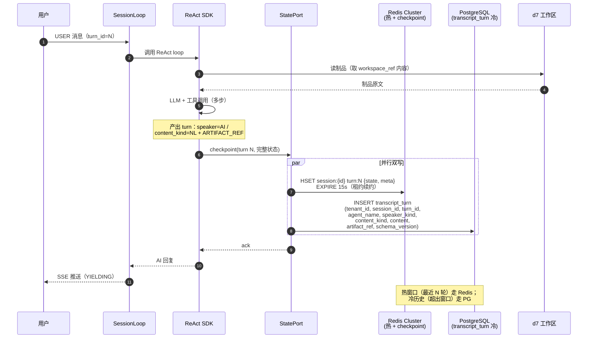
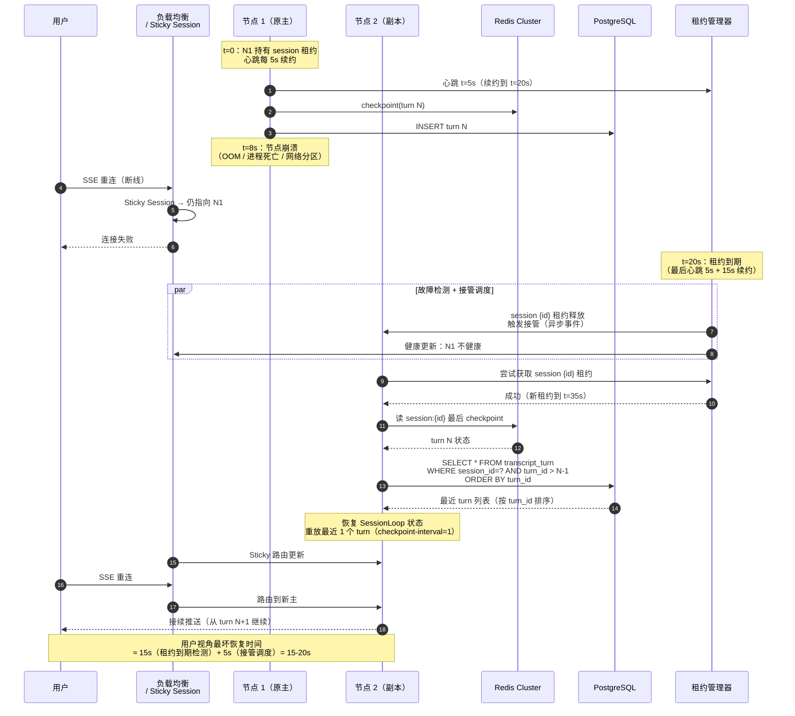
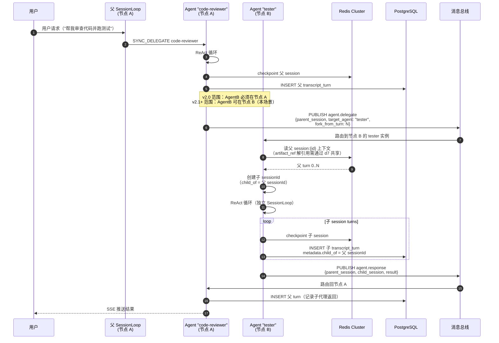

# 智能引擎层外部接口参考

> **版本**：v2.4（2026-07-03）— §4 Agent 委派标 v2.0/v2.1+ 范围（v2.0 仅同 JVM SYNC_DELEGATE）
> **方法签名 SSOT**：`libs/gnex-contracts/src/main/java/com/gnex/contracts/**`（以 Java 源码为准，本文只做索引）
> **运行时方法细节**：[RUNTIME-INTERFACE-REFERENCE.md](./RUNTIME-INTERFACE-REFERENCE.md)
> **编排侧接口**：[ORCHESTRATION-INTERFACE-REFERENCE.md](./ORCHESTRATION-INTERFACE-REFERENCE.md)
> **架构 SSOT**：[INTELLIGENT-ENGINE-LAYER.md](./INTELLIGENT-ENGINE-LAYER.md) · [SESSION-EVENT-LOOP.md](./SESSION-EVENT-LOOP.md)

本文列出 **④ 运行时 / agent-sdk 执行内核** 与外部系统（② 接入、③ 编排、⑤ 注册、⑥ 治理、⑦ 沙箱、⑧ 总线、⑨ 数据）之间的 **Port 边界**。不含 agent-service ↔ agent-sdk 内部调用；不含纯接入层登录（JWT/SSO/用户账户）。

**架构定稿**：会话调度采用 **SessionLoop**（无双循环）；Agent 间通信 **仅消息总线**（无 A2A 协议/网关）。见 [AGENT-SERVICE-DESIGN.md](./AGENT-SERVICE-DESIGN.md)。

---

## 1. 接口全景

```
                    ┌─────────────────────────────┐
                    │       ② 接入层               │
                    └──────────┬──────────────────┘
                               │
         ┌─────────────────────▼─────────────────────┐
         │  ③ 编排 ──CoordinatorRuntimePort──► ④ SDK │
         │  ② SSE  ◄── RunEventPublisher / UiPort     │
         └──┬──────┬──────┬──────┬────────────────────┘
            │ §3   │ §4   │ §5   │ §6
            ▼      ▼      ▼      ▼
          ⑦沙箱  ⑧总线  ⑨数据  ⑤注册/模型/⑥治理
```

Port 全量索引见 **附录**；本表仅按外部系统分组计数。

| 外部系统 | 层 | Port 数 | 详见 |
|----------|-----|:------:|------|
| ②③ 接入 / 编排消费 | ②③ | 9 | §2 |
| ⑦ 沙箱（含跨层 HITL） | ⑦ | 3 + 1 共享 | §3 |
| ⑧ 消息总线 | ⑧ | 3 | §4 |
| ⑨ 数据层 | ⑨ | 6 + 1 规划 | §5 |
| ⑤⑥ 注册 / 模型 / 治理 | ⑤⑥ | 10 + 7 | §6 |

> 共享 Port：`ConfirmationGateway`（接口在 `sandbox` 包，SDK 实现，§3 与 §8 均消费），仅计一次。

---

## 2. ③ 编排 / ② 接入 ↔ ④ 运行时

③ `Orchestrator` 通过下列 Port 驱动 SDK；② 经 SSE 与并发 Port 配合。

### 2.1 核心执行（③ → ④）

| Port | 包 | 实现方 | 主要方法 | 说明 |
|------|-----|--------|----------|------|
| **`CoordinatorRuntimePort`** | `runtime` | SDK `AgentRuntime` | `runCoordinatorReAct`, `runDirectAnswer`, `resumeCoordinatorReAct`, `publishRoutingToUi` | 编排 ReAct / 轻量直答 / 断点续跑 |
| **`AgentRuntimePort`** | `runtime` | SDK `AgentRuntime` | `delegateToWorker` | Worker 同步委派 |
| **`AgentSyncDelegationPort`** | `runtime` | service `AgentSyncExecutor` | `delegateToWorker` | 同步委派 Port 实现（目标迁入 SDK） |

详述：[RUNTIME-INTERFACE-REFERENCE.md §1](./RUNTIME-INTERFACE-REFERENCE.md)。

### 2.2 编排入口（② → ③，非 ④ Owner）

| Port | 包 | 实现方 | 主要方法 |
|------|-----|--------|----------|
| **`ChatOrchestrationPort`** | `orchestration` | service `Orchestrator` | `processStream`, `resumeFromCheckpoint` |

### 2.3 SSE 与 UI 通知（④ → ②）

Port 在 `contracts`，实现落在 service（SSE 适配层）。

| Port | 包 | 实现方 | 主要方法 |
|------|-----|--------|----------|
| **`RunEventPublisher`** | `access` | service glue | `publish`, `publishIfConnected`, `isConnected` |
| **`AgentRuntimeUiPort`** | `runtime` | service `AgentRuntimeUiNotifier` | `publishRoutingToUi`, `publishAgentInvoke`, `publishAgentFinished`, `publishAgentStatus`, `publishInstallStarted`, `publishInstallResult` |

### 2.4 并发与会话入站

| Port | 包 | 实现方 | 主要方法 | 状态 |
|------|-----|--------|----------|------|
| **`ChatConcurrencyPort`** | `runtime` | SDK `MessageQueue` | `tryAcquireGlobal`, `tryAcquireSession`, `prepareForNewTurn`, `releaseSession`, `releaseGlobal` | 保留 |
| **`ChatInFlightControlPort`** | `runtime` | service adapter | `queueSteering`, `queueFollowUp`, `cancelBySession` | **迁移中** → `SessionLoopPort.fireInbound` |
| **`SessionLoopPort`** | `runtime`（规划） | SDK `eventloop` | `fireInbound`, `wakeUp`, `isBusy`, `attachSse`, `detachSse` | **contracts 待落地**；草案见 [SESSION-EVENT-LOOP.md §9.1](./SESSION-EVENT-LOOP.md) |

**SessionLoop 口径**：steering / chat / follow-up / bus 均为 `InboundEvent` 入 `PriorityInboundQueue`，由 `SessionLoop.runOneTurn()` 调度；**无** follow-up 外环。`ChatInFlightControlPort.queueFollowUp` 为遗留 API，落地 SessionLoop 后废弃。

辅助：`ChatRunContextPort` · `ChatSessionPort` · `ChatActiveRunPort` · `ReActCheckpointQueryPort` — 见 RUNTIME-INTERFACE-REFERENCE。

---

## 3. 沙箱（④ → ⑦）

| Port | 包 | 实现方 | 主要方法 | 通信 |
|------|-----|--------|----------|------|
| **`SandboxPort`** | `sandbox` | sandbox-runtime / local executor | `execute(ActionMessage, Duration)`, `pollPendingAction`, `transportName` | dev：进程内；部署：`MessageBusPort` Action/Observation |
| **`SandboxManagementPort`** | `sandbox` | d7 adapter | `listProfiles`, `assignProfile` | REST（Profile 分配，非容器生命周期调度） |
| **`LoopWarningPort`** | `sandbox` | SDK / SSE 层 | `emitWarning(toolName, consecutiveCount)` | 进程内 → UI |
| **`ConfirmationGateway`** ☆ | `sandbox` | SDK `WebConfirmationHandler` | `requestConfirmation`, `approve`, `reject` | SSE 等人确认；§8 治理面亦消费 |

☆ = 跨层共享 Port。负载模型：`ActionMessage` / `ObservationMessage`（`contracts.bus`），非独立 WebSocket 原语 JSON。产品态远程沙箱经 **`MessageBusPort.publishAction`** / **`awaitObservation`** 与 sandbox-runtime 交互。

---

## 4. 消息总线（④ ↔ ⑧）

**架构决策**：Agent 与 Agent 协作走 `AgentCommunicationPort`。

- **v2.0**：仅 `AUTO` / `SYNC_DELEGATE`——同 JVM 内调用，不引入跨节点消息总线（绝大多数业务场景够用）
- **v2.1+**：`MESSAGE_BUS` / `BATCH_DELEGATE` + `AgentInboxLoop` 跨节点订阅——给 AlwaysOn / Agent 集群化部署等场景预留

> **v2.0 不做跨节点 Agent 委派的依据**：
> - 同一用户 session 走节点亲和性（sticky session），整个 session 在单节点，子 Agent 也在同节点
> - 跨节点 Agent 委派占比生产环境通常 < 10%，复杂度高、收益低
> - Session 跨节点故障转移由租约 + checkpoint 保证（§5.3），与 Agent 委派无关

### 4.1 Port

| Port | 包 | 实现方 | 核心 API |
|------|-----|--------|----------|
| **`MessageBusPort`** | `bus` | bus-service | `publishAction`, `publishObservation`, `awaitObservation`, `publish(BusEventMessage)`, `subscribe`, `pollAction` |
| **`AgentMessageBusPort`** | `messagebus` | bus-service | `subscribe`, `publish`, `consume`, DLQ / backpressure REST — **v2.1+** |
| **`AgentCommunicationPort`** | `bus` | bus-service | **`dispatch(DispatchContext)`**, **`await(taskId, timeout)`**, **`onEvent`**, **`cancel`**；策略：`AUTO` / `SYNC_DELEGATE`（v2.0）/ `MESSAGE_BUS` / `BATCH_DELEGATE`（v2.1+） |

Legacy `sendMessage` / `sendAndWait` 等已 `@Deprecated`，以 `dispatch` + `await` 为准。

### 4.2 Topic 清单

| Topic | 生产者 | 消费者 | 用途 | 版本 |
|-------|--------|--------|------|:----:|
| `sandbox.request` | 引擎 | 沙箱调度 | Action 下发（与 `MessageBusPort` 统一） | v2.0 |
| `sandbox.events` | 沙箱 | 引擎 | 状态变更 | v2.0 |
| `agent_events` | 引擎 | 同步/校验 | Action/Observation 事件 | v2.0 |
| `cost_events` | 模型侧 | 同步 | LLM 成本 | v2.0 |
| `agent.delegate` | 引擎 | 目标 Agent | 委派任务（`AgentCommunicationPort.dispatch` 跨节点时落地） | **v2.1+** |
| `agent.response` | 目标 Agent | 源 Agent | 委派返回（与 `await` 配对） | **v2.1+** |
| `audit_log` | 引擎/治理 | 同步 | 审计 | v2.0 |

> `agent.delegate` / `agent.response` 仅在 `MESSAGE_BUS` 策略下使用；`SYNC_DELEGATE` 走 JVM 内调用，不经 Topic。命名沿用历史，非 A2A 协议。

可靠性：at-least-once + 幂等；分区键 `tenant_id + session_id`。

---

## 5. 数据层（④ / REST → ⑨）

| Port | 包 | 消费方 | 实现方 | 主要方法 |
|------|-----|--------|--------|----------|
| **`StatePort`** | `state` | SDK checkpoint / SessionLoop | state adapter | `get/put/deleteSessionAttribute`, `load/saveCheckpoint`, `backendName` |
| **`ConversationAccessPort`** | `conversation` | service / SDK | service | 会话 CRUD、`getSessionMessages`, `addMessage`, `forkFromMessage`, 分支 |
| **`MemoryQueryPort`** | `memory` | REST / 管理 | adapter | `query(q, source, page, pageSize)`, `delete(id)` — 非 ReAct 热路径 |
| **`IsolatedWorkSpacePort`** | `workspace` | service | d7 adapter | `create`, `apply`, `discard`, `refreshDiff`, `listByStatus` |
| **`WorkSpaceSessionPort`** | `runtime` | service scheduler | service | `prepareIsolatedSession`, `prepareForScheduledSession`, `prepareAlwaysOnTask`, `unbind` |
| **`SessionArchivePort`** | `runtime` | AlwaysOn | service | `archiveAlwaysOnRun(AlwaysOnArchiveRequest)` |
| **`UserSessionRegistryPort`** ☆ | `conversation`（规划） | ② 接入层 / UI | service | `listByUser(userId)`, `summarize(sessionId)` — 多会话切换所需：列出用户活跃 session、状态摘要（含当前 turn 进度、最后活动时间） |

**StatePort**：dev profile 为 SQLite adapter；目标态 Redis（热）+ PostgreSQL（冷）。Hook 侧记忆召回走 runtime 内部 + `MemoryRecallHook`，非 `MemoryQueryPort.query`。

☆ **UserSessionRegistryPort**：多会话切换场景的产物——用户在多个 session 间切换时，UI 需要列出"我的活跃会话"+ 各会话当前状态（跑着 / YIELDING / 已完成）。任务不丢失的工程保证见 [SESSION-EVENT-LOOP.md §9.1](./SESSION-EVENT-LOOP.md)。**契约未落地**，先在文档占位。

### 5.1 transcript 存储策略（含上下文压缩）

ReAct transcript 体积通常是 ReAct 热路径的主要开销之一。**三类内容体积占比与存储策略不同**（占比为经验观察值，需以真实会话样本验证）：

| 类别 | 体积占比 | 存储策略 | 备注 |
|------|:------:|---------|------|
| **结构化元数据**（sessionId / turnId / agentName / decision / tool_calls 元数据） | ~10% | Redis Hash 直接存 | 低延迟字段访问 |
| **自然语言对话**（user message / assistant response / system prompt） | ~50% | Redis（热）+ PostgreSQL（冷） | 滑动窗口 + 归档 |
| **大块制品**（代码片段、文件内容、工具返回的长 output） | ~40% | **transcript 存引用，实际内容在 d7** | 仅引用化可省 ~40% transcript 体积（自然语言压缩需另走 §5.2 7c/7e） |

**制品引用化的前置条件**——d7 工作区后端为集中调度（沙箱调度中心 + workspace/容器按策略），同一 workspace 跨节点可访问，引用化在副本场景下安全可用。

**制品引用结构（建议）**：

```json
{
  "type": "workspace_ref",
  "workspace_id": "ws_xxx",
  "path": "UserService.java",
  "commit_sha": "abc123",
  "line_range": { "start": 10, "end": 50 },
  "fetched_at_turn": 12
}
```

`workspace_id + commit_sha` 保证版本确定性；`line_range` 限定范围避免取整个文件（`start`/`end` 均为闭区间行号）。

**transcript 逻辑粒度 vs 物理粒度**——逻辑上 transcript 是 **per-session** 的（一个 sessionId 一份 transcript，含本次会话所有 turn / steering / 制品引用，不跨会话共享）；但**物理存储必须按 turn 分片**，不能"一个会话一条记录"。两条理由：

| 物理形态 | 单条大小风险 | 租约崩溃重放 | 适用性 |
|---------|-----------|----------|------|
| 整段会话一条记录 | 50 轮轻松到 MB 级；200 轮 + 大代码块可能 10-50MB | ✅ 简单——读最后一条即完整状态 | ❌ MongoDB 16MB 文档上限会爆；PG 单行膨胀影响 VACUUM；但**部分写半完成时无法续**，必须整段覆盖写 |
| **按 turn 分片**（一行/一文档一个 turn） | 单条几 KB 到几十 KB（大制品已引用化走对象存储） | 🟡 需重读最近 N 条并按 turn_id 排序——但配合 `checkpoint-interval-turns: 1` 只需重放最近 1 个 turn 的增量 | ✅ 两种存储都可行 |

**核心权衡**：整段塞一条的崩溃重放"逻辑简单"但代价是**整段必须原子写**——这与高并发增量写入冲突（每次 turn 都要读改写整条）；按 turn 分片把"写"和"恢复"解耦，写入路径纯追加，恢复路径读取+排序——**这是工程上更可控的形态**，也是业界主流（LangGraph checkpointer、OpenAI Assistants thread）选择。

按 turn 分片的物理 schema（建议）：

```
transcript_turn
  ├─ tenant_id        (多租户隔离，配合 MyBatis-Plus 行级过滤)
  ├─ session_id       (索引，关联会话)
  ├─ turn_id          (递增编号)
  ├─ agent_name       (产出该 turn 的 agent，配合蜂群/多 persona/子代理分析)
  ├─ speaker_kind     (USER / AI / TOOL_CALL / TOOL_RESULT / STEERING — 按发言者)
  ├─ content_kind     (META / NL / ARTIFACT_REF — 按内容性质，对应三类占比表)
  ├─ content          (文本 / 结构化 JSONB)
  ├─ artifact_ref     (引用 d7，不直接塞大对象)
  ├─ schema_version   (结构化字段版本，配合 §5.3 滚动发布前向兼容)
  └─ created_at
  PK: (session_id, turn_id)
  INDEX: (tenant_id, agent_name, created_at)  -- 多租户 + 跨 agent 分析
```

**kind 双维度说明**：本 schema 拆为 `speaker_kind`（按发言者，与三类占比表正交）和 `content_kind`（按内容性质，对应三类占比）两个独立维度——单条 TOOL_RESULT 可能是 ARTIFACT_REF 内容（制品引用化），避免单一 kind 列的二义性。

加载时按 `sessionId + turnId range` 查询——这与主文件 §8.2 `loadRange(sessionId, turnIdRange)` 契约一致；热窗口 Redis 缓存最近 N 轮，冷历史走 PG。

### 5.2 上下文压缩策略（分阶段演进）

按"投入产出比 + 风险"排序，分阶段实施：

| 阶段 | 做什么 | 副本友好度 | 优先级 |
|------|-------|:--------:|------|
| **7a** | StatePort Redis Cluster 化（多节点副本前置必做） | ✅ | 必做基础 |
| **7b** | 制品引用化（transcript 存 d7 ref） | ✅ | **最高性价比**——预期节省 ~40% transcript 体积（仅制品部分，不含自然语言） |
| **7c** | 滑动窗口 + 主动 recall（hot window 配置已有 `transcript-hot-window-size`） | ✅ | 高 |
| **7d** | 结构化字段（带 `schema_version` + 自然语言摘要降级） | 🟡 | 中——前后兼容必备 |
| **7e** | LLM 后置摘要（双轨写、幂等是硬要求） | 🟡 | 按需——复杂度最高 |

### 5.3 副本与故障转移约束

GNEX 目标部署为多节点，所有压缩方案必须满足：

- **进程内 cache 仅作读优化，不作权威**——节点崩溃即失效
- **checkpoint 频率与租约配套**：`checkpoint-interval-turns: 1` + 租约 15 秒（可配） + 心跳 ~5 秒 → 用户视角最坏恢复时间 ≈ **15-20 秒**（租约到期检测 0-15s + 接管调度 0-5s）。注意 **15 秒是下界、20 秒是上界**，SLA 承诺应取上界。
  - **租约 / 心跳配比的硬约束**：租约 ≥ 心跳 × 3（默认 15s / 5s 满足），否则网络抖动一次心跳就会误判节点死亡、误触发接管产生**双主**。租约下限建议 ≥ 10 秒，上限受用户会话超时（30 分钟）约束。
- **滚动发布期间 schema 前向兼容**：结构化字段加 `schema_version`，旧版本读不懂时降级到自然语言摘要
- **LLM 后置摘要的崩溃一致性**：摘要 LLM 调用耗时 5-30 秒，崩溃发生在此期间必须保证——摘要任务幂等可续、完整 transcript 同时写盘、恢复时优先用完整 transcript
- **跨节点 Agent 间委派**（**v2.1+ 才生效**，v2.0 同 JVM 内不涉及）：父子 transcript 跨节点可见——必须中心化存储（Redis + PostgreSQL），不能本地 cache + 异步同步

**Redis QPS 风险**：每 turn checkpoint + 多次 transcript 增量写，单实例并发会话数高时 Redis 可能成瓶颈——这是 §5.2 阶段 7a（StatePort Redis Cluster 化）必须前置的根本原因，分片键统一为 `sessionId`。

### 5.4 冷路径存储选型（PostgreSQL JSONB vs MongoDB）

由于 §5.1 已明确 transcript 按 turn 分片（单条几 KB 到几十 KB），MongoDB 16MB 文档上限不再是约束——选型转向**架构一致性 / 查询能力 / 既有设施 / 数据模型匹配度**四维度：

| 维度 | PostgreSQL JSONB | MongoDB |
|------|------------------|---------|
| **GNEX 既有架构** | ✅ 主库已用（SQLite/PG + MyBatis-Plus） | ❌ 引入新栈，需独立 ORM |
| **多租户行级过滤** | ✅ `tenant_id` 拦截器已落地 | ❌ 需重建过滤中间件 |
| **跨表 JOIN**（session ↔ project ↔ agent ↔ tenant） | ✅ 关系强项 | 🟡 `$lookup` 性能弱 |
| **事务一致性** | ✅ ACID | 🟡 文档级原子，跨文档需两阶段提交 |
| **运维成本** | ✅ 与现有栈一致 | ❌ 新组件部署 / 备份 / 监控 |
| **schema 演进灵活度** | 🟡 JSONB 加字段需 ALTER（`DEFAULT NULL` 已优化但仍有元数据锁） | ✅ 字段加减零迁移成本 |
| **水平 sharding 原生支持** | 🟡 Citus / 分区表为后挂方案 | ✅ sharding 是一等公民 |
| **无事务纯追加写吞吐** | 🟡 WAL + MVCC 有一定开销 | ✅ 通常单机吞吐更高 |

**JSONB 索引落地说明**：PG 的 GIN 索引对包含查询（`@>`）很快，但**键值路径深度查询**（如 `content->'tool_calls'->0->'name' = 'xxx'`）需建专门表达式索引，否则会全表扫。落地建议：按 kind + created_at 建复合 B-tree 索引覆盖主流查询，对已知高频 JSONB 字段建表达式 GIN 索引——这部分需在 §5.1 schema 落地时配套出索引清单。

**推荐 PostgreSQL 的根本理由**：GNEX 是**关系密集型**业务系统（session ↔ project ↔ agent ↔ tenant ↔ skill 多对多），不是文档密集型内容平台。表内其他维度（既有架构 / 多租户拦截器 / 运维栈 / 事务一致性）都是这一主论点的次级支撑，不重复展开。

**何时考虑 MongoDB**：transcript 之外的**海量非结构化事件流**（如全链路 trace / 审计日志 / 评测样本）独立出来时——那是文档/事件密集型场景，MongoDB 占优；但这是后话，当前 PostgreSQL 完全够用。

### 5.5 关键场景时序图

#### 场景 1：正常 turn 写入（transcript 双写：Redis 热 + PG 冷）



**关键不变量**：
- Step 7-8 双写并行——任一失败需回滚（PG 事务可作权威）
- Step 7 `EXPIRE 15s` 是租约续约，崩溃后 15-20s 内自动过期
- Step 8 PG 写入是**冷历史权威**，Redis 仅热缓存

---

#### 场景 2：节点崩溃 → 副本接管（租约驱动）



**关键不变量**：
- **t=8s 到 t=20s 的窗口**：用户感知"挂了"，但 N1 写入的 turn N 已在 PG（冷历史权威）
- **租约 ≥ 心跳 × 3**（15s / 5s 满足）：避免心跳抖动误判
- **接管幂等**：N2 重放 turn N 时，PG 的 `(session_id, turn_id)` 主键保证重复写不破坏一致性
- **没有双主风险**：N2 必须先获取租约才能恢复，N1 即使复活也无法并发写（租约已被 N2 持有）

---

#### 场景 3：跨节点 Agent 委派（v2.1+，当前 v2.0 不涉及）



**关键不变量**：
- **父子 sessionId 显式关联**：`child_of` 元数据让父子 transcript 可双向追溯
- **跨节点共享**：Redis + PostgreSQL 必须中心化（§5.3 第 5 条），本地 cache + 异步同步会丢消息
- **d7 共享存储前置**：artifact_ref 跨节点解引用依赖 d7 集中调度（已在 §5.1 验证）
- **v2.0 不涉及**：本场景标记 v2.1+，v2.0 AgentB 必须在同 JVM 内 SYNC_DELEGATE

---

## 6. 注册 / 模型 / 治理（④ → ⑤⑥）

### 6.1 模型配置

| Port | 包 | 消费方 | 实现方 | 说明 |
|------|-----|--------|--------|------|
| **`LlmConfigPort`** | `registry` | SDK `ReActLlmInvoker` | SDK `LLMConfigManager` | `getEffectiveDefaultModel`, `getModelForAgent`, `setApiKey`, `registerModel`, … |
| **`LlmModelCatalogPort`** | `registry` | service | platform | `listModels`, `getModel`, `isModelAvailable` |

引擎通过 `LlmConfigPort` 读配置；实际 LLM HTTP 在 SDK 内完成。产品态「模型网关四策略（fallback/race/cost_aware）」为网关服务职责，**未**体现在当前 `LlmConfigPort` 接口中。

### 6.2 注册层（安装/工具链，均为进程内调用）

| Port | 包 | 主要方法（摘要） |
|------|-----|------------------|
| **`AgentRegistryPort`** | `registry` | `listAll`, `installFromCanonical`, `uninstall` |
| **`AgentPackagePort`** | `registry` | `uploadZip`, `evaluate`, `install` |
| **`CustomToolManagementPort`** | `registry` | `listTools`, `registerTool`, `unregisterTool` |
| **`ToolHookPort`** | `registry` | `executeToolHook(phase, agentName, sessionId, toolName, arguments, result)` |
| **`CredentialManagementPort`** | `registry` | `list`, `getById`, `store`, `updateCredential`, `delete` |
| **`McpServerManagementPort`** | `registry` | `listServers`, `connect`, `reconnectFromDb`, `disconnect` |
| **`SkillImportPort`** | `registry` | `importExternalSkill(format, sourcePath)` |
| **`SkillTranslationPort`** | `registry` | `translateToSkillMd(format, originalPath)` |

### 6.3 治理面（ReAct / 工具执行热路径）

JWT / 用户 / SSO 属接入层，不在此列。

| Port | 包 | 消费方 | 实现方 | 主要方法 |
|------|-----|--------|--------|----------|
| **`AgentBudgetPort`** | `runtime` | SDK `ReActLoop` | d3 `AgentBudgetService` | `checkBudget` → 拒绝原因；`checkoutTokens` |
| **`AgentBudgetManagementPort`** | `budget` | REST 管理 | d3 | 继承上者 + `createBudget`, `listBudgets`, `hardStop` |
| **`AuditPublisher`** | `governance` | SDK tool 路径 | d6 async | `log(LogEntry)` |
| **`ToolAuditPort`** | `governance` | boundary | d6 | `record(ToolAuditRequest)` |
| **`ConfirmationPort`** | `governance` | ② UI 回调 | d6 adapter | `approve`, `reject`（配合 §3 `ConfirmationGateway`） |
| **`QualityGatePort`** ⚠️ | `governance` | SessionLoop 高优 | d6 adapter | `evaluate(Mode)`, `listQuarantine`, `releaseQuarantine` |
| **`EvaluationPort`** | `governance` | 诊断 REST | service adapter | `evaluateSession`, `replaySession`, `compareSessions`, `checkAiAssets` |

---

## 附录：Port 速查（方向 / 外部系统）

> 完整包路径见各节表；本表只列「方向 + 外部」以便快速定位。

| Port | 方向 | 外部 |
|------|------|------|
| `CoordinatorRuntimePort` | ③→④ | 编排 |
| `AgentRuntimePort` / `AgentSyncDelegationPort` | ③→④ | 编排 |
| `ChatOrchestrationPort` | ②→③ | 接入 |
| `RunEventPublisher` | ④→② | SSE |
| `AgentRuntimeUiPort` | ④→② | SSE |
| `ChatConcurrencyPort` | ②↔④ | 接入 |
| `ChatInFlightControlPort` | ②→④ | 接入（迁移中） |
| `SessionLoopPort` | ②→④ | 规划 |
| `SandboxPort` | ④→⑦ | 沙箱 |
| `SandboxManagementPort` | ④→⑦ | Profile |
| `LoopWarningPort` | ④→② | 告警 |
| `ConfirmationGateway` ☆ | ④↔②/⑥ | HITL |
| `MessageBusPort` | ④↔⑧ | 总线 |
| `AgentMessageBusPort` | ④↔⑧ | 总线 |
| `AgentCommunicationPort` | ④↔⑧ | Agent 通信 |
| `StatePort` | ④→⑨ | 状态 |
| `ConversationAccessPort` | ④→⑨ | 会话 |
| `MemoryQueryPort` | REST→⑨ | 记忆 |
| `IsolatedWorkSpacePort` | ④→⑨ | 工作区 |
| `WorkSpaceSessionPort` | ④→⑨ | 工作区会话 |
| `SessionArchivePort` | ④→⑨ | 归档 |
| `UserSessionRegistryPort` ☆ | REST→⑨ | 多会话切换（规划） |
| `LlmConfigPort` / `LlmModelCatalogPort` | ④→配置 | 模型 |
| `AgentRegistryPort` 等 8 个 | ④→⑤ | 注册 |
| `AgentBudgetPort` | ④→⑥ | 预算 |
| `AgentBudgetManagementPort` | REST→⑥ | 预算管理 |
| `AuditPublisher` / `ToolAuditPort` | ④→⑥ | 审计 |
| `ConfirmationPort` | ②→⑥ | 确认回调 |
| `QualityGatePort` / `EvaluationPort` | ④→⑥ | 质量 |

**相关文档**：[RUNTIME-CONTRACTS.md](./RUNTIME-CONTRACTS.md) · [AGENT-SERVICE-DESIGN.md](./AGENT-SERVICE-DESIGN.md) · [AGENT-COMMUNICATION.md](./AGENT-COMMUNICATION.md)
