# D3 编排层 2.0 架构

> **层号**：③ `d3-orchestration`（编排+虚拟层）+ `gnex-agent-service` (runtime/team/adapter) + `gnex-platform-service` (workflow)
> **Owner 边界**（不含 ②④⑤⑦⑨）：见 [LAYER-ARCHITECTURE.md](./LAYER-ARCHITECTURE.md)
> **编排路由 SSOT**：[d3-orchestration-design.md](./d3-orchestration-design.md)（§3–§9 接口契约）
> **产品目标 SSOT**：~~[GNexCore架构设计_2.1.html](../GNexCore架构设计_2.1.html) §5.1.3–§5.1.5~~（⚠️ 外部 HTML 已不在仓库，相关内容已内化到 [ARCHITECTURE.md](./ARCHITECTURE.md)）
> **关联**：[LAYER-ARCHITECTURE.md](./LAYER-ARCHITECTURE.md)、[RUNTIME-LAYER.md](./RUNTIME-LAYER.md)、[RUNTIME-CONTRACTS.md](./RUNTIME-CONTRACTS.md)
> **⚠️ v1.0 代码对照**：[V1-CODE-REALITY.md](./V1-CODE-REALITY.md)——本文档中 `AgentRoomService` / `runDirectAnswer()` 等符号与代码不符，阅读前必看 §1 修正表

---

## 1. 层定位

### 1.1 职责

| 维度 | 1.0 现状 | 2.0 目标 |
|------|----------|----------|
| **核心职责** | 单体编排 + ReAct 全部调度 | 意图路由 + 多 Agent 编排 + 工作流 DAG，不嵌入执行 |
| **编排模式** | 固定路径 | 三种模式按需切换：固定 DAG / 混合编排 / 完全动态 |
| **协作拓扑** | 仅单 Agent | 6 种拓扑：Orchestrator-Worker / Pipeline / Parallel Race / 会诊 / Control Transfer / 递归 |
| **调度模型** | 同步阻塞 | 同步委派 + 优先级队列 + AlwaysOn 周期 |
| **与 ④ 边界** | 编排持有 ReAct 循环引用 | 编排调用④执行，仅依赖 Port 接口（C1） |

### 1.2 不负责

HTTP/SSE 暴露（②）、ReAct 单轮执行（④）、工具注册定义（⑤）、Inspector 实现（⑦）、DB Mapper（⑨）

**架构铁律**：③ 无 REST Controller，仅通过 Port 接口暴露能力，由 ② 的 Controller 调用。

### 1.3 与 2.1 产品架构的映射

2.1 五层技术架构中 ③ = 控制面 Agent 引擎 = 编排 · ReAct · Agent 间协作（消息总线）· 意图识别 · 校验。

**核心映射声明**：编排模式是大 Agent Loop 的策略参数——同一套 think-act-observe 循环，按 `flow_id` 切换控制权归属（2.1 §5.1.2）：

| 编排模式 | flow_id 注入什么 | think 步行为 | 第一层是否循环 | 对应 d3 组件 |
|----------|-----------------|-------------|-------------:|-------------|
| 固定流程 | DAG 定义（节点·边·每节点工具集） | 状态机遍历，不推理 | 否 | `WorkflowEngine` |
| DAG（混合编排） | 拓扑定义（节点·边），节点内工具集开放 | 节点边界 think 决策，节点内自主 ReAct | 半循环 | `WorkflowEngine` + `AgentRoomService` |
| 完全动态 | 无注入 | 完整 think→act→observe 循环 | 是 | `Orchestrator` → `CoordinatorRuntimePort` |

九层 ③ d3-orchestration 对应 2.1 的 ③ 控制面 Agent 引擎，这是直接映射。

### 1.4 系统不变量

以下条件在系统任意时刻必须成立：

| # | 不变量 | 保障机制 |
|---|--------|----------|
| I1 | 同一 sessionId 在 ③ 与 ④ 间最多一条活跃 delegation | AgentExecutionContext `depth` 追踪 + `DelegationCancelRegistry` |
| I2 | ③ 编排调用 ④ 执行，不 import ④ 实现类 | 仅依赖 `gnex-contracts`，Phase 23 已验证无违规 |
| I3 | Orchestrator NO_MATCH 路径必须在 3 秒内返回 | ~~`runDirectAnswer()` 无工具、`maxTurns=1`~~（v1.3.3 后已废，详见 [V1-CODE-REALITY](./V1-CODE-REALITY.md) §1）；v1.0 实际走 `delegateToWorker("default-worker", …)` |
| I4 | AgentRouter 置信度低于 `THRESHOLD`(0.6) 的匹配不委派 | `THRESHOLD` 硬编码 + `AUTO_DELEGATE_THRESHOLD`(0.7) |
| I5 | AgentScheduler `depth < maxDepth`(3) | `submit()` 入口 `wouldExceedDepth()` 检查 |
| I6 | WorkflowEngine APPROVAL 节点必须持久化状态 | `WorkflowApprovalGate` + instance 状态 `PAUSED` 写 DB |
| I7 | AlwaysOn `tryMarkRunning` 乐观锁保证同一 task 仅一个 RUNNING | 条件 UPDATE `ACTIVE→RUNNING` |
| I8 | ③ 不直接 import 其他服务的 entity/mapper | 通过 Port + DTO（C7/C8）；当前违规见 §9 |

---

## 2. 层间位置

```
┌─────────────────────────────────────────────────────────────┐
│ ① d1-web          React Chat / hooks / SSE 解析              │
└────────────────────────────┬────────────────────────────────┘
                             │ HTTP / SSE
┌────────────────────────────▼────────────────────────────────┐
│ ② d2-access       ChatController, ChatAgentStreamRunner,     │
│                   WorkflowController, TeamController,         │
│                   AlwaysOnController ...     │
└────────────────────────────┬────────────────────────────────┘
                             │ ChatOrchestrationPort / AgentTeamManagementPort / ...
┌────────────────────────────▼────────────────────────────────┐
│ ③ d3-orchestration  ◄── 本文档                                │
│   Orchestrator · AgentRouter · PlanExecutor                   │
│   AgentTeamService · AgentRoomService · TeamTaskRouter · TeamBatchExecutor       │
│   WorkflowEngine · AgentFlowEngine · AgentAdapterPort         │
│   AlwaysOnRunner · AgentScheduler                             │
└───┬─────────┬─────────┬─────────┬─────────┬──────────────────┘
    │         │         │         │         │
    ▼         ▼         ▼         ▼         ▼
  ④运行时    ⑤注册    ⑦沙箱    ⑧总线    ⑨数据
```

---

## 3. 层内架构

### 3.1 模块总览

```mermaid
flowchart TB
    subgraph ingress["接入层 ②"]
        HTTP[ChatController / SSE]
        WF_CTRL[WorkflowController]
        TEAM_CTRL[TeamController]
        AO_CTRL[AlwaysOnController]
        JOB_CTRL[JobController]
    end

    subgraph core["③ Orchestrator 核心 — agent-service/runtime"]
        ORCH[Orchestrator]
        ORCH_PORT[ChatOrchestrationPort]
        AUG[OrchestratorInputAugmenter]
        ROUTER[AgentRouter]
        PROMPT[OrchestratorPromptLoader]
        PLAN[PlanExecutor]
    end

    subgraph exec["③ 调度与执行 — agent-service/runtime"]
        SYNC[AgentSyncExecutor]
        SYNC_PORT[AgentSyncDelegationPort]
        SCHED[AgentScheduler]
        SCHED_PORT[AgentJobManagementPort]
        ASYNC[AsyncAgentExecutor]
        AON[AlwaysOnRunner]
        BOOT[AgentToolBootstrap]
        BOOT_PORT[AgentToolBootstrapPort]
        WFACT[AgentWorkerToolFactory]
    end

    subgraph team["③ Team 子架构 — agent-service/team"]
        TEAM_SRV[AgentTeamService]
        TEAM_PORT[AgentTeamManagementPort]
        TEAM_PORT2[TeamTaskRoutingPort]
        ROUTER_T[TeamTaskRouter]
        BATCH[TeamBatchExecutor]
        MEMBERSHIP[TeamMembershipSupport]
        MENTION[TeamMentionParser]
        MENTION_PORT[TeamMentionParserPort]
        OBS[TeamObservabilityService]
        OBS_PORT[TeamObservabilityPort]
        COLLAB_SRV[AgentRoomService]
        COLLAB_PORT[TeamCollaborationManagementPort]
    end

    subgraph workflow["③ Workflow 子架构 — platform-service/workflow"]
        WF_ENG[WorkflowEngine]
        WF_PORT[WorkflowManagementPort]
        AF_ENG[AgentFlowEngine]
        AF_PORT[AgentFlowPlanPort]
        NODE_EXEC[NodeExecutor]
        GRAPH[WorkflowGraphParser]
        APPROVAL[WorkflowApprovalGate]
        SQUAD[WorkflowSquadExecutor]
        PLAN_GEN[PlanGenerator]
    end

    subgraph adapter["③ Adapter 虚拟层 — agent-service/adapter"]
        ADAPT_EXEC[AgentAdapterExecutor]
        ADAPT_PORT[AgentAdapterPort]
        CLAUDE[ClaudeCodeAdapter]
    end

    HTTP --> ORCH_PORT
    WF_CTRL --> WF_PORT
    TEAM_CTRL --> TEAM_PORT
    AO_CTRL --> AO_PORT((AlwaysOnTaskManagementPort))
    JOB_CTRL --> SCHED_PORT

    ORCH_PORT --> ORCH
    ORCH --> AUG
    ORCH --> ROUTER
    ORCH --> PROMPT
    ORCH --> PLAN
    ORCH --> SYNC_PORT
    SYNC_PORT --> SYNC

    SCHED_PORT --> SCHED
    SCHED --> ASYNC
    AON --> SCHED

    TEAM_PORT --> TEAM_SRV
    TEAM_PORT2 --> TEAM_SRV
    TEAM_SRV --> ROUTER_T
    TEAM_SRV --> BATCH
    BATCH --> SYNC_PORT
    MENTION_PORT --> MENTION
    MENTION --> TEAM_SRV
    OBS_PORT --> OBS

    WF_PORT --> WF_ENG
    AF_PORT --> AF_ENG
    WF_ENG --> NODE_EXEC
    NODE_EXEC --> SYNC_PORT
    WF_ENG --> APPROVAL
    WF_ENG --> SQUAD
    AF_ENG --> PLAN_GEN

    ADAPT_PORT --> ADAPT_EXEC
    ADAPT_EXEC --> CLAUDE

    BOOT_PORT --> BOOT
    BOOT --> WFACT
```



### 3.2 六个子包

| 子包 | 职责 | 类数 | 服务 | 来源 |
|------|------|------|------|------|
| `runtime/` | Orchestrator 核心：意图路由、Agent 匹配、Plan 编排、调度与委派、AlwaysOn 周期 | 34 | agent-service | 现有 + 2.0 收口 |
| `team/` | Team 协作：CRUD、标签路由、负载均衡、批量执行、技能共享、可观测、4-phase DAG 协作空间 | 18 | agent-service | 现有 |
| `adapter/` | Adapter 虚拟层：外部 Agent 格式转换、Claude Code 适配 | 11 | agent-service | 现有 |
| `workflow/engine/` | Workflow DAG 引擎：8 节点类型、AgentFlow Plan-and-Solve、APPROVAL/FORK/JOIN | 12 | platform-service | 现有 |
| `workflow/service/` | Workflow CRUD + Port 适配层 | 2 | platform-service | 现有 |

---

## 4. Orchestrator 路由流水线（③ 核心组件）

> 流水线**契约 SSOT** = [d3-orchestration-design.md §0.3](./d3-orchestration-design.md)；本节为 v1.0 实施视角（步骤名、阈值、特殊路径），与 d3 冲突时以 d3 为准。

### 4.1 主路由流水线

```
processStream(userInput, sseSessionId)
  │
  ├─ 0. OrchestratorInputAugmenter.prepare()
  │      匹配、路由提示注入、follow-up 上下文、乱码清洗、Room 增强
  │
  ├─ 1. Capability Inquiry 检测
  │      isCapabilityInquiry() == true → 直接回答（描述能力，不委派）
  │
  ├─ 2. Multi-step 检测
  │      isMultiStepTask() == true → PlanExecutor.executeMultiStep()
  │      串行委派 + 审计持久化
  │
  ├─ 3. Direct Delegation 判断
  │      isDirectDelegable() && confidence >= AUTO_DELEGATE_THRESHOLD(0.7)
  │      → coordinatorRuntime.delegateToWorker()
  │
  ├─ 4. NO_MATCH 处理
  │      match == null && 非 generic && 非 creation → 直接回答(无工具, maxTurns=1)
  │
  └─ 5. 默认路径
        executeReAct() — 完整 Coordinator ReAct 循环（有工具）
```

### 4.2 意图分类决策矩阵

| 意图类型 | 检测机制 | 执行路径 | 预期耗时 | 工具 |
|----------|----------|----------|----------|------|
| GENERIC_QUESTION | `GENERIC_QUESTION_PATTERN` 正则 | `runDirectAnswer()` | 2-5s | 无 |
| CAPABILITY_INQUIRY | `CAPABILITY_INQUIRY_PATTERN` 正则 | `runDirectAnswer()` | 2-5s | 无 |
| CREATION_REQUEST | `CREATION_REQUEST_PATTERN` 正则 | `executeReAct()` | 10-60s | 有 |
| MULTI_STEP | `STEP_MARKER_PATTERN`（中文序列词+圈号+step） | `PlanExecutor.executeMultiStep()` | 20-120s | 有 |
| DIRECT_DELEGABLE | `AgentRouter.match()` confidence >= 0.7 | `delegateToWorker()` | 5-30s | Worker 自有 |
| NO_MATCH | `AgentRouter.match()` < 0.6 | `runDirectAnswer()` | 2-5s | 无 |
| DEFAULT（兜底） | 无匹配 | `executeReAct()` | 10-77s | 有（pure-mode: 仅编排工具） |

### 4.3 AgentRouter 匹配算法

**评分公式**：`score = min(1.0, base + exclusive)`

**base = computeSimilarity(input, routingCorpus(agent))**，三因子复合：

1. **Chinese bigram 重叠**（主要因子）：提取输入与 Agent 语料的连续中文双字对（CJK Unified Ideographs 范围 `一`~`鿿`），计算 `forwardBigram` 和 `reverseBigram`，取 `max(fwd, rev)`
2. **单字增益**：当 `bigramScore > 0.1` 时，`charGain = min(charScore, 0.5) * 0.35`
3. **单词重叠**：按空格分词，统计 >1 字符的单词在 Agent 语料中的出现率

最终 base = `min(1.0, max(bigramScore, wordScore) + charGain)`

**exclusiveTokenBoost**：对仅出现在当前 Agent 语料中的 token，长词（>=4 字符）加 0.1，短词加 0.06，上限 0.2。

**阈值**：

| 常量 | 值 | 语义 |
|------|-----|------|
| `THRESHOLD` | 0.6 | 最低匹配线 |
| `AUTO_DELEGATE_THRESHOLD` | 0.7 | 自动委派线 |
| `ADMIN_CONFIDENCE_THRESHOLD` | 0.4 | 管理类意图匹配线 |

**特殊路径**：

- **Java 代码评审**：同时包含评审意图词（评价/审查/review）和 Java 源码路径时，跳过常规评分，返回 confidence `max(0.7, 0.75)`
- **管理意图 bypass**：关键词（安装/卸载/删除）占比 >=40% 时返回 null，由 Orchestrator 直接处理
- **乱码 fallback**：所有 Agent 低于 THRESHOLD 且输入含 U+FFFD 时，以路径评分重试
- **Follow-up 上下文**：输入含 `--- Previous conversation` 时 match 置为 null

### 4.4 OrchestratorInputAugmenter 准备管线

10 步顺序执行：

| 步骤 | 内容 | 条件 |
|------|------|------|
| 1 | 乱码检测 | 输入含 U+FFFD |
| 2 | Follow-up 检测 | 输入含 `--- Previous conversation` |
| 3 | Agent 匹配 | `agentRouter.match()`，follow-up 跳过 |
| 4 | Capability inquiry 注入 `[CAPABILITY INQUIRY]` | isCapabilityInquiry() + 有匹配 |
| 5 | 路由提示注入 `[ROUTING HINT]` | 普通匹配成功 |
| 6 | Follow-up 无匹配注入 `[CONVERSATION_CONTEXT]` | Follow-up + 无匹配 |
| 7 | 上次 Agent 上下文 `[ROUTING HINT]` | 前次委派 + 新匹配 |
| 8 | 模糊请求检测 `[CLARIFY_FIRST]` | 输入 <=40 字符 + 有动词无主语 |
| 9 | 乱码清洗 | 去除 U+FFFD，空则 fallback |
| 10 | Team 协作增强 `[AGENT ROOM MODE]` | `shouldEnterCollaborationMode()` 返回 true |

### 4.5 委派 vs 接管语义

参考 2.1 §5.1.5：

| 语义 | 当前 Agent | 目标 Agent | d3 实现 | 状态 |
|------|-----------|------------|---------|------|
| **spawn_agent**（委派） | 不退出，等待结果 | 执行后返回 | `delegateToWorker()` + `AgentSyncExecutor` | ✅ 已实现 |
| **handoff**（接管） | 退出 | 接管整个会话 | `Orchestrator.handoff()` | ☐ 规划中 |

---

## 5. 多 Agent 协作子架构

### 5.1 Team 协作

**路由算法**（`TeamTaskRouter.routeTask()`）：

```
routeTask(teamId, requiredTag)
  ├─ Phase 1: Tag 精确路由
  │     ├─ resolveTag(teamId, tag) → 按 priority 降序，LIMIT 1
  │     └─ isRoutable(agentName, minRate=0.5, lookback=10) → 健康则直接返回
  │
  ├─ Phase 2: 负载均衡
  │     ├─ 列出所有成员
  │     ├─ 过滤：successRate(last 10) >= 0.5
  │     ├─ 排序：pending 消息数升序（AgentMessageBusService 查询）
  │     └─ 选择：最少 pending 的成员
  │
  └─ 兜底: routableLeaderOrThrow()
       → 无健康成员时抛 IllegalStateException
```

**批量执行**（`TeamBatchExecutor`）：
- 虚拟线程 + 每成员 `Semaphore` 限流
- `ConcurrentHashMap<batchId, List<CompletableFuture>>` 跟踪批次
- `cancelBatch(batchId)` 取消所有 Future
- 进度回调 `onProgress(BatchProgress)`

**技能共享**（`TeamSkillInstaller` + `TeamSkillRecorder`）：
- `recordTeamSkill()` → 增量 `usage_count`
- `recommendSkills(teamId, agentName)` → 按其他成员使用量排序
- `applySkillToMember()` → 为目标成员安装指定 skill

**Team 状态机**：

```
ACTIVE ──pause──→ PAUSED ──resume──→ ACTIVE
  │                                    │
  └──archive──→ ARCHIVED              └──archive──→ ARCHIVED
```

**Mention 解析**：`TeamMentionParser` 通过 `@teamName` 语法在聊天中触发 Team 路由。

### 5.2 Room 协作空间

Team 内为特定任务提供分阶段协作模式（`AgentRoomService`），取代独立的 Room 概念：

```
DECISION ──→ CONTRACT ──→ IMPLEMENT ──→ VERIFY
  │              │             │            │
  └──────────────┴─────────────┴────────────┘
          依赖链：前序 DONE 才能激活后序
```

| 方法 | 说明 |
|------|------|
| `openCollaboration(taskSummary, sessionId, ...roles)` | 创建协作空间，初始化 4 阶段 DAG 节点（均为 PENDING） |
| `completeNode(nodeId, evidence)` | 验证依赖→标记 DONE→持久化 evidence |
| `markNodeNoReply(nodeId)` | Agent 无价值贡献时跳过 |
| `updateCollaborationStatus(collabId, status)` | OPEN → CONVERGED / CLOSED |

**协作模型**（`AgentRoomService`）：
- `SharedContext`: `Map<String, Object>` 共享上下文
- 消息传递：通过 `AgentCommunicationPort` 或 `RunEventPublisher`
- Orchestrator 集成：`buildCollaborationAugmentation()` 注入 `[AGENT ROOM MODE]`

### 5.3 Workflow DAG 引擎

**8 节点类型**：

| 类型 | 行为 | 实现 |
|------|------|------|
| `START` | 入口，no-op，推进到下一节点 | `completeLog()` → `moveToNext()` |
| `END` | 终止，标记 COMPLETED | `completeInstance()` |
| `TOOL` | 执行工具 | `NodeExecutor.executeTool()` → `AgentRuntimePort` |
| `AGENT` | 委派 Agent（可选 HandoffBrief 传入） | `NodeExecutor.executeAgent(handoff)` |
| `FORK` | 并行分支 | `CompletableFuture` + `WorkflowForkContext` 合并 |
| `JOIN` | 同步点（FORK 后） | BFS 搜索配对的 FORK |
| `APPROVAL` | 审批节点，阻塞等待 | `WorkflowApprovalGate` + `PAUSED` 持久化 |
| `SQUAD` | 团队执行（单委派/并行 fan-out/batch） | `WorkflowSquadExecutor` + `TeamTaskRoutingPort` |

**执行模型**：

```
startInstance(definitionId)
  ├─ parseGraph(definitionJson) → WorkflowGraph (nodes + adjacency)
  ├─ executeFromNode(startNode) [virtual thread]
  │    ├─ TOOL/AGENT → NodeExecutor → AgentRuntimePort.delegateToWorker()
  │    ├─ FORK → CompletableFuture.allOf() 并行分支
  │    ├─ APPROVAL → session.awaitDecision() 阻塞 + 持久化 PAUSED
  │    └─ SQUAD → WorkflowSquadExecutor (single/fanout/batch)
  └─ END → completeInstance()
```

**输出校验**：`NodeOutputValidator.validate()` 按 `node.outputSchema()` 校验；AGENT 节点有 schema 时自动保存 `HandoffBrief` 供下游消费。

**心跳**：`WorkflowHeartbeatService` 每 5 分钟检测，RUNNING > 30 分钟无 node log 活动 → 标记 STALLED。

### 5.4 AgentFlow Plan-and-Solve

**执行模型**（`AgentFlowEngine`）：

```
startPlan(goal)
  ├─ PlanGenerator.decompose(goal) → List<PlanTask>
  │     LLM 结构化输出：label + description + dependsOn + agentName
  ├─ 依赖拓扑排序
  │    ├─ 独立任务 → 虚拟线程并行
  │    ├─ 失败 → 重试（max 2 次）
  │    └─ 全部阻塞且失败 → PlanGenerator.regenerate（max 2 次）
  └─ 全部完成 → COMPLETED
```

**与 v1 Plan Graph 的关系**：

| 维度 | v1 PlanExecutor（agent-service） | v2 AgentFlowEngine（platform-service） |
|------|--------------------------------|---------------------------------------|
| 触发 | `isMultiStepTask()` 正则匹配 | `AgentFlowPlanPort.startPlan()` |
| 规划 | LLM 单轮 via `runDirectAnswer()` | `PlanGenerator` LLM 结构化输出 |
| 执行 | 串行委派 + placeholder 替换 | 并行执行 + 依赖拓扑排序 |
| 重规划 | 无 | 最多 2 次 regenerate |
| 持久化 | WorkflowInstance/NodeLog（跨违规） | 通过 `AgentFlowPlanPort` |

### 5.5 Adapter 虚拟层

**格式转换管线**（`AgentAdapterExecutor`）：

```
AgentAdapterPort.convert(format, sourcePath)
  ├─ 定位胶水脚本: ~/.gnex/adapters/gnex-adapter-{format}.py/.js
  ├─ 子进程执行（可配置超时，默认 30s）
  └─ 解析 stdout → CanonicalAgent（JSON 格式）
```

**ClaudeCodeAdapter**（内部组件，非 Port）：
- 扫描 `~/.claude/agents/` 目录
- 两遍扫描：先平铺 `.md`，再子目录 `SKILL.md`（优先子目录版本）
- 输出 `AgentDefinition` → `CanonicalAgent`

**AdapterBootstrapper**：`@EventListener(ApplicationReadyEvent)` 从 `classpath:adapters/*` 种子到 `~/.gnex/adapters/`，仅当目标文件不存在时复制。

**异常类型**：

| 异常 | 条件 |
|------|------|
| `AdapterNotFoundException` | 胶水脚本不存在 |
| `AdapterExecutionException` | 脚本非零退出/超时 |
| `AdapterParseException` | stdout 非 CanonicalAgent JSON |

---

## 6. 与 2.1 系统级三层循环映射

2.1 §5.1.3 定义了三层循环，D3 2.0 的映射：

| 2.1 循环 | D3 2.0 组件 | 说明 |
|----------|------------|------|
| **Loop 1 · 执行循环**（ReAct think→act→observe） | `CoordinatorRuntimePort.runCoordinatorReAct()` / `delegateToWorker()` | ③ 决定谁做什么 → ④ 执行，③ 不嵌入执行 |
| **Loop 2 · 校验循环**（质量评估） | ⚠️ **`QualityGatePort` 在 v1.0 是 CI 覆盖率门，不是 ReAct 质量门**——见 [LOOP-ENGINEERING-ASSESSMENT §1.3](./LOOP-ENGINEERING-ASSESSMENT.md)。本行描述的是 2.0 规划语义，需引入独立 `TurnQualityPort` 才能落地 | 不是独立循环——编排层将质量检查排入 SessionLoop 优先级队列（P1.5，介于改方向与用户新消息之间），SessionLoop 让出点消费。通过→继续；不通过→排入重做消息 |
| **Loop 3 · 事件驱动循环**（Cron/Webhook/Bus 触发） | `AlwaysOnRunner.runCycle()` + `AgentScheduler` 优先级队列 | AlwaysOn discover→plan→execute→report 周期 + 异步 Job 调度 |

---

## 7. 上层接口（谁调用 D3）

### 7.1 调用方矩阵

| 上层 | 入口类 | 调用的 D3 Port | 场景 |
|------|--------|----------------|------|
| **② 接入** | `ChatAgentStreamRunner` | `ChatOrchestrationPort.processStream()` / `resumeFromCheckpoint()` | 主 Chat SSE |
| **② 接入** | `ChatAgentStreamRunner` | `ChatUserIntentPort.isMcpCatalogRequest()` / `isSkillCatalogRequest()` | MCP/Skill 目录意图 |
| **② 接入** | `WorkflowController` | `WorkflowManagementPort.startInstance()` 等 12 方法 | 工作流 CRUD + 执行 |
| **② 接入** | `PlanController` | `AgentFlowPlanPort.startPlan()` / `getPlan()` / `getAllPlans()` | Plan-and-Solve |
| **② 接入** | `TeamController` | `AgentTeamManagementPort` 全套 20 方法 | Team CRUD + 批量 + 技能 |
| **② 接入** | `TeamObservabilityController` | `TeamObservabilityPort` 5 方法 | 可观测查询 |
| **② 接入** | `TeamController` | `TeamCollaborationManagementPort.openCollaboration()` 等 6 方法 | Team 协作管理 |
| **② 接入** | `AlwaysOnController` | `AlwaysOnTaskManagementPort` 7 方法 | 常驻任务 CRUD |
| **② 接入** | `JobController` | `AgentJobManagementPort.submit()` / `cancel()` / `pause()` / `resume()` | 异步 Job |
| **② 接入** | `DevMapController` | `DevMapPort.generateDevMap()` / `generateTaskBoard()` | 项目全景图 |
| **② 接入** | `AdapterController` | `AgentAdapterPort.convert()` | 外部 Agent 适配 |
| **② 接入** | `GoalController` | `SessionGoalPort.setGoal()` / `getGoal()` | Session 目标 |

### 7.2 核心入口 Port 概要

**`ChatOrchestrationPort`**（D3 主入口）：

```java
public interface ChatOrchestrationPort {
    String processStream(String userInput, String sseSessionId);
    String resumeFromCheckpoint(ReActCheckpoint checkpoint, String sseSessionId);
}
```

| 项 | 约定 |
|----|------|
| **前置** | `ChatRunContext` 已绑定；全局+session 锁已 acquire；入口门禁已通过 |
| **后置** | 返回最终回答文本；checkpoint 状态为 COMPLETED 或 RESUMABLE |
| **失败** | 预算拒绝、cancel (`OperationCancelledException`)、LLM/工具失败 → ERROR 事件 + 可恢复 checkpoint |

> 完整 Port 契约见 [d3-orchestration-design.md](./d3-orchestration-design.md) §3–§9（OC-01 ~ OC-17）。

---

## 8. 下层接口（D3 依赖谁）

### 8.1 依赖矩阵

| 下层 | 服务 | 接口（Port） | D3 消费点 | 通信模式 |
|------|------|-------------|-----------|----------|
| **④ 运行时** | agent-service | `CoordinatorRuntimePort` | Orchestrator → `runCoordinatorReAct()` / `delegateToWorker()` / `runDirectAnswer()` | P1（in-process） |
| **④ 运行时** | agent-service | `AgentRuntimePort` | TeamBatchExecutor / WorkflowEngine / AgentFlowEngine → `delegateToWorker()` | P1 |
| **④ 运行时** | agent-service | `SessionLoopPort` | 2.0 统一调度路径 | P1 |
| **④ 运行时** | agent-service | `ChatRunContextPort`, `ChatConcurrencyPort`, `SessionFollowUpPort` | 上下文绑定、并发控制、follow-up 注入 | P1 |
| **⑤ 注册** | platform-service | `SkillRegistryPort`, `AutoSkillCatalogPort`, `SkillOnDiskCatalogPort` | AgentToolBootstrap / OrchestratorPromptLoader / TeamSkillInstaller | P1 |
| **⑧ 总线** | bus-service | `MessageBusPort`, `AgentCommunicationPort` | Team 异步通信、PlanExecutor dispatch+await | P1/P3 |
| **⑨ 数据** | agent-persistence | 进程内 Repository 接口 | 编排日志/Job/AlwaysOn 持久化 | 进程内 |
| **⑥ 治理** | agent-service | `AgentBudgetPort` | AgentScheduler / AsyncAgentExecutor 预算检查 | 进程内 |

> 完整契约定义见 [RUNTIME-CONTRACTS.md](./RUNTIME-CONTRACTS.md) §6–§8（RC-01 ~ RC-32）。

---

## 9. 跨边界违规评估

### 9.1 设计铁律

> 契约级定义见 [d3-orchestration-design.md §0.3](./d3-orchestration-design.md)；本节为架构视角复述，冲突时以 d3 为准。

| # | 原则 |
|---|------|
| C1 | **编排调用执行，不嵌入执行**。③ 仅依赖 `gnex-contracts`，禁止 import ④ 实现类 |
| C2 | **能力注入，非拉取注册**。Agent/Tool/LLM 由 ③ 经 ⑤ 接口装配后，④ 只消费已解析产物 |
| C3 | **编排模式 = 大 Agent Loop 的策略参数**。同一套 think-act-observe 循环，按 `flow_id` 切换 |
| C4 | **委派 vs 接管语义清晰**。spawn_agent（委派）vs handoff（接管） |
| C5 | **取消可协作**。用户 cancel 经 ②→`SessionLoopPort.fireInbound(CANCEL)` |
| C6 | **事件与结果分离**。同步返回结果 DTO；流式 UI 经 `RunEventPublisher` |
| C7 | **Port 接口是唯一的跨服务 import 机制**。禁止 import 其他服务的具体类 |
| C8 | **跨服务数据只通过 DTO**。禁止直接 import entity/mapper |
| C9 | **服务间调用通过 Port + 适配器**。当前 P1（in-process），Phase 7+ 切 P2（REST/Feign），消费代码零改动 |

### 9.2 当前跨边界违规

D3 编排层是跨边界违规的重灾区，以下列出所有已知的直接 import 违规：

| 优先级 | ③ 消费方 | 违规目标 | 具体类 | 正确替代 Port | 说明 |
|--------|----------|---------|--------|---------------|------|
| **P0** | `AgentScheduler`, `AsyncAgentExecutor`, `AgentSyncExecutor` | `skill.service` | `HookExecutor` | `ToolHookPort`（已定义） | Port 已存在但仍 import 具体类 |
| **P0** | `AgentToolBootstrap` | `skill.service` | `SkillRegistryService` | `SkillRegistryPort`（已定义） | Port 已存在但仍 import 具体类 |
| **P0** | `OrchestratorPromptLoader` | `skill.service` | `AutoSkillCatalog` | `AutoSkillCatalogPort`（已定义） | Port 已存在但仍 import 具体类 |
| **P0** | `TeamSkillInstaller` | `skill.service` | `SkillOnDiskCatalog`, `SkillRegistryService` | `SkillOnDiskCatalogPort` + `SkillRegistryPort` | Port 已存在但仍 import 具体类 |
| **P1** | `PlanExecutor` | `platform-persistence` | `WorkflowInstanceMapper`, `WorkflowNodeLogMapper`, **`WorkflowDefinitionMapper`**（用于 Plan 复用持久化） | `WorkflowQueryPort` + `WorkflowManagementPort`（RC-32 + RC-30） | 直接读写 Workflow 表 |
| **P1** | `DevMapService` | `platform-persistence` | `WorkflowDefinitionMapper`, `WorkflowInstanceMapper` | `WorkflowQueryPort` | 直接读写 Workflow 表 |
| **P1** | `OperationsMetricsService` | `platform-service` | `BillingService` | `BillingQueryPort`（需新增） | 直接调用 Billing 服务 |
| **P1** | `ProjectConstraintRenderer` | `platform-service` | `ProjectService` | `ProjectManagementPort`（需新增） | 直接调用 Project 服务 |

### 9.3 违规消除路线

| 步骤 | 内容 | 状态 |
|------|------|------|
| 1 | `AgentScheduler` / `AsyncAgentExecutor` / `AgentSyncExecutor` 改 `ToolHookPort` | P0 — 立即，仅改 import |
| 2 | `AgentToolBootstrap` 改 `SkillRegistryPort` | P0 — 立即，仅改 import |
| 3 | `OrchestratorPromptLoader` 改 `AutoSkillCatalogPort` | P0 — 立即，仅改 import |
| 4 | `TeamSkillInstaller` 改 `SkillOnDiskCatalogPort` + `SkillRegistryPort` | P0 — 立即，仅改 import |
| 5 | `PlanExecutor` 改 `WorkflowManagementPort` / `WorkflowQueryPort` | P1 — 需新增 Port 方法覆盖写入场景 |
| 6 | `DevMapService` 改 `WorkflowQueryPort` | P1 — Port 已定义，迁移 import |
| 7 | 新增 `BillingQueryPort` 规范计费查询 | P1 — 需新增 Port 定义 + adapter |
| 8 | 新增 `ProjectManagementPort` 规范项目查询 | P1 — 需新增 Port 定义 + adapter |

---

## 10. 数据所有权

| 域 | 表 | persistence 归属 | 物理 DB | 说明 |
|----|-----|-----------------|---------|------|
| **Team** | `agent_team`, `team_member`, `team_tag_route`, `team_skill`, `team_collaboration`, `team_collaboration_dag_node` | `gnex-agent-persistence` | agent-service DB | 团队 CRUD + 路由 + 技能 + 协作空间 |
| **Workflow** | `workflow_definition`, `workflow_instance`, `workflow_node_log` | `gnex-platform-persistence` | platform-service DB | DAG 工作流定义与实例 |
| **AlwaysOn** | `always_on_task`, `always_on_run` | `gnex-agent-persistence` | agent-service DB | 常驻任务 + 运行记录 |
| **Job** | `agent_job` | `gnex-agent-persistence` | agent-service DB | 异步 Job 调度 |
| **Execution Log** | `execution_log` | `gnex-agent-persistence` | agent-service DB | 编排执行日志 |
| **Handoff** | `handoff_artifact` | `gnex-agent-persistence` | agent-service DB | 委派产物持久化 |

**关键声明**：③ 不拥有 `platform-persistence` 的表——Workflow 表在 platform-service DB，③ 只通过 Port 间接访问。`PlanExecutor` 当前违规直接写 `platform-persistence` 表，目标态应改为 `WorkflowQueryPort` + `WorkflowManagementPort`（见 §9.3）。

---

## 11. Feature Flag 与降级

```yaml
gnex:
  coordinator-pure-mode: ${GNEX_COORDINATOR_PURE_MODE:true}
  always-on:
    enabled: ${GNEX_ALWAYS_ON_ENABLED:true}
    poll-interval-ms: ${GNEX_ALWAYS_ON_POLL_MS:60000}
  chat-max-concurrent: ${GNEX_CHAT_MAX_CONCURRENT:8}
  delegate-timeout-ms: ${GNEX_DELEGATE_TIMEOUT_MS:600000}
  team-route-min-success-rate: ${GNEX_ROUTE_MIN_SUCCESS_RATE:0.5}
  team-route-health-lookback: ${GNEX_ROUTE_HEALTH_LOOKBACK:10}
  message-bus-max-pending: ${GNEX_BUS_MAX_PENDING:5000}
  message-bus-max-pending-per-agent: ${GNEX_BUS_MAX_PENDING_PER_AGENT:1000}
  adapter-timeout-seconds: ${GNEX_ADAPTER_TIMEOUT_SECONDS:30}
  context-window: 64000
  session:
    idle-close-minutes: ${GNEX_SESSION_IDLE_CLOSE_MINUTES:30}
```

**降级路径**：

- `coordinator-pure-mode=true`：Orchestrator 仅用编排工具（Task/route/lifecycle），不直接执行；`false`（旧模式）允许 Coordinator 拥有全部工具
- `always-on.enabled=false`：`AlwaysOnRunner` 不启动，`BackgroundScheduler` 不注册
- `chat-max-concurrent=1`：全局串行，消除并发问题（降级调试用）
- `delegate-timeout-ms=0`：委派不限时（调试用）

---

## 12. 与 2.1 差距矩阵

### 12.1 多 Agent 协作拓扑覆盖

2.1 §5.1.5 定义 6 种协作拓扑，当前 d3 覆盖情况：

| 2.1 协作拓扑 | 类别 | d3 实现 | 状态 | 差距说明 |
|-------------|------|---------|------|----------|
| **编排器-Worker** | 委派类 | `Orchestrator` + `AgentSyncExecutor` | ✅ 已实现 | 完整 |
| **流水线** | 委派类 | `WorkflowEngine`（DAG TOOL/AGENT 链式） | ✅ 已实现 | 完整 |
| **并行竞速** | 委派类 | `TeamBatchExecutor`（轮询分配） | ⬜ 部分覆盖 | 无竞速语义（谁先完成谁胜出），当前是 round-robin 分配 |
| **专家会诊** | 委派类 | `AgentRoomService`（DECISION 阶段多人参与） | ⬜ 部分覆盖 | 仅 4 阶段 DAG 中的 DECISION 阶段，非完整会诊 |
| **控制权转移** | 接管类 | `Orchestrator.handoff()` | ☐ 规划中 | 仅有 `spawn_agent`（委派），无 `handoff`（接管） |
| **层级递归** | 委派类 | `TeamBatchExecutor` depth 递归 | ⬜ 部分覆盖 | depth 支持存在，但无动态子团队生成 |

### 12.2 编排能力差距矩阵

| 2.1 条目 | GNEX 1.0 | 2.0 状态 | 负责 |
|----------|-----------|---------|------|
| 意图分类（正则） | `OrchestratorInputAugmenter` regex patterns | ✅ | ③ |
| 意图分类（LLM function-calling） | 🟡 **已实现一条路径**（`AgentRouterTool @Tool route_to_agent`，见 [V1-CODE-REALITY](./V1-CODE-REALITY.md) §2） | ③ |
| AgentRouter keyword + bigram 评分 | `AgentRouter` | ✅ | ③ |
| AgentRouter embedding 评分 | 无 | ☐ 规划中 | ③ |
| 多步任务 Plan Graph（串行） | `PlanExecutor` v1 | ✅ | ③ |
| 多步任务 Plan Graph（DAG 并行） | 🟡 **schema 已预留**（`PlanNode.subgraphId/maxRetries/budgetTokens/edges`，v2 改并行不需破坏性升级） | ③ |
| Workflow 8 节点类型 | `WorkflowEngine` | ✅ | ③ |
| Workflow sub-workflow 嵌套 | ✅ **已实现**（`PlanExecutor.executeReusable` + Jaccard≥0.6 + 30d TTL，见 [V1-CODE-REALITY](./V1-CODE-REALITY.md) §2） | ③ |
| Team 协作空间自定义 DAG 模板 | 硬编码 4-phase（`AgentRoomService:133-140`） | ☐ 规划中 | ③ |
| AlwaysOn discover→plan→execute→report | `AlwaysOnRunner` | ✅ | ③ |
| AlwaysOn 跨日预算自动重置 | `budgetDay` 逻辑 | ✅ | ③ |
| handoff（接管语义） | 无 | ☐ 规划中 | ③ |
| Agent 间协作（消息总线） | 同进程为主 | ✅ / 🔄 跨节点 Topic | ③ + ⑧ |
| 跨服务 Port 化（违规消除） | 多项直写 | ✏️ 见 §9.3 | ③ |

**图例**：✅ 已对齐 · ✏️ 部分等价或演进中 · ☐ 2.1 目标态未落地

---

## 13. 演进方向与迁移路线

### v2 短期目标

- Orchestrator 意图分类从正则迁移到 LLM function-calling
- Team 协作空间支持自定义 DAG 模板（非硬编码 4-phase）
- Team 路由引入 ML-based 负载预测
- 实现 `handoff` 接管语义（`Orchestrator.handoff()`）
- 消除 PlanExecutor 对 platform-persistence 的直接 import（改 `WorkflowQueryPort`）
- AgentRouter 从 keyword+bigram 迁移到 embedding 评分

### v3 中期目标

- WorkflowEngine 支持 sub-workflow 嵌套
- AgentFlowEngine 支持跨团队 Plan 协调
- Parallel Race 真实竞速语义（谁先完成谁胜出，非 round-robin 分配）

### Phase 7+ 远期

- 消息总线跨集群联邦（Topic 桥接 / Redis Stream 复制），仍经 `AgentCommunicationPort`，不引入 A2A 协议网关

---

## 14. 相关文档

| 文档 | 内容 |
|------|------|
| [d3-orchestration-design.md](./d3-orchestration-design.md) | Port 契约 SSOT（OC-01 ~ OC-17，DTO，跨服务调用矩阵） |
| [RUNTIME-CONTRACTS.md](./RUNTIME-CONTRACTS.md) | D4 接口 SSOT + 微服务边界评估 |
| [RUNTIME-INTERFACE-REFERENCE.md](./RUNTIME-INTERFACE-REFERENCE.md) | D4 上层/下层接口参考 |
| [RUNTIME-LAYER.md](./RUNTIME-LAYER.md) | D4 架构 SSOT |
| [LAYER-ARCHITECTURE.md](./LAYER-ARCHITECTURE.md) | 九层 SSOT、依赖矩阵 |
| [AGENTOS-SPLIT.md](./AGENTOS-SPLIT.md) | 微服务拆分部署 SSOT |
| [ARCHITECTURE.md](./ARCHITECTURE.md) | 产品/技术架构 SSOT（替代已移除的外部 HTML） |

---

## 附录 A. v1.0 已知约束与坑（实施前必读）

> 完整对照见 [V1-CODE-REALITY.md](./V1-CODE-REALITY.md)。本节列**编排层**实施时必须遵守的 v1.0 隐性契约。

### A.1 Orchestrator 永不直接生成内容

`Orchestrator` —— capability_inquiry 和 NO_MATCH 全部强制走 `default-worker = AgentLoader.defaultWorkerName()`。这是**铁律不是优化项**。`executeDirectAnswer` / `buildDirectAnswerPrompt` 已在 **A.27** 删除；禁止复活（NO_MATCH 仅委派，永不直写 LLM 答案）。

### A.2 INLINE_OUTPUT_CONTRACT

`PlanExecutor.java:90-95` 给每个 Plan step 强制追加"必须内联输出 / 禁止 Task 委派"。**步骤间数据依赖靠这个 prompt 铁律保障，而非消息总线**。2.0 若引入异步消息总线必须解决等价问题。

### A.3 AGENT_BEHAVIOR_SUFFIX

`AgentWorkerPromptBuilder.java:16-44` 给每个 worker prompt 末尾强制追加 8 条铁律：TodoWrite 必须 complete、`<decision>` 块模板、Skill vs MCP 区分、sandbox_exec 限制、deliverable 铁律。

### A.4 team:/@ 前缀路由格式

`PlanExecutor.java:489-523`（`resolveAgentName`）强制：
- `@<teamId>:<tag>` ——按 tag 在 team 内选 agent
- `@<teamId>` ——按 team 整体委派
- 其他 ——按字面量 agent 名处理

### A.5 default-worker archetype 特例

`AgentWorkerPromptBuilder.java:55-64` 硬编码 `if ("default-worker".equals(agentName))` 跳过 archetype REVIEWER 兜底——否则会被 `AgentArchetype.resolve` 污染为 REVIEWER。2.0 重构 worker 装配时必须保留。

### A.6 已踩坑警示

- **AgentRouter THRESHOLD = 0.6** 不要回调（`AgentRouter.java:27` 注释记录了误委派事故，从 0.2 升到 0.6）
- **消息总线 async dispatch 已试过且失败**（`PlanExecutor.java:526-536` 大段注释：90s × 3 累计 270s+ 超时），改用同步 `delegateToWorker`。2.0 重引入异步前必读此注释
- **Plan 复用与追问互斥**（`PlanExecutor.java:1417-1423`）：正则 `改成|换成|修改|重新生成|...` 命中跳过 Jaccard 复用——sub-workflow 复用必须继承此约束

---

*D3 编排层 2.0 — GNEX Orchestrator 路由流水线 + 多 Agent 协作模型。实现以源码与 feature flag 为准。*
