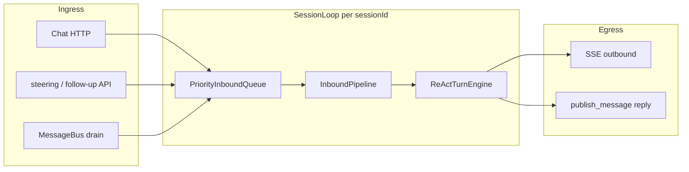
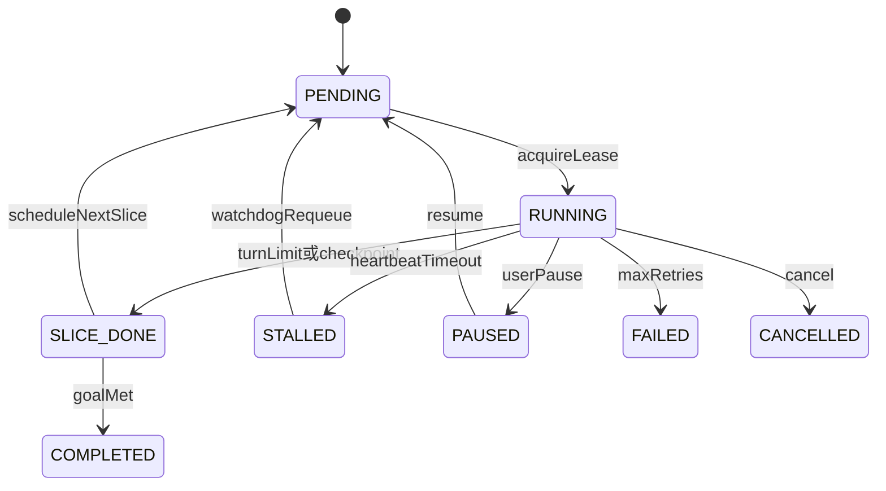

# Runtime 演进设计（SessionLoop / 长任务）

> **状态**：设计定稿，分阶段实现（未全部落地）。  
> **关联**：[RUNTIME-LAYER.md](./RUNTIME-LAYER.md)、[AGENT-COMMUNICATION.md](./AGENT-COMMUNICATION.md)、[AGENT-SKILL-DEVELOPMENT.md](./AGENT-SKILL-DEVELOPMENT.md)

本文记录 GNEX Agent 运行时的两项演进方向：

1. **SessionLoop** — 用 Netty 启发的单会话事件循环替代 steering/follow-up 双循环
2. **LongRun（72h+）** — 分片执行 + 持久状态机 + 租约心跳，保证超长任务稳定性

---

## 1. 背景：当前双循环与效率问题

### 1.1 现状（Phase 12）

| 循环 | 组件 | 职责 |
|------|------|------|
| **内循环** | `ReActTurnLoop` | think → act → observe；每 turn 开始前 `drainSteering()` |
| **外循环** | `FollowUpContinuationLoop` | ReAct 结束后 `pollFollowUp()` → `prepareFollowUpResume` → `resumeExecute` |

`MessageQueue` 提供双 Lane：

- **steering**（高优先级）：轮间注入
- **follow-up**（低优先级）：整轮 ReAct 结束后才消费

### 1.2 问题（为何感觉「效率不高」）

| 维度 | 表现 |
|------|------|
| **响应性** | steering 仅在 turn 边界轮询；follow-up 必须等整轮 ReAct 结束 |
| **session 锁** | 从 `tryAcquireSession` 到外环 follow-up 链结束才释放，连发消息只能排队 |
| **结构** | 双队列 + 外环 while + `deferCompletion` 三处协作，难扩展 bus 消息与统一优先级 |
| **CPU** | 相对 LLM 延迟（秒级）通常不是主因；checkpoint 序列化为毫秒级 |

### 1.3 与消息总线的关系

Phase 13 消息总线已实现：**publish → DB → auto-drain → AsyncAgentExecutor → ReAct**（Worker 可收消息、后台执行）。

- **Chat 主路径**：Orchestrator + 同步 Task + `MessageQueue` steering（低延迟 UI）
- **团队/异步路径**：消息总线（fire-and-forget 或 `await_response`）
- **约束**：同一协作场景不混用 sync 委派与 bus（见 [AGENT-COMMUNICATION.md](./AGENT-COMMUNICATION.md)）

Worker **未禁止** `publish_message`，可通过总线收发控制消息；与 session steering 是两套机制。

---

## 2. Netty 启发：概念对照

不引入 Netty 依赖；借鉴其 **EventLoop + Pipeline + 背压 + 生命周期** 模型。

| Netty | GNEX 现状 | 目标 |
|-------|----------|------|
| Boss EventLoop（accept） | `ChatAgentStreamRunner` 收 HTTP/SSE | 快速 ack，投递到 session loop |
| Worker EventLoop（Channel 串行） | `MessageQueue.sessionLocks` Semaphore(1) | **Per-SessionLoop**，锁内单循环处理 |
| Channel | `sessionId` / agent inbox | 升格为 `SessionChannel` / `AgentChannel` |
| ChannelPipeline + Handler | ReAct 阶段类（`TurnPreamble`、`LlmInvoker`…） | **InboundPipeline**：分类 → 注入 → 执行 |
| 优先级 inbound | steering / follow-up 两个队列 | **单一 PriorityInboundQueue** |
| eventLoop.execute / wakeUp | turn 边界 poll | 事件到达 **wakeUp(session)** |
| Backpressure / watermarks | `MessageBusBackpressurePolicy` | session inbox 深度上限 |
| IdleStateHandler | `WorkflowHeartbeatService`（30min STALLED） | Run 租约过期 → STALLED → requeue |
| Graceful shutdown | 部分缺失 | shutdown hook：checkpoint → PAUSED → 释放 lease |

**不宜照搬**：

- LLM 为秒级 blocking I/O，用 Virtual Thread 而非 NIO EventLoop 忙等
- 不在 LLM 流式生成中途硬插 steering（破坏 tool call 完整性）；在 **turn/tool 边界** 处理高优先级事件

---

## 3. Phase 2：SessionLoop（目标架构）

> **完整架构 SSOT**：[SESSION-EVENT-LOOP.md](./SESSION-EVENT-LOOP.md)（组件、Pipeline、时序、迁移、配置）。

### 3.1 总览



### 3.2 统一 Inbound 事件

```text
enum InboundKind { USER_TURN, STEERING, FOLLOW_UP, BUS_TASK, CANCEL }
优先级: CANCEL > STEERING > USER_TURN > FOLLOW_UP > BUS_TASK
```

### 3.3 单循环语义（替代双循环）

1. **一个** `messages`  transcript + **一个** `runId`，session 生命周期内延续
2. `SessionLoop.run()`：取 inbound → Pipeline → ReAct（有限 turn）→ 让出点检查高优先级 inbound
3. **Steering**：让出点注入 `UserMessage`，不结束外层 run
4. **Follow-up**：低优先级 USER 事件，idle 或 turn 完成后追加同一 transcript
5. **不再**需要 `FollowUpContinuationLoop` 外环 + 多次 `prepareFollowUpResume`

### 3.4 与 assistant / 消息总线

- Phase 1：`assistant` 作为默认 Skill 宿主（见 [AGENT-SKILL-DEVELOPMENT.md §4.1](./AGENT-SKILL-DEVELOPMENT.md)）
- Phase 2b：`assistant` 可订阅 bus topic；`MessageBusBacklogDrainer` 改为 `fireInbound(BUS_TASK)` 而非独立 while-drain 竞态

### 3.5 实施分期

| 阶段 | 范围 |
|------|------|
| **2a** | Chat Orchestrator 路径：`SessionLoop` + `InboundPipeline`；合并 follow-up 进单 loop |
| **2b** | `AgentInboxLoop` + bus 接线 + assistant 订阅 |
| **2c** | Outbound SSE 队列、inbox watermark、长 tool 协作式 cancel |

---

## 4. Phase 3：LongRun 长任务（72h+）稳定性

### 4.1 核心原则

**72 小时任务 ≠ 一个线程 / 一条 SSE 连接跑 72 小时。**

必须采用：**持久 Run 状态机 + 分片（slice）执行 + 租约心跳 + 消息总线续跑**。

当前栈限制（不可用于单次连续 72h）：

| 配置/组件 | 典型值 | 说明 |
|-----------|--------|------|
| `gnex.sse.timeout-ms` | 30 min | SSE 不能盯 72h |
| `gnex.delegate-timeout-ms` | 10 min | 同步委派会超时 |
| `DEFAULT_MAX_TURNS` | 20 | 单次 ReAct 有 turn 上限 |
| `AsyncAgentExecutor.runningJobs` | 内存 Future | 进程重启丢 in-flight |

已有可复用能力：

| 能力 | 组件 |
|------|------|
| 每 turn checkpoint | `ReActCheckpointService` / `react_checkpoint` |
| 周期短循环 + 日预算 | `AlwaysOnRunner`（**正确范式**：多轮短执行） |
| 多步 + STALLED 检测 | `WorkflowEngine` + `WorkflowHeartbeatService` |
| 持久 inbox + DLQ 退避 | `MessageBusDeadLetterService`（退避至 6h） |

### 4.2 Run 状态机



### 4.3 分片（slice）执行

每个 slice：

1. `acquireLease(runId)` — 单 worker 独占
2. 跑 **有限** ReAct（如 max 10 turn）或一个 WorkFlow 节点
3. `saveCheckpoint` + `releaseLease` + `publish(CONTINUE)` → topic `run.continue`
4. Virtual Thread 退出 — **不占 72h 线程**

### 4.4 租约与心跳（Netty IdleState 类比）

| 字段 | 建议 |
|------|------|
| `lease_owner` | 节点 instanceId |
| `lease_expires_at` | now + 5min（可配置） |
| `heartbeat_at` | 每 turn / 长 tool 每 60s 刷新 |
| Watchdog | 扫描 `RUNNING AND lease_expires_at < now()` → `STALLED` → bus requeue |

### 4.5 上下文与存储

| 风险 | 对策 |
|------|------|
| `messages_json` 膨胀 | 每 slice 后 `ContextCompactor` + 归档至 `agent_trajectory` / FileStore |
| SQLite 单连接 | 72h 生产建议 **PostgreSQL** |
| Token 跨天 | Always-On 式 daily budget + run 级 total budget |
| 大产物 | 写 `outputs/`，checkpoint 只存引用 |
| 幂等 | slice 带 `slice_seq`；tool 侧 idempotency key |

### 4.6 三种长任务路径选型

```text
任务类型？
├─ 多步骤、需审批、可人工介入 → WorkFlow（扩展节点超时与 heartbeat）
├─ Agent 自主循环、周期性巡检 → Always-On（intervalSec）
└─ 单次目标但耗时极长 → LongRun + Slice + Bus 续跑（本节）
```

**禁止**用主 Chat Orchestrator + session 锁承载 72h 任务。

### 4.7 建议配置（示意）

```yaml
gnex:
  long-run:
    slice-max-turns: 10
    lease-ttl-sec: 300
    heartbeat-interval-sec: 60
    stall-threshold-sec: 600
    max-slice-retries: 5
    total-max-duration-hours: 168
```

### 4.8 验收标准

- 进程 kill 后 10min 内 watchdog 续跑，不重复已成功 slice
- 滚动部署：in-flight slice → PAUSED → 新节点续跑
- 用户关闭浏览器 72h 后 `GET /runs/{id}` 仍可查状态

---

## 5. GNEX 1.0 → 2.0 规划建议

### 5.1 定位差异

| | **1.0 演示系统** | **2.0 企业生产系统** |
|--|-----------------|---------------------|
| 首要目标 | 能跑、能讲、能装 Skill | 稳定、可观测、可恢复、可扩展、可运维 |
| 运行时 | 双循环 + 内存 Job 可接受 | 需统一调度模型与持久 Run |
| 通信 | 同步 Chat 为主 | Chat + 总线 + WorkFlow + 后台 Job 并存 |
| 数据库 | SQLite 零配置 | PostgreSQL 生产主库（推荐） |

### 5.2 SessionLoop vs 双循环（2.0 中肯结论）

**2.0 目标架构应采用 SessionLoop，替代双循环作为主运行时内核**——主要不是因为 CPU 性能，而是因为企业生产需要：

| 双循环在 2.0 的风险 | SessionLoop 在 2.0 的收益 |
|--------------------|-------------------------|
| steering / follow-up / bus 三套入口，排障难 | 统一 PriorityInbound + 让出点 |
| session 锁贯穿 ReAct + follow-up 外环 | 锁与事件生命周期可明确定义 |
| bus drain 与 Chat 两套调度心智 | Per-Session / Per-Agent Loop 可同源扩展 |
| 与 LongRun 分片边界纠缠 | slice 结束 = SessionLoop 让出点，与 §4 对齐 |

**不宜高估的部分**：

- SessionLoop **不会**显著缩短 LLM 单次延迟
- steering 仍在 turn/tool 边界注入，非流式中途改字
- **不能**用 SessionLoop 替代 Orchestrator 同步 Chat UX
- 全量迁移 **成本高**（d2/d3/d4 + 测试回归），不宜作为 2.0 第一天唯一里程碑

**一句话**：双循环是 1.0 演示够用的折中；SessionLoop 是 2.0 更干净的主干——**应写入 2.0 规划，宜分阶段交付（2.0 / 2.1），而非首日全量重写。**

### 5.3 2.0 推荐优先级（相对 SessionLoop）

| 优先级 | 能力 | 说明 |
|--------|------|------|
| **P0** | 多租户隔离、审计、预算、权限硬化 | 企业准入门槛 |
| **P0** | LongRun：分片 + 租约 + DB 状态机 + watchdog | 长任务；双循环无法解决 |
| **P0** | assistant / Skill 归属 + 热加载（Phase 1） | 演示与企业合规 |
| **P1** | PostgreSQL 生产路径 | SQLite 不适合 2.0 生产主库 |
| **P1** | 消息总线 Per-Agent 串行消费（可先不做完整 Pipeline） | 小改消除 drain 竞态 |
| **P1–P2** | SessionLoop 2.0 内核 | P0 稳定后替换双循环 |
| **P2** | 完整 InboundPipeline、control topic、Outbound 队列 | bus 总控成熟后 |

**2.0 运行时目标公式**（不单换 SessionLoop）：

```text
持久 Run 状态机（LongRun）
+ Per-Session / Per-Agent Loop（替代双循环）
+ 消息总线 durable inbox（统一调度）
+ Chat Orchestrator 仍负责同步 UX（保留）
```

### 5.4 1.0 过渡期可选小改（验证方向、低 ROI 风险）

在不做全量 SessionLoop 前，可先拿部分收益：

| 小改 | 效果 |
|------|------|
| follow-up 同 runId 内 append transcript，减少 `resumeExecute` 重建 | 降延迟、减 bug 面 |
| tool batch 结束后再 poll steering 一次 | 长 tool 场景略好 |
| ReAct 主路径结束即释放 session 锁，follow-up 重新 acquire | 减少「session busy」 |
| bus drain 绑定 per-agent 单线程 executor | 比完整 Pipeline 改动小 |

### 5.5 何时值得全量做 SessionLoop

满足 **两条以上** 建议纳入 2.0/2.1 全量 SessionLoop：

1. Worker 经 bus 收/发 control，与 Chat 共用调度抽象
2. follow-up / steering 类问题在生产环境反复出现
3. 明确 roadmap：multi-agent 同 session、inbound 类型持续增加
4. 可投入专门 sprint 做 runtime 重构与 E2E 回归

若 2.0 首版仅为「演示加固 + assistant + PG + 权限」，SessionLoop 可放到 **2.1**。

---

## 6. 实施顺序（Roadmap）

| Phase | 内容 | 文档 | 2.0 优先级 |
|-------|------|------|------------|
| **1** | `assistant` 默认 Skill 宿主、热 reload、V63 migration | [AGENT-SKILL-DEVELOPMENT.md §4.1](./AGENT-SKILL-DEVELOPMENT.md) | P0 |
| **3** | LongRun 表、RunLease、Watchdog、slice 执行器 | 本文 §4 | P0（有长任务时） |
| **2a** | SessionLoop Chat 路径、合并 follow-up | 本文 §3 | P1–P2 |
| **2b** | AgentInboxLoop + bus 统一 | 本文 §3 | P2 |

**2.0 建议顺序**：Phase 1 → Phase 3a → Phase 2a → Phase 2b。

---

## 7. 相关文档

| 文档 | 内容 |
|------|------|
| [RUNTIME-LAYER.md](./RUNTIME-LAYER.md) | 当前 d4 组件与双循环时序 |
| [AGENT-COMMUNICATION.md](./AGENT-COMMUNICATION.md) | 同步委派 / 消息总线 / dispatch+await |
| [HARNESS-MATURITY.md](./HARNESS-MATURITY.md) | Harness 与双循环差距 |
