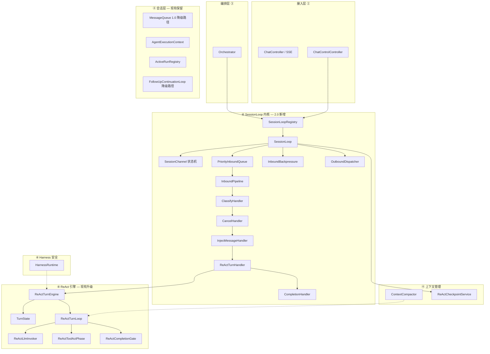

# D4 运行时层 2.0 架构

> **层号**：④ `d4-runtime`（运行时层）+ `libs/gnex-agent-sdk`
> **Owner 边界**（不含 ②③⑤）：见 [INTELLIGENT-ENGINE-LAYER.md](./INTELLIGENT-ENGINE-LAYER.md)
> **SessionLoop 架构 SSOT**：[SESSION-EVENT-LOOP.md](./SESSION-EVENT-LOOP.md)（§0 总监导读 + §2–§12 实现）
> **产品目标 SSOT**：~~[GNexCore架构设计_2.1.html](../GNexCore架构设计_2.1.html) §5.1.4~~（⚠️ 外部 HTML 已不在仓库，相关内容已内化到 [ARCHITECTURE.md](./ARCHITECTURE.md)）
> **关联**：[LAYER-ARCHITECTURE.md](./LAYER-ARCHITECTURE.md)、[RUNTIME-EVOLUTION.md](./RUNTIME-EVOLUTION.md)
> **⚠️ v1.0 代码对照**：[V1-CODE-REALITY.md](./V1-CODE-REALITY.md)——SessionLoop / ReActTurnEngine / ChannelStatus 等在 v1.0 完全不存在，复用 vs 新建决策见 §5/§6

---

## 1. 层定位

### 1.1 职责

| 维度 | 说明 |
|------|------|
| **核心职责** | **SessionLoop 统一调度** + **ReActTurnLoop 单轮执行** + checkpoint |
| **会话调度** | `PriorityInboundQueue` + `SessionChannel` + `runOneTurn()`（无双循环） |
| **让出语义** | `runOneTurn()` 返回 → SessionLoop poll 下一 `InboundEvent` |
| **SSE 关系** | SSE 是观察者；Run 状态经 StatePort / checkpoint 持久化 |

### 1.2 不负责

HTTP/SSE 暴露（②）、意图路由与 Workflow 编排（③）、工具注册定义（⑤）、Inspector 实现（⑦）、DB Mapper（⑨）

### 1.3 与 2.1 产品架构的映射

2.1 五层技术架构中 ④ = 执行层 = Sandbox Pool。九层逻辑分层中 ④ = d4-runtime = Agent 运行时。

**映射声明**：九层 ④ d4-runtime 对应 2.1 的 ② Agent 引擎内部运行时模块，不对应 2.1 的 ④ 执行层（沙箱）。2.1 的 ④ 执行层对应九层的 ⑦ d7-sandbox。

### 1.4 系统不变量

以下条件在系统任意时刻必须成立（详见 [SESSION-EVENT-LOOP.md §1.3](./SESSION-EVENT-LOOP.md)）：

| # | 不变量 | 保障机制 |
|---|--------|----------|
| I1 | 同一 sessionId 最多一个 SessionLoop 处于 PROCESSING | SessionLoopRegistry 单例 + lease 独占 |
| I2 | CANCEL 事件在下一 runOneTurn() 返回前生效 | CANCEL 优先级 0 + 循环顶部 poll |
| I3 | checkpoint 的 turnIndex 单调递增 | saveProgress 只写当前 turnIndex；DB 唯一约束 |
| I4 | STALLED → CANCELLED 不超过 max-stall-retries | Watchdog 计数 + 超限强制 |
| I5 | 低优先级事件等待不超过 priority-aging-ms + 一个 poll 周期 | 老化升级 + 强制消费 |
| I6 | SSE 断开不改变 Run 状态 | Run 状态持久化在 DB，SSE 只是观察者 |

---

## 2. 层间位置

> 基础层间图见 [INTELLIGENT-ENGINE-LAYER.md §1.3](./INTELLIGENT-ENGINE-LAYER.md)。下图增加 v1.0 类名标注和 2.0 新组件。

```
┌─────────────────────────────────────────────────────────────┐
│ ① d1-web          React Chat / hooks / SSE 解析              │
└────────────────────────────┬────────────────────────────────┘
                             │ HTTP / SSE
┌────────────────────────────▼────────────────────────────────┐
│ ② d2-access       ChatController, ChatAgentStreamRunner,     │
│                   ChatControlController (steering/follow-up) │
└────────────────────────────┬────────────────────────────────┘
                             │ SessionLoopPort.fireInbound()
┌────────────────────────────▼────────────────────────────────┐
│ ③ d3-orchestration Orchestrator, Workflow, Team, Room        │
│                   （旁路触发 runtime）                          │
└────────────────────────────┬────────────────────────────────┘
                             │ AgentRuntimePort / ReActLoop API
┌────────────────────────────▼────────────────────────────────┐
│ ④ d4-runtime  ◄── 本文档                                      │
│   SessionLoop · ReActTurnEngine · PriorityInboundQueue        │
│   Checkpoint · TurnState · Harness · Context                  │
└───┬─────────┬─────────┬─────────┬─────────┬──────────────────┘
    │         │         │         │         │
    ▼         ▼         ▼         ▼         ▼
  ⑤注册    ⑦沙箱    ⑧总线    ⑨数据    ⑥治理(旁路)
```

---

## 3. 层内架构

### 3.1 模块总览



### 3.2 五个子包

| 子包 | 职责 | 类数 | 来源 |
|------|------|------|------|
| `loop/` | SessionLoop 内核：调度、队列、Handler 链、状态机、背压 | 18 | 2.0 新增 |
| `react/` | ReAct 执行引擎：单轮执行、Turn 状态、LLM 调用、工具派发、完成判定 | ~25 | 现有 + 2.0 新增 ReActTurnEngine、TurnState |
| `session/` | 会话与并发：1.0 双循环降级路径、ThreadLocal 上下文、in-flight 追踪 | ~8 | 现有保留 |
| `harness/` | Harness 4 层安全运行时 | ~10 | 现有保留 |
| `context/` | 上下文管理：压缩、裁剪、Token 预算、checkpoint 持久化 | ~15 | 现有保留 |

---

## 4. SessionLoop 内核（2.0 核心）

详见 [SESSION-EVENT-LOOP.md](./SESSION-EVENT-LOOP.md)，本节仅列要点与代码的映射。

### 4.1 主循环

```
SessionLoop.runLoop(channel):
    channel.status = PROCESSING
    while channel.status in (PROCESSING, YIELDING):
        event = inboundQueue.poll(timeout=yieldTimeout)
        if event == null:
            if noPendingWork(channel): channel.status = IDLE; break
            continue
        decision = pipeline.fire(channel, event)
        if decision == RUN_ONE_TURN:
            turnResult = engine.runOneTurn(channel, turnState)
            persistCheckpoint(channel)
            continue                    ← 回到循环顶部，自动 poll
        elif decision == COMPLETE / CANCELLED / YIELD_SLICE:
            ... break or continue
    outbound.flush(channel)
    registry.onLoopExit(channel)
```

### 4.2 让出点

| 时机 | SessionLoop 行为 | 对应 2.1 §5.1.4 |
|------|-----------------|------------------|
| 每 turn 结束 | runOneTurn() 返回 → 循环顶部 → poll() | PREP 步骤升级：Steering 由队列驱动而非轮询 |
| slice 预算耗尽 | TurnResult=BUDGET_EXHAUSTED → YIELD_SLICE | 72h 任务 = N 次短 slice |
| ReAct 自然结束 | TurnResult=REACT_DONE → COMPLETED 或注入 FOLLOW_UP | Final Answer 终止条件 |

> **TurnResult 映射 / InboundKind 优先级 / 防饿死 / 状态机**：详见 [RUNTIME-CONTRACTS.md §8](./RUNTIME-CONTRACTS.md)（避免重复，本文档不再维护这些表的副本）。

---

## 5. ReAct 执行引擎（2.0 升级）

### 5.1 ReActTurnEngine

包装现有 `ReActTurnLoop`，暴露 `runOneTurn(channel, turnState)` 接口。

**关键约束**：
- 不持有可变状态——所有跨 turn 状态通过 TurnState 传入/传出
- 不消费 steering——传入 `steeringSupplier = () -> null` 禁用旧路径
- 不修改 `ReActTurnLoop.run()` 内部逻辑——`runOneTurn` 在外层做适配

### 5.2 TurnState

```java
public record TurnState(
    int turnIndex,
    int[] totalTokenUsage,
    int totalToolCalls,
    Map<String, Integer> toolCallSignatureCounts,
    ReActCompletionGate.RouteState routeState,
    List<Message> messages,
    Set<String> deniedTools
) {}
```

### 5.3 与 2.1 §5.1.4 四步循环的映射

| 2.1 步骤 | D4 2.0 组件 | 说明 |
|----------|------------|------|
| **PREP**（上下文裁剪 + 记忆召回 + Steering） | `InjectMessageHandler` + `ReActTurnPreamble` | SessionLoop poll → pipeline.fire() 处理 Steering；TurnPreamble 处理裁剪/记忆/预算 |
| **THINK**（LLM 推理） | `ReActLlmInvoker`（在 runOneTurn 内） | ReActTurnHandler → engine.runOneTurn() |
| **ACT**（工具执行） | `ReActToolActPhase`（在 runOneTurn 内） | 同上 |
| **OBSERVE**（结果拼回 messages） | `TurnState` 更新 | runOneTurn() 返回 → SessionLoop 继续 |

### 5.4 6 大风险对照

详见 [V1-CODE-REALITY.md §6](./V1-CODE-REALITY.md#6-v20-文档的真空白v10-一行没有)（v1.0 真空白清单）。

| # | 风险 | D4 2.0 缓解 |
|---|------|-------------|
| 1 | 循环体拆分丢状态 | TurnState 收敛跨 turn 状态 |
| 2 | Steering 双消费 | runOneTurn 传入 `steeringSupplier = () -> null` |
| 3 | resumeExecute 重建 | TurnState 初始化包含必要状态 |
| 4 | finishTurn lambda | TurnState 携带累计 token 用量 |
| 5 | ThreadLocal 跨线程 | runOneTurn 在同 VT 内完成 |
| 6 | PhasedAgentLoop 双路径 | runOneTurn 不修改 run()，旧路径仍走 run() |

---

## 6. 与 2.1 系统级三层循环映射

2.1 §5.1.3 定义了三层循环，D4 2.0 的映射：

| 2.1 循环 | D4 2.0 组件 | 说明 |
|----------|------------|------|
| **Loop 1 · 执行循环**（ReAct think→act→observe） | `ReActTurnEngine.runOneTurn()` | SessionLoop 每轮 poll 后调一次 |
| **Loop 2 · 校验循环**（质量评估） | 不归属 D4——由编排层 `QualityGatePort.evaluate()` 作为 SessionLoop 高优消息消费。⚠️ **`QualityGatePort` 在 v1.0 实际是 CI 覆盖率门**，本行是 2.0 规划语义，需独立 `TurnQualityPort` 才能落地（见 [LOOP-ENGINEERING-ASSESSMENT §1.3](./LOOP-ENGINEERING-ASSESSMENT.md)） | D4 不关心 Loop 2 调度；编排层在 SessionLoop 让出点排入质量检查消息，D4 仅提供 `CompletionHandler` 使运行时级检查嵌入 Loop 1 |
| **Loop 3 · 事件驱动循环**（Cron/Webhook/Bus 触发） | `AgentInboxLoop`（Phase 2b） | bus 消息 → fireInbound → SessionLoop |

---

## 7. 上层接口（谁调用 Runtime）

### 7.1 调用方矩阵（2.0）

| 上层 | 入口类 | 调用的 Runtime API | 场景 |
|------|--------|-------------------|------|
| **② 接入** | `ChatAgentStreamRunner` | `SessionLoopPort.fireInbound(USER_TURN)` | 主 Chat SSE（2.0 路径） |
| **② 接入** | `ChatControlController` | `SessionLoopPort.fireInbound(STEERING/FOLLOW_UP/CANCEL)` | 运行中纠偏/续跑/取消 |
| **③ 编排** | `Orchestrator` | `AgentRuntimePort.runCoordinatorReAct` / `delegateToWorker` | 协调器 ReAct / 直委派 |
| **③ 编排** | `AgentScheduler` | `ReActLoop.execute` + `processFollowUps`（1.0 降级路径） | 后台 Agent Job |
| **⑧ 总线** | `AgentCommunicationAdapter` | `AgentRuntimePort.delegateToWorker` | 信箱触发 Worker |

### 7.2 SessionLoopPort 契约

```java
public interface SessionLoopPort {
    void fireInbound(Long sessionId, InboundKind kind, String payload);
    void wakeUp(Long sessionId);
    boolean isBusy(Long sessionId);
    void attachSse(Long sessionId, String sseSessionId);
    void detachSse(Long sessionId);
    ChannelStatus getChannelStatus(Long sessionId);
}
```

### 7.3 AgentRuntimePort 契约（保留）

```java
public interface AgentRuntimePort {
    String delegateToWorker(String agentName, String taskDescription);
}
```

---

## 8. 下层接口（Runtime 依赖谁 — 微服务视角）

### 8.1 依赖矩阵（2.0 微服务视角）

| 下层 | 服务 | 接口（Port） | Runtime 消费点 | 通信模式 |
|------|------|-------------|----------------|----------|
| **⑤ 注册** | platform-service | `ModelConfigPort`, `SkillRegistryPort`, `McpServerConfigPort`, `AutoSkillCatalogPort`, `SkillOnDiskCatalogPort`, `CustomToolQueryPort` | 加载 Agent、模型、工具、Skill | P1（当前）/ P2（Phase 7+） |
| **⑤ SPI** | platform-service | `ExtensionSpiPort`, `ToolHookPort` | 风险分类、审批、Hook 生命周期 | P1 / P2 |
| **⑦ 沙箱** | sandbox-runtime | `SandboxPort` | ACT 阶段安全拦截 + 工具执行 | P4（异步请求/响应） |
| **⑨ 数据** | agent-service 内 | `ReActCheckpointService`, `GnexMemoryService`, `RunEventRecorderPort` | 断点、记忆、事件记录 | 进程内 |
| **⑥ 治理** | agent-service 内 | `AgentBudgetPort`, `LlmRateLimiter`, `LlmCircuitBreaker` | 预算、限流、熔断 | 进程内 |
| **⑧ 总线** | bus-service | `MessageBusPort` | AgentInboxLoop 消费（Phase 2b） | P3/P5 |
| **⑤ OTel** | platform-service | `OtelMirrorPort` | 事件 OTel span 镜像 | P1 / 直连 OTel |

> 完整契约定义见 [RUNTIME-CONTRACTS.md](./RUNTIME-CONTRACTS.md) §6–§8（RC-12 ~ RC-25）。

---

## 9. Feature Flag 与降级

```yaml
gnex:
  event-loop:
    enabled: ${GNEX_EVENT_LOOP_ENABLED:false}
    yield-timeout-ms: 500
    max-inbound-per-session: 50
    max-turns-per-slice: 20
    checkpoint-interval-turns: 1
    priority-aging-ms: 30000
    priority-force-consume-every: 10
    max-stall-retries: 3
    transcript-hot-window-size: 20
```

- `enabled=false`：现有 1.0 双循环路径不变（Orchestrator → ReActLoop.run() + FollowUpContinuationLoop）
- `enabled=true`：Orchestrator → SessionLoopRegistry.fireInbound() → SessionLoop → ReActTurnEngine.runOneTurn()
- 两条路径共享 `ReActTurnLoop` 的 turn 体执行逻辑，入口不同

---

## 10. 迁移步骤（Phase 2a — Chat 路径）

| 步骤 | 内容 | 涉及文件 |
|------|------|----------|
| 1 | 创建 `loop/` 子包 + PriorityInboundQueue + SessionLoopRegistry | 新建 2 类 |
| 2 | 创建 InboundEvent + InboundKind + TurnResult + LoopControlDecision | 新建 4 类 |
| 3 | 实现 SessionChannel（状态机 + STALLED 恢复） | 新建 1 类 |
| 4 | 实现 InboundPipeline + 5 个 Handler | 新建 6 类 |
| 5 | 实现 InboundBackpressure + OutboundDispatcher | 新建 2 类 |
| 6 | 实现 TurnState + ReActTurnEngine | 新建 2 类 |
| 7 | 实现 SessionLoop 主循环 | 新建 1 类 |
| 8 | SessionLoopPort 加入 gnex-contracts | 新建 1 接口 |
| 9 | ChatControlController 改 fireInbound | 改 1 类 |
| 10 | Orchestrator 去掉 followUpContinuationLoop | 改 1 类 |
| 11 | Feature flag 灰度 + E2E 测试 | 配置 + 11 用例 |
| 12 | 废弃 FollowUpContinuationLoop（或保留空壳） | 改 1 类 |

---

## 11. 与 2.1 差距矩阵（④ Owner 项 2.0 更新）

| 2.1 条目 | GNEX 1.0 | 2.0 状态 | 负责 |
|----------|-----------|---------|------|
| ReAct 四步 PREP→think→act→observe | `ReActTurnLoop` | ✅ | ④ |
| PREP：Steering 注入 | `MessageQueue.drainSteering` | ✅ → SessionLoop PriorityQueue 驱动 | ④ |
| Steering：WebSocket cancel（长原语打断） | 无 | ☐ 未落地 | ④+⑦ |
| 终止：Final Answer / max_steps / deadline / 死循环 | 部分实现 | ✏️ deadline 待补 | ④ |
| 大 Agent Loop（第一层） | `ReActLoop` | ✅ → SessionLoop 替代 | ④ |
| 复合操作 Worker（第二层） | `AgentSyncExecutor` | ✏️ | ④ |
| SessionLoop 统一调度 | 无 | ✅ Phase 2a 落地 | ④ |
| checkpoint 降频 | 每轮写 DB | ✅ 可配置 | ④ |
| transcript 懒加载 | 全量内存 | ✅ 热窗口 20 turns | ④ |
| STALLED 恢复 | 无 | ✅ Phase 2a 落地 | ④ |

**图例**：✅ 已对齐 · ✏️ 部分等价或演进中 · ☐ 2.1 目标态未落地

---

## 12. 相关文档

| 文档 | 内容 |
|------|------|
| [SESSION-EVENT-LOOP.md](./SESSION-EVENT-LOOP.md) | SessionLoop 架构 SSOT（组件、Pipeline、时序、迁移、不变量） |
| [SESSION-EVENT-LOOP-EXEC-SUMMARY.md](./SESSION-EVENT-LOOP-EXEC-SUMMARY.md) | 技术总监一页摘要 |
| [RUNTIME-EVOLUTION.md](./RUNTIME-EVOLUTION.md) | 1.0→2.0 演进、LongRun、优先级、Netty 对照 |
| [LAYER-ARCHITECTURE.md](./LAYER-ARCHITECTURE.md) | 九层 SSOT、依赖矩阵 |
| [INTELLIGENT-ENGINE-LAYER.md](./INTELLIGENT-ENGINE-LAYER.md) | ④ Owner 边界与 2.1 产品层对照 |
| [RUNTIME-CONTRACTS.md](./RUNTIME-CONTRACTS.md) | 跨层契约 SSOT |
| [ARCHITECTURE.md](./ARCHITECTURE.md) | 产品/技术架构 SSOT（替代已移除的外部 HTML） |

---

## 附录 A. v1.0 已落地能力（2.0 应复用）

> 完整对照见 [V1-CODE-REALITY.md](./V1-CODE-REALITY.md)。本节列**运行时层** 2.0 实施时应**复用而非新建**的 v1.0 能力。

### A.1 每 turn checkpoint 已实现

| 2.0 抽象 | v1.0 已有 | 代码位置 |
|---|---|---|
| 每 turn checkpoint 落盘 | `react_checkpoint` 表 + `ReActCheckpointService.saveProgress` | `ReActCheckpointService.java:29-64` |
| PAUSED / RESUMABLE 状态机 | `markResumable` / `markCompleted`，status: IN_PROGRESS/RESUMABLE/COMPLETED | `ReActCheckpointService.java:67-107` |
| 孤儿 checkpoint 清理 | `cleanupOrphanedInProgress(sessionId)` | `ReActCheckpointService.java:76-93` |
| 恢复入口 | `findResumableBySession` | `ReActCheckpointService.java:107-138` |
| 单轮包装 | `resumeExecute()` 已存在 | `ReActLoop.java:314` |

**说明**：v1.0 没有 YIELDING/STALLED 状态、没有 `lease_owner/lease_expires_at` 字段、没有 `RunLease` 表——这些是 2.0 真空白。但 RESUMABLE 已是 PAUSED 的等价物，可直接复用 status 枚举扩展。

### A.2 slice turn budget 已有雏形

`AlwaysOnRunner.java:33-35`：`DISCOVERY_MAX_TURNS=6 / PLAN_MAX_TURNS=4 / EXECUTE_MAX_TURNS=15` ——这就是 2.0 `max-turns-per-slice:20` 的现成实现，按阶段切片。

### A.3 DB lease 雏形（CAS 行级）

`AlwaysOnRunner.java:50` 的 `tryMarkRunning(taskId)` 是 DB 行级 CAS 当 lease——2.0 `RunLease` 表是它的强化版（加 `lease_owner` + `lease_expires_at` 独占字段），不是从零开始。

### A.4 Watchdog requeue 雏形

`BackgroundScheduler.java:40-58`：`@Scheduled fixedDelay=60s` + `Executors.newVirtualThreadPerTaskExecutor()` 等价于 2.0 "Watchdog requeue → 单 VT 跑 slice"。

### A.5 FORK 并行 + 批取消（直接复用）

`CompletableFuture.allOf()` + `ConcurrentHashMap<batchId, List<Future>>` + `cancelBatch` 在 `WorkflowEngine.java:243`、`TeamBatchExecutor.java:36,186,195,228`、`AgentFlowEngine.java:146` 已验证可靠。

---

## 附录 B. v1.0 真空白（2.0 必须新建）

| 2.0 抽象 | 1.0 最接近的存在 |
|---|---|
| `SessionLoop.runLoop()` 主循环 | 无（全仓 grep 仅命中 docs） |
| `SessionLoopRegistry` | 无。1.0 用 `ChatActiveRunPort.registerRun` 仅记 SSE 订阅者 |
| `ReActTurnEngine.runOneTurn()` | 无。1.0 只有 `ReActLoop.execute()` 全量 + `resumeExecute()` |
| `TurnResult` / `LoopControlDecision` | 无 |
| `ChannelStatus`（YIELDING/STALLED） | 无。1.0 只有 `AgentJob.status` 字符串 + `react_checkpoint.status` |
| `RunLease` 表 / `lease_owner` / `lease_expires_at` | 无（`AlwaysOnTask.nextRunAt` 不是 lease） |
| `gnex.event-loop.*` 配置块 | 无。`application.yml` 只有 `always-on.enabled=true` |

详见 [V1-CODE-REALITY.md §6](./V1-CODE-REALITY.md#6-v20-文档的真空白v10-一行没有)。

---

*D4 运行时层 2.0 — GNEX SessionLoop 统一调度 + ReAct 单轮执行。实现以源码与 feature flag 为准。*
