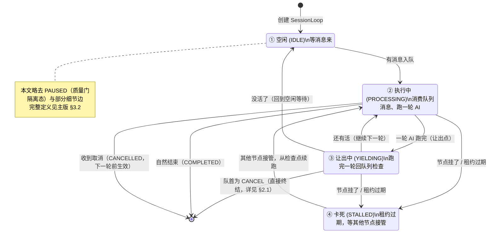

# SessionLoop 是什么——GNEX 2.0 会话调度内核

> **本文定位**：入门导读（给产品 / 业务 / 运维 / 新人架构师）。
> **不含**类名、接口名、迁移代码。
> **技术定稿见**：[SESSION-EVENT-LOOP.md](./SESSION-EVENT-LOOP.md)（含完整状态机、类清单、Phase 2a/2b 迁移步骤）。
>
> **一句话**：把现在三套各管各的调度（聊天、消息总线、长任务），收成一套统一的"排队→干活→让出"循环——让系统更稳、更好扩、更好修。

### 读者指南（按角色选读）

| 角色 | 推荐读 | 关心什么 |
|------|--------|---------|
| **产品 / 业务** | §0 全部 + §4.2 不替换什么 | 这玩意儿能给客户讲什么故事、不能讲什么 |
| **运维 / SRE** | §0.4 状态机 + §1 稳定性 + §3.2 多实例 + §6 配置项 | 故障恢复、滚动发布、长任务、配置调优 |
| **客户成功 / 售前** | §0.1 vs §0.2 对照 + §1.2 故障表 | 1.0 客户的痛点 2.0 怎么解决 |
| **新人架构师** | 全文 + 主版 [SESSION-EVENT-LOOP.md](./SESSION-EVENT-LOOP.md) | 先建立直觉，再看技术定稿 |
| **d2/d3/d4 开发** | 直接看主版，本文仅在卡壳时回查 | 类清单、迁移步骤、契约 |

---

## 0. 这东西干什么用的

### 0.1 现在（1.0）有什么问题

GNEX 1.0 有三套各管各的调度机制：

| 调度 | 管什么 | 问题 |
|------|--------|------|
| **内环** | 聊天的每轮思考→行动→观察 | 跑得挺好，但不知道怎么插队 |
| **外环** | 一轮 AI 回答完，要不要继续追问 | 和主循环不是一套，状态容易散 |
| **消息总线** | Agent 之间的消息投递 | 第三套机制，和聊天完全隔离 |

**后果**：
- 用户发了新消息（steering），要等当前这轮 AI 跑完才能生效，不能"打断一下改方向"
- 滚动发布时，正在跑的请求可能丢
- 想加个长任务（跑 72 小时），发现调度机制不支持
- 出了问题，很难定位"到底卡在哪了"

### 0.2 2.0 怎么解决

**把三套合成一套：SessionLoop**。

它的工作方式很简单——就像一个**单线程的消息处理器**：

```
循环 forever:
    从队列拿一个消息（按优先级排队）
    如果是"做一轮 AI 思考"→ 执行一轮
    如果是"取消" → 标记取消
    如果是"改方向" → 把新消息拼进上下文
    做完一轮 → 回到队列拿下一个消息
```

**核心原则**：每一轮做完都是"让出点"——回到队列看看有没有更急的消息要处理，而不是死死抱住不放手。

### 0.3 一张图看懂（数据流）

```
所有入口 ─→ 优先级队列 ─→ SessionLoop ─→ 结果/SSE ─→ 回队
```

所有入口消息（用户消息 / 改方向 / 取消 / 消息总线）都走同一条优先级队列——改方向/取消也是入队消息（只是优先级更高），不是"做完一轮后的分支处理"。每轮 AI 跑完，SessionLoop 自动回到队列，按优先级取下一条。详细流转见 §7 总结图。

### 0.4 状态流转（SessionLoop 一生）

从出生到结束，SessionLoop 在几个状态之间来回切换。看懂这张图就读懂了它的生命周期：



**关键规律**：
- 大部分时间在 **①↔②↔③** 之间循环——这才是"干活"的正常状态
- **检查点不是状态**，而是 YIELDING 时做的一个动作（按配置间隔存盘，默认每 1 轮存一次）
- **优雅停机/滚动发布** 走 YIELDING + 强制 checkpoint 存盘后退出，**不引入单独状态**；重启后按 STALLED 恢复路径从检查点续跑
- **STALLED** 是"看起来在跑其实挂了"的中间态，租约过期后由其他节点接管恢复
- **PAUSED**（质量门隔离态）本文略——发生频率低，详见主版 §3.2
- 终态有两个：**COMPLETED**（正常结束）和 **CANCELLED**（被取消）
- 完整状态机定义见 [SESSION-EVENT-LOOP.md §3.2](./SESSION-EVENT-LOOP.md)

### 0.5 为什么必须现在做（2.0），不能拖到 2.5

**业务紧迫性**（1.0 痛点详见 §0.1）：

| 客户场景 | 2.0 解决方式 | 影响 |
|---------|------------|------|
| 企业滚动发布（每周/双周） | YIELDING + checkpoint，从断点续跑 | SRE 不再加班、SLA 可守 |
| 长任务（数据治理、批处理） | slice 化（默认 20 轮/片）+ 跨节点恢复 | 产品能力扩展到长任务场景 |
| 多租户大并发 | 单会话串行 + 全局并发槽，状态外化 | 大客户扩容可成 |
| Agent 间协作 | 消息总线降为优先级 4 输入（BUS_TASK），SessionLoop 统一调度 | 多 Agent 编排有统一载体 |

→ 这不是"性能优化"，是**企业生产可运维**问题——1.0 在 PoC 阶段够用，进入规模化采购阶段会被卡。

**与其他 v2.0 项的依赖关系**：

```
Phase 5  SDK 抽离完成      ← 前置：SessionLoop 必须在 SDK 内
   │
   ▼
Phase 6  SessionLoop 统一   ← 本文档主角
   │
   └─→ Phase 7  StatePort Redis 化   （SessionLoop 需要热路径状态外化）

注：Agent 间通信复用消息总线（agent_message_bus → BUS_TASK 入队），
    不引入独立的 A2A 跨集群网关。
```

→ **SessionLoop 是 v2.0 的承重点**：Redis 化依赖它。不做 SessionLoop，Redis 化无法落地。

**不做的代价**：
- Redis 化只能给 1.0 双循环"打补丁"，状态散在三处，分布式一致性难保证
- Agent 间 handoff 没有统一执行载体，跨节点恢复靠消息总线"打补丁"
- 每多一个客户场景，就要多打一层补丁——技术债持续累积

详细 Phase 编号见 [AGENT-SERVICE-DESIGN.md §10](./AGENT-SERVICE-DESIGN.md)（v2.0 能力演进 Phase 5–8；与 [AGENTOS-SPLIT.md §9](./AGENTOS-SPLIT.md) 代码搬迁 Phase 编号不同）。

> **编号口径提示**：v2.0 能力演进 Phase（5/6/7）与 SessionLoop 子阶段（Phase 2a/2b，见 §5）是两个轴——前者按"SDK 抽离 / SessionLoop / StatePort"粗粒度划分，后者是 SessionLoop 内部的落地步骤。本文 §5「第一阶段/第二阶段」对应主版的 Phase 2a/2b。

---

## 1. 它的"稳"体现在哪

### 1.1 六条铁律

| # | 铁律 | 大白话 |
|---|------|--------|
| **I1** | 一个会话同时最多只有一个 SessionLoop 在跑 | 两个人不能同时改同一个文档，会打架 |
| **I2** | 取消消息在下一轮开始前必须生效 | 你说"停"，下一轮一定停 |
| **I3** | 检查点的编号只能越来越大 | 恢复时不会重复执行某一步 |
| **I4** | 卡死的任务最多重试 3 次，多了就彻底取消 | 不会无限重试拖垮系统 |
| **I5** | 低优先级消息不会永远等不到 | 即使一直有人插队，普通消息也会被"老化升级" |
| **I6** | SSE 断开了不影响任务状态 | 刷新页面任务还在，只是看不到推送了 |

### 1.2 常见故障怎么处理

最关键的三类（完整 5 类对照见 [主版 §0.3](./SESSION-EVENT-LOOP.md)）：

| 故障 | 1.0 会怎样 | 2.0 SessionLoop 会怎样 |
|------|-----------|----------------------|
| 进程突然挂了（OOM/kill） | 正在跑的任务丢了 | 租约过期 → 其他节点从检查点接管 |
| 滚动升级发版 | 内存里的 Future 丢了 | YIELDING + 检查点，发完后从断点恢复 |
| 用户刷新页面（SSE 断开） | 依赖"孤儿清理" | SSE 与任务解耦——刷新后查询任务状态即可 |
| 用户切到别的 session / 关页 | 任务常被自动取消或丢失 | SessionLoop 继续跑（不知道用户走了），回切时 attach SSE 推送最新进度 |

**共性**：1.0 把"运行时状态"散在 Future / 锁 / 内存队列里，进程一死就丢；2.0 把状态外化到检查点 + 租约，进程只是状态的临时载体。

### 1.3 恢复流程

```
进程重启
    │
    ├── 从数据库读检查点（"活干到哪了"）
    ├── 重建会话通道
    ├── 排入"继续执行"消息
    └── SessionLoop 从断点恢复干活
```

### 1.4 每一轮内部发生了什么（门禁 + 验证）

SessionLoop 在 `PROCESSING` 状态时跑一轮 AI——这一轮内部有 **3 道大门禁（含 Sandbox 3 子层 = 共 5 个检查点）+ 1 次验证**，按固定顺序执行。

> 口径说明：① 入口门禁（1 道）+ ③ ACT 门禁（1 道）+ ④ Sandbox 三层门禁（**3 子层，视作 1 大道 3 子点**）= **3 大道 / 5 检查点**。② LLM think 是模型推理本身、⑥ checkpoint 是存盘动作，不算门禁。下文表中「门禁（①③④）」按**大门禁**计 3 道；若按子点展开为 5 个检查点。

```
┌─────────────────────────── 一轮 turn 开始 ───────────────────────────┐
│                                                                      │
│  ① 入口门禁（pre-LLM）                                                │
│     ├─ 身份/租户：JWT 已校验                                          │
│     ├─ 输入合规：敏感词、注入扫描                                     │
│     ├─ 风险分级：🟢/🟡/🔴                                            │
│     └─ 限流/熔断：超阈值直接拒绝                                      │
│                                                                      │
│  ② LLM think（AI 思考）                                              │
│     └─ 输出 tool_calls 或 Final Answer                                │
│                                                                      │
│  ③ ACT 门禁（如有 tool_calls）— InspectorChain 控制面                 │
│     ├─ 权限检查：能不能调这个工具                                     │
│     ├─ 路径白名单：能不能动这个文件                                   │
│     ├─ 风险分级：HIGH 仅审计 / 🔴 CRITICAL → 弹人工确认                │
│     │            ┌──────────────────────────────────┐                │
│     │            │ 用户在 SSE 上点"同意" / "拒绝"     │                │
│     │            │  ↓ 超时默认拒绝                    │                │
│     │            └──────────────────────────────────┘                │
│     └─ 通过 → 进入 Sandbox                                           │
│                                                                      │
│  ④ Sandbox 三层门禁（执行）                                           │
│     ├─ ~~控制面~~（已由 ③ 完成，此处不重复）                          │
│     ├─ 调度器门禁：Action × 隔离级别、网络出站、资源配额               │
│     └─ 沙箱内门禁：文件路径、cgroups、seccomp                         │
│                                                                      │
│  ⑤ 验证（post-turn，可选）— QualityGatePort ⚠️ v1.0 实际是 CI 覆盖率门   │
│     ├─ 编排层质量评估（如：输出是否符合同事的 prompt 契约）            │
│     ├─ 通过 → 进入 checkpoint                                        │
│     └─ 不达标 → 排入"再跑一轮"消息（优先级 1，STEERING 类）           │
│                                                                      │
│  ⑥ checkpoint 保存（YIELDING 时按间隔）                               │
│                                                                      │
└─────────────────────────── 一轮 turn 结束 ───────────────────────────┘
                                │
                                ▼
                    回到队列顶部（YIELDING）
```

**门禁 vs 验证 的区别**：

| 维度 | 门禁（①③④，3 大道 / 5 检查点） | 验证（⑤） |
|------|-----------|----------|
| 作用 | 防止**违规**（权限、路径、风险） | 防止**质量不达标** |
| 失败行为 | 拒绝执行 / 弹确认 | 触发新 turn 重试 |
| 触发时机 | pre-LLM、ACT 前、Sandbox 内 | post-turn（一轮跑完） |
| 配置方 | 安全/治理团队 | 业务/质量团队 |

**关键定位**：
- **门禁不是 SessionLoop 的状态**，而是 `PROCESSING` 内部的子步骤——线性流水线
- **验证也不是状态**，而是一条"特殊 feedback 消息"——post-turn 跑完后，如果不达标，重新入队一条"再跑一轮"消息（优先级 1，STEERING 类）
- 完整的 ReAct 单轮时序（含 hooks 名）见 [SESSION-EVENT-LOOP.md §4.3](./SESSION-EVENT-LOOP.md)
- 三层门禁归属详见 [AGENT-SERVICE-DESIGN.md §8.4](./AGENT-SERVICE-DESIGN.md)

---

## 2. 优先级怎么排

SessionLoop 内部有一个**优先级队列**，五类消息按优先级从高到低排列：

```
优先级 0: 取消（CANCEL）     — "立刻停"                     最高
优先级 1: 改方向（STEERING） — "等一下，你先做这个"           │
优先级 2: 用户新消息（USER_TURN） — "帮我查个东西"           │
优先级 3: 后续消息（FOLLOW_UP） — 上一轮 AI 决定"还要再看一下"│
优先级 4: 总线消息（BUS_TASK） — 其他 Agent 发来的通知       最低
```

> 主版 `InboundKind` 定义同 5 类，详见 [§3.3](./SESSION-EVENT-LOOP.md)。

### 2.1 取消（CANCEL）怎么处理

取消虽然走的是优先级队列（优先级 0），但行为上比普通消息更"硬"——它直接终结当前执行：

```
收到 CANCEL（排到队首被消费时）
    │
    ├─ 如果正在 YIELDING（队列检查中） → 直接转入 CANCELLED 终态
    └─ 如果正在 PROCESSING（跑一轮 AI）
          │
          ├─ 标记"下一轮开始前必须停"（铁律 I2）
          └─ 当前这一轮跑完后，立刻进入 CANCELLED，不再消费队列
```

**关键不变量 I2**：取消消息在**下一轮开始前**必须生效——即使用户在你跑第 9 轮时点取消，第 10 轮一定不会开始。

### 2.2 防饿死策略

如果一直有高优先级消息（比如一直改方向），低优先级消息会**老化升级**——等超过 30 秒（`priority-aging-ms`）后，自动提升一级优先级，确保不会被永远饿死。

> 进一步：每消费 10 次高优先级（`priority-force-consume-every`），强制消费一条老化事件——双保险。

---

## 3. 并行和扩展

### 3.1 一个实例里能同时跑几个

```
一个服务器实例：
    ├── 会话 A 的 SessionLoop        ← 一个虚拟线程
    ├── 会话 B 的 SessionLoop        ← 另一个虚拟线程
    ├── Agent "助手" 的 SessionLoop  ← 又一个
    ├── Agent "代码审查" 的 SessionLoop
    └── ...最多到配置上限
```

- 每个会话/每个 Agent 的 SessionLoop 独自串行执行（内部不会打架）
- 多个会话/多个 Agent 之间可以并行执行
- 单实例内有并发上限（`chat-max-concurrent: 8`，默认最多 8 个同时聊天）——跨实例另算，见 §3.2

### 3.2 多实例扩展

```
多台服务器：
    ├── 节点 1：持有会话 A、B 的租约
    ├── 节点 2：持有会话 C、D 的租约
    └── 状态在数据库，不绑死在某个节点上
    
如果节点 1 挂了 → 租约过期 → 节点 2 自动接管会话 A、B
```

**注意**：同一个会话不会同时在两个节点上跑——保持顺序执行，不会打架。

### 3.3 长任务（72 小时）

不是说一个线程要跑 72 小时。而是：

```
一次"跑 72 小时"的任务 = N 次"跑 20 轮"的短任务

完成 20 轮 → 保存检查点 → 让出 → 发出"请继续"消息 → 下一个节点收到 → 恢复 → 再跑 20 轮
```

每次只跑一小段（**一个 slice，默认 20 轮 = `max-turns-per-slice`**），跑完就保存让出，不占线程。

---

## 4. 和现有系统什么关系

### 4.1 SessionLoop 统一什么 / 不动什么

统一前（1.0）即 §0.1 说的三套调度：内环 + 外环 + 消息总线 + 长任务。

统一后（2.0）：

```
所有入口 → 同一条优先级队列 → SessionLoop
注：消息总线（agent_message_bus 表）仍然存在，只是从"独立调度"
    降为 SessionLoop 的优先级 4 输入（BUS_TASK）
```

### 4.2 SessionLoop 不替换什么

- **不替换编排器（Orchestrator）**——谁来做、怎么做，还是编排器说了算。SessionLoop 只管"做完一步后下一步做什么"。
- **不引入 Netty**——只是借鉴它的"事件循环"思路，不用它的库。
- **不会让 AI 变快**——瓶颈在大模型调用本身，不在调度。

### 4.3 接入方式变化

1.0 的旧方式见 §0.1（内环 + 外环 + 消息总线三套）。2.0 新方式：

```
编排器 → 排入 USER_TURN 消息 → SessionLoop 消费 → 执行一轮
      → 检查结果 → 决定继续还是结束
```

### 4.4 斜杠命令的分层归属

不同命令归不同层处理——SessionLoop **永远不知道**命令语法：

| 命令类型 | 例子 | 处理层 | 处理方式 |
|---------|------|-------|---------|
| **路由级** | `/cancel` `/stop` `/resume` | ② 接入层 | 直接映射 InboundKind（CANCEL / 触发恢复） |
| **编排级** | `/btw <text>` `/delegate <agent>` `/aside` | ② 解析 → ③ 编排层决策 | 创建子会话 / 派给其他 Agent / 切换前台后台 / 配置观察范围 |
| **意图级** | 自然语言「等下，先帮我查下邮件」 | ④ 智能引擎 | 编排 Agent 通过 LLM 识别，自己决定按 /btw 路径处理 |

**关键边界**：
- ② 接入层只做**语法解析**（识别命令名、抽参数）——不做会话生命周期决策
- ③ 编排层负责**复杂命令的语义处理**——是否 fork 子会话、是否切 SSE 前台、观察父状态范围多大，都是 ③ 的职责
- ④ SessionLoop 只认 5 种 InboundKind——产品要加多少种斜杠命令 / 按钮 / 语音指令都不影响调度内核

**示例**：`/btw 看下当前重构进度`

```
② 解析：command=btw, payload="看下当前重构进度"
   │
   ▼
③ 编排决策：
   ├─ 创建 ephemeral 子会话 sessionA'（parentId=sessionA）
   ├─ 配置观察范围：sessionA 的 transcript + 当前 tool 调用
   ├─ 切换 SSE 路由：sessionA → 后台（继续跑），sessionA' → 前台
   └─ 入队 USER_TURN（键=sessionA'）
   │
   ▼
④ SessionLoop（sessionA' 自己的循环）：
   └─ 跑一轮 LLM：观察父状态 → 出答案 → COMPLETED
   │
   ▼
③ 编排层：
   └─ SSE 路由切回 sessionA → 前台
```

---

## 5. 怎么升级（迁移策略）

> **阶段编号说明**：v2.0 能力演进 Phase（5 SDK 抽离 / 6 SessionLoop 落地 / 7 StatePort）见 [AGENT-SERVICE-DESIGN.md §10](./AGENT-SERVICE-DESIGN.md)。SessionLoop 步骤见 [SESSION-EVENT-LOOP.md §10](./SESSION-EVENT-LOOP.md)。**架构定稿：SessionLoop 为唯一会话调度，无双循环。**

### 第一阶段：先改聊天路径（对应主版 Phase 2a）

| 步骤 | 做什么 |
|------|--------|
| 1 | 实现优先级队列 + SessionLoop 注册表 |
| 2 | 控制接口改为发消息（fireInbound） |
| 3 | 编排器末尾去掉"外环继续"逻辑 |
| 4 | 包装现有 ReAct 引擎，每轮只执行一步 |
| 5 | 功能开关控制灰度 |
| 6 | 废弃旧的外环代码 |

### 第二阶段：再改总线路径（对应主版 Phase 2b）

| 步骤 | 做什么 |
|------|--------|
| 1 | Agent 的 SessionLoop + 消息总线接线 |
| 2 | Agent 默认走总线订阅 |
| 3 | 下线老的"while 循环消费"方式 |

---

## 6. 配置项（运维用）

```yaml
gnex:
  chat-max-concurrent: 8              # 全局并发槽（跨所有 SessionLoop），见 §3.1
  event-loop:
    enabled: false                    # 功能开关，默认关
    yield-timeout-ms: 500             # 队列等待超时
    max-inbound-per-session: 50       # 单个会话队列上限
    max-turns-per-slice: 20           # 每次让出前最多跑几轮
    checkpoint-interval-turns: 1      # 每几轮存一次检查点
    priority-aging-ms: 30000          # 低优先级等多久"老化升级"
    priority-force-consume-every: 10  # 每消费 N 次高优先级后强制消费一条老化事件
    max-stall-retries: 3              # 卡死重试几次后放弃
    transcript-hot-window-size: 20    # 内存保留最近多少轮对话
```

---

## 7. 一张图总结

```
                    ┌─── 用户发消息 ───→ 排入队列（优先级 0~4）
                    │                              │
                    │                              ▼
                    │                     SessionLoop 循环:
                    │                       排在最前的消息
                    │                              │
                    │            ┌─────────────────┼─────────────────┐
                    │            │                 │                 │
                    │       CANCEL(0)/STEERING(1)  USER_TURN(2)      FOLLOW_UP(3)/BUS_TASK(4)
                    │            │                 │                 │
                    │            ▼                 ▼                 ▼
                    │       标记取消          执行一轮 AI         执行一轮 AI
                    │       下一轮必停         （含改方向注入）
                    │                              │
                    │            ┌─────────────────▼──────────────┐
                    │            │ 一轮内部的 3 大门禁 + 1 验证    │
                    │            │ (详见 §1.4)                    │
                    │            │                                │
                    │            │ ① 入口门禁（身份/合规/风险）    │
                    │            │ ② LLM think                    │
                    │            │ ③ ACT 门禁（InspectorChain）   │
                    │            │    └─ 🔴 CRITICAL → 弹确认      │
                    │            │ ④ Sandbox 三层门禁             │
                    │            │ ⑤ 验证（QualityGate）          │
                    │            │    └─ 不达标 → 重跑一轮         │
                    │            │ ⑥ checkpoint 保存              │
                    │            └───────────┬────────────────────┘
                    │                        │
                    │                   回到队列顶部
                    │                        │
                    │                   还有活？没活？
                    │                    │       │
                    │                   继续   结束了
                    │
    SSE 推送 ───────┘
     / 消息总线

护栏：
    ├── 租约：其他人知道你还在不在干活
    ├── 检查点：每轮存一次，挂了能接着跑
    ├── 背压：队列满了自动拒绝低优先级
    ├── 老化升级：低优先级不会被饿死
    ├── 优雅停机：发版时保存状态再退出
    ├── 门禁（3 大道 / 5 检查点）：防违规，失败拒绝/弹确认
    └── 验证（1 次）：防劣，不达标重跑一轮
```

---

## 相关文档

| 文档 | 内容 |
|------|------|
| [SESSION-EVENT-LOOP.md](./SESSION-EVENT-LOOP.md) | 原版（含类名、接口名、详细实现） |
| [AGENT-SERVICE-DESIGN.md](./AGENT-SERVICE-DESIGN.md) | agent-service + agent-sdk 设计 |
| [INTELLIGENT-ENGINE-INTERFACES.md](./INTELLIGENT-ENGINE-INTERFACES.md) | ④ 外部 Port 索引（与 contracts 对齐） |
| [RUNTIME-LAYER.md](./RUNTIME-LAYER.md) | ④ 包结构与 SessionLoop 演进（1.0 降级路径见 §9） |
| [ARCHITECTURE.md](./ARCHITECTURE.md) | 产品/技术架构 SSOT（替代已移除的外部 HTML） |
