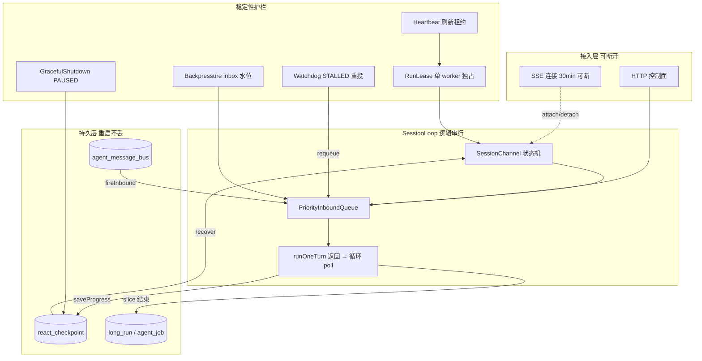
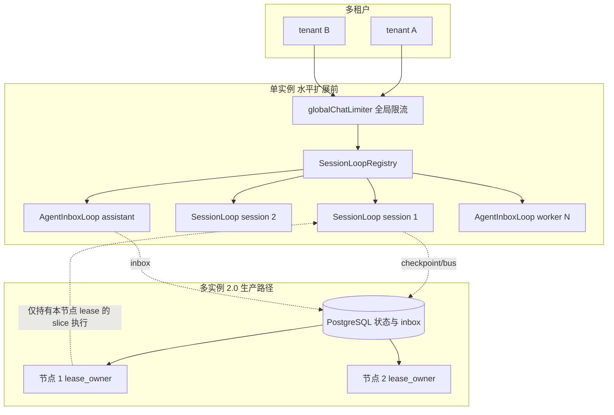
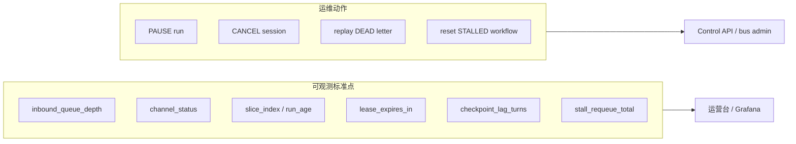
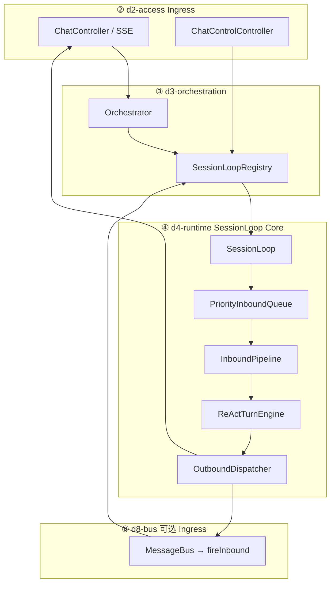
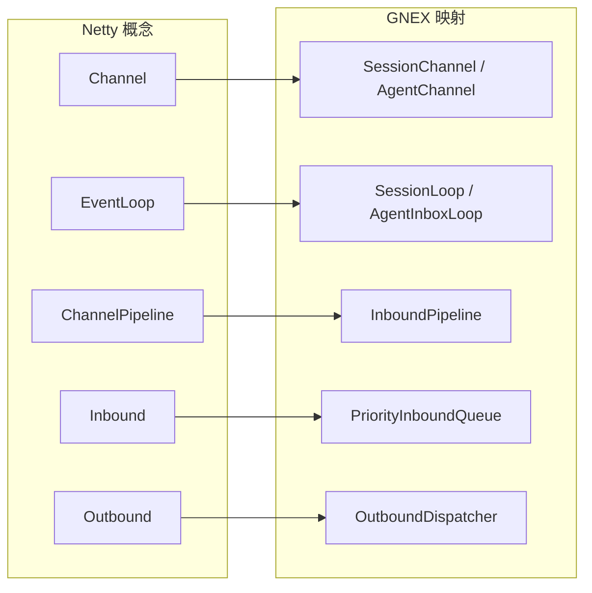
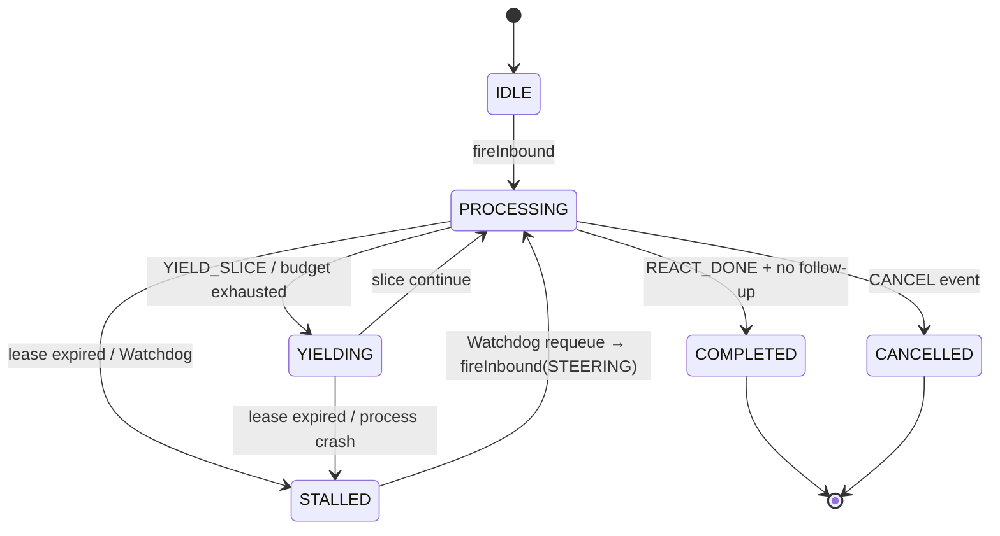
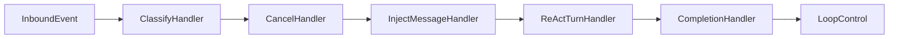
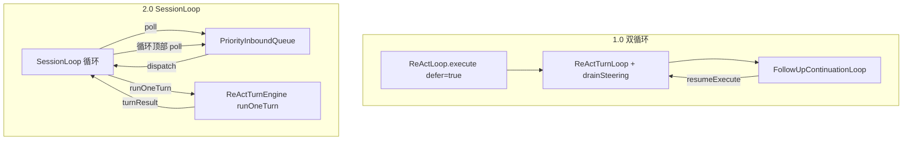
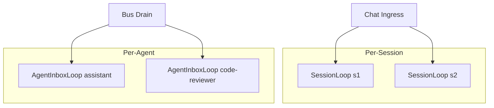

# SessionLoop 架构（GNEX 2.0 运行时）

> **状态**：架构定稿，代码分 Phase 2a / 2b 落地。  
> **读者**：技术总监 / 架构评审、架构师、d2/d3/d4 开发。  
> **入门导读**：[SESSION-EVENT-LOOP-OVERVIEW.md](./SESSION-EVENT-LOOP-OVERVIEW.md)（无类名/接口名，给产品业务运维看）  
> **一页摘要**：[SESSION-EVENT-LOOP-EXEC-SUMMARY.md](./SESSION-EVENT-LOOP-EXEC-SUMMARY.md)（总监决策用）  
> **关联**：[RUNTIME-EVOLUTION.md](./RUNTIME-EVOLUTION.md)、[RUNTIME-LAYER.md](./RUNTIME-LAYER.md)、[AGENT-COMMUNICATION.md](./AGENT-COMMUNICATION.md)
> **⚠️ v1.0 代码对照**：[V1-CODE-REALITY.md](./V1-CODE-REALITY.md)——v1.0 双循环模型细节 / 已有 checkpoint / 已踩坑见 §3.4–§3.6 + §5

---

## 0. 技术总监导读（为何做、解决什么）

### 0.1 一句话决策

**GNEX 会话级调度采用 SessionLoop 统一内核**（Chat / 总线 / 长任务同一套「入队 → runOneTurn → 让出」）——目标是 **企业生产可运维、可扩展、可恢复**。不采用独立外环 / 双循环模型。

### 0.2 非功能属性：1.0 双循环 vs 2.0 SessionLoop

| 非功能维度 | 1.0 双循环（现状） | 2.0 SessionLoop | 总监关注点 |
|------------|-------------------|----------------------|------------|
| **稳定性（故障恢复）** | 内存 `Future` + 外环 resume；重启易丢 in-flight | checkpoint 每 turn + YIELD/PAUSED 状态；与 LongRun 租约衔接 | 滚动发布、进程崩溃可续跑 |
| **稳定性（语义一致）** | steering / follow-up / bus 三套入口，易混用 | 单一 PriorityInbound + 明确优先级 | 减少生产「消息走哪条路」类工单 |
| **可扩展性（多 Agent）** | Chat 与 bus drain 两套调度 | Session + Agent 同构 SessionLoop | 团队、assistant Worker 统一扩展 |
| **可扩展性（并发）** | session 锁持有过久（含 follow-up 外环） | 让出点释放锁；全局 `globalChatLimiter` 保留 | 多租户多 session 并行 |
| **可扩展性（长任务）** | 与 follow-up 外环纠缠，无法 72h 单线程 | slice 边界 = SessionLoop YIELD + bus 续跑 | 夜间/长批任务企业场景 |
| **可运维性** | 状态散在 MessageQueue + FollowUpLoop + deferCompletion | 单 channel 状态机 + 标准 metric 点 | 队列深度、stall、slice 可观测 |
| **可测试性** | E2E 需覆盖双环组合 | 事件驱动：注入 InboundEvent 即可单测 | 降低 2.0 回归成本 |
| **性能（LLM）** | 瓶颈在模型 | 相同 | **不应作为立项主因** |

### 0.3 稳定性架构（总监视图）

下图强调 **持久化、租约、让出、恢复**——组件图里看不出的部分。



| 故障场景 | 1.0 行为 | 2.0 SessionLoop 设计 |
|----------|----------|-------------------|
| 进程 OOM / kill | RUNNING job 可能悬空 | lease 过期 → STALLED → bus/checkpoint 续跑 |
| 滚动发布 | in-flight Future 丢失 | YIELD/PAUSED + checkpoint RESUMABLE |
| SSE 断开 | 依赖 cleanupOrphanedInProgress | Run 与连接解耦；`GET /runs/{id}` 查状态 |
| inbox 堆积 | bus 反压；Chat follow-up 无统一水位 | 统一 Backpressure；低优先级可降级 |
| 双写/双跑 | session 锁 + 竞态 drain | lease + 单 SessionLoop 串行 |

### 0.4 可扩展性架构（总监视图）



| 扩展维度 | 机制 | 上限与说明 |
|----------|------|------------|
| **Session 并行** | 每 session 独立 SessionLoop（VT） | 受 `chat-max-concurrent` 全局限流 |
| **Agent 并行** | 每 agent 独立 InboxLoop | inbox 串行；多 agent 名并行 |
| **水平扩展** | 状态在 DB；slice 带 `lease_owner` | 同 session **不**跨节点并行执行（保序） |
| **长任务** | slice + `run.continue` topic | 72h = N 次短 slice，非 72h 线程 |
| **背压** | per-session + global inbox 水位 | 防止单租户拖垮实例 |

### 0.5 可运维性（总监视图）



| 运维问题 | 1.0 定位难度 | 2.0 定位路径 |
|----------|-------------|-------------|
| 用户说「卡住了」 | 查 session 锁？follow-up？ReAct？ | `channel_status` + `inbound_queue_depth` |
| 消息重复消费 | bus claim 与 job 脱节 | 单 AgentInboxLoop 串行 + slice_seq 幂等 |
| 升级后任务消失 | 内存 Future | `long_run` + RESUMABLE checkpoint |

### 0.6 投资与风险（立项用）

| 项 | 评估 |
|----|------|
| **建设成本** | Phase 2a Chat 路径 + 2b bus：约 **4–6 人周**（含回归），与 LongRun 正交。原估 2–4 人周偏乐观——仅新建 12+ 类 + 改造 3 个现有组件 + 6+ E2E 场景已占 3 周，ReActTurnEngine 包装现有 ReActTurnLoop 时可能发现内部耦合比预期深，需留 buffer |
| **不做风险** | 2.0 继续维护双循环 + bus 双调度，multi-agent / 长任务成本指数上升 |
| **依赖** | Phase 1 assistant（可并行）；生产 DB 建议 PostgreSQL（P1） |
| **降级** | `gnex.event-loop.enabled=false` 回退 1.0 双循环 |
| **验收 KPI** | 滚动发布 0 丢 run；steering 类工单下降；inbox 深度可告警 |

### 0.7 与组件图的关系

- **§0（本节）**：回答总监——**稳不稳、扩不扩、好不好运维**。  
- **§2 起**：回答开发——**模块怎么拆、类怎么命名、怎么迁移**。  
- 评审时 **先看 §0.3–0.5 三张图**，再看 §2 逻辑分层。  
- **一页版 / 汇报**：[SESSION-EVENT-LOOP-EXEC-SUMMARY.md](./SESSION-EVENT-LOOP-EXEC-SUMMARY.md)
- **HTML 架构图**：[diagrams/gnex-session-event-loop.html](./diagrams/gnex-session-event-loop.html) · [时序图](./diagrams/gnex-session-event-loop-sequence.html)

---

## 1. 目标与非目标

### 1.1 目标

| 目标 | 说明 |
|------|------|
| **统一调度** | 将 steering、follow-up、用户新消息、bus 任务、取消合并为单一 **PriorityInbound** 模型 |
| **单 transcript** | 一个 `sessionId` + 一个 `runId` 延续对话，取消 `FollowUpContinuationLoop` 外环 |
| **串行语义** | 每个 Session / Agent inbox **单线程语义**（Virtual Thread 执行，逻辑串行） |
| **让出点清晰** | 每 turn 结束即事件边界，SessionLoop 自动 poll 队列决定下一步 |
| **可扩展** | 与 LongRun slice、消息总线 Per-Agent Loop 同源抽象 |

### 1.2 非目标

| 非目标 | 说明 |
|--------|------|
| 引入 Netty 依赖 | 仅借鉴 EventLoop / Pipeline / 背压概念 |
| 替代 Orchestrator | Chat 仍由 Coordinator 理解意图、委派 Worker、对用户合成回复 |
| LLM 流式中途改向 | steering 仍在 **turn / tool 边界** 注入 |
| 显著降低 LLM 延迟 | 瓶颈在模型调用，非调度循环 |

### 1.3 系统不变量

以下条件在系统任意时刻必须成立，违反即为 bug：

| # | 不变量 | 违反后果 | 保障机制 |
|---|--------|----------|----------|
| **I1** | 同一 `sessionId` 最多一个 SessionLoop 处于 PROCESSING | 并发写入 transcript 导致上下文损坏 | SessionLoopRegistry 单例 + lease 独占 |
| **I2** | CANCEL 事件在下一 `runOneTurn()` 返回前生效 | 用户无法中止失控 Agent | CANCEL 优先级 0 + 循环顶部 poll |
| **I3** | checkpoint 的 `turnIndex` 单调递增 | 恢复后回放旧 turn 导致重复执行 | `saveProgress` 只写当前 turnIndex；DB 唯一约束 (runId, turnIndex) |
| **I4** | STALLED → CANCELLED 不超过 `max-stall-retries` 次 | 无限重试拖垮系统 | Watchdog 计数 + 超限强制 CANCELLED |
| **I5** | 低优先级事件等待不超过 `priority-aging-ms` + 一个 poll 周期 | FOLLOW_UP / BUS_TASK 饿死 | 老化升级 + 强制消费 |
| **I6** | SSE 断开不改变 Run 状态 | 用户重连后找不到 run | Run 状态持久化在 DB，SSE 只是观察者 |

---

## 2. 架构总览

### 2.1 逻辑分层



### 2.2 核心隐喻（Netty 对照）



| Netty | GNEX 组件 | 职责 |
|-------|-----------|------|
| Channel | `SessionChannel` | 绑定 `sessionId`、`runId`、transcript 句柄 |
| EventLoop | `SessionLoop` | 单 session 串行消费 inbound |
| `channelRead` | `InboundPipeline.fireInbound` | 事件进入 Handler 链 |
| Handler 链 | `ClassifyHandler` → `InjectHandler` → `ReActTurnHandler` | 分类、注入消息、执行 turn |
| `writeAndFlush` | `OutboundDispatcher` | SSE / bus reply 异步写出 |
| `isWritable` / 水位 | `InboundBackpressure` | inbox 深度超限时拒绝或降级 |
| `IdleStateHandler` | `RunLeaseGuard`（LongRun 共用） | 租约过期 → STALLED |

---

## 3. 核心组件

### 3.1 组件清单

| 组件 | 模块 | 职责 |
|------|------|------|
| `SessionLoopRegistry` | d3-orchestration | `sessionId` → `SessionLoop` 生命周期；`fireInbound` / `wakeUp` |
| `SessionChannel` | d4-runtime | 不可变上下文：`sessionId`、`runId`、`sseSessionId`、`transcript` |
| `PriorityInboundQueue` | d4-runtime | 多优先级阻塞队列；替代 `MessageQueue` 双 Lane |
| `SessionLoop` | d4-runtime | 主循环：`poll` → `pipeline` → `yield` |
| `InboundPipeline` | d4-runtime | Handler 链编排 |
| `ReActTurnEngine` | d4-runtime | 封装现有 `ReActTurnLoop`，每次 `runOneTurn()` 只执行一轮 |
| `OutboundDispatcher` | d4-runtime | SSE 事件、bus `publish_message`、run 进度 |
| `InboundBackpressure` | d4-runtime | per-session / global 深度限制 |
| `AgentInboxLoop` | d4-runtime + d8 | Phase 2b：per `agentName` 串行消费 bus inbox |

### 3.2 SessionChannel 状态

```text
SessionChannel
├── sessionId: Long
├── runId: String              // 单次对话 run，follow-up 不换新 runId
├── sseSessionId: String       // 可 detach/reattach
├── status: IDLE | PROCESSING | YIELDING | STALLED | COMPLETED | CANCELLED
├── transcript: MessageList    // 内存 + checkpoint 持久化（懒加载，见 §8.2）
├── sliceTurnBudget: int       // 本 slice 剩余 turn（LongRun 共用）
└── lease: RunLease?           // 长任务可选
```

**STALLED 状态恢复路径**：



STALLED 是可恢复的中间状态：Watchdog 检测到 lease 过期后将 channel 标记为 STALLED，并通过 `fireInbound(STEERING)` 重投 slice，SessionLoop 从 RESUMABLE checkpoint 恢复继续执行。若连续 STALLED 超过 `max-stall-retries`（默认 3），则标记为 CANCELLED 并通知用户。

### 3.3 Inbound 事件模型

```java
// 概念类型（实现时放 gnex-contracts 或 d4-runtime）
record InboundEvent(
    InboundKind kind,
    String payload,
    Instant enqueuedAt,
    Map<String, String> metadata
) {}

enum InboundKind {
    CANCEL,      // 优先级 0 — 最高
    STEERING,    // 1 — 运行中纠偏
    USER_TURN,   // 2 — 用户新消息（空闲时或编排入口）
    FOLLOW_UP,   // 3 — 排队后续（原 follow-up lane）
    BUS_TASK     // 4 — 消息总线投递
}
```

**优先级规则**：`PriorityInboundQueue` 始终先取高优先级；同优先级 FIFO。

**防饿死策略**：高优先级（CANCEL / STEERING）持续产生时，FOLLOW_UP / BUS_TASK 可能无限等待。采用**老化升级**：低优先级事件在队列中等待超过 `priority-aging-ms`（默认 30s）后，优先级临时提升一级。每消费 N 次高优先级事件（默认 10）后，强制检查并消费一条已老化事件。这确保即使 STEERING 持续产生，FOLLOW_UP 也不会饿死。

### 3.4 TurnResult 与 LoopControlDecision

```java
// ReActTurnEngine.runOneTurn() 的返回值
enum TurnResult {
    REACT_DONE,        // ReAct 自然结束（无 tool call）
    TOOL_CALL_PENDING, // turn 产生了 tool call，需要下一轮继续
    BUDGET_EXHAUSTED,  // slice turn 预算耗尽
    ERROR              // LLM / tool 异常，需要决定重试或终止
}

// Pipeline.fire() 的返回值，决定 SessionLoop 下一步动作
enum LoopControlDecision {
    RUN_ONE_TURN,   // 执行一轮 runOneTurn()
    COMPLETE,       // 会话结束
    CANCELLED,      // 会话取消
    YIELD_SLICE     // 让出当前 slice（LongRun 续跑）
}
```

**映射关系**：CompletionHandler 根据 TurnResult 产出 LoopControlDecision——

| TurnResult | LoopControlDecision | 条件 |
|------------|---------------------|------|
| `REACT_DONE` | `COMPLETE` | 队列无 FOLLOW_UP / USER_TURN |
| `REACT_DONE` | `RUN_ONE_TURN` | 队列有 FOLLOW_UP / USER_TURN，注入后继续 |
| `TOOL_CALL_PENDING` | `RUN_ONE_TURN` | 默认，继续循环 |
| `BUDGET_EXHAUSTED` | `YIELD_SLICE` | 持久 checkpoint，bus 续跑 |
| `ERROR` | `COMPLETE` | 重试次数耗尽 |
| `ERROR` | `RUN_ONE_TURN` | 重试次数未耗尽 |

### 3.5 InboundPipeline Handler 链



| Handler | 输入 | 输出 / 副作用 |
|---------|------|----------------|
| **ClassifyHandler** | 任意 `InboundEvent` | 校验 kind、tenant、session 归属 |
| **CancelHandler** | `CANCEL` | 设 cancel flag；若 PROCESSING 则在下一让出点结束 |
| **InjectMessageHandler** | `STEERING` / `USER_TURN` / `FOLLOW_UP` | `transcript.add(UserMessage)`；推 SSE `[Steering]` 等 |
| **ReActTurnHandler** | 需要执行 turn 时 | 调 `ReActTurnEngine.runOneTurn()`，返回 TurnResult |
| **CompletionHandler** | TurnResult 为 REACT_DONE / BUDGET_EXHAUSTED | 更新 checkpoint；决定 COMPLETED、YIELD 或继续 |

`ReActTurnHandler` **不**新建 `ReActLoop.execute` 全量初始化；在已有 `transcript` 上继续 `ReActTurnLoop`。每次 `runOneTurn()` 只执行一轮 turn，由 SessionLoop 决定下一步。

---

## 4. 主循环语义

### 4.1 SessionLoop 伪代码

**核心原则：SessionLoop 自身控制循环节奏，ReActTurnEngine 只执行单轮并返回结果。**

让出不是 ReActTurnEngine 的回调义务，而是 SessionLoop 的结构保证——每轮 turn 结束就是事件边界，SessionLoop 自动重新 poll 队列，决定下一步动作。引擎不需要知道外层循环的存在。

```text
function runLoop(channel: SessionChannel):
    channel.status = PROCESSING
    while channel.status in (PROCESSING, YIELDING):
        event = inboundQueue.poll(timeout=yieldTimeout)
        if event == null:
            if noPendingWork(channel):
                channel.status = IDLE
                break
            continue

        decision = pipeline.fire(channel, event)

        if decision == RUN_ONE_TURN:
            turnResult = engine.runOneTurn(channel)   // 只跑一轮，不回调
            persistCheckpoint(channel)
            continue                                   // 回到循环顶部，自动 poll
        elif decision == COMPLETE:
            channel.status = COMPLETED
            break
        elif decision == CANCELLED:
            channel.status = CANCELLED
            break
        elif decision == YIELD_SLICE:
            channel.status = YIELDING
            persistCheckpoint(channel)
            scheduleContinue(channel)   // LongRun: bus publish
            break

    outbound.flush(channel)
    registry.onLoopExit(channel)
```

**与回调式让出的对比**：

| | 回调式 `runUntilYield(onYield)` | 循环式 `runOneTurn()` |
|--|--------------------------------|----------------------|
| 谁控制让出 | ReActTurnEngine 主动回调 | SessionLoop 循环自动 poll |
| 漏埋风险 | 引擎内部每个退出点都必须调 `onYield`，漏一处即 bug | 无——turn 结束即返回，SessionLoop 自然回到循环顶部 |
| 引擎耦合 | 引擎知道外层循环的存在 | 引擎不知道外层循环，纯函数语义 |
| 测试 | 需覆盖引擎内部所有让出路径 | 只需测 `runOneTurn` 的返回值 |

### 4.2 让出点（Yield Points）

让出由 SessionLoop 循环结构自动保证，不依赖引擎内部回调。每轮 `runOneTurn()` 返回后，SessionLoop 回到循环顶部 poll 队列，高优先级事件自然被优先消费。

| 让出时机 | SessionLoop 行为 | 原因 |
|----------|-----------------|------|
| **每 turn 结束** | `runOneTurn()` 返回 → 循环顶部 → `poll()` | CANCEL / STEERING 自然优先；无需引擎主动检查 |
| **slice turn 预算耗尽** | `runOneTurn()` 返回 `BUDGET_EXHAUSTED` → `YIELD_SLICE` | 持久 checkpoint；LongRun 发 `run.continue` |
| **ReAct 自然结束** | `runOneTurn()` 返回 `REACT_DONE` → pipeline 决定 COMPLETED 或注入 FOLLOW_UP | 无待处理事件则 COMPLETED；有则继续 |

### 4.3 与双循环对比



| 行为 | 1.0 双循环 | 2.0 SessionLoop |
|------|-----------|-----------------|
| steering | turn 前 `pollSteering` | SessionLoop 循环自动 poll，STEERING 事件优先 |
| follow-up | 整轮结束后外环 `resumeExecute` | `FOLLOW_UP` 事件，同 transcript 继续 |
| 让出机制 | 引擎内部回调 `drainSteering` | `runOneTurn()` 返回 → 循环顶部自动 poll |
| runId | follow-up 依赖 checkpoint resume | 单一 runId 延续 |
| session 锁 | 持有至 follow-up 链结束 | 可在 `YIELD` / `IDLE` 释放（可配置） |

---

## 5. 数据流

### 5.1 Chat 用户发消息

```mermaid
sequenceDiagram
    participant U as 用户
    participant D2 as ChatAgentStreamRunner
    participant D3 as Orchestrator
    participant REG as SessionLoopRegistry
    participant LOOP as SessionLoop
    participant ENG as ReActTurnEngine
    participant SSE as OutboundDispatcher

    U->>D2: POST /chat (SSE)
    D2->>D3: processStream
    D3->>REG: fireInbound USER_TURN
    REG->>LOOP: wakeUp(sessionId)
    loop SessionLoop 循环
        LOOP->>LOOP: poll PriorityInboundQueue
        LOOP->>ENG: runOneTurn(channel)
        ENG-->>LOOP: TurnResult
        LOOP->>LOOP: persistCheckpoint
        LOOP->>SSE: textChunk / turn events
        SSE-->>U: SSE
        Note over LOOP: TurnResult=TOOL_CALL_PENDING → 继续循环
    end
    Note over LOOP: TurnResult=REACT_DONE → COMPLETE
```

### 5.2 运行中 steering

```mermaid
sequenceDiagram
    participant U as 用户
    participant CTRL as ChatControlController
    participant REG as SessionLoopRegistry
    participant LOOP as SessionLoop
    participant ENG as ReActTurnEngine

    U->>CTRL: POST /chat/steering
    CTRL->>REG: fireInbound STEERING
    REG->>LOOP: wakeUp
    Note over LOOP,ENG: 当前 turn/tool 完成后
    LOOP->>LOOP: InjectMessageHandler
    LOOP->>ENG: 下一 turn 带新 UserMessage
```

### 5.3 消息总线 → Session（Phase 2b）

```mermaid
sequenceDiagram
    participant BUS as MessageBusConsumer
    participant REG as SessionLoopRegistry
    participant LOOP as SessionLoop
    participant OUT as OutboundDispatcher

    BUS->>REG: fireInbound BUS_TASK metadata.sessionId
    REG->>LOOP: wakeUp
    LOOP->>LOOP: 低优先级排队或 idle 时执行
    LOOP->>OUT: 可选 publish reply topic
```

**约束**：同一协作场景仍不混用 sync `delegateToWorker` 与 bus（见 AGENT-COMMUNICATION）。

---

## 6. AgentInboxLoop（v2.1+，Phase 2b）

> **v2.0 范围**：仅 `SessionLoop`。AgentInboxLoop 及其依赖的跨节点 Agent 委派（`MESSAGE_BUS` 策略、`agent.delegate` / `agent.response` Topic）**延后 v2.1+**。
>
> **延后依据**：同一用户 session 走节点亲和性（sticky session），整个 session 在单节点，子 Agent 也在同节点——同 JVM `SYNC_DELEGATE` 已够用。跨节点 Agent 委派占比生产环境通常 < 10%，复杂度高、收益低。Session 跨节点**故障转移**仍由租约 + checkpoint 保证（§8.3），与 Agent 委派无关。

Chat session 与 Agent worker inbox **结构同构**，实例不同：

| | SessionLoop | AgentInboxLoop |
|--|------------------|---------------------|
| 键 | `sessionId` | `agentName`（默认串行）/ `<agentName>#<shardId>`（分片） |
| Ingress | HTTP、steering API | `MessageBusBacklogDrainer` |
| Egress | SSE | `publish_message` / `agent_job` |
| Orchestrator | 有 | 无（纯执行 ReAct） |
| 并发模型 | 默认 1 个；用户多人各自独立 | 默认串行；分片/蜂群见 [AGENT-SERVICE-DESIGN.md §5.2](./AGENT-SERVICE-DESIGN.md) |



`MessageBusBacklogDrainer` 演进：

```text
// 现：while consume → submitJob (多次竞态)
// 目标：consume → fireInbound(agentName, BUS_TASK) → AgentInboxLoop 串行
```

**编排级命令的归属（Phase 2c+，未落地）**：

`/btw` `/delegate` `/aside` 等"创建临时会话 / 切换前台后台 / 派给其他 Agent" 的命令**不归** ② 接入层语义处理，也**不新增 InboundKind**——接入层只做语法解析，决策由 ③ 编排层负责。SessionLoop 内核零修改，新增的 API 仅供 ③ 调用：

| API | 调用方 | 作用 |
|-----|-------|------|
| `SessionLoopPort.fork(parentId, observationScope)` | ③ Orchestrator | 创建 ephemeral 子会话，绑定父状态只读快照 |
| `SessionLoopPort.observe(parentId)` | ③ / ④ SDK | 返回父会话 transcript + 当前 tool 调用 + 最新 checkpoint 元数据（只读） |
| `SseRouter.switchForeground(sessionId)` | ③ Orchestrator | 切换前台 SSE 路由（后台会话继续跑） |

**不变量**：父会话**不被**子会话阻塞——父子并行跑各自的 SessionLoop，铁律 I1 不破（键不同）。子会话 COMPLETED 后由 ③ 决定是否切回前台。

---

---

## 7. 并发与资源

### 7.1 线程模型

| 资源 | 模型 |
|------|------|
| SessionLoop 执行体 | **每 session 一个 Virtual Thread**（或共享 executor 上串行 task） |
| 全局 Chat 并发 | 保留 `globalChatLimiter`（现 `MessageQueue.tryAcquireGlobal`） |
| LLM / Tool 调用 | 阻塞在 VT 内，不占用平台线程池 |
| Outbound SSE | 可选独立 queue + 单写线程，避免与 ReAct 互斥 |

**Virtual Thread carrier 瓶颈说明**：ReAct 循环不是纯 I/O——transcript 构建、checkpoint 序列化、Handler 链执行等内存操作不会触发 VT unmount，导致 carrier thread 被长时间 pin。carrier 池默认大小 = CPU 核数，若同时有 N 个 session 各跑 20+ turns，carrier 可能成为瓶颈。

监控指标：`jvm.threads.virtual.count`、`jvm.threads.carrier.count`、`gnex.session.carrier.pin-duration`。生产建议：若 carrier 利用率持续 > 80%，考虑将 checkpoint 序列化拆为独立 VT 或增大 carrier 池（`-Djdk.virtualThreadScheduler.parallelism=N`）。

### 7.2 背压

```yaml
gnex:
  event-loop:
    max-inbound-per-session: 50
    max-global-inbound: 5000
    reject-policy: DROP_LOW_PRIORITY   # 或 FAIL_FAST
```

水位满时：`FOLLOW_UP` / `BUS_TASK` 可降级；`STEERING` / `CANCEL` 仍接受。

### 7.3 优雅停机

```text
1. 停止 accept 新 USER_TURN / BUS_TASK
2. 对 PROCESSING channel：当前让出点 checkpoint → status=PAUSED
3. 释放 RunLease（LongRun）
4. 等待 VT 退出（超时强制 interrupt）
```

---

## 8. 持久化与恢复

| 时机 | 动作 |
|------|------|
| 每 turn 结束 | `ReActCheckpointService.saveProgress`（复用 V58） |
| SessionLoop YIELD / PAUSED | `markResumable(runId)` |
| COMPLETED | `markCompleted(runId)` |
| 进程重启 | `SessionLoopRegistry.recover(sessionId)` 从 `RESUMABLE` checkpoint 重建 channel |

**checkpoint 频率说明**：每 turn 持久化是安全上限，但一次 ReAct 有 15+ turns 时，PostgreSQL 下跨网络写 15 次的延迟会累积。支持通过 `checkpoint-interval-turns` 配置降频：设为 3 则每 3 turns 持久化一次，中间 turn 退出只写内存。降频的代价是崩溃恢复时最多回滚 N-1 turns。slice 边界和 PAUSED 时始终强制持久化，不受此配置影响。

**Chat resume API**（现有 `POST /chat/sessions/{id}/resume-run`）改为：`fireInbound(USER_TURN)` + 从 checkpoint 恢复 channel，而非直接调 `resumeCoordinatorReAct` 绕开 loop。

### 8.2 Transcript 懒加载

单一 runId 延续意味着长对话（50+ turns）的 transcript 会非常长，恢复时全量加载成本高。采用**滑动窗口 + 按需加载**：

- **热窗口**：内存保留最近 N turns（默认 20，配置 `transcript-hot-window-size`），作为 LLM 上下文直接使用
- **冷历史**：更早的 turns 只在 checkpoint 中保留摘要（`ReActCheckpointService.summarizeCold`），不加载到内存
- **按需回溯**：若 ReActTurnEngine 需要引用早期 turn（如 tool 输出回看），通过 `transcript.loadRange(startTurn, endTurn)` 从 DB 加载指定区间
- **恢复时**：只加载热窗口 + 当前 checkpoint 状态，不加载全量 transcript

这与 AutoMemoryTools 的分层记忆（短期/长期/归档）自然对齐——热窗口即短期记忆，冷摘要即长期记忆。

### 8.3 租约与故障转移参数（默认值，可配）

| 参数 | 默认值 | 含义 |
|------|------|------|
| `lease-ttl-seconds` | 15 | SessionLoop 租约过期时间——节点崩溃后其他节点接管前的等待窗口 |
| `lease-heartbeat-interval-seconds` | 5 | 心跳续约频率（一般为租期的 1/3） |
| `checkpoint-interval-turns` | 1 | checkpoint 频率；与短租约配套保证崩溃损失最小 |
| `max-stall-retries` | 3 | 连续 STALLED 后放弃，转 CANCELLED |

**用户视角最坏恢复时间 ≈ `lease-ttl-seconds`**（默认 15 秒）：节点崩溃 → 心跳停止 → 租约过期 → 其他节点从 checkpoint 续跑。

**与上下文压缩的关联**：副本 + 故障转移场景下，压缩方案的选择受租约/ checkpoint 频率约束——详见 [INTELLIGENT-ENGINE-INTERFACES.md §5.3 副本与故障转移约束](./INTELLIGENT-ENGINE-INTERFACES.md)。

> **澄清**：SessionLoop 租约（15 秒级，本节）≠ 用户会话超时（30 分钟无操作，登录层概念）——两者独立，互不影响。

---

## 9. 模块与接口（目标包结构）

```text
d4-runtime/src/main/java/com/gnex/agent/loop/
├── SessionChannel.java
├── SessionLoop.java
├── SessionLoopRegistry.java
├── AgentInboxLoop.java
├── PriorityInboundQueue.java
├── InboundEvent.java
├── InboundKind.java
├── TurnResult.java              // §3.4 定义
├── LoopControlDecision.java     // §3.4 定义
├── InboundPipeline.java
├── InboundBackpressure.java
├── OutboundDispatcher.java
└── handler/
    ├── InboundHandler.java
    ├── ClassifyHandler.java
    ├── CancelHandler.java
    ├── InjectMessageHandler.java
    ├── ReActTurnHandler.java
    └── CompletionHandler.java

d3-orchestration/
└── Orchestrator.java          // 改为 fireInbound，不再直接拼 steeringSupplier 外环

d2-access/
├── ChatAgentStreamRunner.java // acquire global → registry.startOrAttach
└── ChatControlController.java // fireInbound(STEERING|FOLLOW_UP|CANCEL)

gnex-contracts/
└── runtime/
    └── SessionLoopPort.java   // d2 调 d3/d4 的窄接口
```

### 9.1 SessionLoopPort（契约草案）

```java
public interface SessionLoopPort {
    void fireInbound(Long sessionId, InboundKind kind, String payload);
    void wakeUp(Long sessionId);
    boolean isBusy(Long sessionId);
    void attachSse(Long sessionId, String sseSessionId);
    void detachSse(Long sessionId);
}
```

**关键不变量**：

- `detachSse` **绝不触发任务取消**——任务生命周期与 UI 连接解耦。UI 切走/关页/刷新只 detach SSE，SessionLoop 该跑跑、该 checkpoint checkpoint、该让出让出。
- 用户回切时走 `attachSse` + `isBusy` + 拉 `ConversationAccessPort` 最近消息恢复视图。
- 进程崩溃/滚动发布场景下，UI detach 后任务仍由租约+checkpoint 保证可恢复（见 §8 持久化与恢复）。

**多会话切换场景的工程保证**（用户在多个 session 间切换，任务不丢失）：

| 场景 | 保证 |
|------|------|
| UI 切换到另一 session | SessionLoop 不停，SSE detach；回切时 attach 推最新状态 |
| 浏览器关页 / 网络断 | 同上，SessionLoop 继续跑直到 COMPLETED 或租约过期 |
| 进程崩溃 | checkpoint 已存 → 其他节点从 checkpoint 续跑 |
| 集群滚动发布 | 当前 turn 跑完 → 强制 checkpoint → 退出 → 重启后 STALLED→PROCESSING 恢复 |

---

## 10. 迁移策略

### 10.1 Phase 2a（Chat 路径）

| 步骤 | 内容 |
|------|------|
| 1 | 实现 `PriorityInboundQueue` + `SessionLoopRegistry` |
| 2 | `ChatControlController` 改 `fireInbound` |
| 3 | `Orchestrator` 末尾去掉 `followUpContinuationLoop.runWithFollowUps` |
| 4 | `ReActTurnEngine` 包装 `ReActTurnLoop`，保留 hooks/checkpoint |
| 5 | Feature flag：`gnex.event-loop.enabled` 灰度 |
| 6 | 废弃 `FollowUpContinuationLoop`（或保留空壳委托给 SessionLoop） |

### 10.2 Phase 2b（Bus）

| 步骤 | 内容 |
|------|------|
| 1 | `AgentInboxLoop` + `MessageBusBacklogDrainer` 接线 |
| 2 | `assistant` 默认 bus 订阅（与 Phase 1 配合） |
| 3 | 下线 `AsyncAgentExecutor` 对 bus 消息的 while-drain 直 submit |

### 10.3 测试重点

| 用例 | 验证 |
|------|------|
| steering 在 turn 间注入 | transcript 含 steering UserMessage |
| 连发 3 条用户消息 | 优先级与顺序正确，无 context 交错 |
| follow-up 不再 resume 重建 | 同 runId，checkpoint turn 单调递增 |
| cancel 中途 | `runOneTurn()` 返回后循环退出，status=CANCELLED |
| 重启恢复 | RESUMABLE checkpoint → SessionLoop 续跑 |
| 背压 | inbox 满时低优先级拒绝 |
| 优先级防饿死 | STEERING 持续 60s，FOLLOW_UP 仍被消费（老化升级生效） |
| STALLED 恢复 | lease 过期 → Watchdog 标记 STALLED → requeue → 从 checkpoint 续跑 |
| STALLED 重试上限 | 连续 3 次 STALLED 后 CANCELLED |
| checkpoint 降频 | `checkpoint-interval-turns=3`，崩溃恢复回滚 ≤2 turns |
| transcript 懒加载 | 50 turn 对话恢复，只加载热窗口 20 turns |

---

## 11. 配置项（建议）

```yaml
gnex:
  event-loop:
    enabled: ${GNEX_EVENT_LOOP_ENABLED:false}
    yield-timeout-ms: 500
    max-inbound-per-session: 50
    max-turns-per-slice: 20          # 与 LongRun 共用
    release-session-lock-on-yield: true
    outbound-buffer-size: 256
    checkpoint-interval-turns: 1     # 每 N turns 持久化一次；1=每 turn（安全上限）
    priority-aging-ms: 30000        # 低优先级等待超时后提升一级
    priority-force-consume-every: 10 # 每消费 N 次高优先级后强制消费一条老化事件
    max-stall-retries: 3            # STALLED 连续重试上限，超限则 CANCELLED
    transcript-hot-window-size: 20  # 内存热窗口 turn 数
```

---

## 12. 相关文档

| 文档 | 内容 |
|------|------|
| [RUNTIME-EVOLUTION.md](./RUNTIME-EVOLUTION.md) | 1.0→2.0 规划、LongRun、优先级 |
| [RUNTIME-LAYER.md](./RUNTIME-LAYER.md) | ④ 包结构；1.0 降级路径 |
| [INTELLIGENT-ENGINE-INTERFACES.md](./INTELLIGENT-ENGINE-INTERFACES.md) | ④ 外部 Port 索引 |
| [AGENT-COMMUNICATION.md](./AGENT-COMMUNICATION.md) | 同步委派 vs 总线选择 |
| [AGENT-SKILL-DEVELOPMENT.md](./AGENT-SKILL-DEVELOPMENT.md) | assistant Worker |

---

## 附录 A. v1.0 双循环真实结构（实施时必读）

> 完整对照见 [V1-CODE-REALITY.md](./V1-CODE-REALITY.md)。本节列**会话事件循环** 2.0 实施时必须知道的 v1.0 实际架构。

### A.1 "双循环"的真实持有者

文档说的"主循环 + 副循环"在代码里其实是：

- **内环** = `ReActTurnLoop.java:128` 的 `turnPreamble.drainSteering()`——steering 注入发生在 turn **内部 preamble** 阶段，不是文档说的"turn 边界 poll"
- **外环** = `FollowUpContinuationLoop.runWithFollowUps()`（`FollowUpContinuationLoop.java:43-72`），由 `AgentScheduler.java:383` 和 `AgentSyncExecutor.java:277` 在 ReAct 主路径返回后再调一次

`Orchestrator.java:138, 386` 只调一次 `coordinatorRuntime.runCoordinatorReAct()`，没有"循环"。

### A.2 "持有 Future 的 map" 实际有 4 处

| 持有者 | 字段 | 位置 |
|---|---|---|
| `AsyncAgentExecutor` | `runningJobs: jobId→Future` | `AsyncAgentExecutor.java:55` |
| `AsyncAgentExecutor` | `messageBusJobs: jobId→messageId` | `AsyncAgentExecutor.java:53` |
| `AgentScheduler` | `runningTasks: jobId→PausableTask` | `AgentScheduler.java:67` |
| 共享 | `TaskRepository` | `AsyncAgentExecutor.java:100` |

**主循环实际是 Virtual Thread**：`ChatAgentStreamRunner.java:115` 用 `Thread.ofVirtual().start(...)`，每个 chat turn 一个 VT，没有持久化注册表。

### A.3 取消/中断的双重通道（坑）

`AgentScheduler.cancelBySession` (`:216-230`) 真实链路：
1. `messageQueue.cancel(sessionId)` 设 `AtomicBoolean` 标志（`MessageQueue.java:131-135`）——**协作式轮询**
2. `messageQueue.addSteering(sessionId, "退出任务")` ——把取消当 steering 注入
3. `delegationCancelRegistry.cancel(jobId)` + `pausable.cancel()`（`:480-490`）——同时 `thread.interrupt()` + `future.cancel(true)`

**坑**：`prepareForNewTurn`（`MessageQueue.java:162-171`）只清 cancel+steering，**不清 followUp**——下一轮 follow-up 可能携带上次取消的副作用。2.0 引入 `PriorityInboundQueue` 时必须解决此生命周期问题。

### A.4 PausableTask.pause() 不持久化（坑）

`AgentScheduler.java:492-498` 只 `thread.interrupt()`，**没有持久化 PAUSED 状态**——重启后丢失。这就是本文档反复说的"内存 Future 重启易丢"的**具体机制**。2.0 的 PAUSED 状态必须落 DB。

### A.5 v1.0 完全不存在的 2.0 抽象

- `SessionLoop.runLoop()` / `SessionLoopRegistry`
- `PriorityInboundQueue`（5 优先级 + 老化）——1.0 `MessageQueue` 只有 steering/followUp 两条**无优先级** `ConcurrentLinkedQueue`（`MessageQueue.java:226-229`）
- `InboundKind` enum——1.0 只有 `queueSteering/queueFollowUp/cancelBySession` 三方法
- `TurnResult` / `LoopControlDecision`
- `ChannelStatus`（YIELDING/STALLED）——1.0 只有 `AgentJob.status: PENDING/RUNNING/SUCCESS/FAILED` + `react_checkpoint.status: IN_PROGRESS/RESUMABLE/COMPLETED`
- `RunLease` 表 / `lease_owner` / `lease_expires_at`
- `gnex.event-loop.*` 配置块

详见 [V1-CODE-REALITY.md §5 + §6](./V1-CODE-REALITY.md)。

---

*GNEX 2.0 SessionLoop — 架构 SSOT。实现以源码与 feature flag 为准。*
