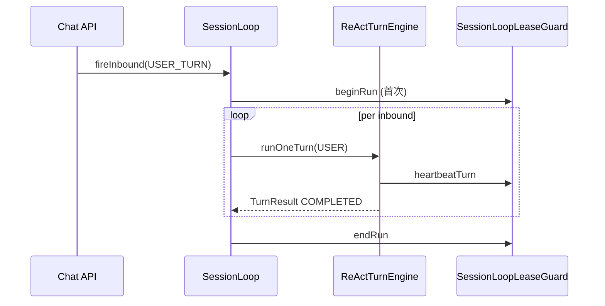
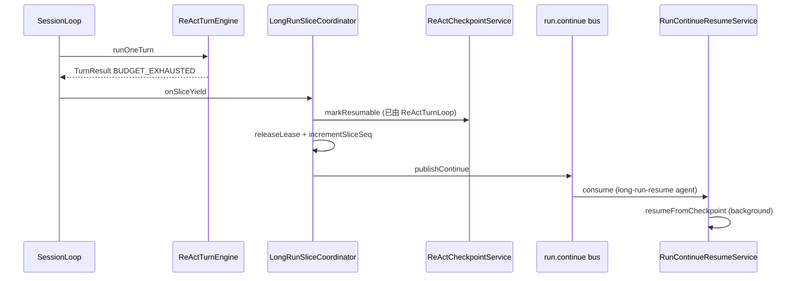
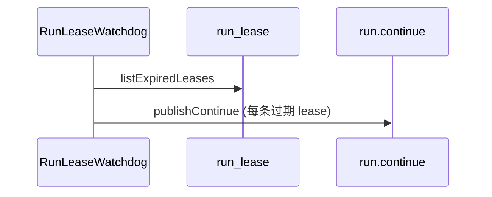

# SessionLoop × LongRun Slice × ReAct Turn 时序

> **状态**：CUTOVER Wave 5 Phase D（2026-07-09）  
> **SSOT 关联**：[SESSION-EVENT-LOOP.md](./SESSION-EVENT-LOOP.md) · [RUNTIME-EVOLUTION.md](./RUNTIME-EVOLUTION.md) §4

## 1. 三层边界

| 层 | 键 | 生命周期 | 触发源 |
|----|-----|----------|--------|
| **SessionLoop** | `sessionId` | 单次 chat run（可含多 slice） | HTTP / steering / BUS_TASK |
| **LongRun slice** | `runId` + `slice_seq` | 有限 turn 窗口（如 20） | turn 预算耗尽 / lease 过期 |
| **ReAct turn** | `turnIndex` | 单次 LLM+tool 循环 | SessionLoop 取一条 inbound |

**硬约束**：72h 任务 = N 个短 slice，**禁止**单 VT 连续跑 72h。

## 2. 正常 Chat Turn（无 slice）

## 3. LongRun Slice 让出（BUDGET_EXHAUSTED）

## 4. 租约过期（Watchdog）

## 5. 多副本恢复（Phase C）

| 组件 | 职责 |
|------|------|
| `SessionLoopRecoveryService` | 启动时扫描 `RESUMABLE` checkpoint，对无活跃 loop 的 session 发 `run.continue` |
| `InMemorySessionStatePort` | 单节点 session→instance 索引（生产换 Redis） |
| `RunLeasePort.acquireLease` | CAS 保证同 `runId` 仅一 worker 执行 slice |

## 6. TurnResult → LoopControl 映射

| TurnResult.outcome | SessionLoop 行为 | 下游 |
|--------------------|------------------|------|
| `COMPLETED` | YIELDING，等待下一 inbound | 正常结束 turn |
| `CONTINUE` | 等待 TOOL_RESULT inbound | tool 异步回传 |
| `YIELD` | YIELDING | steering / 空输入 |
| `BUDGET_EXHAUSTED` | terminate + `onSliceYield` | `run.continue` 续跑 |

## 7. 代码锚点

| 类 | 包 |
|----|-----|
| `SliceYieldHandler` | `libs/gnex-agent-sdk/.../loop` |
| `LongRunSliceCoordinator` | `services/gnex-agent-service/.../runtime` |
| `LongRunContinuePublisher` | 同上 |
| `RunLeaseWatchdog` | 同上 |
| `SessionLoopRecoveryService` | 同上 |
| `RunContinueResumeService` | 同上 |
