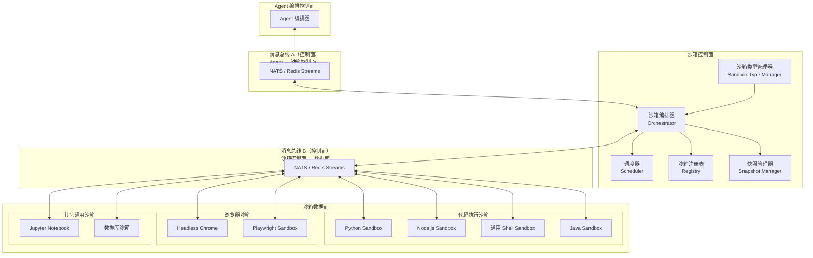
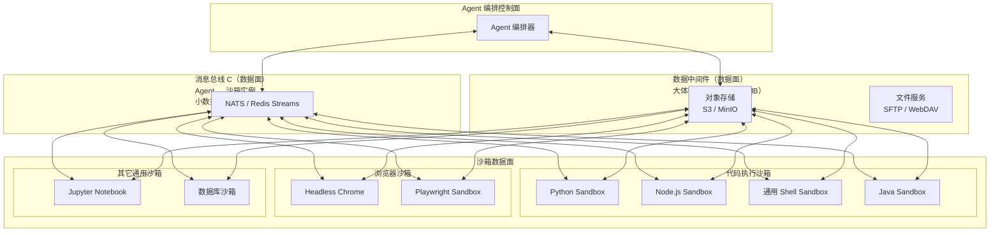
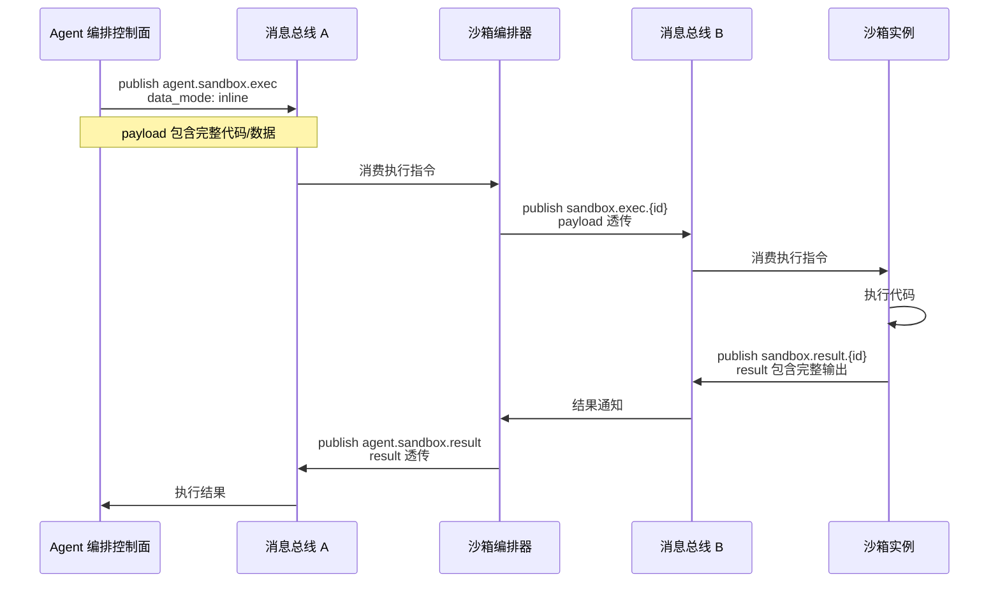
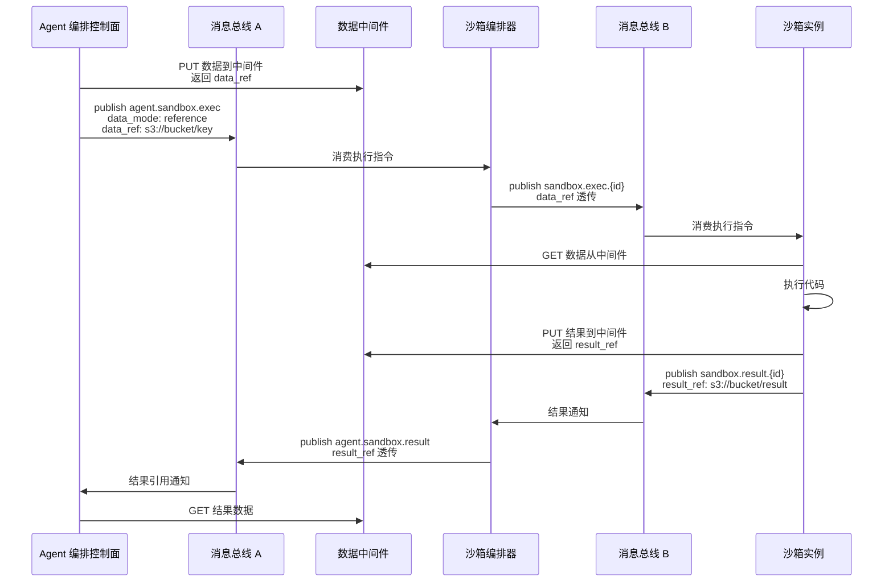
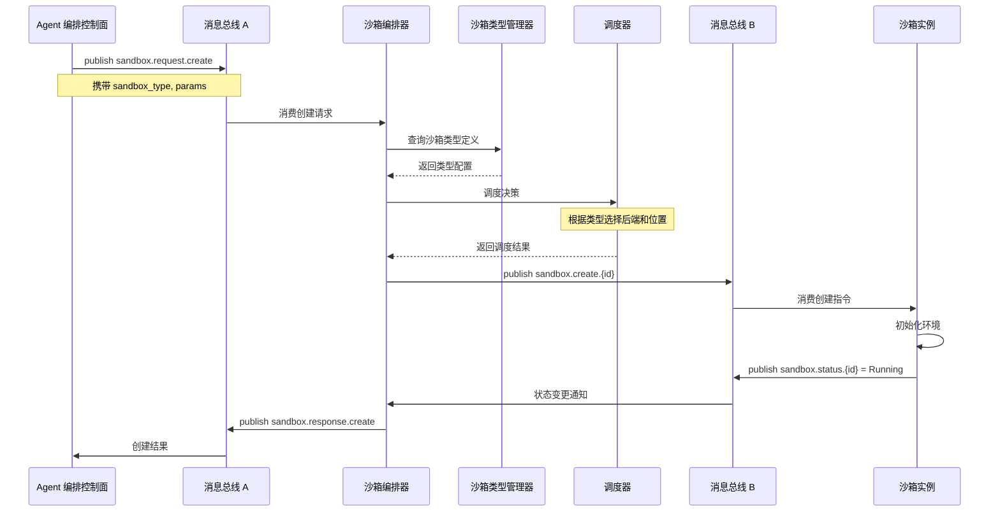
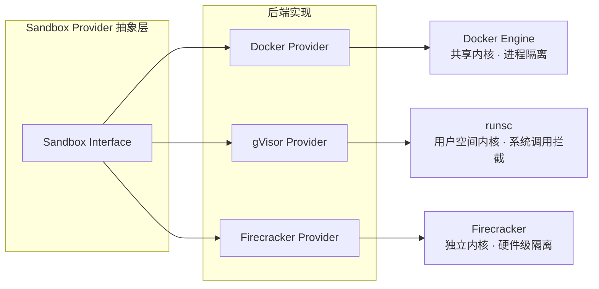
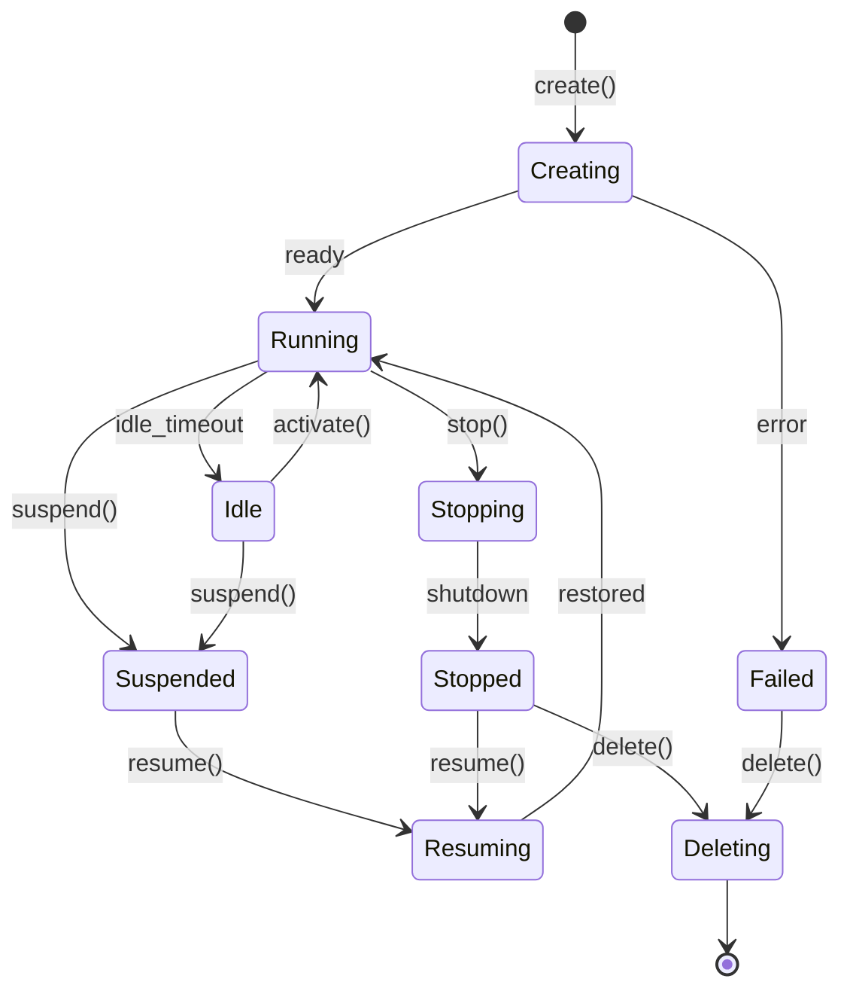

# Agent 平台沙箱系统设计方案

> **版本** v1.2 | **日期** 2026-06-24 | **类型** 架构设计

沙箱子系统包含沙箱控制面和沙箱数据面。沙箱控制面通过消息总线与外部 Agent 编排控制面通信，同时通过消息总线与沙箱数据面通信。沙箱控制面负责沙箱类型管理、生命周期管理、操作调度和状态聚合，并根据 Agent 控制平面的请求决定拉起哪类沙箱。

沙箱的输入输出支持两种模式：**内嵌模式**（控制指令与数据均内嵌在消息体中传输）和**引用模式**（控制指令通过消息总线传输，数据通过外部存储引用间接传输）。

***

## 目录

- [需求概述](#需求概述)
- [整体架构](#整体架构)
- [数据通道设计](#数据通道设计)
- [沙箱类型管理](#沙箱类型管理)
- [沙箱类型与选型](#沙箱类型与选型)
- [生命周期管理](#生命周期管理)
- [消息总线设计](#消息总线设计)
- [沙箱操作接口](#沙箱操作接口)
- [安全模型](#安全模型)
- [技术选型对比](#技术选型对比)
- [演进路线](#演进路线)
- [开源实现参考](#开源实现参考)
- [本地沙箱与 Workspace 挂载](#本地沙箱与-workspace-挂载)
- [容器运行时与编排](#容器运行时与编排)
- [渐进式部署方案](#渐进式部署方案)

***

## 需求概述

AI Agent 在执行任务时需要安全、隔离的环境来运行用户代码、操作文件和执行系统命令。沙箱系统是 Agent 平台的底层基础设施，承担三个核心职责：**安全隔离**（防止恶意代码逃逸）、**资源管理**（限制 CPU、内存、网络等资源用量）和**状态管理**（支持创建、暂停、恢复、销毁等生命周期操作）。

当前需求围绕以下维度展开：

- **双控制面架构**：Agent 编排控制面（外部）与沙箱控制面（内部），两者通过消息总线通信
- **双数据通道模式**：内嵌模式（数据直接内嵌在消息体中传输）与引用模式（消息传输数据引用，实际数据走外部存储）
- **沙箱类型管理**：支持代码执行沙箱、浏览器沙箱及业界通用沙箱类型
- **消息总线通信**：Agent 控制面通过消息总线向沙箱控制面发起请求，沙箱控制面通过消息总线管理数据面
- **全生命周期管理**：创建、销毁、暂停、恢复、状态查询
- **丰富的操作支持**：代码执行、命令执行、文件读写、目录管理
- **持久化与快速加载**：通过快照技术实现 200ms 级别的沙箱启动
- **多后端支持**：Docker 容器、Firecracker MicroVM 等多种沙箱实现

***

## 整体架构

系统采用**双控制面 + 三层消息总线 + 可选数据中间件**的架构。通信平面分为**控制面**和**数据面**：

- **控制面**负责管理指令的传输，包括沙箱生命周期管理、状态同步、调度决策
- **数据面**负责业务数据的传输，包括沙箱输入（代码、文件、命令参数）和沙箱输出（执行结果、产物文件、日志）

三条消息总线分别承担不同职责：

- **消息总线 A（控制面）**：Agent 编排控制面与沙箱控制面之间的管理指令通信
- **消息总线 B（控制面）**：沙箱控制面与沙箱数据面之间的内部控制指令通信
- **消息总线 C（数据面）**：沙箱实例与 Agent 编排层之间的业务数据通信（内嵌模式的小数据传输）

大体积数据（文件上传下载、执行结果输出等）通过**数据中间件**传输（引用模式），避免数据面消息总线被大流量阻塞。

### 控制面架构



*图 1a：控制面架构 — 管理指令通道*

### 数据面架构



*图 1b：数据面架构 — 业务数据传输通道*

### 核心组件职责

| 组件        | 所属层级      | 职责                                | 关键技术                 |
| --------- | --------- | --------------------------------- | -------------------- |
| Agent 编排器 | Agent 控制面 | Agent 任务编排、决策何时需要沙箱、指定沙箱类型        | 编排引擎                 |
| 沙箱类型管理器   | 沙箱控制面     | 注册和维护沙箱类型定义，管理类型模板和镜像映射           | 模板引擎                 |
| 沙箱编排器     | 沙箱控制面     | 沙箱生命周期管理、操作调度、状态聚合、数据通道选择         | 状态机 + 事件驱动           |
| 调度器       | 沙箱控制面     | 根据沙箱类型和策略选择后端实现、部署位置              | 策略引擎                 |
| 沙箱注册表     | 沙箱控制面     | 维护所有沙箱实例的元数据和运行状态                 | etcd / Redis         |
| 快照管理器     | 沙箱控制面     | 创建、存储、分发沙箱快照                      | CoW + mmap           |
| 消息总线 A    | 控制面       | Agent 编排控制面与沙箱控制面之间的管理指令通道        | NATS / Redis Streams |
| 消息总线 B    | 控制面       | 沙箱控制面与沙箱实例控制面之间的内部控制指令通道          | NATS / vsock         |
| 消息总线 C    | 数据面       | 沙箱实例与 Agent 编排层之间的业务数据通道（内嵌模式）    | NATS / Redis Streams |
| 数据中间件     | 数据面       | 沙箱实例与 Agent 编排层之间的大体积数据传输通道（引用模式） | S3 / MinIO / SFTP    |

***

## 数据通道设计

沙箱的输入输出支持两种传输模式，由调用方在请求时指定，或由系统根据数据大小自动选择。

### 模式对比

| 维度     | 内嵌模式        | 引用模式               |
| ------ | ----------- | ------------------ |
| 控制指令   | 消息总线        | 消息总线               |
| 数据载荷   | 直接内嵌在消息体中   | 通过外部存储引用间接传输       |
| 适用数据量  | 小数据（< 1MB）  | 大数据（>= 1MB）、文件上传下载 |
| 消息总线压力 | 高（数据占用队列带宽） | 低（仅传输元数据和引用）       |
| 延迟     | 低（单次往返）     | 略高（需读写外部存储）        |
| 可靠性    | 依赖消息总线持久化   | 依赖外部存储持久化          |
| 适用场景   | 代码片段执行、命令执行 | 大文件上传下载、批量数据处理     |

### 内嵌模式

控制指令与数据均直接内嵌在消息体中传输。数据随消息一起发送和接收，适合小体积数据场景。



*图 2：内嵌模式通信时序*

### 引用模式

控制指令通过消息总线传输，数据本身不进入消息体。消息中仅包含数据引用（如对象存储的 URL 或对象键），收发双方通过外部存储读写实际数据。



*图 3：引用模式通信时序*

### 数据通道选择策略

系统自动选择数据通道的策略如下：

| 条件                    | 选择模式 | 说明          |
| --------------------- | ---- | ----------- |
| payload < 64KB        | 内嵌模式 | 小数据直接内嵌在消息中 |
| 64KB <= payload < 1MB | 可配置  | 默认内嵌，可强制引用  |
| payload >= 1MB        | 引用模式 | 大数据走外部存储    |
| 文件上传/下载               | 引用模式 | 强制走外部存储     |
| 执行结果 stdout > 100KB   | 引用模式 | 大输出自动转存外部存储 |

调用方也可在请求中显式指定 `data_mode`：

```json
{
  "request_id": "uuid-v4",
  "operation": "exec_command",
  "sandbox_id": "sb-xxxx",
  "sandbox_type": "python-sandbox",
  "data_mode": "reference",
  "data_ref": {
    "store": "s3",
    "bucket": "sandbox-data",
    "key": "inputs/script.py",
    "presigned_url": "https://..."
  },
  "params": {
    "command": "python /workspace/input/script.py",
    "timeout": 30000
  }
}
```

### 中间件选型

| 中间件                   | 协议                                   | 适用场景                  | 特点                   |
| --------------------- | ------------------------------------ | --------------------- | -------------------- |
| **S3 / MinIO**        | S3 API                               | 对象存储、大文件、执行结果归档       | 高吞吐、低成本、生命周期管理       |
| **SFTP / WebDAV**     | 文件协议                                 | 文件上传下载、目录同步           | 兼容传统文件操作             |
| **Redis**             | Key-Value                            | 小数据缓存、临时结果            | 低延迟、自动过期             |
| **NATS Object Store** | NATS 原生                              | 与消息总线同基础设施            | 简化运维、统一认证            |
| **Sonatype Nexus**    | Docker Registry / Maven / npm / PyPI | 沙箱镜像仓库、依赖包代理缓存、构建产物存储 | 统一制品管理、离线内网部署、多级缓存加速 |

> **推荐方案**
>
> - **数据中间件**：生产环境使用 S3 兼容对象存储（AWS S3 / MinIO / 腾讯云 COS），与消息总线（NATS）独立部署。开发环境可使用 NATS Object Store 简化基础设施。
> - **制品仓库**：使用 Sonatype Nexus 作为统一制品管理器，同时承担 Docker 镜像仓库（存储沙箱运行镜像）、依赖包代理仓库（缓存 pip/npm/maven，加速沙箱内依赖安装）、构建产物仓库（归档沙箱编译输出）三重职责。内网/离线环境必须自建 Nexus 以替代公网镜像源和包管理器。

***

## 沙箱类型管理

沙箱类型管理器是沙箱控制面的核心组件之一，负责定义、注册和维护系统中所有可用的沙箱类型。当 Agent 控制面请求创建沙箱时，沙箱编排器查询类型管理器获取对应的类型定义，调度器据此决定拉起哪类沙箱实例。

### 沙箱类型分类

| 大类              | 类型                 | 说明                               | 典型镜像/运行时                     |
| --------------- | ------------------ | -------------------------------- | ---------------------------- |
| **代码执行沙箱**      | Python Sandbox     | 执行 Python 代码片段，支持 pip 依赖安装       | python:3.11-slim             |
| <br />          | Node.js Sandbox    | 执行 JavaScript/TypeScript 代码      | node:20-alpine               |
| <br />          | Shell Sandbox      | 执行 shell 命令和脚本                   | alpine:latest                |
| <br />          | Go Sandbox         | 编译并执行 Go 代码                      | golang:1.22                  |
| <br />          | Rust Sandbox       | 编译并执行 Rust 代码                    | rust:1.78                    |
| <br />          | Java Sandbox       | 编译并执行 Java 代码，支持 Maven/Gradle 构建 | eclipse-temurin:17-jdk       |
| **浏览器沙箱**       | Headless Chrome    | 无头浏览器，支持页面抓取、自动化测试               | selenium/standalone-chrome   |
| <br />          | Playwright Sandbox | 基于 Playwright 的浏览器自动化            | mcr.microsoft.com/playwright |
| <br />          | Puppeteer Sandbox  | 基于 Puppeteer 的浏览器控制              | 含 Chromium 的 Node 镜像         |
| **数据库沙箱**       | SQLite Sandbox     | 本地文件型数据库操作                       | alpine + sqlite              |
| <br />          | PostgreSQL Sandbox | 临时 PostgreSQL 实例                 | postgres:15-alpine           |
| **Notebook 沙箱** | Jupyter Sandbox    | 交互式 Notebook 执行                  | jupyter/scipy-notebook       |
| **自定义沙箱**       | 用户自定义镜像            | 基于预置模板或用户上传镜像                    | 自定义                          |

### 沙箱类型定义结构

每个沙箱类型在类型管理器中注册为一条类型定义，包含以下信息：

```json
{
  "type_id": "python-sandbox",
  "type_name": "Python Sandbox",
  "category": "code_execution",
  "description": "执行 Python 代码片段，支持标准库和 pip 安装",
  "default_image": "python:3.11-slim",
  "supported_backends": ["docker", "firecracker"],
  "default_backend": "docker",
  "resource_profile": {
    "cpu_limit": "1.0",
    "memory_limit": "512M",
    "timeout_default": 30000
  },
  "capabilities": ["exec_code", "exec_command", "file_rw", "pip_install"],
  "network_policy": "restricted",
  "snapshot_enabled": true,
  "data_channel": {
    "default_mode": "auto",
    "inline_threshold": "64KB",
    "reference_threshold": "1MB",
    "supported_middleware": ["s3", "redis", "nats_os"]
  },
  "created_at": "2026-06-24T00:00:00Z",
  "updated_at": "2026-06-24T00:00:00Z"
}
```

### 依赖管理与镜像源配置

沙箱内部执行代码时，经常需要动态安装依赖（`pip install`、`npm install`、`mvn install` 等）。为了加速安装并支持内网/离线环境，系统通过 Sonatype Nexus 提供统一制品管理能力。

**Nexus 在沙箱场景中的三重职责**

| 职责              | 说明                                              | 配置方式                                                                                                                                         |
| --------------- | ----------------------------------------------- | -------------------------------------------------------------------------------------------------------------------------------------------- |
| **Docker 镜像仓库** | 存储私有沙箱镜像，替代 Docker Hub / 阿里云镜像仓库                | 在 containerd / Docker 的 `daemon.json` 中配置 `registry-mirrors` 指向 Nexus Docker Registry                                                        |
| **依赖包代理仓库**     | 缓存/代理 PyPI、npm Registry、Maven Central，加速沙箱内依赖安装 | 沙箱初始化时注入配置文件：`pip.conf`（`index-url` 指向 Nexus PyPI Group）、`.npmrc`（`registry` 指向 Nexus npm Group）、`settings.xml`（mirror 指向 Nexus Maven Group） |
| **构建产物存储**      | 归档沙箱编译输出（jar、wheel、tar 等），支持产物复用和审计             | 沙箱内构建脚本将产物 push 到 Nexus Raw / Maven 仓库                                                                                                       |

**沙箱类型定义中的镜像源配置**

每个沙箱类型的类型定义可声明依赖包源配置，沙箱初始化时自动注入：

```json
{
  "type_id": "python-sandbox",
  "registry_config": {
    "docker_registry": "https://nexus.corp/docker",
    "pip_index_url": "https://nexus.corp/repository/pypi-group/simple",
    "npm_registry": "https://nexus.corp/repository/npm-group/",
    "maven_mirror": "https://nexus.corp/repository/maven-public/"
  }
}
```

沙箱创建时，编排器将 `registry_config` 映射为沙箱内的环境变量和配置文件：

- Docker 镜像拉取 → 指向 Nexus Docker Registry
- `pip install` → 指向 Nexus PyPI Group（含缓存代理）
- `npm install` → 指向 Nexus npm Group（含缓存代理）
- `mvn install` → 指向 Nexus Maven Public（含缓存代理）

> **离线环境强制要求**
>
> 内网/离线部署时，Nexus 必须预先同步所有必需的 Docker 镜像层和依赖包到本地仓库。沙箱初始化脚本在 `/etc/pip.conf`、`.npmrc`、`$HOME/.m2/settings.xml` 等位置硬编码 Nexus 地址，阻断所有外网访问。

### 创建沙箱时的类型选择流程



*图 4：基于沙箱类型的创建流程*

***

## 沙箱类型与选型

系统定义两种部署模式和三种隔离后端。部署模式决定沙箱运行在哪里，隔离后端决定沙箱用什么技术实现隔离。两者正交组合，由调度器根据策略自动选择。

### 部署模式

| 维度   | 本地沙箱             | 远程沙箱              |
| ---- | ---------------- | ----------------- |
| 数据位置 | 数据不离开本机          | 数据上传到远端           |
| 启动延迟 | 取决于本地资源（28ms-1s） | 网络延迟 + 启动时间       |
| 适用场景 | 开发调试、敏感数据处理、合规要求 | 生产环境、弹性扩展、无基础设施团队 |
| 跨平台  | 本地               | 任何平台可用            |

### 隔离后端

三种后端按隔离强度递增排列：**Docker 容器**（共享内核，进程级隔离）、**gVisor**（用户空间内核拦截系统调用）、**Firecracker MicroVM**（独立内核，硬件级隔离）。安全性与性能之间存在权衡，但 Agent 等待 LLM 响应通常需要 500ms-5s，Firecracker 增加的 125ms 启动开销在此场景下可以忽略[\[8\]](#cite-8)。

> **选型建议**
>
> 开发环境使用 Docker + gVisor，生产环境使用 Firecracker。通过 Provider 抽象层统一 API，上层代码无需关心底层实现差异。



*图 5：Provider 抽象层与后端实现*

***

## 生命周期管理

每个沙箱实例从创建到销毁经历一组明确的状态转换。编排器维护状态机，所有状态变更通过消息总线广播，确保控制面和沙箱实例对状态有一致的认知。



*图 6：沙箱生命周期状态机*

### 状态说明

| 状态          | 说明                  | 资源消耗               |
| ----------- | ------------------- | ------------------ |
| `Creating`  | 从镜像或快照创建中，分配资源      | 临时（创建期间）           |
| `Running`   | 活跃执行状态，可接收操作指令      | 完整（CPU + 内存 + I/O） |
| `Idle`      | 无活跃操作，等待指令或超时挂起     | 完整（可配置降频）          |
| `Suspended` | 内存和磁盘状态保存为快照，计算资源释放 | 仅存储（快照文件）          |
| `Resuming`  | 从快照恢复中，加载内存和 CPU 状态 | 临时（恢复期间）           |
| `Stopped`   | 用户主动停止，可从快照恢复       | 仅存储                |
| `Failed`    | 创建或运行时发生不可恢复错误      | 需清理                |
| `Deleting`  | 资源回收中               | 递减                 |

### 自动挂起策略

空闲超时触发自动挂起，超时阈值可配置（1m / 5m / 10m / 30m / 60m）。挂起时保存完整内存和磁盘快照，计算资源立即释放，仅保留快照存储费用。恢复时通过 mmap 加载内存快照，Firecracker 可在约 28ms 内完成恢复[\[3\]](#cite-3)。

***

## 消息总线设计

系统使用**三条消息总线 + 数据中间件**，按通信类型分为**控制面**和**数据面**：

**控制面消息总线**（传输管理指令）：

- **消息总线 A**：Agent 编排控制面 ↔ 沙箱控制面，传输生命周期管理、调度、状态查询等管理指令
- **消息总线 B**：沙箱控制面 ↔ 沙箱数据面，传输内部控制指令（创建、执行、状态上报）

**数据面通信通道**（传输业务数据）：

- **消息总线 C**：沙箱实例 ↔ Agent 编排层，传输业务数据（代码、命令参数、执行结果），仅用于内嵌模式的小数据（< 1MB）
- **数据中间件**：沙箱实例 ↔ Agent 编排层，传输大体积数据（文件、产物），用于引用模式（>= 1MB）

控制面与数据面分离的核心目的：管理指令需要可靠性、持久化和审计能力，走消息总线；业务数据需要低延迟和高吞吐，小数据走数据面消息总线，大数据走外部存储。

### 通信拓扑

```mermaid
sequenceDiagram
    participant AgentOrch as Agent 编排控制面
    participant BusA as 消息总线 A（控制面）
    participant BusC as 消息总线 C（数据面）
    participant Middleware as 数据中间件（数据面）
    participant SandboxOrch as 沙箱编排器
    participant BusB as 消息总线 B（控制面）
    participant Sandbox as 沙箱实例

    rect rgb(20, 30, 60)
        Note over AgentOrch,BusB: 控制面通信：生命周期管理
        AgentOrch->>BusA: publish agent.sandbox.create
        BusA->>SandboxOrch: 消费创建指令
        SandboxOrch->>BusB: publish sandbox.create.{id}
        BusB->>Sandbox: 消费创建指令
        Sandbox->>BusB: publish sandbox.status.{id} = Running
        BusB->>SandboxOrch: 状态变更通知
        SandboxOrch->>BusA: publish agent.sandbox.status
        BusA->>AgentOrch: 状态变更通知
    end

    rect rgb(30, 50, 40)
        Note over AgentOrch,Sandbox: 数据面通信：业务数据传输
        AgentOrch->>Middleware: PUT 大文件到中间件（引用模式）
        AgentOrch->>BusC: publish data.exec.request<br/>data_mode: inline（内嵌模式）
        BusC->>Sandbox: 消费执行请求
        Sandbox->>Middleware: GET 文件数据（引用模式）
        Sandbox->>Sandbox: 执行代码/命令
        Sandbox->>Middleware: PUT 结果到中间件（引用模式）
        Sandbox->>BusC: publish data.exec.result<br/>result_ref / inline payload
        BusC->>AgentOrch: 消费执行结果
        AgentOrch->>Middleware: GET 结果数据（引用模式）
    end
```



*图 7：控制面与数据面分离通信时序*

### 消息总线 A（控制面）：Agent 控制面 ↔ 沙箱控制面

传输**管理指令**，不承载业务数据。消息采用主题（Subject）路由。

```
agent.sandbox.{operation}.{request_id}

# 管理指令（Agent 控制面 -> 沙箱控制面）
agent.sandbox.create.{req_id}         # 请求创建沙箱
agent.sandbox.destroy.{req_id}        # 请求销毁沙箱
agent.sandbox.suspend.{req_id}        # 请求挂起沙箱
agent.sandbox.resume.{req_id}         # 请求恢复沙箱
agent.sandbox.scale.{req_id}          # 请求扩缩容

# 状态通知（沙箱控制面 -> Agent 控制面）
agent.sandbox.response.{req_id}       # 管理操作响应
agent.sandbox.status.{sandbox_id}     # 沙箱状态变更通知
agent.sandbox.heartbeat.{sandbox_id}  # 沙箱心跳
```

**原则**：消息总线 A 只传输控制元数据，不传输代码内容、文件数据或执行结果。

### 消息总线 B（控制面）：沙箱控制面 ↔ 沙箱数据面

传输沙箱内部的**控制指令和状态上报**，不承载业务数据。

```
sandbox.ctl.{operation}.{sandbox_id}

# 控制指令（沙箱控制面 -> 数据面）
sandbox.ctl.create.{sandbox_id}       # 创建沙箱实例
sandbox.ctl.destroy.{sandbox_id}      # 销毁沙箱实例
sandbox.ctl.suspend.{sandbox_id}      # 挂起沙箱
sandbox.ctl.resume.{sandbox_id}       # 恢复沙箱
sandbox.ctl.start.{sandbox_id}        # 启动进程
sandbox.ctl.stop.{sandbox_id}         # 停止进程

# 状态上报（数据面 -> 沙箱控制面）
sandbox.ctl.status.{sandbox_id}       # 实例状态变更
sandbox.ctl.heartbeat.{sandbox_id}    # 实例心跳
sandbox.ctl.metric.{sandbox_id}       # 资源使用指标
```

**原则**：消息总线 B 只传输内部控制信号，不传输代码内容或执行结果。

### 消息总线 C（数据面）：沙箱实例 ↔ Agent 编排层

传输**业务数据**，包括代码片段、命令参数、执行结果、小文件内容等。仅用于内嵌模式（数据 < 1MB）。大数据走数据中间件。

```
sandbox.data.{direction}.{sandbox_id}.{request_id}

# 沙箱输入（Agent 编排层 -> 沙箱实例）
sandbox.data.in.{sandbox_id}.{req_id}     # 代码/命令/参数输入
sandbox.data.file_in.{sandbox_id}.{req_id} # 小文件内容（内嵌模式）

# 沙箱输出（沙箱实例 -> Agent 编排层）
sandbox.data.out.{sandbox_id}.{req_id}    # 执行结果/stdout/stderr
sandbox.data.file_out.{sandbox_id}.{req_id} # 小文件产物（内嵌模式）
```

**原则**：消息总线 C 只传输业务数据，不传输管理指令。管理指令（创建/销毁/暂停）必须走消息总线 A。

### 消息总线选型

| 消息总线           | 方案               | 延迟      | 吞吐 | 持久化          | 适用场景                       |
| -------------- | ---------------- | ------- | -- | ------------ | -------------------------- |
| **A / B（控制面）** | NATS / JetStream | 极低（微秒级） | 高  | 是（JetStream） | 管理指令需要可靠性，推荐持久化            |
| **A / B（控制面）** | Redis Streams    | 2-5ms   | 中高 | 是            | 轻量级控制面通信                   |
| **B（内部）**      | vsock            | 约 3ms   | 高  | 否            | Firecracker MicroVM 内部控制通信 |
| **C（数据面）**     | NATS（无持久化）       | 极低      | 极高 | 否            | 业务数据低延迟传输                  |
| **C（数据面）**     | Redis Pub/Sub    | 1-3ms   | 高  | 否            | 轻量数据面通信                    |

> **推荐方案**
>
> - **控制面（A/B）**：NATS JetStream（需要持久化和审计）或 Redis Streams（轻量场景）
> - **数据面（C）**：NATS 普通模式（不需要持久化，追求低延迟）或 Redis Pub/Sub
> - **内部（B）**：Firecracker 使用 vsock，Docker 使用 Unix Socket
>
> Firecracker 沙箱内部使用 vsock 与宿主通信，vsock 是内核到内核的直接通道，无 IP 地址和端口，消除了整类基于网络的攻击[\[3\]](#cite-3)。

***

## 沙箱操作接口

沙箱操作按通信平面分为**控制面操作**和**数据面操作**：

- **控制面操作**：走消息总线 A（外部）或消息总线 B（内部），包括生命周期管理、状态查询
- **数据面操作**：走消息总线 C（内嵌模式）或数据中间件（引用模式），包括代码执行输入输出、文件传输

大体积数据（>= 1MB）强制走数据中间件，不走消息总线。

### 操作分类

| 类别       | 操作                              | 说明                                     |
| -------- | ------------------------------- | -------------------------------------- |
| **生命周期** | `create`                        | 创建沙箱实例，指定沙箱类型、后端类型、资源配置、镜像             |
| <br />   | `destroy`                       | 销毁沙箱，释放所有资源                            |
| <br />   | `suspend`                       | 挂起沙箱，保存快照，释放计算资源                       |
| <br />   | `resume`                        | 从快照恢复沙箱到 Running 状态                    |
| **代码执行** | `exec_command`                  | 执行 shell 命令，返回 stdout/stderr/exit code |
| <br />   | `exec_code`                     | 执行代码片段（Python/Node/等），返回输出             |
| **文件操作** | `file_write`                    | 写入文件到沙箱指定路径（支持 inline / reference 模式）  |
| <br />   | `file_read`                     | 读取沙箱内文件内容（支持 inline / reference 模式）    |
| <br />   | `file_list`                     | 列出目录内容                                 |
| <br />   | `file_delete`                   | 删除文件或目录                                |
| <br />   | `file_upload` / `file_download` | 批量上传/下载文件（强制 reference 模式）             |
| **状态查询** | `get_status`                    | 查询沙箱当前状态、资源使用量                         |
| <br />   | `get_info`                      | 查询沙箱元数据（创建时间、沙箱类型、后端类型、镜像等）            |

### 操作消息格式（内嵌模式）

```json
{
  "request_id": "uuid-v4",
  "operation": "exec_command",
  "sandbox_id": "sb-xxxx",
  "sandbox_type": "python-sandbox",
  "data_mode": "inline",
  "params": {
    "command": "python main.py --input data.csv",
    "timeout": 30000,
    "working_dir": "/workspace/project"
  },
  "timestamp": "2026-06-24T10:00:00Z"
}
```

### 操作消息格式（引用模式）

```json
{
  "request_id": "uuid-v4",
  "operation": "file_write",
  "sandbox_id": "sb-xxxx",
  "sandbox_type": "python-sandbox",
  "data_mode": "reference",
  "data_ref": {
    "store": "s3",
    "bucket": "sandbox-data",
    "key": "inputs/data.csv",
    "presigned_url": "https://s3.example.com/sandbox-data/inputs/data.csv?X-Amz-..."
  },
  "params": {
    "target_path": "/workspace/project/data.csv"
  },
  "timestamp": "2026-06-24T10:00:00Z"
}
```

### 响应消息格式（引用模式）

```json
{
  "request_id": "uuid-v4",
  "sandbox_id": "sb-xxxx",
  "sandbox_type": "python-sandbox",
  "status": "success",
  "data_mode": "reference",
  "result_ref": {
    "store": "s3",
    "bucket": "sandbox-data",
    "key": "results/sb-xxxx/stdout.log",
    "presigned_url": "https://s3.example.com/sandbox-data/results/..."
  },
  "result_meta": {
    "exit_code": 0,
    "duration_ms": 1250,
    "output_size": 1048576
  },
  "timestamp": "2026-06-24T10:00:01.25Z"
}
```

***

## 安全模型

AI Agent 执行的代码本质上是不可信的。LLM 生成的所有代码必须在安全、隔离的沙箱环境中执行"[\[8\]](#cite-8)。系统采用纵深防御策略，多层安全机制叠加。

### 分层安全架构

| 层级          | 机制                  | 作用                          |
| ----------- | ------------------- | --------------------------- |
| L1 · 进程隔离   | Linux namespaces    | 隔离 PID、网络、文件系统、用户 ID        |
| L2 · 资源限制   | cgroups v2          | 限制 CPU、内存、I/O 用量            |
| L3 · 系统调用过滤 | seccomp-bpf         | 限制可用系统调用，阻断危险操作             |
| L4 · 用户空间内核 | gVisor (runsc)      | 拦截系统调用，减少内核攻击面              |
| L5 · 硬件级隔离  | Firecracker MicroVM | 独立内核，5 万行代码（vs QEMU 200 万行） |
| L6 · 网络策略   | 受限网络 / HTTP 代理      | 域名白名单，防止数据泄露                |
| L7 · 文件系统保护 | 只读根文件系统 + tmpfs     | 防止写入工作区外的敏感路径               |

***

## 技术选型对比

下表汇总了当前主流沙箱技术的关键指标。

| 技术                  | 隔离级别       | 冷启动（生产环境）                                                                     | 快照恢复                                                  | 内存开销                   | Python 支持  | 适用场景                 |
| ------------------- | ---------- | ----------------------------------------------------------------------------- | ----------------------------------------------------- | ---------------------- | ---------- | -------------------- |
| **Firecracker**     | 硬件级（独立内核）  | **\~300-400ms**（AWS Lambda P50 287ms / P95 418ms，含网络往返）；纯 VM boot \~100-150ms | **\~28ms**                                            | <5 MiB + Guest 内核      | 完整 Linux   | 不可信代码、多租户、Serverless |
| **Kata Containers** | 硬件级（VMM）   | **\~500ms-1.5s**（QEMU 后端典型 \~800ms，CSDN AIGC 平台实测 1350ms）                     | **支持**（Kata 3.x 基础/增量快照，通过 QEMU `savevm`/`loadvm` 实现） | \~28-52 MiB + Guest 内核 | 完整 Linux   | 合规要求 VM 级隔离          |
| **gVisor**          | 系统调用拦截     | **\~500-650ms**（比 runc 额外增加 40-150ms Systrap 开销）                              | N/A（runsc checkpoint/restore 实验性）                     | \~18 MiB               | 完整 Linux   | CI/CD 运行器、SaaS 插件执行  |
| **WASM / WASI**     | 运行时内存安全    | **\~20ms**（Cloudflare Workers P50 23ms / P95 37ms）                            | N/A                                                   | 极低                     | 受限（无 C 扩展） | 边缘函数、插件系统、跨平台 CLI    |
| **Docker (runc)**   | 命名空间（共享内核） | **\~450ms-1s**（生产环境镜像已缓存，Docker 守护进程 + overlay FS 开销）；需拉取镜像时 1s-数分钟           | N/A                                                   | \~7 MiB                | 完整 Linux   | 可信代码、内部微服务           |

***

## 演进路线

沙箱系统的建设建议分三个阶段推进，从最小可用到生产就绪，逐步覆盖所有需求。

### Phase 1：最小可用（MVP）

- Docker 作为唯一后端，本地部署模式
- 沙箱类型管理器：支持 Python、Node.js、Shell 三种代码执行沙箱
- 基础生命周期管理：创建、销毁、状态查询
- 命令执行和文件操作接口（内嵌模式）
- Redis Streams 作为消息总线 A/B（控制面）
- 内嵌模式走消息总线传输业务数据
- seccomp + cgroups 安全加固

### Phase 2：快照与多后端

- 引入 Firecracker 后端，实现快照创建与恢复
- 扩展沙箱类型：浏览器沙箱（Headless Chrome、Playwright）
- Provider 抽象层统一 API，支持 Docker / Firecracker 切换
- 沙箱挂起 / 恢复能力
- 远程沙箱部署模式
- NATS 替换 Redis Streams（控制面 A/B，多租户支持）
- 引入消息总线 C（数据面），分离控制面与数据面
- 引入引用模式：S3 作为数据中间件，支持大文件传输

### Phase 3：生产强化

- 引入 gVisor 后端，提供三级隔离选择
- 扩展沙箱类型：数据库沙箱、Jupyter Notebook、自定义镜像
- 快照仓库管理（版本、过期、自动清理）
- 沙箱池化模式（1 VM 服务 N 用户，目录级隔离）
- 可观测性（指标采集、日志聚合、链路追踪）
- 自动扩缩容与成本优化
- 数据面消息总线 C 支持流式传输
- 多中间件支持：S3、MinIO、NATS Object Store 自适应选择

```mermaid
graph LR
    subgraph P1["Phase 1 · MVP"]
        direction TB
        P1A["Docker 后端"]
        P1B["本地部署"]
        P1C["Redis Streams"]
        P1D["基础生命周期"]
        P1E["代码执行沙箱"]
        P1F["内嵌模式"]
    end

    subgraph P2["Phase 2 · 快照与多后端"]
        direction TB
        P2A["+ Firecracker"]
        P2B["+ 远程部署"]
        P2C["+ NATS"]
        P2D["+ 挂起/恢复"]
        P2E["+ 浏览器沙箱"]
        P2F["+ 引用模式 + S3"]
    end

    subgraph P3["Phase 3 · 生产强化"]
        direction TB
        P3A["+ gVisor"]
        P3B["+ 池化模式"]
        P3C["+ 可观测性"]
        P3D["+ 自动扩缩"]
        P3E["+ 数据库/Notebook"]
        P3F["+ 多中间件自适应"]
    end

    P1 --> P2 --> P3
```



*图 9：三阶段演进路线*

***

***

## 开源实现参考

### 可复用的开源组件

| 项目                      | 定位            | 可复用组件                                   | 协议         |
| ----------------------- | ------------- | --------------------------------------- | ---------- |
| **E2B** (`e2b-dev/E2B`) | AI agent沙箱平台  | SDK、Envd Daemon、API Server、Orchestrator | Apache 2.0 |
| **OpenSandbox**         | AI  agent沙箱平台 | `execd` Sidecar、动态注入机制                  | 部分开源       |
| **CubeSandbox**         | AI Agent 沙箱平台 | Rust 运行时、eBPF 策略                        | 开源         |
| **Firecracker**         | MicroVM（沙箱实现） | VMM、快照恢复                                | Apache 2.0 |
| **containerd**          | 容器运行时（沙箱实现）   | Go SDK、CRI 接口                           | Apache 2.0 |
| **gVisor**              | 容器沙箱（沙箱实现）    | `runsc` 运行时                             | Apache 2.0 |

### 推荐组合（按场景）

**MVP 快速验证**：

```
隔离后端：containerd + runc
通讯协议：gRPC + Protobuf
Sidecar：参考 OpenSandbox execd 自行实现（约 500 行 Go）
客户端：参考 E2B SDK 设计，自行封装
```

**生产级高隔离**：

```
隔离后端：Firecracker
通讯层：复用 E2B Envd Daemon（Connect RPC）
编排层：参考 E2B Orchestrator，按需裁剪
基础设施：PostgreSQL + Redis + NATS
```

***

## 本地沙箱与远程沙箱 Workspace 挂载

### 本地沙箱实现方式

本地沙箱在用户本机创建受限执行环境，数据不离开设备。

| 操作系统        | 技术                       | 原理                                  |
| ----------- | ------------------------ | ----------------------------------- |
| **macOS**   | `sandbox-exec`           | 系统沙箱配置文件限制文件访问范围                    |
| **Linux**   | **Bubblewrap** (`bwrap`) | User Namespace + Bind Mount，无需 root |
| **Windows** | 自研 SDK                   | AppContainer 或 Job Object 封装        |

### Bubblewrap 核心隔离机制

```bash
bwrap \
  --ro-bind /usr /usr \
  --ro-bind /lib /lib \
  --bind ./project /workspace \
  --tmpfs /tmp \
  --proc /proc \
  --dev /dev \
  --unshare-all \
  --die-with-parent \
  -- /bin/bash
```

| 参数                     | 隔离机制                                     |
| ---------------------- | ---------------------------------------- |
| `--unshare-all`        | PID/Mount/Network/IPC/UTS/User Namespace |
| `--bind` / `--ro-bind` | 裁剪文件系统可见范围                               |
| `--tmpfs`              | 独立临时目录（内存中，退出销毁）                         |
| `--die-with-parent`    | 父进程退出时自动清理子进程                            |
| `--unshare-user`       | User Namespace（普通用户虚拟 root）              |

### 远程沙箱Workspace 挂载方案

| 场景          | 方案           | 原理                               |
| ----------- | ------------ | -------------------------------- |
| Docker 容器   | Bind Mount   | `-v /host/project:/workspace:rw` |
| Firecracker | VirtioFS     | FUSE + virtio，共享宿主机目录树           |
| K8s Pod     | Volume + PVC | 本地 PV / NFS / CephFS             |

***

<br />

沙箱管理平台对比

| 平台                   | 底层技术                          | 隔离级别                | 冷启动                                       | 预热启动                        | 适用规模                     | 私有化部署                                                   | 硬件要求                                                               |
| -------------------- | ----------------------------- | ------------------- | ----------------------------------------- | --------------------------- | ------------------------ | ------------------------------------------------------- | ------------------------------------------------------------------ |
| **K8s + containerd** | containerd + runc/gVisor/Kata | 容器/VM 级             | 秒级（镜像已缓存时 500ms-2s）                       | 取决于池化策略                     | 万级+（随节点线性扩展）             | **完全支持**，CNCF 开源项目，可完全离线部署                              | **runc/gVisor**：无特殊要求；**Kata/Firecracker**：需 VT-x/AMD-V + /dev/kvm |
| **E2B**              | Firecracker MicroVM           | VM 级                | \~200ms（实测基准 515ms 含网络）                   | \~100ms（快照恢复）               | 标准版 100 并发，企业版 20,000 并发 | **支持自托管**，Apache 2.0，Terraform + Nomad；编排核心开源，多租户隔离层需自研 | **强制**：CPU VT-x/AMD-V，/dev/kvm，裸金属或嵌套虚拟化                           |
| **Daytona**          | Docker 容器                     | 容器级                 | \~750ms（实测基准，含网络）                         | <90ms（容器预热池分配）              | 千级（单节点）                  | **支持自托管**，AGPL-3.0，支持 air-gapped 物理隔离部署                 | **无特殊要求**，标准 Linux + Docker 即可                                     |
| **OpenSandbox**      | Docker / containerd + K8s     | 容器级（支持 gVisor/Kata） | <800ms（Docker 模式）；\~150ms（Firecracker 模式） | <200ms（K8s BatchSandbox 池化） | 单节点 100+ 并发，K8s 集群可扩展至万级 | **支持**，阿里开源，Docker 本地或 K8s 集群私有化部署                      | **容器模式**：无特殊要求；**microVM 模式**：需 VT-x/AMD-V + /dev/kvm              |
| **CubeSandbox**      | Rust + KVM + eBPF             | VM 级                | <60ms（平均 67ms，P95=90ms @50并发）             | 更低（热池直接分配 + CoW 内存共享）       | 单机 2,000+，集群瞬时调度 100K+   | **支持**，腾讯开源（Apache 2.0），提供本地构建部署指南                      | **强制**：x86\_64 + KVM，物理机或嵌套虚拟化，最低 4C8GB                            |

> **说明**
>
> - **启动速度**：冷启动指从零创建全新沙箱实例的时间，预热启动指从预创建的池/快照分配已有实例的时间。E2B、CubeSandbox 的冷启动数据基于各自官方基准测试，Daytona 和 E2B 的冷启动含网络往返延迟（sandbox-comparison.pages.dev 实测）。OpenSandbox 冷启动数据来自官方文档。
> - **规模**：E2B、OpenSandbox、CubeSandbox 均支持集群化部署，规模随节点数线性扩展。
> - **私有化**：E2B 和 CubeSandbox 采用 Apache 2.0，Daytona 为 AGPL-3.0。
> - **硬件要求**：Firecracker 和 CubeSandbox 均基于 KVM，强制要求 CPU 硬件虚拟化支持（VT-x/AMD-V）和 /dev/kvm 设备。Docker/containerd 容器方案无此限制。
> - 上述数据来源于各平台官方文档及公开技术文章，实际表现取决于硬件配置和沙箱资源规格。

### 四者分层定位深度对比（CubeSandbox / OpenSandbox / Daytona / E2B）

四者上层均属于 AI Agent 代码沙箱平台（对外 API/SDK 同一应用层），但底层运行时、技术底座、设计定位、集群编排层完全不在同一技术层级，不能简单划为同类底层产品。

| 底座绑定   | CubeSandbox                | OpenSandbox                               | Daytona            | E2B              |
| ------ | -------------------------- | ----------------------------------------- | ------------------ | ---------------- |
| 底层微 VM | 固定绑定 Cloud Hypervisor（CLH） | Cloud Hypervisor / Firecracker 全都支持，可按需切换 | 增强模式绑定 Firecracker | 固定绑定 Firecracker |

#### 分层定位清晰区分（从上到下三层）

**第 1 层：对外应用层（四者同一层，用户视角一致）**

全部提供统一能力：

- HTTP/OpenAPI + 多语言 SDK（Python/TS/Java）
- 沙箱生命周期：创建 / 执行文件 / 运行命令 / 销毁
- 面向 AI Agent 代码解释器、远程开发、浏览器自动化场景
- 支持私有化部署、离线内网

站在业务集成视角：四者是竞品、同一应用层级。

**第 2 层：集群编排 & 调度层（四者完全不同，层级差异最大）**

| 维度    | OpenSandbox（阿里）                                                 | CubeSandbox（腾讯）                                | Daytona                                                     | E2B                                     |
| ----- | --------------------------------------------------------------- | ---------------------------------------------- | ----------------------------------------------------------- | --------------------------------------- |
| 编排架构  | 原生基于 K8s Operator 设计，标准 CRD 管理沙箱池                               | 基于 containerd Shim v2 深度适配 K8s                 | 无原生 K8s 深度集成，自研单机 / 轻集群调度                                   | Terraform + Nomad（HashiCorp 栈），非 K8s 原生 |
| 多运行时  | 抽象统一 Runtime 接口，插拔式多隔离后端：原生 Docker、gVisor、Kata、Firecracker 全部兼容 | 底层锁定 Cloud Hypervisor 微 VM，配套自研 eBPF 网络 CubeVS | 默认 Docker 容器隔离，可选 Kata/Firecracker 增强隔离                     | 仅 Firecracker，无容器选项                     |
| 企业级能力 | 池化预热、自动扩缩容、多租户权限、完整审计，专为云原生 K8s 集群私有化打造                         | 把 microVM 包装成标准 Pod，完全融入 K8s 调度、HPA、监控体系       | 集群扩缩容能力弱，不适合超大并发一次性代码执行场景                                   | 托管版完整；自托管版多租户隔离层、计费系统需自研                |
| 设计目标  | 全场景兼容，企业分级安全私有化                                                 | 高安全多租户一次性代码沙箱、云原生安全 Pod                        | 长生命周期持久化开发工作站（几小时～几天会话），而非短时效一次性代码执行沙箱                      | 高并发短时效代码执行沙箱，AI Agent 云运行时              |
| 特殊能力  | —                                                               | —                                              | 内置 VNC / 桌面自动化 Computer Use，支持完整 GUI 环境、Docker Compose、Dind | 支持快照暂停 / 恢复，\~150ms 冷启动                 |

**第 3 层：底层隔离运行时（硬件 / 虚拟化底座，完全不互通）**

| 维度     | CubeSandbox                                               | OpenSandbox                                         | Daytona                                        | E2B                     |
| ------ | --------------------------------------------------------- | --------------------------------------------------- | ---------------------------------------------- | ----------------------- |
| 固定底层   | KVM + Cloud Hypervisor（RustVMM），不支持 Firecracker、普通 Docker | 多档隔离分层可选（按需切换底座）                                    | 默认标准 Docker 容器（共享宿主机内核，无需 KVM）                 | Firecracker MicroVM（固定） |
| 基础档    | —                                                         | 原生 Docker Namespace 容器（无 KVM 要求）                    | Docker 容器（默认路线）                                | —                       |
| 中档     | —                                                         | gVisor 用户态内核                                        | —                                              | —                       |
| 高档     | —                                                         | Kata/Cloud Hypervisor/Firecracker 微 VM（需 KVM 硬件虚拟化） | 可选 Kata Containers / Firecracker（需额外开启 KVM 硬件） | Firecracker 微 VM（唯一选项）  |
| 强制硬件要求 | VT-x/AMD-V、/dev/kvm，纯 microVM 硬件级隔离                       | 容器模式无要求，microVM 模式需 KVM                             | 默认部署无需 KVM，增强隔离才要                              | 必须 VT-x/AMD-V、/dev/kvm  |

#### 核心维度对比表

| 对比项      | CubeSandbox                    | OpenSandbox                        | Daytona                            | E2B                     |
| -------- | ------------------------------ | ---------------------------------- | ---------------------------------- | ----------------------- |
| 底层默认虚拟化  | Cloud Hypervisor（固定 microVM）   | 可插拔：Docker/gVisor/Kata/Firecracker | Docker 容器（默认），可选 Firecracker/Kata  | Firecracker（固定 microVM） |
| K8s 原生适配 | 深度集成 containerd Shim v2，标准 Pod | 原生 K8s Operator，CRD 管控             | 弱适配，自研调度，无标准 CRD                   | 无，基于 Nomad 编排           |
| 硬件强制要求   | 必须 VT-x/AMD-V、/dev/kvm         | 分档位：容器模式无需 KVM，microVM 模式必须        | 默认部署无需 KVM，增强隔离才要                  | 必须 VT-x/AMD-V、/dev/kvm  |
| 核心场景     | 高安全多租户一次性代码沙箱、云原生安全 Pod        | 全场景兼容，企业分级安全私有化                    | 长会话远程开发、Agent 桌面自动化 (Computer Use) | 高并发短时效 AI Agent 代码执行    |
| 持久化能力    | 短期会话快照，侧重销毁隔离                  | 磁盘持久化 + 池化预热                       | 强持久化，支持跨天归档恢复、完整开发环境               | 支持快照暂停 / 恢复，侧重快速创建销毁    |
| GPU 支持   | 不支持（CLH 裁剪外设）                  | 容器模式可透传 GPU                        | 原生支持 GPU，适合 ML 开发 Agent            | 不支持（Firecracker 裁剪外设）   |
| 网络方案     | 自研 eBPF CubeVS 虚拟交换机           | K8s 标准 CNI 兼容                      | 标准 Docker 网桥 / 端口转发                | Firecracker virtio-net  |

#### 关键澄清：是不是同一层面产品？

**对外业务 API 层面：算同层竞品**

都是给 AI Agent 提供隔离代码执行沙箱，集成方式、SDK 使用逻辑相似，选型时互相替代。

**底层虚拟化 & 集群架构层面：不属于同一层**

- **CubeSandbox** = K8s + 专属 Cloud Hypervisor 微 VM 运行时（单一强隔离底座）
- **OpenSandbox** = K8s 统一沙箱管控中台（兼容全部隔离底座，中台层产品）
- **Daytona** = 独立开发工作站平台（容器优先，微 VM 为可选增强，非 K8s 原生路线）
- **E2B** = 独立微 VM 运行时平台（Firecracker 固定底座，Nomad 编排，非 K8s 路线）

#### 私有化选型快速区分

| 场景                                          | 推荐方案            |
| ------------------------------------------- | --------------- |
| 已有成熟 K8s 集群、需要统一管控多安全等级沙箱、兼顾容器与 microVM     | **OpenSandbox** |
| 纯高安全场景、只需要硬件级微 VM 隔离、深度融入 K8s 安全容器体系        | **CubeSandbox** |
| 以远程开发、长生命周期 Agent、GUI 桌面自动化、GPU 开发为主，安全要求中等 | **Daytona**     |
| 需要高并发短时效沙箱、\~150ms 冷启动、VM 级隔离，但不依赖 K8s 生态   | **E2B**         |

#### 架构平台关键补充：硬件架构与部署差异

> 以下补充针对 Firecracker / Cloud Hypervisor 类 microVM 方案在 x86\_64 与 aarch64（信创）环境下的关键差异。

**（1）硬件虚拟化能力**

| 架构               | 虚拟化扩展                              | /dev/kvm 支持 | microVM 可行性                       |
| ---------------- | ---------------------------------- | ----------- | --------------------------------- |
| x86\_64          | Intel VT-x / AMD-V                 | ✅ 完整支持      | Firecracker、Cloud Hypervisor 均可运行 |
| aarch64（鲲鹏 / 飞腾） | ARM Virtualization Extensions（EL2） | ✅ 等效支持      | 硬件隔离能力与 x86 完全一致                  |

aarch64 CPU 自带 ARM Virtualization Extensions（EL2），等效 x86 的 VT-x，开启后 /dev/kvm 正常生成，同样支持 microVM（Firecracker / Cloud Hypervisor）。

**（2）部署差异**

| 维度     | x86\_64                                      | aarch64（信创）                              |
| ------ | -------------------------------------------- | ---------------------------------------- |
| 预编译包   | 官方提供 Firecracker、CubeSandbox、E2B 预编译二进制，开箱即用 | **无官方预编译包**，必须自行拉源码交叉编译 VMM、内核、rootfs 镜像 |
| 额外适配   | 无需额外改造                                       | 内核配置、virtio 设备适配、Jailer 权限脚本需要额外适配改造     |
| 硬件隔离能力 | 完整                                           | 与 x86 完全一致，只是编译资产不通用                     |

**（3）镜像不互通**

x86\_64 的沙箱 rootfs、内核镜像**不能直接**跑在 aarch64 机器上，需要单独构建 ARM64 版本运行环境。

> **选型启示**：若你的私有化环境以 aarch64 信创服务器为主，选择 microVM 方案（CubeSandbox / E2B / Firecracker）时需额外评估源码编译、镜像构建、持续维护的人力和时间成本；若追求快速落地且安全要求可接受，OpenSandbox 的容器模式（Docker/gVisor）在 aarch64 上可直接运行，无需跨架构编译。

### 四者故障恢复、状态外化与启动预热机制对比

故障恢复、状态外化、启动预热/池化是沙箱平台的三个核心运维能力。以下从技术实现机制角度，对四者逐一分析。

#### 故障恢复

| 平台              | 核心机制                           | 实现细节                                                                                                                                                         | 局限                                         |
| --------------- | ------------------------------ | ------------------------------------------------------------------------------------------------------------------------------------------------------------ | ------------------------------------------ |
| **E2B**         | Firecracker 快照 + Nomad 任务重启    | `CreateSnapshot`/`LoadSnapshot` API 将 microVM 状态（vCPU 寄存器、内存、设备状态）序列化为 `memfile` + `snapshot_state` 两个文件；内存恢复使用 Linux UFFD 按需加载                              | Nomad 重启任务后是新空沙箱，不会自动从快照恢复；自动故障恢复需上层应用自行实现 |
| **CubeSandbox** | K8s Pod 探针 + 事件级快照回滚           | Kubelet Liveness/Readiness 探针检测健康，失败则重启或重调度；通过 KVM ioctl（`KVM_GET_SREGS`/`KVM_GET_REGS`/`KVM_GET_MP_STATE`）保存 vCPU 状态，内存通过 dirty page tracking 捕获；异常时从最近快照回滚 | 快照文件体积大，存储和传输成本高                           |
| **OpenSandbox** | K8s Operator + 底座差异化恢复         | Sandbox CRD 由 Operator 统一监听，`spec.failurePolicy` 定义重建/迁移/恢复策略；Docker 模式用标准 containerd 重启，gVisor 用 runsc checkpoint/restore，microVM 用 Firecracker 快照          | 不同 Runtime 恢复策略不同，需统一抽象层保证一致性              |
| **Daytona**     | Docker restart policy + 手动归档恢复 | 依赖 Docker Daemon 的 `--restart` 策略自动重启容器；节点故障时无自动迁移，需手动将 Workspace 打包为 tar 归档后在新节点恢复                                                                          | 无 VM 快照机制，进程状态不可保存；增强隔离模式下恢复能力进一步弱化        |

#### 状态外化

状态外化分三层：L1 运行状态（内存、进程）、L2 环境变更（运行时安装的包、配置修改）、L3 过程产物（执行产生的文件、stdout、日志、数据）。

**L1 运行状态**

| 平台          | 机制                                                                              | 存储介质              |
| ----------- | ------------------------------------------------------------------------------- | ----------------- |
| E2B         | Firecracker `CreateSnapshot` API，序列化完整 VM 状态                                    | 本地磁盘或对象存储（GCS/S3） |
| CubeSandbox | KVM 内存镜像 + vCPU 寄存器 + 设备状态                                                      | 节点本地 NVMe 或分布式存储  |
| OpenSandbox | Operator 统一抽象，各 Runtime 各自实现（Docker checkpoint / gVisor sentry 导出 / microVM 快照） | 按底座差异化存储          |
| Daytona     | 无原生机制                                                                           | —                 |

**L2 环境变更**

| 平台          | 机制                                                                                       | 特点                                  |
| ----------- | ---------------------------------------------------------------------------------------- | ----------------------------------- |
| E2B         | **Template 重建**：在沙箱内执行变更后，调用 `e2b build` 将 rootfs 保存为新 Template，后续沙箱从该 Template 克隆       | 离线固化，非实时外化；运行时 `pip install` 不会自动保存 |
| CubeSandbox | **CoW diff 层**：基线 rootfs 只读，各实例写入生成独立 diff 层；可选择性合并回基线成为新模板                              | 同模板沙箱共享基线，diff 层相互隔离；销毁时可丢弃或保留      |
| OpenSandbox | **底座差异化**：Docker 模式用 `docker commit` 保存为新镜像层；gVisor 模式导出 sentry checkpoint；microVM 模式用快照 | 中台层统一封装，上层无感知；最灵活                   |
| Daytona     | **实时持久化**：Workspace 使用 Docker volume（bind mount / named volume），所有变更实时写入宿主机卷             | 最强，无需任何显式操作；容器重启后变更仍在               |

**L3 过程产物**

| 平台          | 机制                                                                                   | 通道                            |
| ----------- | ------------------------------------------------------------------------------------ | ----------------------------- |
| E2B         | 沙箱内 `envd` daemon 通过 vsock 与外部通信；SDK `files.read()` 读取文件后返回；大文件生成预签名 URL 直传对象存储      | vsock（小文件）/ 预签名 URL（大文件）      |
| CubeSandbox | virtio-fs 或 sidecar 容器将沙箱内文件挂载到宿主机目录，再透出到外部存储；需显式配置挂载点                               | virtio-fs / sidecar / 对象存储    |
| OpenSandbox | 文件下载 API（`GET /files/download`，支持 range 请求）；对象存储通过 ossfs 直接挂载到工作目录；K8s 模式使用 PVC 持久化卷 | HTTP API / ossfs 挂载 / K8s PVC |
| Daytona     | 文件直接落在宿主机卷上，无需提取通道；用户可通过宿主机文件系统直接访问，或通过 CLI/API 下载                                   | 宿主机卷直接访问                      |

#### 启动预热与池化

| 平台              | 预热/池化机制                                                                                                                                                                         | 启动速度来源                                       | 池化规模                  |
| --------------- | ------------------------------------------------------------------------------------------------------------------------------------------------------------------------------- | -------------------------------------------- | --------------------- |
| **E2B**         | Template 预热：从预构建的 rootfs 镜像克隆启动；托管版有内部热池（未开源），自托管版依赖 Nomad job placement                                                                                                        | Template rootfs 拉取 + 内核启动；快照恢复跳过内核初始化，比冷启动更快 | 托管版企业级 20K 并发；自托管版需自研 |
| **CubeSandbox** | **资源池化预置 + CoW 快照克隆**：控制面预先创建一批已加载内核的 microVM（状态 "ready"），请求到达时直接分配并注入用户 rootfs diff；内存页面共享，写入时才触发复制                                                                            | 热池分配 + CoW 内存共享；跳过内核启动流程                     | 单机 2K+，集群 100K+ 瞬时调度  |
| **OpenSandbox** | **K8s Deployment + HPA**：热池体现为 Deployment 的 `replicas`，每个 replica 是预创建的沙箱 Pod（状态 "idle"）；请求到达时选取 Pod 标记为 "active" 并注入任务参数；RuntimeClass 支持差异化池化（Docker 池 / gVisor 池 / microVM 池） | 池内 Pod 直接激活，无需从头创建                           | K8s 集群万级+             |
| **Daytona**     | **几乎无池化**：设计目标为长生命周期开发环境，Workspace 创建后持续运行数小时到数天；按需创建为主，无热池预创建机制                                                                                                                | 容器进程启动；可选增强隔离模式下启动速度降到秒级                     | 千级（单节点）               |

#### 四平台机制总结

| 维度     | E2B                         | CubeSandbox                   | OpenSandbox                                    | Daytona                        |
| ------ | --------------------------- | ----------------------------- | ---------------------------------------------- | ------------------------------ |
| 故障恢复核心 | Firecracker 快照 + Nomad 任务重启 | K8s Pod 探针 + 事件级快照回滚          | K8s Operator + 底座差异化恢复                         | Docker restart policy + 手动归档恢复 |
| L1 外化  | Firecracker Snapshot API    | KVM 内存镜像 + vCPU 寄存器           | Operator 统一抽象                                  | 无                              |
| L2 外化  | Template 重建（离线 `e2b build`） | CoW diff 层，可合并为新模板            | Docker commit / gVisor checkpoint / microVM 快照 | 实时写入 Docker volume             |
| L3 外化  | vsock + 预签名 URL（SDK 显式提取）   | virtio-fs / sidecar 挂载 + 对象存储 | 文件下载 API / ossfs 挂载 / K8s PVC                  | 宿主机卷直接访问                       |
| 预热/池化  | Template 克隆 + 可选快照恢复        | 预置 microVM 热池 + CoW 快照克隆      | K8s Deployment replicas + RuntimeClass 差异化池    | 无池化，按需创建                       |
| 启动速度来源 | Template rootfs 拉取 + 内核启动   | 热池分配 + CoW 内存共享               | 池内 Pod 直接激活                                    | 容器进程启动                         |

***

## 渐进式部署方案

### 核心思路：接口先行、运行时统一、编排渐进

第一阶段使用单机 containerd + 自研轻量调度器，第二阶段无缝迁移至 K8s。

### 统一 Provider 接口

```go
type SandboxProvider interface {
    Create(ctx context.Context, req CreateRequest) (*Sandbox, error)
    Destroy(ctx context.Context, id string) error
    Exec(ctx context.Context, id string, cmd *Command) (ExecResult, error)
    GetStatus(ctx context.Context, id string) (*Status, error)
}

// 第一阶段：单机 containerd
provider := containerd.NewProvider(cfg)

// 第二阶段：K8s（接口完全兼容）
provider := kubernetes.NewProvider(cfg)
```

### 第一阶段：轻量级单机方案

```
单台服务器
├── containerd (daemon)
│   ├── sandbox-pool-python (10 预热容器)
│   ├── sandbox-pool-nodejs (10 预热容器)
│   └── assigned-sandboxes (运行中)
│
├── Pool Manager (自研，~2000 行 Go)
│   ├── Hot Pool / Warm Pool
│   └── REST API (对外)
│
├── CNI 插件 (bridge)
│   └── 每个沙箱独立 veth + IP
│
└── 本地存储
    ├── /var/lib/sandbox/workspaces/
    └── /var/lib/sandbox/images/
```

### 关键演进原则

| 维度             | 第一阶段          | 第二阶段                    | 一致性保证  |
| -------------- | ------------- | ----------------------- | ------ |
| **容器运行时**      | containerd    | containerd              | 无需更换   |
| **网络**         | CNI bridge    | CNI bridge              | 配置复用   |
| **存储**         | 本地 bind mount | HostPath / Local PV     | 路径结构一致 |
| **Sidecar 镜像** | 自定义           | 同一镜像                    | 无需修改   |
| **API 接口**     | REST/gRPC     | REST/gRPC + K8s Ingress | 协议兼容   |

### 演进触发条件

| 信号          | 演进动作                 |
| ----------- | -------------------- |
| 单机容器数 > 200 | 引入 K8s 多节点           |
| 需要多租户强隔离    | K8s Namespace + RBAC |
| 需要自动扩缩容     | K8s HPA              |
| 需要高可用       | K8s 多节点 + 调度器        |

### 演进路径（零停机）

```
Step 1: 并行部署 K8s 集群
    ├── 新请求路由到 K8s Provider
    └── 存量单机沙箱逐步回收

Step 2: 数据迁移
    ├── Workspace 目录 rsync 同步
    └── 镜像仓库共用（Harbor）

Step 3: 切换流量
    ├── API Gateway 配置切换
    └── 用户无感知（接口不变）

Step 4: 下线单机
    └── 单机 containerd 作为备用
```

***

