# GNexCore 执行面 —— 沙箱系统技术实现方案

> **版本** v2.0 | **日期** 2026-06-30 | **类型** 技术实现方案
>
> **隶属**：GNexCore 智能中枢平台架构设计方案 §07 执行面设计

***

## 文档定位

本文档是 GNexCore 平台**执行面**的技术实现方案，承接架构设计方案 §07 中定义的功能需求，从技术选型和实现层面回答"沙箱系统怎么做"。

### 在 GNexCore 架构中的位置

GNexCore 架构按**层**组织（接入·控制·网关·执行·数据），按**面**分组（控制面·网关面·执行面·状态面）。沙箱系统归属于**执行面**，是平台唯一承载不可信代码执行的物理层。

```
┌─────────────────────────────────────────────────────┐
│                  GNexCore 智能中枢平台                │
│                                                     │
│  接入层    Web 应用 + REST API                       │
│  ─────────────────────────────────                  │
│  网关面    模型网关 · A2A 网关 · 路由·降级·缓存·成本    │
│  ─────────────────────────────────                  │
│  控制面    Agent 引擎 · 认证 · 状态同步    │
│  ─────────────────────────────────                  │
│  执行面    沙箱调度器 · 沙箱执行            │
│  ─────────────────────────────────                  │
│  数据面    缓存数据库 · 结构化数据库 · 消息总线 · 对象存储  │
└─────────────────────────────────────────────────────┘
```

### 执行面核心组成

| 角色      | 组件    | 核心职责                                  | 所属面                                       |
| ------- | ----- | ------------------------------------- | ----------------------------------------- |
| **调度者** | 沙箱调度器 | 池化管理 · 生命周期管理 · 路由与调度 · 注册表与审计 · 故障处理 | 控制面（轻量微服务）                                |
| **执行者** | 沙箱池   | 通用沙箱操作执行（命令 · 文件 · 代码）              | 执行面（K8s Pod / Docker Container/可插拔其它沙箱实现） |

调度器是控制面组件（部署在控制层），沙箱池是执行面组件（部署在执行层）。两者通过消息总线（生命周期管理）通信；**沙箱操作**走 Agent 引擎与 execd 之间的 HTTP REST + SSE，不经过调度器。

### 沙箱的单一定位

沙箱只有一个职责：**执行 Agent 转换后的通用沙箱操作**——接收操作请求 → 在隔离环境内执行 → 返回操作结果。沙箱不感知 Agent 原语（`exec`/`read`/`write`/`llm`/`io`/`pub/sub`），不编排、不决策、不持有会话状态。

```
Agent 原语（编排面）          Agent 引擎转换              沙箱操作（执行面）
exec / read / write  ──→  PrimitiveAdapter  ──→  POST /command · /files/* · /code
llm / io / pub/sub   ──→  不进入沙箱（模型网关 / 消息总线 / 预签名 URL 编排）
```

| 属性   | 值                                             |
| ---- | --------------------------------------------- |
| 隔离级别 | OS 级（Docker / K8s Pod / Firecracker / gVisor） |
| 状态   | 无状态（可丢弃、可重建）                                  |
| 伸缩   | 独立于控制面，按需起容器                                  |
| 通信   | 生命周期走消息总线；沙箱操作走 HTTP REST + SSE（Agent → execd 直连） |

### 业务定位与规模预期

| 维度         | 当前         | 未来目标 |
| ---------- | ---------- | ---- |
| 同时在线 Agent | < 500      | 1 万+ |
| 租户         | 多企业租户      | 持续增长 |
| 代码可信度      | 不可信（需沙箱隔离） | 不变   |
| 合规要求       | 需审计、可回放    | 不变   |

***

## 目录

- [需求概述](#需求概述)
- [整体架构](#整体架构)
- [沙箱调度器](#沙箱调度器)
  - [池化管理](#池化管理)
  - [生命周期管理](#生命周期管理)
  - [注册表与审计](#注册表与审计)
  - [路由与调度](#路由与调度)
  - [沙箱类型管理](#沙箱类型管理)
  - [故障处理](#故障处理)
    - [四层故障场景](#四层故障场景)
    - [自愈编排流程](#自愈编排流程)
    - [快照与存储分层](#快照与存储分层)
- [沙箱实例](#沙箱实例)
  - [沙箱实例内部结构](#沙箱实例内部结构)
  - [隔离后端选型](#隔离后端选型)
  - [数据通道设计](#数据通道设计)
  - [沙箱操作接口](#沙箱操作接口)
    - [原语 → 沙箱操作映射](#原语--沙箱操作映射)
- [消息总线设计](#消息总线设计)
- [全链路业务流转](#全链路业务流转)
- [开源实现参考](#开源实现参考)
- [沙箱管理平台对比](#沙箱管理平台对比)
  - [四者分层定位深度对比](#四者分层定位深度对比cubeSandbox--opensandbox--daytona--e2b)
  - [四者故障恢复、状态外化与启动预热机制对比](#四者故障恢复状态外化与启动预热机制对比)
- [渐进式部署方案](#渐进式部署方案)
  - [三阶段功能演进路线](#三阶段功能演进路线)

***

## 需求概述

沙箱系统是 GNexCore 平台的**执行面基础设施**，承载所有不可信代码的执行。沙箱系统由**沙箱调度器**（控制面组件）和**沙箱池**（执行面组件）两部分组成，遵循"编排不碰资源，资源不碰执行，执行不碰决策"的职责正交原则。

本方案围绕以下维度展开：

- **本质分离**：Agent 引擎（编排 + 原语→沙箱操作转换）→ 沙箱调度器（资源管理）→ 沙箱池（通用操作执行），生命周期管理走消息总线，沙箱操作走 HTTP REST + SSE
- **无状态沙箱**：沙箱实例本身不持有控制面状态，可丢弃、可重建；持久化能力按隔离后端分化——Firecracker 通过整机差分快照外化文件 + 内存，Docker/gVisor 通过 overlay 层 + 远端存储卷 / OSS 文件备份外化磁盘变更
- **池化与调度**：基于基线快照的纯净预热池（Fast/Slow/Warm Path）· 跨租户隔离
- **多层安全**：三层门禁（控制面→调度器→沙箱内）· 6 种回收策略 · 多租户四维隔离
- **故障自愈**：四层故障场景（L1 execd 自愈 → L2 服务重启 → L3 主动回滚 → L4 实例销毁/节点宕机），控制面统一编排，底层按 Docker / Firecracker 差异化恢复
- **渐进式部署**：当前阶段（<500 并发）不过早引入 K8s，从单机 containerd 起步，平滑演进至 K8s 编排

***

## 整体架构

### 各模块详细职责

| 模块         | 详细职责                                        | 关键逻辑                                                                               | 与其它模块的协作                                                 |
| ---------- | ------------------------------------------- | ---------------------------------------------------------------------------------- | -------------------------------------------------------- |
| **池化管理**   | 预热池水位监控 · 后台补池协程 · 水位告警                     | BufferMin/BufferMax 水位线 · 后台巡检协程 · Fast Path 命中率监控                                 | → 生命周期管理（补池创建指令）· 注册表与审计（水位告警事件）                         |
| **生命周期管理** | 创建 · 分配 · 回收（idle 销毁）· 销毁 · 备份（快照）· 恢复      | creating → ready → assigned → executing → idle → destroy 状态机 · Fast/Slow/Warm 三条路径 | → 路由与调度（分配前匹配）· Workspace 管理（分配时挂载）· 故障处理（error/dead 触发） |
| **路由与调度**  | 沙箱操作 → 沙箱匹配（类型 × 隔离 × 配额）· 优先级 · 执行第二道门禁  | 类型匹配 · 租户隔离校验 · 资源配额校验 · 网络出站白名单校验                                                 | ← 生命周期管理（分配请求）· → Workspace 管理（跨沙箱摆渡决策）                  |
| **注册表与审计** | 沙箱状态注册表（缓存数据库）· 审计旁路（独立写入）· 事件广播            | 缓存数据库读写 · 审计旁路 fire-and-forget · sandbox.events 发布                                 | ← 所有模块（状态变更事件）· → 消息总线（事件发布）                             |
| **故障处理**   | 四层故障分级（L1~L4）· 底座差异化恢复 · RECOVERING 状态协调 | L1 容器内 supervisor 就地自愈；L2~L4 调度器编排，按 Firecracker/Docker 分支 | → 生命周期管理（重建）· → 注册表与审计（故障事件） |

> **调度器不执行沙箱操作**：调度器是控制面组件，负责"资源管理"而非"操作执行"。沙箱是执行面组件，负责在隔离环境内执行 Agent 转换后的通用操作（命令 / 文件 / 代码）。Agent 原语转换在 Agent 引擎完成；调度器通过消息总线管理沙箱生命周期，自身不阻塞等待操作执行。

### 架构全景

执行面架构由**控制面组件**（沙箱调度器）和**执行面组件**（沙箱池）两部分组成。调度器负责资源管理，沙箱负责通用操作执行，Agent 引擎负责编排与原语转换，三者职责严格正交。

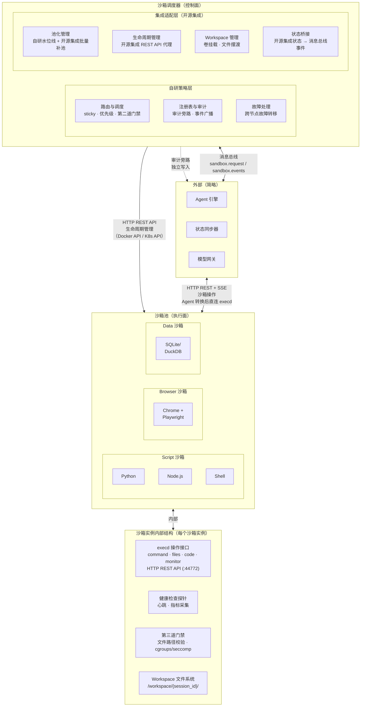

*图 1：执行面架构全景——沙箱调度器六模块 + 沙箱池 + 沙箱内部结构*

> 图中虚线表示审计旁路（调度器独立写入，不依赖沙箱上报）。外部组件（Agent 引擎、状态同步器等）以简化形式呈现，详见图 3 协作关系。

### 沙箱调度器：双层构成

沙箱调度器是沙箱系统的唯一控制面组件，由两层构成：**自研策略层**和**集成适配层**。Agent 引擎可见的边界是沙箱调度器，不直接感知底层集成适配层。

| 层级        | 来源             | 职责                                                                                                                                                                                                                          |
| --------- | -------------- | --------------------------------------------------------------------------------------------------------------------------------------------------------------------------------------------------------------------------- |
| **自研策略层** | 自研             | 门禁 · 多租户管理 · 亲和性调度· 优先级调度 · 审计旁路 · 双重资源配额 · 跨节点故障转移 · RECOVERING 状态协调                                                                                                                                                       |
| **集成适配层** | 开源集成 | 容器生命周期管理（create/delete/pause/resume）· 池化管理 · execd 注入 · 网络管控 · **底座差异化快照**（Firecracker：`pause()` 整机差分快照；Docker：`pause()` 仅冻结 CPU，持久化依赖卷/OSS）· 状态桥接 |

两层通过内部接口交互：自研策略层消费集成适配层的 API 进行容器管理，同时在请求路径上增加门禁、审计、配额等控制面逻辑。

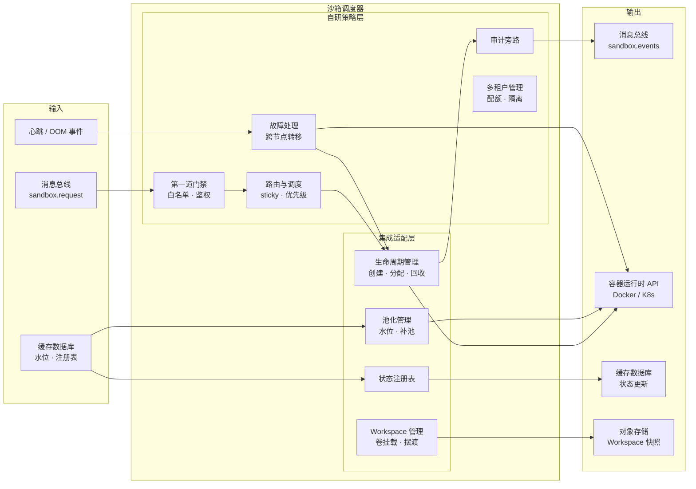

*图 2：沙箱调度器内部交互——自研策略层 + 集成适配层*

**核心数据流**：

1. `sandbox.request` 消息 → **第一道门禁**（白名单 + 鉴权）→ **路由与调度**（匹配沙箱）→ **生命周期管理**（分配沙箱）→ 发布 `sandbox.ready`
2. 心跳超时 / OOM → **故障处理** → **生命周期管理**（重建沙箱）→ **审计旁路**（写入事件）
3. 池水位低于阈值 → **池化管理**（触发补池）→ 调用容器运行时 API

### 外部协作关系

沙箱系统与架构设计中其它组件的协作通过消息总线和状态面进行，以简化形式总结：

| 外部组件         | 协作方式                   | 说明                                                                            |
| ------------ | ---------------------- | ----------------------------------------------------------------------------- |
| **Agent 引擎** | 消息总线 + HTTP REST + SSE | `sandbox.request` 申请 → `sandbox.ready` 通知 → 原语转换为沙箱操作后经 HTTP REST + SSE 下发（直连 execd） |
| **状态同步器**    | 消息总线                   | 消费 `sandbox.events`（sync-cg）→ 物化到结构化数据库                                       |
| **缓存数据库**    | 读写                     | 池水位·注册表·session 状态·pending\_task                                              |
| **结构化数据库**   | 读写                     | 沙箱元数据                                                                         |
| **消息总线**     | 发布/消费                  | sandbox.request / sandbox.events / 审计事件流                                      |
| **对象存储**     | 读写                     | Workspace 文件快照·过程产物外化                                                         |

### 开源集成架构

沙箱系统的集成适配层基于开源集成构建。沙箱调度器作为 GNexCore 与开源集成之间的**代理层**——GNexCore 内部组件只与调度器交互，不直接感知底层开源集成。

#### 集成架构全景

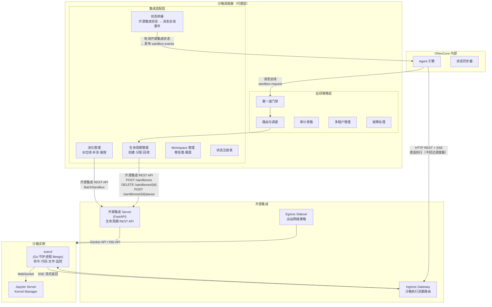

*图：开源集成架构——调度器作为代理层，策略自研，运行时委托开源集成*

#### 代理层职责

调度器作为代理层，承担**双向翻译**职责：

| 方向     | GNexCore 侧协议                | 调度器内部处理         | 开源集成侧协议                              |
| ------ | --------------------------- | --------------- | -------------------------------------------- |
| 下发控制指令 | 消息总线 `sandbox.request`      | 门禁→路由→配额→匹配     | `POST /sandboxes`、`DELETE /sandboxes/{id}` 等 |
| 上报状态事件 | 消息总线 `sandbox.ready/events` | 状态桥接→转换→发布      | `GET /sandboxes/{id}` 状态查询                   |
| 沙箱操作   | HTTP REST + SSE             | **不代理，透传**      | execd HTTP API + SSE                         |
| 审计     | 审计旁路独立写入                    | 不经过开源集成 | 无                                            |

**核心原则**：沙箱操作不走调度器代理——Agent 引擎完成原语转换后直连 execd，调度器不碰执行数据流，避免成为吞吐瓶颈。调度器只代理控制指令（生命周期管理）和策略控制（门禁/配额/路由），这些是低频操作。

#### 通信模型

| 通道         | 协议                  | 路径                                 | 说明              |
| ---------- | ------------------- | ---------------------------------- | --------------- |
| **生命周期管理** | 消息总线 → 开源集成 REST API | Agent 引擎 → 调度器 → 开源集成 Server → 容器   | 调度器代理转发         |
| **沙箱操作**   | HTTP REST + SSE     | Agent 引擎 → Ingress Gateway → execd | 直连，不经过调度器；载荷为通用操作请求，非 Agent 原语 |
| **状态桥接**   | 开源集成状态查询 → 消息总线     | 调度器轮询/事件驱动 → 发布 sandbox.events     | 调度器负责桥接         |
| **审计旁路**   | 独立写入消息总线            | 调度器 → 消息总线                         | 不经过开源集成 |

#### 状态桥接机制

开源集成没有消息总线，状态变更不会主动推送。调度器负责桥接：

| 场景         | 桥接方式              | 说明                                                    |
| ---------- | ----------------- | ----------------------------------------------------- |
| 正常创建/销毁    | **调度器主动发布**       | 调度器是发出创建/销毁指令的一方，自己知道状态何时变更                           |
| OOM / 进程崩溃 | **轮询开源集成状态 API** | 调度器定期检查沙箱状态，检测到 Failed/Terminated 后发布 `sandbox.error` |
| 沙箱就绪       | **创建回调 + 轮询**     | 调度器发出创建请求后，轮询直到状态变为 Running，发布 `sandbox.ready`        |
| TTL 过期销毁   | **调度器主动感知**       | 调度器在创建时记录 TTL，到期前主动续期或发布 `sandbox.destroyed`          |

> **优化方向**：如果开源集成后续支持 Webhook 回调，可以替换轮询为回调驱动，降低延迟。

#### 开源集成替代了什么 / 不替代什么

| 替代（不再自研）                              | 不替代（自研保留）                            |
| ------------------------------------- | ------------------------------------ |
| 容器生命周期管理（create/delete/pause/resume）  | 池化水位线模型（BufferMin/BufferMax/PoolMax） |
| 执行守护进程注入（execd 自动注入）                  | 门禁体系（三层门禁）                           |
| 命令执行 / 代码执行 / 文件操作（execd API）         | 多租户四维隔离                              |
| 代码执行上下文持久化（Jupyter Kernel）            | 审计旁路                                 |
| 网络出站管控（Egress Sidecar，DNS 级域名过滤）      | 路由与调度（sticky/优先级/亲和性）                |
| 沙箱 Ingress Gateway（统一入口路由）            | 故障自愈流水线（L1~L4 分级 · 底座差异化恢复 · 断点续跑）         |
| 安全容器运行时（gVisor/Kata/Firecracker 开箱支持） | 三层快照与存储体系（语义按后端分化：FC 整机快照 / Docker 卷+OSS）       |
| Browser 沙箱（Chrome + Playwright 原生支持）  | 消息总线设计                               |
| TTL 自动过期清理                            | 状态桥接（开源集成状态 → GNexCore 事件）           |

***

## 沙箱调度器

### 池化管理

池化管理是沙箱调度器中集成适配层的核心能力，负责维护预热沙箱池的生命周期。目标是**将沙箱获取延迟从秒级降低到毫秒级**，同时保证资源利用率和多租户隔离。

### 池化架构概览

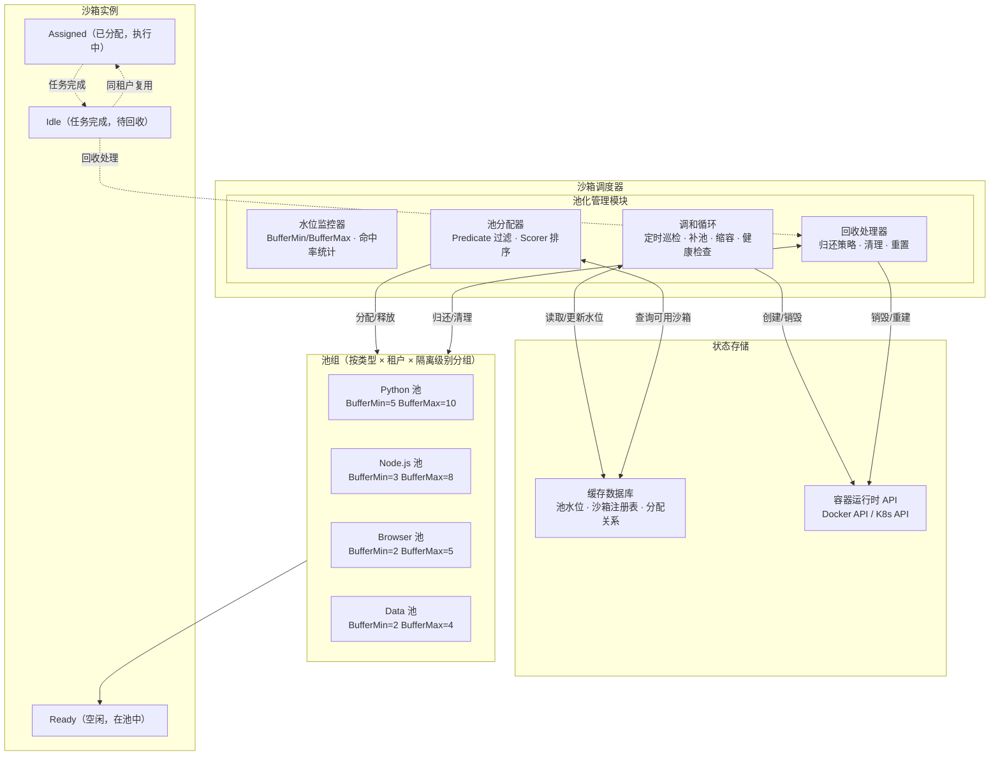

*图 13：池化管理架构——水位监控 · 调和循环 · 池分配器 · 回收处理器*

### 水位线模型

每个沙箱池维护三条水位线，分别驱动补池（扩）、缩容（缩）、限流（限）三个动作：

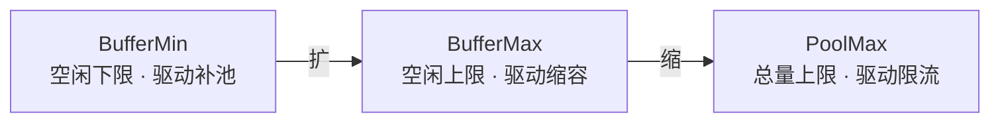

| 水位线           | 含义         | 触发动作                              | 典型值             |
| ------------- | ---------- | --------------------------------- | --------------- |
| **BufferMin** | 池中空闲沙箱最少数量 | 空闲数 < BufferMin → 触发补池（Warm Path） | 预期并发 × 0.1\~0.2 |
| **BufferMax** | 池中空闲沙箱最多数量 | 空闲数 > BufferMax → 缩容销毁多余沙箱        | 预期并发 × 0.3      |
| **PoolMax**   | 池中沙箱总数上限   | 总量 > PoolMax → 拒绝新请求（排队等待）        | 单节点资源上限         |

> **为什么不设 PoolMin**：PoolMin（池总量下限）在逻辑上是 BufferMin 的冗余——空闲数低时总量必然低，BufferMin 一定会先触发补池。PoolMin 永远不会比 BufferMin 先触发，因此去掉。

**水位计算公式**：

```
可用数（Available）= 池总量（Total）- 已分配数（Allocated）
需要补池数（SupplyCnt）= max(0, BufferMin - Available)
需要缩容数（ShrinkCnt）= max(0, Available - BufferMax)
```

> **水位经验值**：BufferMin 设为预期并发的 10%\~20%，BufferMax 设为 30%。BufferMin 太低会导致 Fast Path 命中率下降，太高则浪费资源。Fast Path 命中率低于 80% 时触发水位告警。

### 沙箱获取路径（展开）

三条获取路径是池化管理的核心调度逻辑：

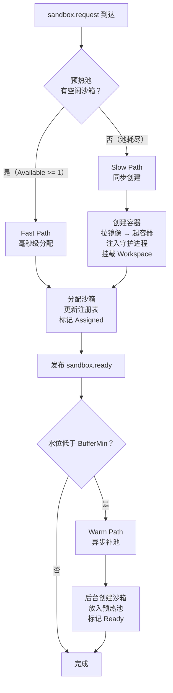

| 路径            | 延迟     | 阻塞调用方 | 触发条件              | 流程                            |
| ------------- | ------ | ----- | ----------------- | ----------------------------- |
| **Fast Path** | < 10ms | 否     | 预热池有可用沙箱          | 从注册表选取 → 更新状态 → 发布 ready      |
| **Slow Path** | 2\~5s  | 是     | 预热池耗尽             | 同步创建容器 → 等待就绪 → 分配 → 发布 ready |
| **Warm Path** | 异步     | 否     | 分配后水位低于 BufferMin | 后台创建沙箱 → 就绪后放入池中，不阻塞当前请求      |

> Slow Path 是降级路径，不应成为常态。如果 Slow Path 占比 > 20%，说明水位配置不合理或突发流量超出预期。

###

### 回收策略

沙箱任务完成（Executing → Idle）后，回收处理器决定如何处理。核心原则：**会话结束后沙箱直接销毁，不归还至预热池**，避免用户自定义安装、配置修改等业务数据污染基线环境。

| 回收类型     | 策略                       | 流程                              | 适用场景                |
| -------- | ------------------------ | ------------------------------- | ------------------- |
| **直接销毁** | 销毁沙箱容器，释放所有资源，从池中移除      | 销毁容器 → 释放 CPU/内存/磁盘 → 水位检查 → 补池 | 会话正常结束（默认策略）        |
| **故障销毁** | 沙箱异常时强制销毁，标记 dead，触发恢复流程 | 强制销毁 → 标记 dead → 触发故障自愈流水线      | 执行超时 / OOM / 健康检查失败 |

**回收流程**：

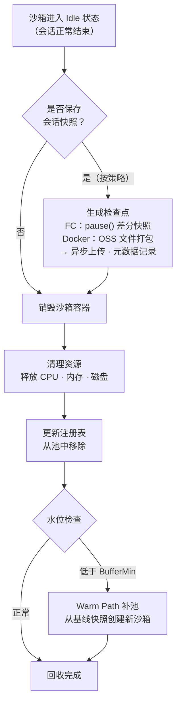

**会话快照保存策略**：

| 策略         | 触发时机               | 说明                   |
| ---------- | ------------------ | -------------------- |
| **全量快照**   | 用户完成环境安装、配置改造后主动生成 | Firecracker：固化专属运行环境（含内存）；Docker：打包允许修改目录上传 OSS |
| **增量定时快照** | 周期自动生成（如每 5 分钟）    | Firecracker：内存脏页 + 文件差分；Docker：文件目录 OSS 增量备份 |
| **手动快照**   | 对外开放接口，业务按需调用      | 关键计算节点前保存状态；Docker 等价于触发文件打包 API              |

### 预热策略：基于基线快照的纯净预热

预热池的核心原则是**基线环境与业务会话数据完全隔离**——池内所有空闲沙箱必须基于全局基线快照构建，不包含任何用户自定义安装、配置或业务数据。任何带业务修改的沙箱在会话结束后直接销毁，绝不归还至预热池。

#### 双快照隔离体系

系统定义两种快照，职责严格分离：

| 快照类型       | 内容构成（按后端分化）                                      | 生命周期                     | 使用约束                                 |
| ---------- | ------------------------------------------------ | ------------------------ | ------------------------------------ |
| **全局基线快照** | **Firecracker**：基础镜像 VM 冷启动态；**Docker**：标准化基础镜像 + 预装公共依赖 + execd | 全局共享模板，仅基础环境版本迭代时重建，长期缓存 | 预热池**仅允许**基于此快照生成空闲沙箱，禁止复用带业务修改的会话快照 |
| **会话专属快照** | **Firecracker**：根文件系统差分 + 全量进程内存（vCPU/设备状态）；**Docker**：等价于 OSS 文件备份包（无内存），overlay 层仅在容器未销毁时有效 | 一对一绑定唯一会话标识，会话结束后可归档或清理  | **仅**用于当前会话故障恢复，预热池、其他会话**不可复用**     |

```
预热池沙箱源 = 全局基线快照 / 镜像（唯一来源）
会话恢复源 = 会话专属快照（FC）或 OSS 文件备份（Docker），一对一绑定
          ≠ 预热池沙箱源（绝对隔离）
```

#### 预热池构建流程

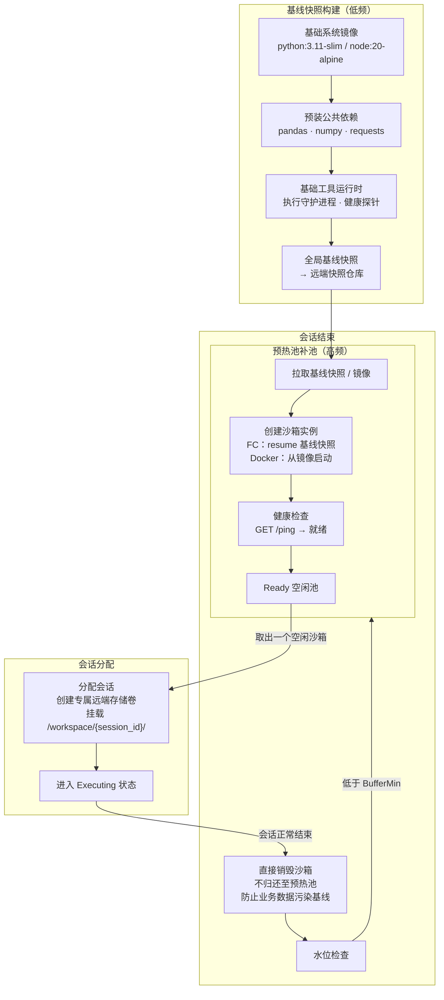

**关键约束**：

- 预热池的沙箱**全部来自全局基线快照**，不含任何业务数据
- 会话结束后沙箱**直接销毁**，不归还至预热池——因为执行过程中可能安装了用户依赖、修改了配置，这些"脏数据"会污染基线环境
- 会话专属快照仅用于故障恢复，不参与预热池流转

#### 基线快照缓存策略

| 策略          | 说明                                                     |
| ----------- | ------------------------------------------------------ |
| **远端存储**    | 基线快照存储于远端统一快照仓库（对象存储），支持多节点拉取                          |
| **宿主机本地缓存** | 宿主机本地缓存最近使用的基线快照副本，加速预热沙箱拉起。缓存命中时补池延迟可降低 50%+          |
| **版本管理**    | 基线快照标记版本号（如 `baseline:python-v3`），版本迭代时构建新快照，旧版本沙箱逐步回收 |

> 关于快照的详细生成、存储、恢复机制，见 §快照与存储分层。

### 多池隔离

池按三个维度分组，实现物理级别的资源隔离：

```
池组键 = f"{sandbox_type}:{isolation_level}:{tenant_id}"

示例：
- python:docker:tenant-a    → 租户 A 的 Python Docker 池
- python:docker:tenant-b    → 租户 B 的 Python Docker 池
- browser:docker:shared     → 共享的 Browser 池
- python:firecracker:tenant-a → 租户 A 的高隔离 Python 池
```

| 隔离维度       | 机制                               | 效果            |
| ---------- | -------------------------------- | ------------- |
| **类型隔离**   | 按沙箱类型（Script/Browser/Data）分池     | 不同类型不共享资源     |
| **隔离级别隔离** | 按后端（Docker/gVisor/Firecracker）分池 | 不同安全等级独立扩缩    |
| **租户隔离**   | 按租户 ID 分池（或共享池 + Label 隔离）       | 租户间资源硬隔离，互不影响 |

**共享池 vs 专属池**：

- **共享池**：适用于低频租户或非敏感场景，多个租户共享一个池，通过租户标签实现分配隔离（同租户不跨租户复用），池资源按比例分配
- **专属池**：适用于高频或敏感租户，每个租户独立池，独立的 BufferMin/BufferMax/PoolMax，资源完全隔离

### 与架构约束的关系

池化管理在 GNexCore 架构中的定位：

| 架构原则      | 池化管理的体现                                                                    |
| --------- | -------------------------------------------------------------------------- |
| **本质分离**  | 池化管理在集成适配层，不涉及沙箱操作执行。池只管理"沙箱是否就绪"，不管理"沙箱执行什么"                                |
| **状态外化**  | 池的状态（水位、分配关系、沙箱列表）全部存储在缓存数据库中，池管理进程崩溃后可从缓存数据库恢复                            |
| **不过度设计** | Phase 1 使用单机 reconcile 循环（Go 协程），Phase 2/3 演进到 K8s Operator 模式时替换实现，上层接口不变 |

### 与其他模块的协作

| 协作方              | 方向 | 接口                   | 说明                       |
| ---------------- | -- | -------------------- | ------------------------ |
| **路由与调度**        | ←  | 分配请求（类型 + 租户 + 隔离级别） | 路由模块决定从哪个池分配，池化管理执行分配    |
| **生命周期管理**       | →  | 创建/销毁指令              | 补池和缩容通过生命周期管理模块执行实际的容器操作 |
| **Workspace 管理** | →  | 卷挂载/卸载               | 分配时挂载 Workspace 卷，回收时卸载  |
| **注册表与审计**       | ←→ | 状态读写                 | 池水位和分配关系写入注册表，审计事件上报     |
| **故障处理**         | ←  | 健康检查事件               | 调和循环中的健康检查失败触发故障处理流程     |

### 生命周期管理

每个沙箱实例从创建到销毁经历一组明确的状态转换。沙箱调度器维护状态机，所有状态变更通过消息总线广播，确保控制面和沙箱实例对状态有一致的认知。

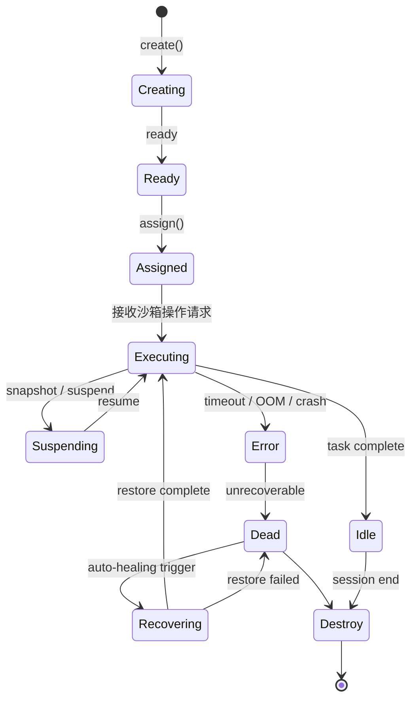

*图 12：沙箱生命周期状态机（含快照挂起与故障自愈）*

### 状态说明

| 状态           | 说明                         | 资源消耗               | 触发者        |
| ------------ | -------------------------- | ------------------ | ---------- |
| `Creating`   | 调度器创建中（Firecracker：从基线快照 resume；Docker：从基线镜像启动） | 临时（创建期间）           | 调度器        |
| `Ready`      | 容器就绪，进入预热池等待分配             | 完整（预热池持有）          | 调度器        |
| `Assigned`   | 已分配给会话，远端存储卷已挂载            | 完整                 | 调度器        |
| `Executing`  | 沙箱执行通用操作（命令 / 文件 / 代码）   | 完整（CPU + 内存 + I/O） | 沙箱         |
| `Suspending` | 快照生成中（Firecracker：`pause()` 整机差分；Docker：文件打包上传 OSS） | 完整（Firecracker CPU 冻结；Docker I/O 密集） | 调度器（按策略触发） |
| `Idle`       | 会话完成，等待销毁                  | 完整（可配置降频）          | 控制面 → 调度器  |
| `Error`      | 执行超时 / OOM / 健康检查失败 / 进程崩溃 | 需判定                | 沙箱自身异常     |
| `Dead`       | 不可恢复，等待自愈流水线接管             | 需清理                | 调度器        |
| `Recovering` | 自愈恢复中：按后端拉取快照或 OSS 备份 → 还原环境 → 挂载存储卷  | 临时（恢复期间）           | 故障自愈控制层    |
| `Destroy`    | 资源回收中                      | 递减                 | 调度器        |

### GNexCore 业务状态 ↔ 开源集成物理状态映射

GNexCore 的 10 个业务状态与开源集成的 5 个物理状态不在同一层——GNexCore 的状态机在开源集成之上，通过注册表扩展字段（`pool_status`）区分开源集成 `Running` 下的多个子状态。

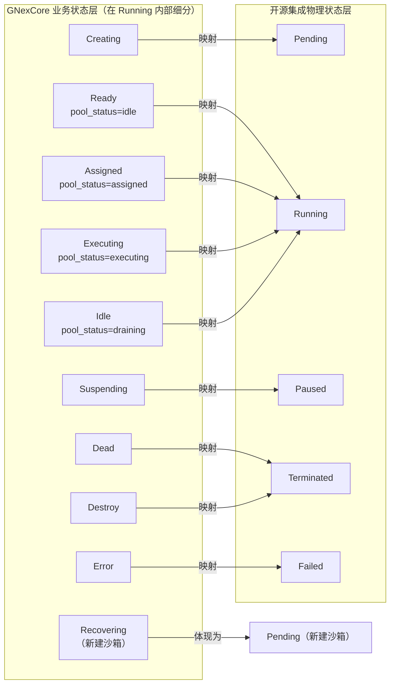

| GNexCore 状态  | 开源集成物理状态                       | 说明                                                      |
| ------------ | -------------------------------------- | ------------------------------------------------------- |
| `Creating`   | `Pending`                              | 名称映射，逻辑一致                                               |
| `Ready`      | `Running`（注册表 `pool_status=idle`）      | 开源集成沙箱创建后就是 Running，GNexCore 通过注册表扩展字段标记为"池中空闲" |
| `Assigned`   | `Running`（注册表 `pool_status=assigned`）  | 同上，通过注册表区分                                              |
| `Executing`  | `Running`（注册表 `pool_status=executing`） | 同上，通过注册表区分                                              |
| `Suspending` | `Paused`                               | 直接映射开源集成 pause API                              |
| `Idle`       | `Running`（注册表 `pool_status=draining`）  | 开源集成无此状态，GNexCore 标记为"待销毁"                      |
| `Error`      | `Failed`                               | 名称映射                                                    |
| `Dead`       | `Terminated`                           | 名称映射，但 GNexCore 会触发 Recovering                          |
| `Recovering` | 新建沙箱（`Pending` → `Running`）            | 开源集成无此概念，在开源集成侧体现为：销毁旧沙箱 + 从快照创建新沙箱            |
| `Destroy`    | 资源回收（开源集成侧无对应状态）                       | GNexCore 自行处理                                           |

**关键结论**：GNexCore 的 10 个状态不需要裁剪。开源集成的 5 个状态是容器运行时的物理状态，GNexCore 的 10 个状态是业务逻辑状态。两者分层映射，互不干扰。

### 关键状态转换约束

- **`Executing → Suspending`**：快照生成期间沙箱暂停接收新操作请求。全量快照（用户触发）、增量定时快照（后台周期）、手动快照（API 调用）三种触发方式。
- **`Suspending → Executing`**：快照生成完成，恢复正常执行。快照异步上传远端仓库，不阻塞恢复。
- **`Error → Dead`** **不可逆**：一旦进入 Dead 状态，沙箱内部状态已不可信，必须由自愈流水线接管。
- **`Dead → Recovering`**：故障自愈控制层自动触发，从元数据中心查询快照指针和存储卷 ID，执行恢复流程。
- **`Recovering → Executing`**：恢复成功，沙箱从快照断点继续执行。Agent 引擎收到 `sandbox.ready` 后恢复下发沙箱操作。
- **`Recovering → Dead`**：恢复失败（如快照损坏）。故障自愈控制层记录失败日志并触发告警，由运维介入处理。
- **`Idle → Destroy`**：会话结束后沙箱直接销毁，不归还预热池（防止业务数据污染基线环境）。
- **`Executing → Error`**：由单次操作超时、OOM Kill、进程崩溃、健康检查失败触发。调度器检测到后标记状态，触发自愈流程。

### 沙箱获取路径

沙箱获取分为三条路径，覆盖从毫秒级到秒级的不同延迟需求。

| 路径                  | 触发条件       | 耗时        | 说明                                              |
| ------------------- | ---------- | --------- | ----------------------------------------------- |
| **Fast Path（快速路径）** | 预热池有空闲沙箱   | 毫秒级       | 从预热池中直接分配已就绪的沙箱，返回 `sandbox.ready` 事件           |
| **Slow Path（慢速路径）** | 预热池耗尽      | 秒级（2\~5s） | 从零创建新沙箱：拉镜像 → 起容器 → 注入上下文 → 挂载 Workspace → 就绪通知 |
| **Warm Path（补池路径）** | 后台巡检池低于水位线 | 异步        | 调度器后台协程持续监控池水位，低于阈值时自动补池，不影响当前请求                |

**补池来源**：Warm Path 补池时，沙箱始终从全局基线快照构建，保证预热池中所有沙箱的"纯净性"——不含任何用户自定义安装、配置或业务数据。

**Fast Path 命中率是性能关键**：经验值下限为预期并发数的 10%，上限为 20%。命中率低于 80% 时触发水位告警，调度器加速补池。

### 资源监控与回收策略

沙箱回收不只"空闲超时"一个维度，架构层面定义 6 种回收触发：

| 回收策略       | 触发条件                  | 动作                     | 严重级别 |
| ---------- | --------------------- | ---------------------- | ---- |
| **空闲超时**   | 长时间无沙箱操作              | 优雅关闭 → 销毁（会话结束不回预热池）   | 正常   |
| **执行超时**   | 单次操作超过 deadline        | 强制终止 → 返回 TimeoutError | 正常   |
| **内存超限**   | OOM Kill 检测           | 强制销毁 → 标记 dead → 告警    | 异常   |
| **CPU 超限** | 持续高 CPU               | 限流 + 告警                | 异常   |
| **磁盘超限**   | 临时卷超配额                | 清理临时文件 + 告警            | 异常   |
| **健康检查失败** | 心跳 30s 无响应            | 标记 dead → 触发沙箱恢复       | 异常   |

具体阈值（空闲几分钟、CPU 百分比、磁盘 GB）由运维按业务特征配置，架构层面只定义"有哪些回收维度"。

### 注册表与审计

**注册表与审计**：沙箱状态注册表（缓存数据库）· 审计旁路（独立写入）· 事件广播。

关键逻辑：缓存数据库读写 · 审计旁路 fire-and-forget · sandbox.events 发布。

协作关系：← 所有模块（状态变更事件）· → 消息总线（事件发布）。

```
# 审计事件（沙箱调度器 -> 审计消费者）
sandbox.audit.{sandbox_id}             # 审计旁路事件流
```

### 路由与调度

系统采用纵深防御策略，每次沙箱操作执行时经过**三层门禁**——前两层在沙箱外（框架强制·不可绕过），第三层在沙箱内（尽力而为·可被绕过）。核心原则：门禁逻辑归框架，门禁策略归配置，用户脚本只管业务逻辑。

> **边界说明**：第一道门禁校验的是 Agent **原语**（`allowed_primitives`）；第二道门禁校验原语转换后的**沙箱操作类型**与隔离级别是否匹配；第三道门禁在 execd 执行具体操作时生效。沙箱本身不感知原语语义。

#### 三层门禁体系

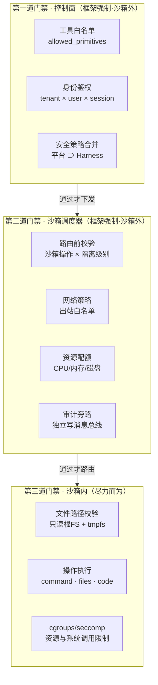

*图 14：三层门禁——前两层框架强制（沙箱外），第三层尽力而为（沙箱内）*

**第一道门禁（控制面）**：Agent 原语下发前，控制面强制校验工具白名单（`allowed_primitives`）、身份鉴权（tenant × user × session 三元组）、安全策略合并（平台级与 Harness 级取最严格交集）。

**第二道门禁（沙箱调度器）**：原语转换为沙箱操作后、路由到沙箱前，调度器强制校验操作类型与隔离级别匹配、网络出站白名单、资源配额（租户总配额 + 单沙箱配额）、审计旁路（独立写入消息总线，不依赖沙箱内上报）。

**第三道门禁（沙箱内）**：execd 执行具体操作时，沙箱内尽力而为的校验——文件路径校验（只读根 FS + tmpfs）、cgroups/seccomp 资源与系统调用限制。

#### 多租户隔离深化

沙箱在多租户场景下必须保证租户间彻底隔离。隔离分四个维度：

| 维度         | 隔离方式                                 | 说明                                                                    |
| ---------- | ------------------------------------ | --------------------------------------------------------------------- |
| **网络隔离**   | DNS 隔离 + 出站白名单 + 入站限制（沙箱不接受入站连接）     | 每个租户的出站策略独立配置，租户 A 的 Agent 执行 `curl internal-api` 绝对不能访问到租户 B 的内部 API |
| **文件系统隔离** | Namespace + 临时卷                      | 沙箱销毁即删除，不留任何文件。Workspace 卷按租户隔离挂载                                     |
| **资源配额**   | 双重配额：每租户总配额 + 单沙箱配额                  | 租户总配额覆盖 CPU/内存/磁盘/带宽/并发五个维度；单沙箱配额限制单个沙箱的资源上限                          |
| **计算隔离**   | 禁止跨租户复用沙箱（必须重建）；同租户内可复用；敏感 Agent 专用池 | 租户隔离是合规底线——所有跨租户访问尝试（即使失败）必须写入审计日志                                    |

### 沙箱类型管理

沙箱类型管理是沙箱调度器的职责之一，负责定义和维护系统中所有可用的沙箱类型。调度器根据 Agent 引擎请求的类型匹配沙箱实例。

### 沙箱类型分类

| 大类              | 类型                 | 说明                               | 典型镜像/运行时                     |
| --------------- | ------------------ | -------------------------------- | ---------------------------- |
| **代码执行沙箱**      | Python Sandbox     | 执行 Python 代码片段，支持 pip 依赖安装       | python:3.11-slim             |
| <br />          | Node.js Sandbox    | 执行 JavaScript/TypeScript 代码      | node:20-alpine               |
| <br />          | Shell Sandbox      | 执行 shell 命令和脚本                   | alpine:latest                |
| <br />          | Go Sandbox         | 编译并执行 Go 代码                      | golang:1.22                  |
| <br />          | Rust Sandbox       | 编译并执行 Rust 代码                    | rust:1.78                    |
| <br />          | Java Sandbox       | 编译并执行 Java 代码，支持 Maven/Gradle 构建 | eclipse-temurin:17-jdk       |
| **浏览器沙箱**       | Headless Chrome    | 无头浏览器，支持页面抓取、自动化测试               | selenium/standalone-chrome   |
| <br />          | Playwright Sandbox | 基于 Playwright 的浏览器自动化            | mcr.microsoft.com/playwright |
| <br />          | Puppeteer Sandbox  | 基于 Puppeteer 的浏览器控制              | 含 Chromium 的 Node 镜像         |
| **数据库沙箱**       | SQLite Sandbox     | 本地文件型数据库操作                       | alpine + sqlite              |
| <br />          | PostgreSQL Sandbox | 临时 PostgreSQL 实例                 | postgres:15-alpine           |
| **Notebook 沙箱** | Jupyter Sandbox    | 交互式 Notebook 执行                  | jupyter/scipy-notebook       |
| **自定义沙箱**       | 用户自定义镜像            | 基于预置模板或用户上传镜像                    | 自定义                          |

### 沙箱类型定义结构

每个沙箱类型在类型管理器中注册为一条类型定义，包含以下信息：

```json
{
  "type_id": "python-sandbox",
  "type_name": "Python Sandbox",
  "category": "code_execution",
  "description": "执行 Python 代码片段，支持标准库和 pip 安装",
  "default_image": "python:3.11-slim",
  "supported_backends": ["docker", "firecracker"],
  "default_backend": "docker",
  "resource_profile": {
    "cpu_limit": "1.0",
    "memory_limit": "512M",
    "timeout_default": 30000
  },
  "capabilities": ["exec_code", "exec_command", "file_rw", "pip_install"],
  "network_policy": "restricted",
  "snapshot_enabled": true,
  "created_at": "2026-06-24T00:00:00Z",
  "updated_at": "2026-06-24T00:00:00Z"
}
```

### 依赖管理与镜像源配置

沙箱内部执行代码时，经常需要动态安装依赖（`pip install`、`npm install`、`mvn install` 等）。为了加速安装并支持内网/离线环境，系统通过 Sonatype Nexus 提供统一制品管理能力。

**Nexus 在沙箱场景中的三重职责**

| 职责          | 说明                                              | 配置方式                                                                                                                                         |
| ----------- | ----------------------------------------------- | -------------------------------------------------------------------------------------------------------------------------------------------- |
| **镜像仓库**    | 存储私有沙箱镜像，替代 Docker Hub / 阿里云镜像仓库                | 在 containerd / Docker 的 `daemon.json` 中配置 `registry-mirrors` 指向 Nexus Docker Registry                                                        |
| **依赖包代理仓库** | 缓存/代理 PyPI、npm Registry、Maven Central，加速沙箱内依赖安装 | 沙箱初始化时注入配置文件：`pip.conf`（`index-url` 指向 Nexus PyPI Group）、`.npmrc`（`registry` 指向 Nexus npm Group）、`settings.xml`（mirror 指向 Nexus Maven Group） |
| **构建产物存储**  | 归档沙箱编译输出（jar、wheel、tar 等），支持产物复用和审计             | 沙箱内构建脚本将产物 push 到 Nexus Raw / Maven 仓库                                                                                                       |

**沙箱类型定义中的镜像源配置**

每个沙箱类型的类型定义可声明依赖包源配置，沙箱初始化时自动注入：

```json
{
  "type_id": "python-sandbox",
  "registry_config": {
    "docker_registry": "https://nexus.corp/docker",
    "pip_index_url": "https://nexus.corp/repository/pypi-group/simple",
    "npm_registry": "https://nexus.corp/repository/npm-group/",
    "maven_mirror": "https://nexus.corp/repository/maven-public/"
  }
}
```

沙箱创建时，调度器将 `registry_config` 映射为沙箱内的环境变量和配置文件：

- Docker 镜像拉取 → 指向 Nexus Docker Registry
- `pip install` → 指向 Nexus PyPI Group（含缓存代理）
- `npm install` → 指向 Nexus npm Group（含缓存代理）
- `mvn install` → 指向 Nexus Maven Public（含缓存代理）

> **离线环境强制要求**
>
> 内网/离线部署时，Nexus 必须预先同步所有必需的 Docker 镜像层和依赖包到本地仓库。沙箱初始化脚本在 `/etc/pip.conf`、`.npmrc`、`$HOME/.m2/settings.xml` 等位置硬编码 Nexus 地址，阻断所有外网访问。

### 创建沙箱时的类型选择流程

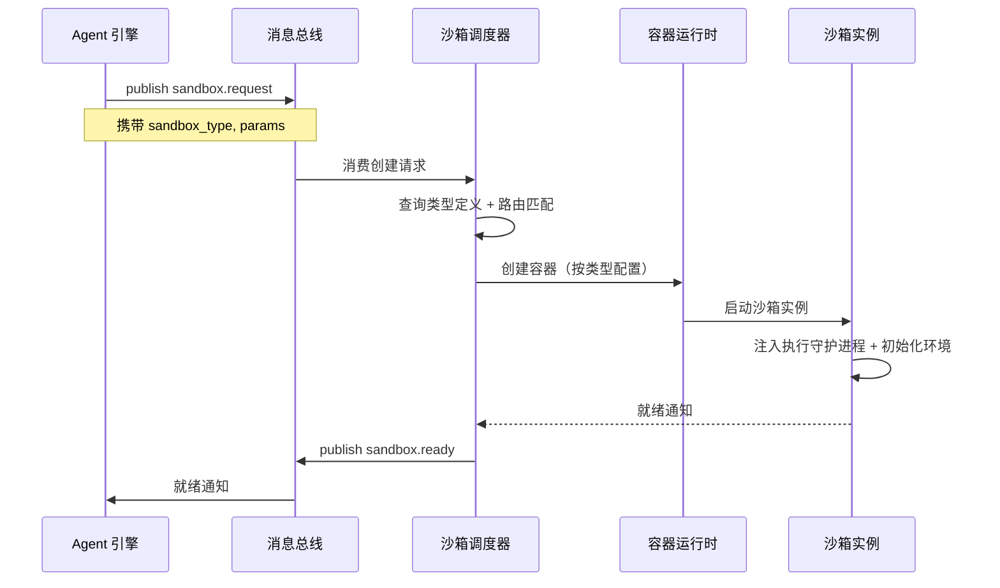

*图 10：基于沙箱类型的创建流程*

### 故障处理

故障自愈是沙箱系统的高可用保障，目标是**全链路自动化自愈**：自动识别沙箱各类异常，无需人工介入完成实例重建、环境恢复、数据挂载、任务续跑。恢复不是被动等待，而是主动接管——调度器对每个 session 主动执行恢复流程，不等用户重新发请求。

GNexCore 沙箱为**无状态执行面**：控制面不持久化沙箱实例本体，持久化能力按隔离后端完全分化。控制面通过统一的 `pause()` / `resume()` / `fork()` API 编排恢复（实现参考 OpenSandbox Provider 抽象层），底层按 Docker/gVisor 与 Firecracker 走不同路径——**不可混用恢复策略**。

#### 四层故障场景

所有故障按四个层级归类，探测、隔离、恢复策略在同一框架下按后端分化执行：

| 层级 | 故障场景 | 典型触发 | 探测方式 |
| --- | --- | --- | --- |
| **L1** | execd / 代码进程崩溃自愈 | OOM、panic、进程退出 | 容器内 supervisor 轮询 `/ping` + PID；调度器 30s 心跳 |
| **L2** | 沙箱运行时服务重启，实例仍存活 | 控制面崩溃 / 滚动升级 | 服务启动后扫描本机残留实例（Docker 容器 / Firecracker VM） |
| **L3** | 主动故障回滚 | 破坏性代码、环境污染 | 用户或调度器调用 `pause()` 生成检查点 |
| **L4** | 实例彻底销毁 / 节点宕机 | TTL 回收、OOM Kill、宿主机重启 | 节点心跳超时（> 60s）、容器 Terminated、资源耗尽 |

**L1：execd / 代码进程崩溃 —— 容器内自动自愈**

两种后端逻辑一致（参考 OpenSandbox execd supervisor 实现）：容器 / VM 内置 supervisor 持续轮询 execd 健康接口与 PID 存活状态，异常后指数退避重启（1s→30s，最大重试可配置熔断）。

| 维度 | Docker/gVisor | Firecracker 微 VM |
| --- | --- | --- |
| 恢复范围 | 仅重启 execd；overlay 文件层完整保留 | 仅重启 execd；磁盘文件完整保留 |
| 丢失内容 | 进程内存、Python 变量、打开句柄 | 同左（未打快照前提下） |
| 容器/VM 实体 | 不销毁，仅内部进程重启 | 不销毁，仅内部进程重启 |

**L2：沙箱运行时服务重启，实例仍存活**

服务进程崩溃但底层实例未被删除时，启动时自动重建内存管理对象（参考 OpenSandbox Server 启动恢复逻辑）：

```
① 启动时遍历本机 docker ps -a 或 Firecracker 进程列表
② 过滤带专属标签 com.gnex.sandbox-id、expire-at 的沙箱实例
③ 读取实例配置（镜像、挂载、资源限制、网络），重建管理对象与 TTL 定时器
④ 对外接口恢复正常读写文件、执行命令
```

| 数据类型 | Docker/gVisor | Firecracker 微 VM |
| --- | --- | --- |
| ✅ 用户修改文件 | overlay 层持久于宿主机磁盘 | 磁盘文件完整保留 |
| ❌ 运行时内存 | 服务内存管理丢失，进程上下文清空 | 未 pause() 时内存丢失 |
| ✅ 已持久化快照 | — | 存于共享对象存储，不受服务重启影响 |
| **约束** | 仅恢复当前宿主机实例，跨节点无法接管 | 有快照时可跨节点；无快照同左 |

> **L2 不触发 RECOVERING 流水线**：底层实例仍存活，运行时服务重启后扫描重建管理对象即可恢复对外 API，Agent 无感知。

**L3：主动故障回滚**

Docker/gVisor 底层依赖 Linux Namespace + Cgroup，文件变更存于宿主机 `/var/lib/docker/overlay2/` 读写层，**无硬件虚拟化快照能力，无法捕获内存运行态**。

控制面暴露统一 `pause()` / `resume()` API，底层语义因后端而异：

| 后端 | `pause()` 实际行为 | 回滚能力 |
| --- | --- | --- |
| **Docker/gVisor** | 调用 `docker pause` 冻结 CPU，**不生成持久快照** | 无原生回滚；兜底见下方两种方案 |
| **Firecracker** | KVM 冻结 VM，脏页跟踪 + 磁盘差分块序列化 | `resume()` 毫秒级还原文件 + 内存 + 进程上下文 |

Docker/gVisor 在 L3 的两种兜底方案：

| 方案 | 机制 | 短板 |
| --- | --- | --- |
| **挂载远端存储卷** | 创建时注入 `-v /data/sandbox/{id}:/workspace`；销毁后目录留存，重建同 ID 挂载恢复 | 仅挂载目录生效；`/etc`、`/root` 等非挂载路径丢失；单机绑定 |
| **业务层 OSS 备份** | API 打包允许修改目录 → MinIO/OSS；重建后上传解压还原 | 仅磁盘文件，内存永久丢失；多文件 IO 耗时 |

> **禁用方案**：`docker commit` 静态镜像——存在镜像膨胀、跨节点拉取慢、一致性破损、丢失运行参数等缺陷，不用于线上故障恢复。

Firecracker L3 快照保存四维运行状态：① 客户机全量内存；② CPU 寄存器与指令指针；③ 虚拟网卡 / 磁盘设备；④ 根文件系统差分块（含 `/etc`、`/root`、`/workspace`）。快照写入集群共享对象存储（MinIO/OSS），任意节点 `resume(sandbox_id)` 可重建。`fork()` 支持基于同一基线克隆分支沙箱，试错失败直接丢弃。

**L4：实例彻底销毁 / 节点宕机**

| 前置条件 | Docker/gVisor | Firecracker 微 VM |
| --- | --- | --- |
| 无备份 / 无快照 | overlay 层被删除，文件彻底丢失 | 冷启动，运行时修改全部丢失 |
| 有挂载卷 | 仅挂载目录保留，换节点无法读取 | — |
| 有 OSS 文件备份 | 手动重建 + 回传文件，无内存 | — |
| 有 pause() 快照 | — | 跨节点拉取快照，文件 + 内存无损恢复 |

**运行时恢复能力对比**

| 故障恢复维度 | Docker/gVisor | Firecracker 微 VM |
| --- | --- | --- |
| execd 崩溃自动重启 | ✅ 仅保留文件 | ✅ 仅保留文件 |
| 服务重启、实例存活恢复文件 | ✅ overlay 保留 | ✅ 磁盘保留 |
| 内存快照 / 差量回滚 | ❌ | ✅ KVM 脏页增量 |
| 全路径文件一键恢复 | ❌ 需打包 / 挂载卷 | ✅ 快照自动捕获 |
| 破坏性代码一键回退 | ❌ 重建重放文件 | ✅ resume 还原运行态 |
| 跨节点恢复 | ❌ 卷绑定单机 | ✅ 共享快照全局恢复 |
| 长会话多轮交互 | 差，依赖额外备份 | 行业标准首选 |

#### pause/resume 状态流转

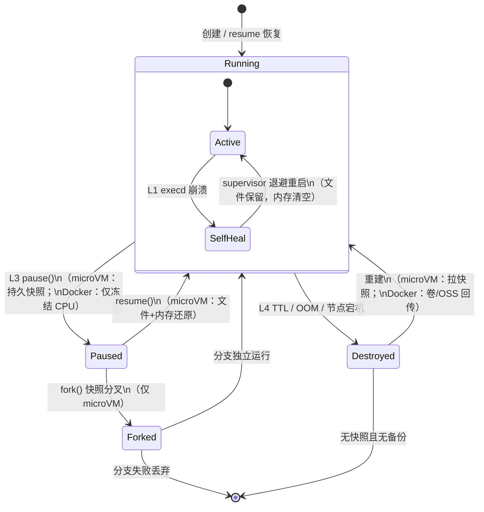

#### 自愈编排流程

调度器收到 L3/L4 级故障信号后，执行统一编排流水线；各步骤的实际行为按 `isolation_backend` 字段分支：

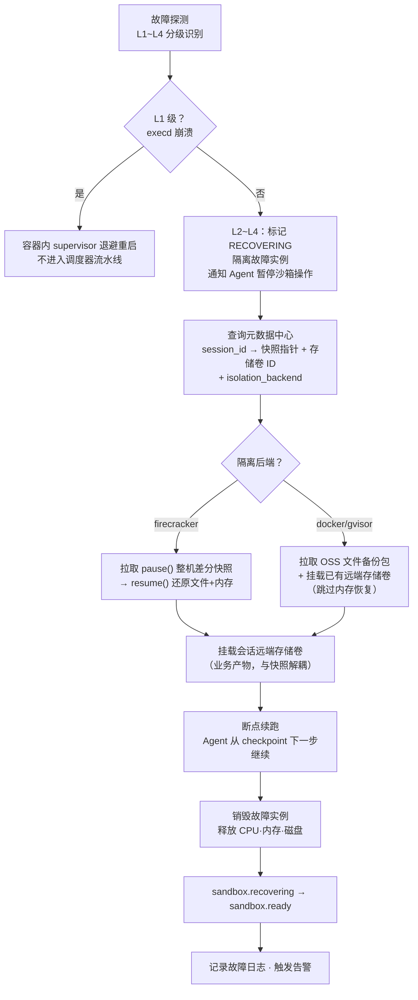

#### 恢复步骤与时序

L3/L4 级故障进入调度器流水线后的标准步骤（L1 由容器内 supervisor 就地处理，不经过此流程）：

| 步骤 | 操作 | 耗时 | Firecracker | Docker/gVisor |
| --- | --- | --- | --- | --- |
| 1. 隔离 | 标记 RECOVERING，通知 Agent 暂停 | < 1s | 同左 | 同左 |
| 2. 元数据查询 | 获取快照指针 + 存储卷 ID + 后端类型 | < 10ms | 同左 | 同左 |
| 3. 拉取检查点 | 从远端仓库拉取最近检查点 | 1~5s | pause() 差分快照 | OSS 文件备份包 |
| 4. 恢复环境 | 重建实例并还原状态 | 1~3s | ~28ms，文件+内存 | ~1s，仅文件 |
| 5. 挂载存储卷 | 挂载 `/workspace/{session_id}/` | < 1s | 业务产物立即可用 | **核心恢复手段** |

**恢复期间状态**：session 标记为 `RECOVERING`，Agent 暂停下发沙箱操作，等待 `sandbox.ready`。用户侧表现为"任务暂停 5~10 秒"，而非任务失败。

#### 恢复后的状态协调

1. 调度器发布 `sandbox.events`（SANDBOX\_READY），携带新沙箱 ID
2. Agent 引擎从 checkpoint 的下一步重新转换原语并下发沙箱操作

#### 快照与存储分层

快照与存储是故障自愈和基线预热的基础设施。三层架构职责分离，但**各层在不同后端上的实现语义不同**——Firecracker 以整机差分快照为主路径，Docker 以远端存储卷 + OSS 文件备份为主路径。

##### 分层存储架构

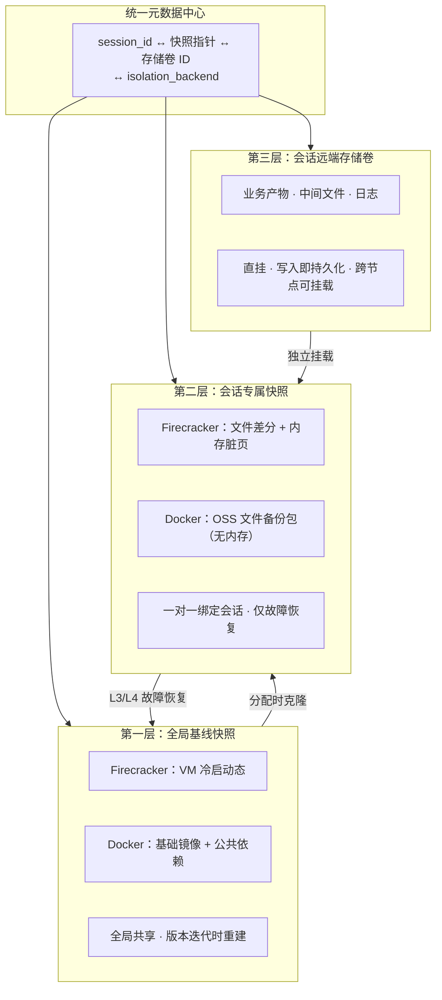

##### 第一层：全局基线快照

基线快照是预热池沙箱的**唯一来源**，保证所有新建沙箱从干净、一致的基础环境启动。

| 属性 | Firecracker | Docker/gVisor |
| --- | --- | --- |
| **内容** | 基础镜像 VM 冷启动态 + execd + 公共依赖 | 基础镜像 + 预装公共依赖 + execd |
| **构建** | 启动临时 VM → 初始化 → `pause()` 生成快照 → 上传对象存储 | 启动临时容器 → 初始化 → `docker commit` 或导出镜像层（**非**运行时 commit） |
| **不含** | 用户自定义包、配置、业务数据 | 同左 |
| **存储** | 远端快照仓库 + 宿主机本地缓存 | 远端镜像仓库 / 对象存储 + 本地缓存 |

##### 第二层：会话专属快照

会话专属快照是 L3/L4 故障恢复的**核心数据源**，语义因后端而异：

| 属性 | Firecracker | Docker/gVisor |
| --- | --- | --- |
| **内容** | 根文件系统差分 + vCPU 寄存器 + 内存页 + 设备状态 | OSS 文件备份包（允许修改目录的 tar/zip）；overlay 仅在容器存活时有效 |
| **生成** | `pause()` API → KVM 脏页跟踪 → 异步上传 | 定时/手动调用文件打包 API → 异步上传 OSS |
| **不含** | 远端存储卷内业务产物 | 同左 |
| **绑定** | 一对一 session_id | 同左 |

**快照生成策略**（控制面统一触发，底层分化执行）：

| 触发方式 | 频率 | Firecracker 内容 | Docker 内容 |
| --- | --- | --- | --- |
| **全量快照** | 环境安装完成后 | 文件差分 + 全量内存 | 全目录 OSS 打包 |
| **增量定时快照** | 默认 5 分钟 | 内存脏页 + 文件差分 | 增量文件 OSS 备份 |
| **手动快照** | API 按需 | `pause()` 整机快照 | 文件打包 API |

##### 第三层：会话远端存储卷（直挂模式）

业务过程产物采用直挂远端分布式存储卷，写入即远端持久化。在两种后端中角色不同：

| 维度 | Firecracker | Docker/gVisor |
| --- | --- | --- |
| **定位** | 业务产物持久化，与 L2 快照解耦 | **L4 故障恢复的核心手段**，叠加 L2 OSS 备份 |
| **跨节点** | 全局可挂载，任意节点重建可读取 | 全局可挂载（CSI 远端存储） |
| **与快照关系** | 不包含在快照中，恢复后直接挂载 | 不包含在 OSS 备份中，恢复后直接挂载 |

**核心设计原则**：

| 原则 | 说明 |
| --- | --- |
| **直挂远端** | 基于 CSI 对接远端分布式存储，沙箱启动时直接挂载，无本地临时卷 |
| **写入即持久化** | 写入实时落盘远端，宿主机下线不丢失业务产物 |
| **跨节点可访问** | 任意宿主机重建沙箱均可挂载同一份数据 |
| **与快照解耦** | 控制快照体积；恢复时直接挂载已有卷 |

**挂载模型**：

```
宿主机
├── /mnt/remote-storage/{session_id}/    ← CSI 远端挂载点
│   ├── inputs/ · outputs/ · logs/ · intermediates/
沙箱内
└── /workspace/{session_id}/             ← bind-mount
```

> 业务产物必须写入 `/workspace/{session_id}/`。沙箱根文件系统（`/etc`、`/root`、用户 pip install 等）的持久化：**Firecracker** 由 L2 快照自动捕获；**Docker** 依赖 L2 OSS 备份或会话期间容器不被销毁。

##### 元数据关联模型

```json
{
  "session_id": "sess_abc123",
  "isolation_backend": "firecracker",
  "baseline_snapshot": {
    "version": "baseline:python-v3",
    "uri": "s3://snapshots/baseline/python-v3.snap"
  },
  "session_snapshot": {
    "latest_uri": "s3://snapshots/sessions/sess_abc123/incr_005.snap",
    "snapshot_type": "vm_diff",
    "version_history": [
      {"seq": 1, "uri": "s3://.../full_001.snap", "type": "full", "ts": "..."}
    ]
  },
  "remote_volume": {
    "volume_id": "vol_xyz789",
    "mount_path": "/workspace/sess_abc123/",
    "status": "mounted"
  }
}
```

`isolation_backend` 决定自愈流水线分支：`firecracker` 走 `resume()` 整机恢复；`docker` 走 OSS 文件回传 + 存储卷挂载。

#### 落地选型

| 场景 | 推荐后端 | 恢复策略 |
| --- | --- | --- |
| 一次性短任务、单机、无多轮交互 | Docker | 远端存储卷 + 可选 OSS 全目录备份 |
| AI Agent 多轮交互、任意目录修改、集群多节点、完整环境恢复 | Firecracker | 原生 `pause()`/`resume()` 整机快照，无需业务手动备份 |

***

## 沙箱实例

### 沙箱实例内部结构

每个沙箱实例内部由四个层次组成。**通讯层与操作执行层**由 execd 守护进程提供，只暴露通用沙箱操作 API，不包含 Agent 原语语义：

```mermaid
graph TB
    subgraph SandboxInstance["沙箱实例"]
        subgraph L1["通讯层（execd）"]
            ExecdAPI["execd HTTP API<br/>命令执行 · 文件操作 · 代码执行 · 系统监控"]
            SSEOut["SSE 流式输出<br/>stdout/stderr/progress"]
            JupyterBridge["Jupyter Bridge<br/>WebSocket → Jupyter Kernel<br/>代码执行上下文持久化"]
        end
        subgraph L2["操作执行层（execd 内部实现）"]
            CommandExec["command<br/>fork 子进程执行 shell"]
            FileOps["files<br/>upload · download · replace · list"]
            CodeExec["code<br/>Jupyter Kernel 上下文执行"]
            SysMonitor["monitor<br/>CPU/内存指标 · 健康探针"]
        end
        subgraph L3["安全层"]
            PathValidator["文件路径校验<br/>只读根FS + tmpfs"]
            CgroupsSeccomp["cgroups/seccomp<br/>资源与系统调用限制"]
            NetworkEgress["网络出站控制<br/>Egress Sidecar<br/>DNS代理 + 域名级过滤"]
        end
        subgraph L4["运行时层"]
            WorkspaceFS["Workspace 文件系统<br/>/workspace/{session_id}/"]
            TempFS["临时目录 /tmp"]
            RuntimeDeps["运行时依赖<br/>Python/Node/Chrome/DB"]
        end
    end

    L1 --> L2
    L2 --> L3
    L3 --> L4
```

*图 3：沙箱实例内部四层结构——execd 提供通讯层与操作执行层，安全层和运行时层自研维护*

| 层级       | 组件                                         | 职责                                                            | 来源                |
| -------- | ------------------------------------------ | ------------------------------------------------------------- | ----------------- |
| **通讯层**  | execd HTTP API + SSE 流式输出 + Jupyter Bridge | 接收沙箱操作请求（HTTP REST）· 流式返回结果（SSE）· 代码执行上下文持久化（Jupyter Kernel） | 开源集成 execd |
| **操作执行层** | command / files / code / monitor           | 在隔离环境内执行具体操作，返回操作结果（exit code、文件内容、stdout 等）                  | 开源集成 execd |
| **安全层**  | 文件路径校验 + cgroups/seccomp + Egress Sidecar  | 第三道门禁（尽力而为·可被绕过）                                              | 自研 + 开源集成 Egress   |
| **运行时层** | Workspace 文件系统 + 临时目录 + 运行时依赖              | 实际执行环境，沙箱销毁时一并清除                                              | 自研                |

> **与 Agent 原语的边界**：`llm`（模型调用）、`io`/`pub/sub`（外部资源编排与事件）属于 Agent 编排面，由 Agent 引擎在沙箱外处理；需要沙箱参与时，Agent 将原语转换为 `command`/`files`/`code` 操作后再下发。

### 隔离后端选型

三种隔离后端按隔离强度递增排列：**Docker 容器**（共享内核，进程级隔离）、**gVisor**（用户空间内核拦截系统调用）、**Firecracker MicroVM**（独立内核，硬件级隔离）。安全性与性能之间存在权衡，但 Agent 等待 LLM 响应通常需要 500ms-5s，Firecracker 增加的 125ms 启动开销在此场景下可以忽略[\[8\]](#cite-8)。

> **选型建议**
>
> 开发环境使用 Docker + gVisor，生产长会话场景使用 Firecracker。通过 Provider 抽象层统一 API（`pause()`/`resume()`/`fork()`），上层代码无需关心底层实现差异；但**故障恢复能力因后端而异**——Docker 依赖远端存储卷 + OSS 文件备份，Firecracker 依赖整机差分快照。详见 [故障处理](#故障处理)。

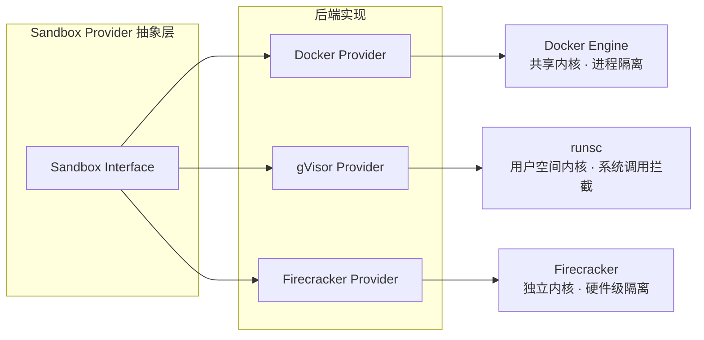

*图 11：Provider 抽象层与后端实现*

### 数据通道设计

Agent 引擎通过 **PrimitiveAdapter** 将 Agent 原语转换为 execd 可执行的通用沙箱操作，再经 **HTTP REST + SSE** 与沙箱内 execd 通讯。三种访问路径与开源集成的三种部署模式一一对应。

Agent 引擎与 execd 之间的数据传输通过 **HTTP REST + SSE** 进行，载荷为沙箱操作请求（如 `POST /command`），而非 Agent 原语结构。execd 在沙箱容器内监听 HTTP 端口，Agent 引擎通过 Ingress Gateway 或 Server 代理访问。

### 三种访问路径

Agent 引擎（通过 SDK）连接沙箱执行守护进程有三种路径，按部署规模递进。

#### 1. Server 代理（内置服务统一转发）

**链路**：Agent → Server（控制面）→ HTTP 内置转发 → 容器内 execd

**路由路径**：`/v1/sandboxes/{sandbox_id}/proxy/{port}/{path}`

**核心原理**：Server 自带内置反向代理，无需额外中间件；Agent 只和 Server 单一端口通信，由 Server 内部寻址沙箱容器 IP，转发流量到 execd。

**优势**：

- 部署极简：仅暴露 Server 一个端口，沙箱容器无需宿主机端口暴露
- 统一鉴权：复用 Server 全局 Token，统一拦截敏感头（Cookie/Authorization）防泄露
- 环境适配：容器网络隔离场景零端口冲突
- 自带沙箱寻址：自动根据 sandbox\_id 路由，无需客户端感知容器地址

**短板**：

- 多一层服务转发，相比端口映射有额外网络开销
- 不适合超高并发、超低延迟本地调试场景
- 只能单节点 Server，无法跨集群多节点分发流量

**适用场景**：本地开发调试、小型单机测试环境、防火墙严格限制不能开放多端口的内网环境。

> **开源集成对应**：此模式直接复用开源集成 Server 内置反向代理（`/v1/sandboxes/{sandbox_id}/proxy/{port}/{path}`），无需额外开发。

#### 2. 端口映射（宿主机直连 Port Forward）

**链路**：Agent → 宿主机映射端口 → 容器网络直连 → execd

**核心原理**：Runtime 做端口 NAT 映射，沙箱 execd 端口直接绑定宿主机端口，Agent 绕过 Server 直连容器。

**优势**：

- 链路最短，无中间代理转发，延迟最低
- 不占用 Server 转发算力，执行并发更高
- 调试直观：可直接用 curl/postman 访问宿主机端口调试 execd 接口

**短板**：

- 单机沙箱数量受宿主机端口范围限制，多沙箱易端口冲突
- 必须开放大量宿主机端口，防火墙 / 安全策略维护成本高
- 无统一鉴权层，鉴权逻辑需要客户端自行携带 execd token
- 不支持集群，跨宿主机沙箱无法直连

**适用场景**：本地单机快速调试、低延迟高频代码执行、临时测试少量沙箱。

> **开源集成对应**：此模式对应开源集成 Docker Runtime 的端口映射部署，execd 端口直接绑定宿主机端口。

#### 3. 网关路由（Ingress Gateway，Header/URI 双路由）

**链路**：Agent → 独立 Ingress 网关 → 按 Header/URI 解析 sandbox\_id → 集群内路由 → execd

**两种路由规则**：

- **Header 模式（默认）**：`开源集成-Ingress-To: sandboxid-port` / Host 泛域名路由
- **URI 模式**：`/sandbox-id/port/请求路径`

**核心原理**：独立网关组件（Ingress）作为集群统一入口，接管全部沙箱执行流量；网关对接集群调度层，跨宿主机寻址沙箱实例，支持负载均衡、限流、统一认证。

**优势（生产级能力）**：

- 集群分布式支持：多宿主机、多节点沙箱统一入口
- 完整生产能力：全局鉴权、SSL 终止、限流熔断、日志审计、WAF
- 单端口对外，无端口泛滥问题，运维安全
- 支持长连接（WebSocket/SSE 流式输出）稳定转发

**适用场景**：生产环境、集群部署、多租户场景。

> **开源集成对应**：此模式直接复用开源集成 Ingress Gateway（Header/URI 双路由），支持集群分布式、多宿主机统一入口。开源集成 Ingress 是独立组件，天然具备全局鉴权、SSL 终止、限流熔断能力。

### 命令执行（SSE 流式输出）

Agent 引擎通过 HTTP POST 发送命令，沙箱执行守护进程通过 SSE 流式返回 stdout/stderr。

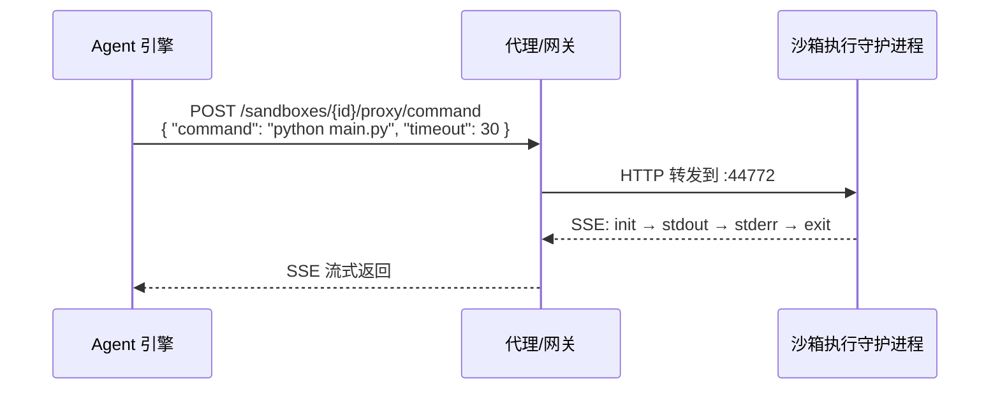

*图 5：命令执行通信时序*

SSE 事件序列：`init`（命令开始）→ `stdout`（标准输出增量）→ `stderr`（标准错误增量）→ `exit`（命令结束，含 exit code 和耗时）。

### 后台命令

长时间运行的命令支持后台执行模式：请求后立即返回命令 ID，后续通过轮询获取状态和增量日志。

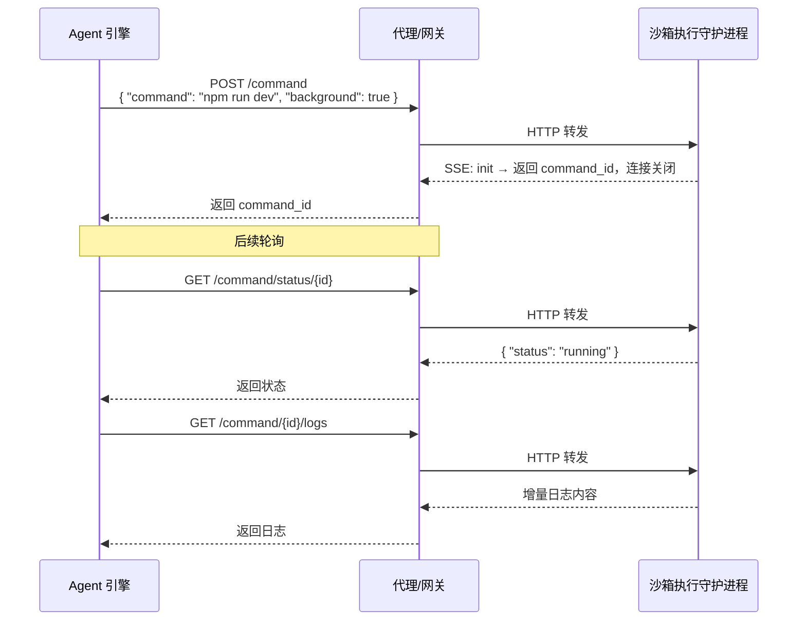

*图 6：后台命令通信时序*

### 文件操作

Agent 引擎通过 REST API 对沙箱内的文件进行读写操作。

```mermaid
sequenceDiagram
    participant Agent as Agent 引擎
    participant Proxy as 代理/网关
    participant Daemon as 沙箱执行守护进程

    rect rgb(20, 30, 60)
        Note over Agent,Daemon: 写入文件
        Agent->>Proxy: POST /files/upload<br/>multipart: file + target_path
        Proxy->>Daemon: HTTP 转发
        Daemon-->>Proxy: 200 OK
        Proxy-->>Agent: 写入成功
    end

    rect rgb(30, 50, 40)
        Note over Agent,Daemon: 读取文件
        Agent->>Proxy: GET /files/download?path=/workspace/output.csv
        Proxy->>Daemon: HTTP 转发
        Daemon-->>Proxy: 文件内容（二进制流）
        Proxy-->>Agent: 同步返回
    end

    rect rgb(40, 30, 20)
        Note over Agent,Daemon: 大文件传输（对象存储中转）
        Agent->>S3: PUT 大文件，生成预签名 URL
        Agent->>Proxy: POST /command<br/>{ "command": "wget -O input.zip $INPUT_URL" }
        Note over Daemon: 沙箱内通过预签名 URL 下载文件
        Proxy-->>Agent: SSE 流式返回
    end
```

*图 7：文件操作通信时序*

大文件（>= 1MB）通过对象存储预签名 URL 中转，避免经过代理/网关传输大文件。

### 代码执行

沙箱执行守护进程支持通过代码解释器执行代码（Python / Node.js / Java / Go），通过 SSE 流式返回执行结果。

```mermaid
sequenceDiagram
    participant Agent as Agent 引擎
    participant Proxy as 代理/网关
    participant Daemon as 沙箱执行守护进程

    Agent->>Proxy: POST /code/context<br/>{ "language": "python" }
    Proxy->>Daemon: 创建代码执行上下文
    Daemon-->>Proxy: context_id
    Proxy-->>Agent: 返回上下文 ID

    Agent->>Proxy: POST /code<br/>{ "context_id": "xxx", "code": "import pandas\ndf = pd.read_csv('data.csv')" }
    Proxy->>Daemon: HTTP 转发
    Daemon-->>Proxy: SSE: init → stdout → exit
    Proxy-->>Agent: SSE 流式返回执行结果
```

*图 8：代码执行通信时序*

### 交互式终端

支持通过 WebSocket 建立持久化 PTY 会话，适用于需要交互式输入的场景（如数据库 CLI、调试器）。

```mermaid
sequenceDiagram
    participant Agent as Agent 引擎
    participant Proxy as 代理/网关
    participant Daemon as 沙箱执行守护进程

    Agent->>Proxy: POST /pty
    Proxy->>Daemon: 创建 PTY 会话
    Daemon-->>Proxy: session_id
    Proxy-->>Agent: 返回会话 ID

    Agent->>Proxy: WebSocket /pty/{session_id}/ws
    Proxy->>Daemon: WebSocket 升级
    Note over Agent,Daemon: 双向数据通道（输入/输出实时传输）

    Agent->>Proxy: WebSocket 帧: 用户输入
    Proxy->>Daemon: 写入 PTY stdin
    Daemon-->>Proxy: WebSocket 帧: PTY stdout
    Proxy-->>Agent: 实时输出
```

*图 9：交互式终端通信时序*

### 资源监控

沙箱执行守护进程持续采集 CPU/内存等资源指标，支持两种获取方式：

| 方式   | 端点                        | 说明                  |
| ---- | ------------------------- | ------------------- |
| 快照查询 | `GET /metrics`            | 返回当前 CPU/内存使用量的即时快照 |
| 实时流  | `GET /metrics/watch`（SSE） | 每 1 秒推送一次指标更新       |

### 沙箱执行守护进程的启动方式

沙箱执行守护进程在容器启动时自动拉起，不需要手动配置。启动流程如下：

1. 容器启动时，通过 init container 或启动脚本将执行守护进程二进制注入到容器内
2. 启动脚本（bootstrap）在后台启动执行守护进程（监听 `:44772`）
3. 启动脚本在前台执行用户的 entrypoint 命令
4. 执行守护进程与用户进程并行运行，共享容器网络命名空间

### 中间件选型

| 中间件                | 协议                                   | 适用场景            | 特点             |
| ------------------ | ------------------------------------ | --------------- | -------------- |
| **S3 / MinIO**     | S3 API                               | 对象存储、大文件、执行结果归档 | 高吞吐、低成本、生命周期管理 |
| **Sonatype Nexus** | Docker Registry / Maven / npm / PyPI | 沙箱镜像仓库、依赖包代理缓存  | 统一制品管理、离线内网部署  |

> **推荐方案**
>
> - **对象存储**：生产环境使用 S3 兼容对象存储（AWS S3 / MinIO / 腾讯云 COS）
> - **制品仓库**：使用 Sonatype Nexus 作为统一制品管理器，同时承担 Docker 镜像仓库（存储沙箱运行镜像）、依赖包代理仓库（缓存 pip/npm/maven，加速沙箱内依赖安装）、构建产物仓库（归档沙箱编译输出）三重职责

### 沙箱操作接口

沙箱操作分为**生命周期管理接口**（沙箱调度器提供，走消息总线 → 开源集成 REST API）和**执行操作接口**（execd 提供，走 HTTP REST + SSE）。

#### 原语 → 沙箱操作映射

Agent 引擎内置 **PrimitiveAdapter**，在编排面完成原语到沙箱操作的转换。沙箱只接收右侧的通用操作，不感知 Agent 原语：

| Agent 原语 | 转换逻辑（Agent 引擎） | 沙箱操作（execd API） |
| --- | --- | --- |
| `exec` | 构造 command + env + working\_dir | `POST /command` |
| `read` | 解析目标路径 | `GET /files/download/{path}` |
| `write` | 构造文件内容与路径 | `POST /files/upload` 或 `/files/replace` |
| `code`（代码块） | 选择或创建 Jupyter context | `POST /code` |
| `llm` | **不进入沙箱**，Agent 直连模型网关 | — |
| `io` | Agent 生成预签名 URL 注入 env，再转 `exec` | 间接经 `POST /command` |
| `pub/sub` | **不进入沙箱**，走消息总线 | — |

### 执行操作接口（execd 提供）

沙箱实例内的 execd 守护进程通过 HTTP REST API 暴露以下**通用操作**能力。Agent 引擎经 PrimitiveAdapter 转换后，通过 Ingress Gateway 或 Server 代理访问：

#### 命令执行

| 方法     | 路径                     | 开源集成 execd 路径              | 协议   | 说明                             |
| ------ | ---------------------- | ------------------------- | ---- | ------------------------------ |
| POST   | `/command`             | `/command`                | SSE  | 执行 shell 命令，流式返回 stdout/stderr |
| DELETE | `/command?id={id}`     | `/command/{id}/interrupt` | REST | 中断正在执行的命令                      |
| GET    | `/command/status/{id}` | `/command/{id}/status`    | REST | 查询后台命令状态                       |
| GET    | `/command/{id}/logs`   | `/command/{id}/logs`      | REST | 获取后台命令增量日志                     |

#### 文件操作

| 方法     | 路径                  | 开源集成 execd 路径             | 协议              | 说明          |
| ------ | ------------------- | ------------------------ | --------------- | ----------- |
| POST   | `/files/upload`     | `/files/upload`          | REST（multipart） | 上传文件到沙箱指定路径 |
| GET    | `/files/download`   | `/files/download/{path}` | REST            | 下载沙箱内文件     |
| DELETE | `/files`            | `/files`                 | REST            | 删除文件        |
| GET    | `/files/info`       | `/files/info`            | REST            | 获取文件元信息     |
| POST   | `/files/replace`    | `/files/replace`         | REST            | 替换文件内容      |
| GET    | `/directories/list` | `/directories/list`      | REST            | 列出目录内容      |
| POST   | `/directories`      | `/directories`           | REST            | 创建目录        |
| DELETE | `/directories`      | `/directories`           | REST            | 删除目录        |

#### 代码执行

| 方法     | 路径                     | 开源集成 execd 路径           | 协议   | 说明                 |
| ------ | ---------------------- | ---------------------- | ---- | ------------------ |
| POST   | `/code`                | `/code`                | SSE  | 在指定上下文中执行代码，流式返回输出 |
| DELETE | `/code?id={sessionId}` | `/code/{id}/interrupt` | REST | 中断代码执行             |
| POST   | `/code/context`        | `/code/context/{id}`   | REST | 创建代码执行上下文（session） |
| GET    | `/code/contexts`       | `/code/contexts`       | REST | 列出活跃的代码执行上下文       |

> **代码执行内部路径**：execd 收到 `/code` 请求后，通过 WebSocket 将代码转发给 Jupyter Gateway → Jupyter Kernel 执行 → SSE 流式返回结果。这是开源集成的核心创新——代码执行天然支持上下文持久化，多轮对话中变量状态保持。

#### 健康检查与指标

| 方法  | 路径               | 开源集成 execd 路径            | 协议   | 说明           |
| --- | ---------------- | ----------------------- | ---- | ------------ |
| GET | `/ping`          | `/ping`                 | REST | 健康检查端点       |
| GET | `/metrics`       | `/system/monitor`       | REST | CPU/内存指标快照   |
| GET | `/metrics/watch` | `/system/monitor/watch` | SSE  | 实时指标流（1s 间隔） |

### 沙箱操作通信契约

以下为 execd 侧的操作请求格式（由 Agent 引擎从 `exec` 原语转换而来，以命令执行为例）：

```json
{
  "command": "python main.py --input data.csv",
  "timeout": 30000,
  "working_dir": "/workspace/project",
  "env": {
    "INPUT_URL": "https://s3.example.com/sandbox-data/inputs/data.csv?X-Amz-..."
  }
}
```

**核心字段**：

| 字段            | 方向              | 说明                       |
| ------------- | --------------- | ------------------------ |
| `command`     | Agent → execd   | 要执行的 shell 命令             |
| `timeout`     | Agent → execd   | 执行超时（ms）                 |
| `working_dir` | Agent → execd   | 工作目录                     |
| `env`         | Agent → execd   | 环境变量（含 Agent 注入的预签名 URL 等） |

### 操作结果通信契约

execd 通过 SSE 事件流返回操作结果；Agent 引擎将其封装为 Observation 供 ReAct 循环消费：

| SSE 事件类型 | 说明     | 数据                                         |
| -------- | ------ | ------------------------------------------ |
| `init`   | 命令开始执行 | 命令 ID                                      |
| `stdout` | 标准输出增量 | 文本片段                                       |
| `stderr` | 标准错误增量 | 文本片段                                       |
| `exit`   | 命令执行完毕 | exit code + duration\_ms + resource\_usage |

***

## 消息总线设计

消息总线只用于**控制面通讯**：Agent 引擎与沙箱调度器之间的生命周期管理消息。沙箱操作和执行结果不经过消息总线。

### 消息总线：Agent 控制面 ↔ 沙箱控制面

传输**管理指令和事件通知**，不承载业务数据。

```
sandbox.{event_type}.{sandbox_id}

# 管理指令（Agent 引擎 -> 沙箱调度器）
sandbox.request.{session_id}          # 请求分配沙箱
sandbox.release.{sandbox_id}          # 主动释放沙箱

# 事件通知（沙箱调度器 -> Agent 引擎）
sandbox.ready.{sandbox_id}            # 沙箱就绪（Fast Path / Slow Path）
sandbox.completed.{sandbox_id}        # 沙箱任务完成
sandbox.idle.{sandbox_id}             # 沙箱进入空闲（可复用）
sandbox.destroyed.{sandbox_id}        # 沙箱已销毁
sandbox.error.{sandbox_id}            # 沙箱异常
sandbox.recovering.{sandbox_id}       # 沙箱恢复中

```

**原则**：消息总线只传输控制元数据，不传输代码内容、文件数据或执行结果。

### 一个 Topic 两个 Consumer Group

沙箱生命周期事件（`sandbox.ready` / `completed` / `released`）同时被两个消费组消费——Agent 引擎（`agent-cg`，用于恢复挂起的委派）和状态同步器（`sync-cg`，用于物化沙箱状态到结构化数据库）。两个消费组独立消费、互不阻塞，各自维护自己的消费位点。

### 异步模型的三层加固

- **Layer 1 · 缓存数据库状态机 + 显式超时**：Agent 引擎 publish `sandbox.request` 后将 `session.status` 设为 `WAITING_SANDBOX`，缓存数据库 TTL = 10s。超时未收到 `sandbox.ready` 则状态流转为 `SANDBOX_TIMEOUT`，触发降级。
- **Layer 2 · 幂等 + 顺序保证**：Agent 引擎消费 `sandbox.ready` 时，先查缓存数据库确认 `session.status == WAITING_SANDBOX`；若 `sandbox_id` 已写入则幂等丢弃；若 `request_timestamp < session.last_request_ts` 则判定为乱序旧消息，直接丢弃。
- **Layer 3 · 混合短回路（可选高级优化）**：若 Fast Path 占比极高（>90%）且对首字延迟极度敏感，可在 publish `sandbox.request` 后监听本地 Channel 并设置 100ms 短超时。超时前收到 `sandbox.ready` 则走本地内存 Fast Path，否则退化为标准异步。

### 消息总线选型

| 方案                 | 延迟      | 吞吐 | 持久化 | 适用场景               |
| ------------------ | ------- | -- | --- | ------------------ |
| **NATS JetStream** | 极低（微秒级） | 高  | 是   | 推荐方案，支持持久化和审计      |
| **Redis Streams**  | 2\~5ms  | 中高 | 是   | 轻量场景，已有 Redis 基础设施 |

> **推荐方案**：NATS JetStream（需要持久化和审计能力）。

***

## 全链路业务流转

本章从端到端视角，串联预热初始化、会话分配、运行备份、故障自愈、会话结束五个阶段，展示沙箱系统完整生命周期中的各组件协作关系。

### 整体逻辑分层架构

```mermaid
graph TB
    subgraph Access["业务接入网关"]
        API["统一对外 API 接口<br/>沙箱申请 · 任务执行 · 状态查询"]
    end

    subgraph Fault["故障自愈控制层"]
        FaultDetect["全维度故障探测<br/>进程崩溃 · OOM · 超时 · 宿主机离线"]
        AutoRecover["自动重建恢复<br/>流水线：隔离 → 查询 → 恢复 → 挂载 → 续跑"]
    end

    subgraph Snapshot["分布式快照管理层"]
        BaselineSnap["基线快照管理<br/>版本管理 · 远端存储 · 本地缓存"]
        SessionSnap["会话快照管理<br/>全量/增量/手动 · 异步上传 · 过期清理"]
        SnapDist["快照跨节点分发<br/>完整性校验 · 拉取加速"]
    end

    subgraph Storage["远端存储编排层"]
        VolumeCreate["存储卷创建<br/>会话专属 · CSI 对接"]
        VolumeMount["存储卷挂载<br/>跨节点直接挂载 · 本地缓存"]
        VolumeLifecycle["生命周期管理<br/>自动创建 · 归档 · 清理"]
    end

    subgraph Pool["预热池调度层"]
        WaterLevel["水位管控<br/>BufferMin/BufferMax · 自动扩缩容"]
        SandboxAssign["沙箱分配<br/>Predicate 过滤 · Scorer 排序"]
        SandboxRecycle["沙箱回收<br/>会话结束后直接销毁"]
    end

    subgraph Runtime["底层沙箱运行层"]
        CreateDestroy["创建 · 销毁"]
        Snapshot["快照 Dump · Restore"]
        Health["健康探针"]
    end

    subgraph Meta["统一元数据中心"]
        MetaStore["会话 ID ↔ 快照指针 ↔ 远端存储卷 ID<br/>三者关联映射"]
    end

    API --> Pool
    Pool --> Runtime
    Runtime --> Snapshot
    Snapshot --> Storage
    FaultDetect --> AutoRecover
    AutoRecover --> Snapshot
    AutoRecover --> Storage
    AutoRecover --> Meta
    Meta --> Snapshot
    Meta --> Storage
```

### 阶段一：预热初始化

```
时间线：系统启动 / 基线版本更新 / 池水位低于阈值
```

1. **构建基线快照**：从基础镜像启动临时容器 → 安装公共依赖 → 注入执行守护进程 → 生成快照 → 上传远端快照仓库
2. **预热池批量补池**：调度器拉取基线快照 → 批量创建沙箱实例 → 健康检查 → 放入 Ready 空闲池
3. **水位稳定**：空闲池达到 BufferMin 以上，等待业务请求

### 阶段二：会话分配

```
时间线：业务下发 sandbox.request
```

1. **Agent 引擎** publish `sandbox.request`（携带 sandbox\_type、session\_id、tenant\_id）
2. **沙箱调度器** 消费请求 → 第一道门禁校验 → 路由匹配池 → 池分配器 Predicate 过滤 + Scorer 排序
3. **池分配器** 从预热池取出一个空闲基线沙箱 → 标记 Assigned
4. **存储编排层** 自动创建会话专属远端存储卷 → 挂载到沙箱 `/workspace/{session_id}/`
5. **元数据中心** 记录关联关系：session\_id → 基线快照版本 → 远端存储卷 ID
6. **调度器** publish `sandbox.ready` → Agent 引擎开始原语转换并下发沙箱操作

### 阶段三：业务运行与快照备份

```
时间线：沙箱执行中
```

1. **环境安装**：用户执行 `pip install`、修改配置 → 根文件系统生成差异层（Docker：overlay；Firecracker：VM 磁盘差分）
2. **业务计算**：中间文件、输出、日志写入 `/workspace/{session_id}/`（远端存储卷，实时持久化）
3. **检查点备份**（按策略触发，底层分化）：
   - **Firecracker**：`pause()` 生成整机差分快照（内存脏页 + 文件差分）→ 异步上传对象存储
   - **Docker**：文件打包 API 上传 OSS（全量 / 增量）；`pause()` 仅冻结 CPU，不产生持久检查点
4. **元数据记录**：上传完成后更新快照版本历史，携带 `isolation_backend` 与 `snapshot_type`

### 阶段四：沙箱故障自愈

```
时间线：故障发生 → 分级识别 → 隔离 → 恢复
```

1. **故障分级**：
   - **L1**（execd 崩溃）：容器内 supervisor 退避重启，不进入调度器流水线
   - **L2~L4**：调度器接管，标记 RECOVERING，通知 Agent 暂停下发沙箱操作
2. **元数据查询**：通过 session\_id 获取快照指针 + 存储卷 ID + `isolation_backend`
3. **差异化恢复**：
   - **Firecracker**：拉取最近 `pause()` 快照 → `resume()` 还原文件 + 内存 → 挂载存储卷
   - **Docker**：拉取 OSS 文件备份 → 重建容器 → 挂载已有远端存储卷（无内存恢复）
4. **通知恢复**：publish `sandbox.ready`，Agent 恢复原语转换与沙箱操作下发

### 阶段五：会话正常结束

```
时间线：会话完成，Agent 引擎 publish sandbox.release
```

1. **会话快照处理**：根据策略决定是否保留会话快照（归档用于回溯 / 清理释放空间）
2. **销毁沙箱**：调度器销毁沙箱容器，不归还至预热池（防止业务数据污染）
3. **远端存储卷处理**：根据策略决定归档或清理（可配置会话结束后保留 N 天）
4. **元数据更新**：标记会话结束，解除关联关系
5. **水位检查**：空闲数 < BufferMin → 触发 Warm Path 补池

### 全链路时序总览

```mermaid
sequenceDiagram
    participant Agent as Agent 引擎
    participant Scheduler as 沙箱调度器
    participant Pool as 预热池
    participant Sandbox as 沙箱实例
    participant SnapRepo as 远端快照仓库
    participant Storage as 远端存储卷
    participant Meta as 元数据中心

    Note over Pool,SnapRepo: 【阶段一：预热初始化】
    Pool->>SnapRepo: 拉取基线快照
    SnapRepo-->>Pool: 返回快照
    Pool->>Pool: 批量创建沙箱 → Ready 池

    Note over Agent,Sandbox: 【阶段二：会话分配】
    Agent->>Scheduler: sandbox.request
    Scheduler->>Pool: 分配空闲沙箱
    Pool-->>Scheduler: 沙箱就绪
    Scheduler->>Storage: 创建会话专属存储卷
    Storage-->>Scheduler: 挂载完成
    Scheduler->>Meta: 记录关联关系
    Scheduler->>Agent: sandbox.ready

    Note over Agent,Sandbox: 【阶段三：业务运行与快照备份】
    Agent->>Sandbox: 沙箱操作（HTTP REST + SSE）
    Sandbox->>Storage: 过程产物写入远端存储卷
    alt Firecracker 后端
        Sandbox->>SnapRepo: pause() 差分快照 → 异步上传
    else Docker 后端
        Sandbox->>SnapRepo: 文件打包 OSS 备份 → 异步上传
    end
    Sandbox->>Meta: 更新快照版本 + isolation_backend

    Note over Agent,Sandbox: 【阶段四：故障自愈】
    Sandbox--xSandbox: L1~L4 故障发生
    alt L1 execd 崩溃
        Sandbox->>Sandbox: supervisor 就地重启
    else L2~L4
        Scheduler->>Scheduler: 标记 RECOVERING
        Scheduler->>Agent: sandbox.error（暂停沙箱操作）
        Scheduler->>Meta: 查询快照 + 存储卷 + 后端类型
        Meta-->>Scheduler: 返回恢复资源定位
        alt firecracker
            Scheduler->>SnapRepo: 拉取 pause() 快照
            Scheduler->>Sandbox: resume() 还原文件+内存
        else docker
            Scheduler->>SnapRepo: 拉取 OSS 文件备份
            Scheduler->>Sandbox: 重建容器 + 回传文件
        end
        Scheduler->>Storage: 挂载远端存储卷
        Scheduler->>Agent: sandbox.ready
    end

    Note over Agent,Sandbox: 【阶段五：会话正常结束】
    Agent->>Scheduler: sandbox.release
    Scheduler->>Sandbox: 销毁沙箱
    Scheduler->>Storage: 归档/清理远端存储卷
    Scheduler->>Meta: 更新会话状态
    Scheduler->>Pool: 水位检查 → 补池
```

***

## 开源实现参考

### 可复用的开源组件

| 项目                      | 定位            | 可复用组件                                   | 协议         |
| ----------------------- | ------------- | --------------------------------------- | ---------- |
| **E2B** (`e2b-dev/E2B`) | AI agent沙箱平台  | SDK、Envd Daemon、API Server、Orchestrator | Apache 2.0 |
| **OpenSandbox**         | AI  agent沙箱平台 | `execd` Sidecar、动态注入机制                  | 部分开源       |
| **CubeSandbox**         | AI Agent 沙箱平台 | Rust 运行时、eBPF 策略                        | 开源         |
| **Firecracker**         | MicroVM（沙箱实现） | VMM、快照恢复                                | Apache 2.0 |
| **containerd**          | 容器运行时（沙箱实现）   | Go SDK、CRI 接口                           | Apache 2.0 |
| **gVisor**              | 容器沙箱（沙箱实现）    | `runsc` 运行时                             | Apache 2.0 |

### 推荐组合（按场景）

**MVP 快速验证**：

```
隔离后端：containerd + runc
通讯协议：HTTP REST + SSE
Sidecar：参考 OpenSandbox execd 自行实现（约 500 行 Go）
客户端：参考 E2B SDK 设计，自行封装
```

**生产级高隔离**：

```
隔离后端：Firecracker
通讯层：复用 E2B Envd Daemon（Connect RPC）
编排层：参考 E2B Orchestrator，按需裁剪
基础设施：PostgreSQL + Redis + NATS
```

***

## 沙箱管理平台对比

| 平台                   | 底层技术                          | 隔离级别                | 冷启动                                       | 预热启动                        | 适用规模                     | 私有化部署                                                   | 硬件要求                                                               |
| -------------------- | ----------------------------- | ------------------- | ----------------------------------------- | --------------------------- | ------------------------ | ------------------------------------------------------- | ------------------------------------------------------------------ |
| **K8s + containerd** | containerd + runc/gVisor/Kata | 容器/VM 级             | 秒级（镜像已缓存时 500ms-2s）                       | 取决于池化策略                     | 万级+（随节点线性扩展）             | **完全支持**，CNCF 开源项目，可完全离线部署                              | **runc/gVisor**：无特殊要求；**Kata/Firecracker**：需 VT-x/AMD-V + /dev/kvm |
| **E2B**              | Firecracker MicroVM           | VM 级                | \~200ms（实测基准 515ms 含网络）                   | \~100ms（快照恢复）               | 标准版 100 并发，企业版 20,000 并发 | **支持自托管**，Apache 2.0，Terraform + Nomad；编排核心开源，多租户隔离层需自研 | **强制**：CPU VT-x/AMD-V，/dev/kvm，裸金属或嵌套虚拟化                           |
| **Daytona**          | Docker 容器                     | 容器级                 | \~750ms（实测基准，含网络）                         | <90ms（容器预热池分配）              | 千级（单节点）                  | **支持自托管**，AGPL-3.0，支持 air-gapped 物理隔离部署                 | **无特殊要求**，标准 Linux + Docker 即可                                     |
| **OpenSandbox**      | Docker / containerd + K8s     | 容器级（支持 gVisor/Kata） | <800ms（Docker 模式）；\~150ms（Firecracker 模式） | <200ms（K8s BatchSandbox 池化） | 单节点 100+ 并发，K8s 集群可扩展至万级 | **支持**，阿里开源，Docker 本地或 K8s 集群私有化部署                      | **容器模式**：无特殊要求；**microVM 模式**：需 VT-x/AMD-V + /dev/kvm              |
| **CubeSandbox**      | Rust + KVM + eBPF             | VM 级                | <60ms（平均 67ms，P95=90ms @50并发）             | 更低（热池直接分配 + CoW 内存共享）       | 单机 2,000+，集群瞬时调度 100K+   | **支持**，腾讯开源（Apache 2.0），提供本地构建部署指南                      | **强制**：x86\_64 + KVM，物理机或嵌套虚拟化，最低 4C8GB                            |

> **说明**
>
> - **启动速度**：冷启动指从零创建全新沙箱实例的时间，预热启动指从预创建的池/快照分配已有实例的时间。E2B、CubeSandbox 的冷启动数据基于各自官方基准测试，Daytona 和 E2B 的冷启动含网络往返延迟（sandbox-comparison.pages.dev 实测）。OpenSandbox 冷启动数据来自官方文档。
> - **规模**：E2B、OpenSandbox、CubeSandbox 均支持集群化部署，规模随节点数线性扩展。
> - **私有化**：E2B 和 CubeSandbox 采用 Apache 2.0，Daytona 为 AGPL-3.0。
> - **硬件要求**：Firecracker 和 CubeSandbox 均基于 KVM，强制要求 CPU 硬件虚拟化支持（VT-x/AMD-V）和 /dev/kvm 设备。Docker/containerd 容器方案无此限制。
> - 上述数据来源于各平台官方文档及公开技术文章，实际表现取决于硬件配置和沙箱资源规格。

### 四者分层定位深度对比（CubeSandbox / OpenSandbox / Daytona / E2B）

四者上层均属于 AI Agent 代码沙箱平台（对外 API/SDK 同一应用层），但底层运行时、技术底座、设计定位、集群编排层完全不在同一技术层级，不能简单划为同类底层产品。

| 底座绑定   | CubeSandbox                | OpenSandbox                               | Daytona            | E2B              |
| ------ | -------------------------- | ----------------------------------------- | ------------------ | ---------------- |
| 底层微 VM | 固定绑定 Cloud Hypervisor（CLH） | Cloud Hypervisor / Firecracker 全都支持，可按需切换 | 增强模式绑定 Firecracker | 固定绑定 Firecracker |

#### 分层定位清晰区分（从上到下三层）

**第 1 层：对外应用层（四者同一层，用户视角一致）**

全部提供统一能力：

- HTTP/OpenAPI + 多语言 SDK（Python/TS/Java）
- 沙箱生命周期：创建 / 执行文件 / 运行命令 / 销毁
- 面向 AI Agent 代码解释器、远程开发、浏览器自动化场景
- 支持私有化部署、离线内网

站在业务集成视角：四者是竞品、同一应用层级。

**第 2 层：集群编排 & 调度层（四者完全不同，层级差异最大）**

| 维度    | OpenSandbox（阿里）                                                 | CubeSandbox（腾讯）                                | Daytona                                                     | E2B                                     |
| ----- | --------------------------------------------------------------- | ---------------------------------------------- | ----------------------------------------------------------- | --------------------------------------- |
| 编排架构  | 原生基于 K8s Operator 设计，标准 CRD 管理沙箱池                               | 基于 containerd Shim v2 深度适配 K8s                 | 无原生 K8s 深度集成，自研单机 / 轻集群调度                                   | Terraform + Nomad（HashiCorp 栈），非 K8s 原生 |
| 多运行时  | 抽象统一 Runtime 接口，插拔式多隔离后端：原生 Docker、gVisor、Kata、Firecracker 全部兼容 | 底层锁定 Cloud Hypervisor 微 VM，配套自研 eBPF 网络 CubeVS | 默认 Docker 容器隔离，可选 Kata/Firecracker 增强隔离                     | 仅 Firecracker，无容器选项                     |
| 企业级能力 | 池化预热、自动扩缩容、多租户权限、完整审计，专为云原生 K8s 集群私有化打造                         | 把 microVM 包装成标准 Pod，完全融入 K8s 调度、HPA、监控体系       | 集群扩缩容能力弱，不适合超大并发一次性代码执行场景                                   | 托管版完整；自托管版多租户隔离层、计费系统需自研                |
| 设计目标  | 全场景兼容，企业分级安全私有化                                                 | 高安全多租户一次性代码沙箱、云原生安全 Pod                        | 长生命周期持久化开发工作站（几小时～几天会话），而非短时效一次性代码执行沙箱                      | 高并发短时效代码执行沙箱，AI Agent 云运行时              |
| 特殊能力  | —                                                               | —                                              | 内置 VNC / 桌面自动化 Computer Use，支持完整 GUI 环境、Docker Compose、Dind | 支持快照暂停 / 恢复，\~150ms 冷启动                 |

**第 3 层：底层隔离运行时（硬件 / 虚拟化底座，完全不互通）**

| 维度     | CubeSandbox                                               | OpenSandbox                                         | Daytona                                        | E2B                     |
| ------ | --------------------------------------------------------- | --------------------------------------------------- | ---------------------------------------------- | ----------------------- |
| 固定底层   | KVM + Cloud Hypervisor（RustVMM），不支持 Firecracker、普通 Docker | 多档隔离分层可选（按需切换底座）                                    | 默认标准 Docker 容器（共享宿主机内核，无需 KVM）                 | Firecracker MicroVM（固定） |
| 基础档    | —                                                         | 原生 Docker Namespace 容器（无 KVM 要求）                    | Docker 容器（默认路线）                                | —                       |
| 中档     | —                                                         | gVisor 用户态内核                                        | —                                              | —                       |
| 高档     | —                                                         | Kata/Cloud Hypervisor/Firecracker 微 VM（需 KVM 硬件虚拟化） | 可选 Kata Containers / Firecracker（需额外开启 KVM 硬件） | Firecracker 微 VM（唯一选项）  |
| 强制硬件要求 | VT-x/AMD-V、/dev/kvm，纯 microVM 硬件级隔离                       | 容器模式无要求，microVM 模式需 KVM                             | 默认部署无需 KVM，增强隔离才要                              | 必须 VT-x/AMD-V、/dev/kvm  |

#### 核心维度对比表

| 对比项      | CubeSandbox                    | OpenSandbox                        | Daytona                            | E2B                     |
| -------- | ------------------------------ | ---------------------------------- | ---------------------------------- | ----------------------- |
| 底层默认虚拟化  | Cloud Hypervisor（固定 microVM）   | 可插拔：Docker/gVisor/Kata/Firecracker | Docker 容器（默认），可选 Firecracker/Kata  | Firecracker（固定 microVM） |
| K8s 原生适配 | 深度集成 containerd Shim v2，标准 Pod | 原生 K8s Operator，CRD 管控             | 弱适配，自研调度，无标准 CRD                   | 无，基于 Nomad 编排           |
| 硬件强制要求   | 必须 VT-x/AMD-V、/dev/kvm         | 分档位：容器模式无需 KVM，microVM 模式必须        | 默认部署无需 KVM，增强隔离才要                  | 必须 VT-x/AMD-V、/dev/kvm  |
| 核心场景     | 高安全多租户一次性代码沙箱、云原生安全 Pod        | 全场景兼容，企业分级安全私有化                    | 长会话远程开发、Agent 桌面自动化 (Computer Use) | 高并发短时效 AI Agent 代码执行    |
| 持久化能力    | 短期会话快照，侧重销毁隔离                  | 磁盘持久化 + 池化预热                       | 强持久化，支持跨天归档恢复、完整开发环境               | 支持快照暂停 / 恢复，侧重快速创建销毁    |
| GPU 支持   | 不支持（CLH 裁剪外设）                  | 容器模式可透传 GPU                        | 原生支持 GPU，适合 ML 开发 Agent            | 不支持（Firecracker 裁剪外设）   |
| 网络方案     | 自研 eBPF CubeVS 虚拟交换机           | K8s 标准 CNI 兼容                      | 标准 Docker 网桥 / 端口转发                | Firecracker virtio-net  |

#### 关键澄清：是不是同一层面产品？

**对外业务 API 层面：算同层竞品**

都是给 AI Agent 提供隔离代码执行沙箱，集成方式、SDK 使用逻辑相似，选型时互相替代。

**底层虚拟化 & 集群架构层面：不属于同一层**

- **CubeSandbox** = K8s + 专属 Cloud Hypervisor 微 VM 运行时（单一强隔离底座）
- **OpenSandbox** = K8s 统一沙箱管控中台（兼容全部隔离底座，中台层产品）
- **Daytona** = 独立开发工作站平台（容器优先，微 VM 为可选增强，非 K8s 原生路线）
- **E2B** = 独立微 VM 运行时平台（Firecracker 固定底座，Nomad 编排，非 K8s 路线）

#### 私有化选型快速区分

| 场景                                          | 推荐方案            |
| ------------------------------------------- | --------------- |
| 已有成熟 K8s 集群、需要统一管控多安全等级沙箱、兼顾容器与 microVM     | **OpenSandbox** |
| 纯高安全场景、只需要硬件级微 VM 隔离、深度融入 K8s 安全容器体系        | **CubeSandbox** |
| 以远程开发、长生命周期 Agent、GUI 桌面自动化、GPU 开发为主，安全要求中等 | **Daytona**     |
| 需要高并发短时效沙箱、\~150ms 冷启动、VM 级隔离，但不依赖 K8s 生态   | **E2B**         |

#### 架构平台关键补充：硬件架构与部署差异

> 以下补充针对 Firecracker / Cloud Hypervisor 类 microVM 方案在 x86\_64 与 aarch64（信创）环境下的关键差异。

**（1）硬件虚拟化能力**

| 架构               | 虚拟化扩展                              | /dev/kvm 支持 | microVM 可行性                       |
| ---------------- | ---------------------------------- | ----------- | --------------------------------- |
| x86\_64          | Intel VT-x / AMD-V                 | ✅ 完整支持      | Firecracker、Cloud Hypervisor 均可运行 |
| aarch64（鲲鹏 / 飞腾） | ARM Virtualization Extensions（EL2） | ✅ 等效支持      | 硬件隔离能力与 x86 完全一致                  |

aarch64 CPU 自带 ARM Virtualization Extensions（EL2），等效 x86 的 VT-x，开启后 /dev/kvm 正常生成，同样支持 microVM（Firecracker / Cloud Hypervisor）。

**（2）部署差异**

| 维度     | x86\_64                                      | aarch64（信创）                              |
| ------ | -------------------------------------------- | ---------------------------------------- |
| 预编译包   | 官方提供 Firecracker、CubeSandbox、E2B 预编译二进制，开箱即用 | **无官方预编译包**，必须自行拉源码交叉编译 VMM、内核、rootfs 镜像 |
| 额外适配   | 无需额外改造                                       | 内核配置、virtio 设备适配、Jailer 权限脚本需要额外适配改造     |
| 硬件隔离能力 | 完整                                           | 与 x86 完全一致，只是编译资产不通用                     |

**（3）镜像不互通**

x86\_64 的沙箱 rootfs、内核镜像**不能直接**跑在 aarch64 机器上，需要单独构建 ARM64 版本运行环境。

> **选型启示**：若你的私有化环境以 aarch64 信创服务器为主，选择 microVM 方案（CubeSandbox / E2B / Firecracker）时需额外评估源码编译、镜像构建、持续维护的人力和时间成本；若追求快速落地且安全要求可接受，OpenSandbox 的容器模式（Docker/gVisor）在 aarch64 上可直接运行，无需跨架构编译。

### 四者故障恢复、状态外化与启动预热机制对比

故障恢复、状态外化、启动预热/池化是沙箱平台的三个核心运维能力。以下从技术实现机制角度，对四者逐一分析。

#### 故障恢复

| 平台              | 核心机制                           | 实现细节                                                                                                                                                         | 局限                                         |
| --------------- | ------------------------------ | ------------------------------------------------------------------------------------------------------------------------------------------------------------ | ------------------------------------------ |
| **E2B**         | Firecracker 快照 + Nomad 任务重启    | `CreateSnapshot`/`LoadSnapshot` API 将 microVM 状态（vCPU 寄存器、内存、设备状态）序列化为 `memfile` + `snapshot_state` 两个文件；内存恢复使用 Linux UFFD 按需加载                              | Nomad 重启任务后是新空沙箱，不会自动从快照恢复；自动故障恢复需上层应用自行实现 |
| **CubeSandbox** | K8s Pod 探针 + 事件级快照回滚           | Kubelet Liveness/Readiness 探针检测健康，失败则重启或重调度；通过 KVM ioctl（`KVM_GET_SREGS`/`KVM_GET_REGS`/`KVM_GET_MP_STATE`）保存 vCPU 状态，内存通过 dirty page tracking 捕获；异常时从最近快照回滚 | 快照文件体积大，存储和传输成本高                           |
| **OpenSandbox** | K8s Operator + 底座差异化恢复         | Sandbox CRD 由 Operator 统一监听，`spec.failurePolicy` 定义重建/迁移/恢复策略；Docker 模式用标准 containerd 重启，gVisor 用 runsc checkpoint/restore，microVM 用 Firecracker 快照          | 不同 Runtime 恢复策略不同，需统一抽象层保证一致性              |
| **Daytona**     | Docker restart policy + 手动归档恢复 | 依赖 Docker Daemon 的 `--restart` 策略自动重启容器；节点故障时无自动迁移，需手动将 Workspace 打包为 tar 归档后在新节点恢复                                                                          | 无 VM 快照机制，进程状态不可保存；增强隔离模式下恢复能力进一步弱化        |

#### 状态外化

状态外化分三层：L1 运行状态（内存、进程）、L2 环境变更（运行时安装的包、配置修改）、L3 过程产物（执行产生的文件、stdout、日志、数据）。

**L1 运行状态**

| 平台          | 机制                                                                              | 存储介质              |
| ----------- | ------------------------------------------------------------------------------- | ----------------- |
| E2B         | Firecracker `CreateSnapshot` API，序列化完整 VM 状态                                    | 本地磁盘或对象存储（GCS/S3） |
| CubeSandbox | KVM 内存镜像 + vCPU 寄存器 + 设备状态                                                      | 节点本地 NVMe 或分布式存储  |
| OpenSandbox | Operator 统一抽象，各 Runtime 各自实现（Docker checkpoint / gVisor sentry 导出 / microVM 快照） | 按底座差异化存储          |
| Daytona     | 无原生机制                                                                           | —                 |

**L2 环境变更**

| 平台          | 机制                                                                                       | 特点                                  |
| ----------- | ---------------------------------------------------------------------------------------- | ----------------------------------- |
| E2B         | **Template 重建**：在沙箱内执行变更后，调用 `e2b build` 将 rootfs 保存为新 Template，后续沙箱从该 Template 克隆       | 离线固化，非实时外化；运行时 `pip install` 不会自动保存 |
| CubeSandbox | **CoW diff 层**：基线 rootfs 只读，各实例写入生成独立 diff 层；可选择性合并回基线成为新模板                              | 同模板沙箱共享基线，diff 层相互隔离；销毁时可丢弃或保留      |
| OpenSandbox | **底座差异化**：Docker 模式用 `docker commit` 保存为新镜像层；gVisor 模式导出 sentry checkpoint；microVM 模式用快照 | 中台层统一封装，上层无感知；最灵活                   |
| Daytona     | **实时持久化**：Workspace 使用 Docker volume（bind mount / named volume），所有变更实时写入宿主机卷             | 最强，无需任何显式操作；容器重启后变更仍在               |

**L3 过程产物**

| 平台          | 机制                                                                                   | 通道                            |
| ----------- | ------------------------------------------------------------------------------------ | ----------------------------- |
| E2B         | 沙箱内 `envd` daemon 通过 vsock 与外部通信；SDK `files.read()` 读取文件后返回；大文件生成预签名 URL 直传对象存储      | vsock（小文件）/ 预签名 URL（大文件）      |
| CubeSandbox | virtio-fs 或 sidecar 容器将沙箱内文件挂载到宿主机目录，再透出到外部存储；需显式配置挂载点                               | virtio-fs / sidecar / 对象存储    |
| OpenSandbox | 文件下载 API（`GET /files/download`，支持 range 请求）；对象存储通过 ossfs 直接挂载到工作目录；K8s 模式使用 PVC 持久化卷 | HTTP API / ossfs 挂载 / K8s PVC |
| Daytona     | 文件直接落在宿主机卷上，无需提取通道；用户可通过宿主机文件系统直接访问，或通过 CLI/API 下载                                   | 宿主机卷直接访问                      |

#### 启动预热与池化

| 平台              | 预热/池化机制                                                                                                                                                                         | 启动速度来源                                       | 池化规模                  |
| --------------- | ------------------------------------------------------------------------------------------------------------------------------------------------------------------------------- | -------------------------------------------- | --------------------- |
| **E2B**         | Template 预热：从预构建的 rootfs 镜像克隆启动；托管版有内部热池（未开源），自托管版依赖 Nomad job placement                                                                                                        | Template rootfs 拉取 + 内核启动；快照恢复跳过内核初始化，比冷启动更快 | 托管版企业级 20K 并发；自托管版需自研 |
| **CubeSandbox** | **资源池化预置 + CoW 快照克隆**：控制面预先创建一批已加载内核的 microVM（状态 "ready"），请求到达时直接分配并注入用户 rootfs diff；内存页面共享，写入时才触发复制                                                                            | 热池分配 + CoW 内存共享；跳过内核启动流程                     | 单机 2K+，集群 100K+ 瞬时调度  |
| **OpenSandbox** | **K8s Deployment + HPA**：热池体现为 Deployment 的 `replicas`，每个 replica 是预创建的沙箱 Pod（状态 "idle"）；请求到达时选取 Pod 标记为 "active" 并注入任务参数；RuntimeClass 支持差异化池化（Docker 池 / gVisor 池 / microVM 池） | 池内 Pod 直接激活，无需从头创建                           | K8s 集群万级+             |
| **Daytona**     | **几乎无池化**：设计目标为长生命周期开发环境，Workspace 创建后持续运行数小时到数天；按需创建为主，无热池预创建机制                                                                                                                | 容器进程启动；可选增强隔离模式下启动速度降到秒级                     | 千级（单节点）               |

#### 四平台机制总结

| 维度     | E2B                         | CubeSandbox                   | OpenSandbox                                    | Daytona                        |
| ------ | --------------------------- | ----------------------------- | ---------------------------------------------- | ------------------------------ |
| 故障恢复核心 | Firecracker 快照 + Nomad 任务重启 | K8s Pod 探针 + 事件级快照回滚          | K8s Operator + 底座差异化恢复                         | Docker restart policy + 手动归档恢复 |
| L1 外化  | Firecracker Snapshot API    | KVM 内存镜像 + vCPU 寄存器           | Operator 统一抽象                                  | 无                              |
| L2 外化  | Template 重建（离线 `e2b build`） | CoW diff 层，可合并为新模板            | Docker commit / gVisor checkpoint / microVM 快照 | 实时写入 Docker volume             |
| L3 外化  | vsock + 预签名 URL（SDK 显式提取）   | virtio-fs / sidecar 挂载 + 对象存储 | 文件下载 API / ossfs 挂载 / K8s PVC                  | 宿主机卷直接访问                       |
| 预热/池化  | Template 克隆 + 可选快照恢复        | 预置 microVM 热池 + CoW 快照克隆      | K8s Deployment replicas + RuntimeClass 差异化池    | 无池化，按需创建                       |
| 启动速度来源 | Template rootfs 拉取 + 内核启动   | 热池分配 + CoW 内存共享               | 池内 Pod 直接激活                                    | 容器进程启动                         |

***

## 渐进式部署方案

### 核心思路：接口先行、OpenSandbox 集成、编排渐进

第一阶段部署 OpenSandbox Server（Docker 模式）+ 调度器代理层，第二阶段切换 OpenSandbox K8s Runtime，第三阶段生产强化。

### 统一 Provider 接口

```go
type SandboxProvider interface {
    Create(ctx context.Context, req CreateRequest) (*Sandbox, error)
    Destroy(ctx context.Context, id string) error
    Exec(ctx context.Context, id string, cmd *Command) (ExecResult, error)
    GetStatus(ctx context.Context, id string) (*Status, error)
    Pause(ctx context.Context, id string) error
    Resume(ctx context.Context, id string) error
}

// 第一阶段：OpenSandbox Docker Runtime
provider := opensandbox.NewProvider(cfg, opensandbox.DockerRuntime)

// 第二阶段：OpenSandbox K8s Runtime（接口完全兼容）
provider := opensandbox.NewProvider(cfg, opensandbox.KubernetesRuntime)
```

### 第一阶段：OpenSandbox Docker + 调度器代理层

```
单台服务器
├── OpenSandbox Server (FastAPI, Docker Runtime)
│   ├── sandbox-pool-python (10 预热容器)
│   ├── sandbox-pool-nodejs (10 预热容器)
│   └── assigned-sandboxes (运行中)
│
├── 沙箱调度器（自研，代理层）
│   ├── 自研策略层（门禁·路由·审计·配额）
│   ├── 集成适配层（OSB REST API 代理·池化管理·状态桥接）
│   └── 消息总线接入（Redis Streams）
│
├── OpenSandbox Ingress（可选，也可用 Server 代理模式）
│
└── 本地存储
    ├── /var/lib/sandbox/workspaces/
    └── /var/lib/sandbox/images/
```

### 关键演进原则

| 维度         | 第一阶段                        | 第二阶段                          | 一致性保证         |
| ---------- | --------------------------- | ----------------------------- | ------------- |
| **容器运行时**  | OpenSandbox Docker Runtime  | OpenSandbox K8s Runtime       | Provider 接口不变 |
| **网络**     | Docker bridge / OSB Ingress | CNI bridge + OSB Ingress      | 配置复用          |
| **存储**     | 本地 bind mount               | HostPath / Local PV / K8s PVC | 路径结构一致        |
| **execd**  | OSB 自动注入                    | 同一 execd                      | 无需修改          |
| **API 接口** | HTTP REST + SSE             | HTTP REST + SSE + K8s Ingress | 协议兼容          |

### 演进触发条件

| 信号          | 演进动作                 |
| ----------- | -------------------- |
| 单机容器数 > 200 | 引入 K8s 多节点           |
| 需要多租户强隔离    | K8s Namespace + RBAC |
| 需要自动扩缩容     | K8s HPA              |
| 需要高可用       | K8s 多节点 + 调度器        |

### 演进路径（零停机）

```
Step 1: 并行部署 K8s 集群 + OpenSandbox K8s Runtime
    ├── 新请求路由到 OSB K8s Provider
    └── 存量 Docker 模式沙箱逐步回收

Step 2: 数据迁移
    ├── Workspace 目录 rsync 同步
    └── 镜像仓库共用（Nexus）

Step 3: 切换流量
    ├── 调度器 Provider 配置切换（Docker → K8s）
    └── 用户无感知（Provider 接口不变）

Step 4: 下线单机
    └── 单机 OSB Docker Runtime 作为备用
```

### 三阶段功能演进路线

沙箱系统的建设建议分三个阶段推进，从最小可用到生产就绪。

#### Phase 1：OpenSandbox Docker + 调度器代理层

- OpenSandbox Server（Docker Runtime）作为底层运行时
- 沙箱调度器：自研策略层（门禁·路由·审计·配额）+ 集成适配层（OSB REST API 代理·池化管理·状态桥接）
- OpenSandbox execd：命令执行 + 文件操作 + 代码执行（HTTP REST + SSE）
- OpenSandbox Server 代理模式（Agent → Server 代理 → execd）
- Redis Streams 作为消息总线（控制面：Agent 引擎 ↔ 沙箱调度器）
- seccomp + cgroups 安全加固

#### Phase 2：OpenSandbox K8s + 快照与多后端

- 切换 OpenSandbox K8s Runtime，BatchSandbox 批量补池
- 引入 gVisor 后端，Provider 抽象层统一 API（Docker / gVisor）
- 沙箱挂起 / 恢复能力（OSB pause/resume）
- 扩展沙箱类型：Browser 沙箱（OSB Chrome + Playwright 原生支持）、Data 沙箱
- NATS JetStream 替换 Redis Streams（持久化 + 审计）
- OpenSandbox Ingress Gateway 模式（Agent → Ingress → execd）
- Egress Sidecar 网络策略（DNS 级域名过滤）
- 交互式终端（WebSocket PTY）

#### Phase 3：生产强化与多租户隔离

- 引入 Firecracker 后端，提供三级隔离选择（Docker / gVisor / Firecracker）
- 扩展沙箱类型：数据库沙箱、Notebook、自定义镜像
- 多租户四维隔离（网络 / 文件系统 / 双重配额 / 计算隔离）
- 三层快照与存储体系（FC 整机差分快照 + Docker 卷/OSS 备份）
- 故障自愈流水线（L1~L4 分级 · 底座差异化恢复 · 跨节点转移）
- 可观测性（指标采集、日志聚合、链路追踪）
- 自动扩缩容与成本优化

```mermaid
graph LR
    subgraph P1["Phase 1 · OSB Docker + 代理层"]
        direction TB
        P1A["OpenSandbox Server<br/>Docker Runtime"]
        P1B["调度器代理层<br/>自研策略 + OSB 适配"]
        P1C["Redis Streams"]
        P1D["OSB Server 代理模式"]
        P1E["execd 命令/文件/代码"]
        P1F["代码执行沙箱"]
    end

    subgraph P2["Phase 2 · OSB K8s + 多后端"]
        direction TB
        P2A["+ OSB K8s Runtime"]
        P2B["+ gVisor 后端"]
        P2C["+ OSB Ingress Gateway"]
        P2D["+ OSB pause/resume"]
        P2E["+ Browser/Data 沙箱"]
        P2F["+ Egress 网络策略"]
    end

    subgraph P3["Phase 3 · 生产强化"]
        direction TB
        P3A["+ Firecracker 后端"]
        P3B["+ 多租户四维隔离"]
        P3C["+ 三层快照与存储"]
        P3D["+ 故障自愈流水线"]
        P3E["+ 可观测性 + 自动扩缩"]
        P3F["+ 全类型沙箱"]
    end

    P1 --> P2 --> P3
```

*图 15：三阶段演进路线*
