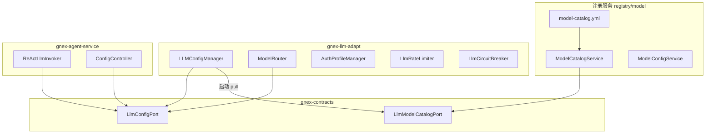
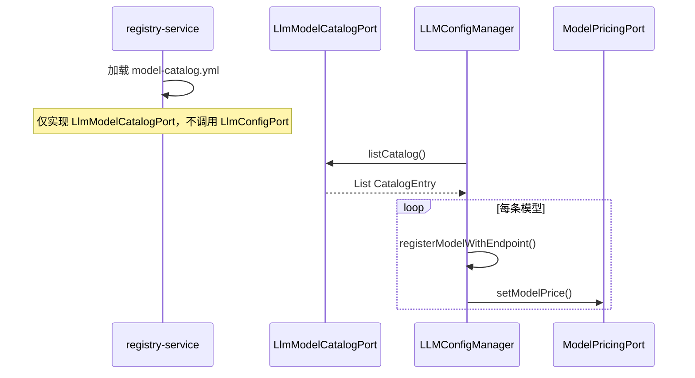
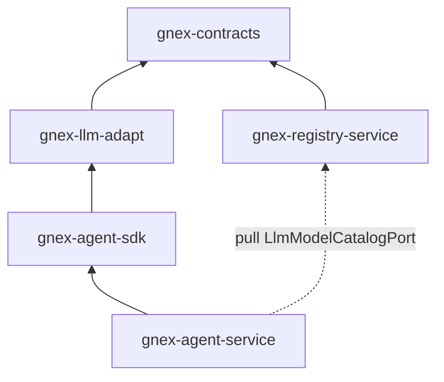

# 大模型适配 v2.0 设计方案

> **版本**：v2.0 草案 · 2026-07-09
> **基底**：DEV-PLAN-Capability-Layer.md 能力 A（三十大模型接入）+ `gnex-llm-adapt` 库拆分
> **范围**：30 模型目录 SSOT、多协议适配元数据、连通性自检、运行时 ChatModel 统一构建、**provider 级多 Key 池化与健康感知调度（单次调用池内换 Key 重试）**。完整模型网关四策略（fallback / race / cost_aware）、**跨 provider 降级**为 S2 远期能力，不在本文实现范围。
> **上游依据**：[INTELLIGENT-ENGINE-INTERFACES.md](../Agent核心/INTELLIGENT-ENGINE-INTERFACES.md) §6.1 · [运营管理服务设计方案.md](../运营管理服务/运营管理服务设计方案.md) 模型网关边界 · [注册服务设计方案.md](./注册服务设计方案.md) · [DEV-PLAN-Capability-Layer.md](../../DEV-PLAN-Capability-Layer.md)

### 命名规范

跨服务共享接口统一使用 `XxxInterface` 命名。当前代码使用 `LlmConfigPort` / `LlmModelCatalogPort`（`contracts.registry` 包），后续迁移为 `LlmConfigInterface` / `LlmModelCatalogInterface`。本文与代码现状对齐。

---

## 目录

1. [能力定位与职责切分](#1-能力定位与职责切分)
2. [总体架构](#2-总体架构)
3. [对外契约](#3-对外契约)
4. [模型目录 SSOT](#4-模型目录-ssot)
5. [Catalog Pull 模式](#5-catalog-pull-模式)
6. [运行时协议适配](#6-运行时协议适配)
7. [AuthProfile 与凭证边界](#7-authprofile-与凭证边界)
8. [智能路由与韧性保护](#8-智能路由与韧性保护)
9. [REST API 归属](#9-rest-api-归属)
10. [gnex-llm-adapt 库结构](#10-gnex-llm-adapt-库结构)
11. [配置多源与优先级](#11-配置多源与优先级)
12. [演进路线](#12-演进路线)

---

## 1. 能力定位与职责切分

大模型自动适配解决两个问题：**「平台支持哪些模型」**（目录/元数据）和 **「运行时怎么调」**（协议分支/ChatModel 构建）。v2.0 将二者拆到不同物理模块，经 Port 解耦。

| 维度 | 注册服务 `registry/model` | 运行时库 `gnex-llm-adapt` |
| --- | --- | --- |
| **职责** | 模型目录 SSOT、DB 种子、连通性探测、定价元数据 | ChatModel 构建、协议分支、场景路由、限流熔断 |
| **Maven 模块** | `services/gnex-registry-service` | `libs/gnex-llm-adapt` |
| **Port** | `LlmModelCatalogPort`（只读）、`ModelConfigPersistencePort` | `LlmConfigPort`、`ModelRouterPort`、`AuthProfilePort` |
| **调用频率** | 启动 + 管理台查询 | **每 ReAct turn**（热路径） |
| **是否可远程化** | 是（纯读 + 探测） | **否**（v2.0 保持 in-process） |

**不负责**（边界声明）：

| 大模型适配不负责 | 归属 |
| --- | --- |
| Token 成本实时计量与 `cost_events` 发布 | S2 模型网关 / 消息总线 |
| fallback / race / cost_aware 四策略路由 | S2 模型网关（新 Port） |
| **跨 provider 降级**（DeepSeek 全挂 → 切 Qwen） | S2 模型网关（新 Port） |
| 用户身份认证 | `gnex-auth-service` |
| Agent 工具凭证（外部 API Key） | 注册服务 `CredentialManagementPort` |
| 计费账单聚合 | `gnex-ops-service` |



---

## 2. 总体架构

### 2.1 适配链路（目标态）

```
model-catalog.yml（30 模型 SSOT，registry-service）
  → LlmModelCatalogPort.listCatalog()（只读）
  → LLMConfigManager.@PostConstruct pull 注册内存
  → createChatModel() 按 protocol 分支
      ├── openai-compat  → OpenAiChatModel（DeepSeek / Qwen / GPT / …）
      └── anthropic-native → AnthropicChatModel（Claude 系列）
  → KeyPoolSelector 从 provider Key 池选一个 ACTIVE Key（§7）
  → LlmRateLimiter + LlmCircuitBreaker（按 Key 熔断）保护，失败池内换 Key 重试
  → ReActLlmInvoker 每轮调用
```

### 2.2 与模型网关（S2）的边界

[运营管理服务设计方案.md](../运营管理服务/运营管理服务设计方案.md) 将「模型路由/降级」划为模型网关职责。v2.0 当前态：

| 能力 | v2.0 实现位置 | S2 目标 |
| --- | --- | --- |
| 30 模型目录 | `registry-service` + `LlmModelCatalogPort` | 不变 |
| `createChatModel()` 协议分支 | `gnex-llm-adapt` in-process | 不变（热路径） |
| 场景分级路由（轻量/强模型） | `ModelRouter` in-process | 可迁入网关 |
| fallback / race / cost_aware | **未实现** | 新 `ModelGatewayPort` + 独立服务 |
| `cost_events` 旁路写入 | **未实现** | 消息总线 |

> [INTELLIGENT-ENGINE-INTERFACES.md](../Agent核心/INTELLIGENT-ENGINE-INTERFACES.md) §6.1 明确：产品态网关四策略**未**体现在当前 `LlmConfigPort` 中。

### 2.3 为何 LLMConfigManager 不归注册服务

[DEV-PLAN-Capability-Layer.md](../../DEV-PLAN-Capability-Layer.md) §1.1 结论：

1. `createChatModel()` 在**每个 ReAct turn** 调用，与 `AgentRuntime` / Spring AI `ToolCallingManager` 同进程强绑定
2. 物理迁入 registry-service 会引入跨服务 RPC，延迟与 tool-calling 流式复杂度显著上升
3. **逻辑归属能力层 ≠ 物理代码必须在 registry-service**；运行时实现就地留 `gnex-llm-adapt`

---

## 3. 对外契约

契约 SSOT：`libs/gnex-contracts/src/main/java/com/gnex/contracts/registry/`

### 3.1 LlmModelCatalogPort（只读，registry-service 实现）

```java
interface LlmModelCatalogPort {
    List<CatalogEntry> listCatalog();
    @Nullable CatalogEntry findByModel(String modelId);
    List<String> listProviders();
    List<ConnectivityResult> checkConnectivity();
}
```

**CatalogEntry 字段**：

```
CatalogEntry
├─ modelId          String    模型标识（如 deepseek-chat）
├─ provider         String    厂商键（deepseek / anthropic / qwen / …）
├─ baseUrl          String    OpenAI-compatible API root
├─ contextWindow    int       最大上下文 token
├─ protocol         String    openai-compat | anthropic-native | gemini-native
├─ pricePerMillion  BigDecimal  定价（USD/1M tokens）
└─ keyEnv           String    连通性探测用环境变量名（如 GNEX_DEEPSEEK_KEY）
```

### 3.2 LlmConfigPort（运行时，gnex-llm-adapt 实现）

```java
interface LlmConfigPort {
    // 配置读写
    String getEffectiveDefaultModel();
    String getEffectiveApiKey();
    String getEffectiveBaseUrl();
    void setDefaultModel(String model);
    void setApiKey(String key);
    void setBaseUrl(String url);
    void setAgentModel(String agentName, @Nullable String model);

    // 模型注册（内存）
    void registerModel(String modelName, int contextWindow, String provider);
    void registerModelWithEndpoint(String modelName, int contextWindow,
                                   String provider, String protocol, String baseUrl);
    Map<String, LlmModelInfo> getRegisteredModels();

    // 运行时工厂（热路径）
    ChatModel createChatModel();
    OpenAiChatOptions getDefaultChatOptions();
    @Nullable OpenAiChatOptions getChatOptionsForAgent(String agentName);

    // Auth 轮换
    default void recordAuthProfileSuccess() { }
    default boolean rotateAuthProfile() { return false; }
}
```

### 3.3 相关 Port

| Port | 实现方 | 用途 |
| --- | --- | --- |
| `ModelConfigPersistencePort` | registry-service `ModelConfigService` | DB `model_config` 加载 |
| `ModelPricingPort` | registry-service `ModelPricingService`（只读单价） | 定价元数据只读，用量计量归 S2（见 §10.1） |
| `AuthProfilePort` | gnex-llm-adapt `AuthProfileManager` | **provider → Key 池**管理、状态机、失败分类 |
| `KeyPoolSelectorPort` | gnex-llm-adapt `KeyPoolSelector` | **池内选 Key**（weighted / round-robin / least-loaded） |
| `ModelRouterPort` | gnex-llm-adapt `ModelRouter` | 场景分级路由 |
| `LlmRateLimitPort` | gnex-llm-adapt `LlmRateLimiter` | 租户级限流 |
| `LlmResiliencePort` | gnex-llm-adapt `LlmCircuitBreaker` | **按 Key 熔断**（见 §8.3） |

### 3.4 AuthProfilePort / KeyPoolSelectorPort（多 Key 池，gnex-llm-adapt 实现）

```java
interface AuthProfilePort {
    /** 注册/加载某 provider 的 Key 池。 */
    void registerPool(String provider, List<AuthProfile> keys);
    /** 池内当前可用（ACTIVE）的 Key 数量。 */
    int activeCount(String provider);
    /** 记录一次调用结果，驱动 Key 状态机（成功清零 / 失败退避）。 */
    void recordResult(String provider, String keyId, LlmCallOutcome outcome);
    /** 手动禁用 / 恢复某 Key（管理台）。 */
    void disable(String provider, String keyId);
    void enable(String provider, String keyId);
}

interface KeyPoolSelectorPort {
    /** 从 provider 池中选一个 ACTIVE Key；无可用返回 empty。 */
    Optional<AuthProfile> select(String provider, KeySelectStrategy strategy);
}
```

`LlmCallOutcome` 由调用方按 HTTP 语义分类：`SUCCESS` / `RATE_LIMITED(429)` / `UNAUTHORIZED(401/403)` / `TRANSIENT(5xx/timeout)`，映射见 §7.3。

---

## 4. 模型目录 SSOT

### 4.1 model-catalog.yml

**位置（目标态）**：`services/gnex-registry-service/src/main/resources/model-catalog.yml`

**现状**：`services/gnex-platform-service/src/main/resources/model-catalog.yml`

**内容**：30 个主流大模型（国内 Top20 + 海外 Top10），字段见 §3.1。示例：

```yaml
version: 1
models:
  - { modelId: deepseek-chat,     provider: deepseek,  baseUrl: https://api.deepseek.com,                              contextWindow: 65536,  protocol: openai-compat,    pricePerMillion: 0.14,  keyEnv: GNEX_DEEPSEEK_KEY }
  - { modelId: claude-sonnet-4-6, provider: anthropic, baseUrl: https://api.anthropic.com,                              contextWindow: 200000, protocol: anthropic-native, pricePerMillion: 3.0,   keyEnv: GNEX_ANTHROPIC_KEY }
  # … 共 30 条
```

### 4.2 ModelCatalogService 职责

**位置（目标态）**：`com.gnex.registry.model.service.ModelCatalogService`

| 职责 | 说明 |
| --- | --- |
| 加载 YAML | `@PostConstruct` 读 classpath `model-catalog.yml` |
| 实现 `LlmModelCatalogPort` | 只读查询 + `checkConnectivity()` |
| 连通性探测 | 逐模型 ping `baseUrl`，状态：`OK` / `NO_KEY` / `UNAUTHORIZED` / `UNREACHABLE` |
| **不再** push 到 `LlmConfigPort` | 见 §5 Catalog Pull |

### 4.3 里程碑完成度（能力 A）

| 子能力 | 状态 | 证据 |
| --- | --- | --- |
| A0 模型元数据扩展 | 已完成 | yml SSOT 含 baseUrl / protocol |
| A1 30 模型目录 + 自动注册 | 已完成 | `ModelCatalogServiceTest` 7/7 |
| A2 多协议适配 | 已完成 | `openai-compat` / `anthropic-native` 分支 |
| A3 连通性自检 + 冒烟 | 已完成 | `DiagnosticsController` + smoke 脚本 |

---

## 5. Catalog Pull 模式

### 5.1 现状问题（Push 模式）

```
ModelCatalogService.@PostConstruct
  → llmConfigPort.registerModelWithEndpoint()   // registry/platform → SDK 反向依赖
  → modelPricingPort.setModelPrice()
```

platform-service 启动依赖 agent-sdk 中 `LLMConfigManager` 实例存在，违反依赖方向。

### 5.2 目标态（Pull 模式）



**改造要点**：

1. `ModelCatalogService` 删除对 `LlmConfigPort` 的注入与 `@PostConstruct` 注册逻辑
2. `LLMConfigManager` 新增 `@PostConstruct loadCatalog()`：`llmModelCatalogPort.listCatalog()` → 逐条 `registerModelWithEndpoint` + `setModelPrice`
3. `gnex-registry-service` POM **不依赖** `gnex-llm-adapt`
4. 启动顺序：registry-service Bean 先于 `LLMConfigManager` 就绪（assembler 同 JVM 自然满足）

### 5.3 跨进程兜底（独立镜像态）

同 JVM（assembler）下启动顺序天然满足；**registry 独立部署**时 `LlmModelCatalogPort` 变为 Feign 远程调用（注册服务文档 §10.2），需处理「pull 失败 / registry 未就绪」：

1. **本地内嵌种子快照**：`gnex-llm-adapt` 打包一份 `model-catalog.yml` 快照，远程 `listCatalog()` 失败时降级加载，保证 `LLMConfigManager` 可启动、热路径不阻断
2. **懒加载 + 重试**：`loadCatalog()` 由 `@PostConstruct` 强依赖改为**懒初始化**（首次热路径调用前确保就绪），远程失败按指数退避重试
3. **异步刷新**：registry 就绪后经健康检查触发异步重拉，用最新目录覆盖本地快照
4. **超时**：远程 catalog 拉取超时默认 2s，超时即走快照，不拖慢启动

---

## 6. 运行时协议适配

### 6.1 createChatModel() 流程

**实现类**：`libs/gnex-llm-adapt/.../LLMConfigManager.java`（当前在 `gnex-agent-sdk`）

> **契约不变**：`createChatModel()` 保持 §3.2 的**无参签名**，选 Key 在方法内部完成，7 个热路径调用方（§6.4）无需改动。

```
createChatModel()                          // 无参，选 Key 内聚在方法内
  → authProfileManager.evictExpired()
  → model = getEffectiveDefaultModel()
  → provider = getProvider(model)
  → protocol = getProtocol(model)          // 来自 catalog 注册的 ModelInfo
  → profile = keyPoolSelector.select(provider, strategy)   // §7.2 池内选 Key，无可用抛 AllKeysExhaustedException
  → apiKey = resolve(profile.apiKeyRef)    // 环境变量取值 / credential_store 解密（BYOK）
  → buildChatModel(model, protocol, apiKey, profile.baseUrl)
       ├── anthropic-native → AnthropicChatModel
       └── 默认            → OpenAiChatModel（OpenAI-compatible）
  → 调用失败按 §7.3 分类 → recordResult + 池内换 Key 重试（≤ max-retries-per-call）
```

### 6.2 支持的协议

| protocol | ChatModel 实现 | 典型厂商 |
| --- | --- | --- |
| `openai-compat`（默认） | `OpenAiChatModel` | DeepSeek、Qwen、GPT、Gemini（兼容端点）、Moonshot、… |
| `anthropic-native` | `AnthropicChatModel` | Claude 系列 |
| `gemini-native` | 预留 | 未来原生 Gemini SDK |

### 6.3 配置持久化

| 配置项 | 存储 | 说明 |
| --- | --- | --- |
| 默认模型 / API Key / Base URL 覆盖 | `~/.gnex/config.json` | 用户 Settings 页写入 |
| Agent 级模型覆盖 | `~/.gnex/config.json` → `agents.{name}` | per-agent 指定模型 |
| DB 模型种子 | `model_config` 表 | 启动从 DB 补充注册 |

### 6.4 热路径调用方

| 调用方 | 场景 |
| --- | --- |
| `ReActLlmInvoker` | 每轮 LLM 调用 + 熔断 |
| `ReActCompletionGate` | 完成判定二次调用 |
| `AgentWorkerToolFactory` | Subagent ChatClient 构建 |
| `GnexSubagentTypes` | 子 Agent 类型 ChatClient |
| `WebConfirmationHandler` | 高风险确认 LLM 评估 |
| `PlanGenerator` / `AgentFlowEngine` | 工作流规划 |
| `SystemDiagnosticsService` | LLM 连通性自检 |

---

## 7. 多 Key 池化与 AuthProfile

### 7.0 设计动机

传统 Agent 项目全系统绑定单一 API Key/厂商，一旦该 Key 流量过大触发限流（429）或被封（401），**整个 provider 乃至系统不可用**。本设计将 provider 从「单 Key」升级为「**Key 池 + 健康感知调度**」：单次调用失败时在池内换 Key 重试，坏 Key 独立隔离，好 Key 持续服务。

### 7.1 数据模型：provider → Key 池

`AuthProfileManager` 按 `provider` 维护一组 `AuthProfile`（每个代表一个 Key）：

```
AuthProfile
├─ id             String     稳定标识（池内唯一）
├─ provider       String     对齐 catalog provider 字段（deepseek / anthropic / ...）
├─ apiKeyRef      String     Key 引用：环境变量名 或 credential_store 加密引用（BYOK）
├─ baseUrl        String     可选覆盖
├─ weight         int        加权轮询权重（默认 1，高配额账号给大权重）
├─ maxRpm/maxTpm  int        该 Key 本地预算上限（可选，用于 least-loaded）
├─ state          enum       ACTIVE / COOLING / DISABLED
├─ cooldownUntil  Instant    冷却截止（429/熔断后设置）
└─ metrics        {successCnt, failCnt, lastLatencyMs, consecutiveFail}
```

调度以 **provider 为单位**：运行时"要调 deepseek-chat" → 从 deepseek 池中选一个 `ACTIVE` Key。

### 7.2 选 Key 策略（`KeySelectStrategy`，可配）

| 策略 | 逻辑 | 适用 |
| --- | --- | --- |
| `round-robin` | 池内轮转，跳过非 ACTIVE | 各 Key 配额相近 |
| `weighted`（默认） | 按 `weight` 加权随机 + 跳过 COOLING | 账号配额不均 |
| `least-loaded` | 选近窗在途请求 / token 用量最低者 | 高并发削峰 |

选 Key 必须**并发安全**（`AtomicInteger` 游标 / 读写锁），避免多 ReAct turn 同时命中同一 Key。

### 7.3 失败分类 → 差异化反应（核心）

按 HTTP 语义分类，避免"一刀切"处理：

| `LlmCallOutcome` | 触发条件 | 对当前 Key 的反应 | 是否换 Key 重试 |
| --- | --- | --- | --- |
| `SUCCESS` | 2xx | `recordSuccess()`，清零 consecutiveFail，半开→ACTIVE | — |
| `RATE_LIMITED` | 429 / rate_limit | 置 `COOLING`，退避 = `Retry-After` 或指数退避 | **是，立即换池内下一个 Key** |
| `UNAUTHORIZED` | 401 / 403 | 置 `DISABLED` + 告警，不再选中 | 是 |
| `TRANSIENT` | 5xx / 超时 | 累计 `consecutiveFail`，达阈值 → 该 **Key** 熔断（COOLING） | 是 |

**池内换 Key 重试**是解决"流量过大不可用"的关键：单次调用失败先在**同 provider 池内**轮换重试（上限 `max-retries-per-call`，默认 3）；池内全部 Key 耗尽再抛 `AllKeysExhaustedException`（跨 provider fallback 属 S2，本期不做）。

### 7.4 Key 状态机（按 Key 独立，粒度细于 provider）

```
ACTIVE ──429 / 5xx累计达阈值──► COOLING ──cooldown 到期──► (半开) 试探 1 次
   ▲                                                        │
   │◄──────────────── 成功 ──────────────────────────────────┤
   └──────────────── 401/403 ──────► DISABLED（需管理台/告警恢复）
```

> 相比原设计 §8.3「按 provider 熔断」，改为**按 Key 熔断**后，一个坏 Key 不会误伤整个 provider——这是"避免系统级不可用"的关键升级。

### 7.5 谁选 Key（分层定稿）

选 Key、resolve、失败分类与池内换 Key 重试全部**内聚在 `LLMConfigManager.createChatModel()`**（流程见 §6.1），`createChatModel()` **保持无参契约**（§3.2），`ReActLlmInvoker` 等 7 个热路径调用方无感、无需改动。`KeyPoolSelectorPort` / `AuthProfilePort.recordResult()` 为内部协作 Port，不暴露给调用方；现有 `rotateAuthProfile()` / `recordAuthProfileSuccess()` 承接换 Key 与成功记录。

### 7.6 BYOK：用户 BYOK 优先 + 租户 BYOK 兜底

- **用户 BYOK**（优先）：登录用户在 Settings 填入的 LLM Key 走 **`credential_store` AES 加密存储**（`apiKeyRef` 指向加密引用），运行时解密后动态加入**该用户专属的 provider 池**；同租户不同用户互不可见
- **租户 BYOK**（兜底）：租户管理员配置的组织默认 Key，写入 `credential_store`，无用户 Key 时注入**该租户专属池**
- **生产热路径禁止**回退平台 yaml/env 池；用户无 Key 且租户也无 Key → 抛 `NoLlmKeyConfiguredException`；解析优先级见 §11.2
- 双层限流：Key 池防单 Key 超限 + `LlmRateLimiter` 按用户/租户令牌桶防挤占

#### 命名空间隔离（BYOK LLM Key vs 工具凭证）

`credential_store` 同时承载「Agent 工具凭证」与「BYOK LLM 厂商 Key」，用 `provider` 字段的**保留命名空间**区分，避免管理台两类混展：

| 类型 | `credential_store.provider` 取值 | 展示入口 | 使用方 |
| --- | --- | --- | --- |
| BYOK LLM Key（用户层） | **`__llm_byok__`** | Settings / `/api/config`（LLM 配置页） | `KeyPoolSelector` 装配用户池 |
| BYOK LLM Key（租户层） | **`__llm_byok__`** | 租户管理台（组织 LLM Key） | `KeyPoolSelector` 装配租户池 |
| Agent 工具凭证 | 真实 provider（`openai` / `github` / …） | `/api/credentials`（凭证管理页） | 工具执行前 `CredentialHandler` |

**name 约定**（用前缀区分两层）：

| 层 | name 格式 | 例 | 谁可 CRUD |
| --- | --- | --- | --- |
| 用户 BYOK | `u:{userId}:{llmProvider}` | `u:42:deepseek` | 仅该用户 |
| 租户 BYOK | `t:{tenantId}:{llmProvider}` | `t:acme:deepseek` | 租户管理员 |

**规则**：
1. BYOK LLM Key 写入时 `provider = "__llm_byok__"`；用户层 `name = u:{userId}:{llmProvider}`，租户层 `name = t:{tenantId}:{llmProvider}`
2. `GET /api/credentials`（注册服务，注册服务文档 §5.3）**默认过滤 `provider = "__llm_byok__"`**，LLM Key 不在工具凭证列表出现
3. `KeyPoolSelector` 装配时：先按 `u:{userId}:%` 查用户层；无则按 `t:{tenantId}:%` 查租户层；并校验 owner / 管理权限
4. `__llm_byok__` 为系统保留值，工具凭证 `POST /api/credentials` 校验拒绝该 provider 取值
5. 无 `userId` 的后台任务：仅查租户层；租户也无 Key → 抛异常，**禁止**静默用平台 Key

### 7.7 与注册服务工具凭证的区别

| 维度 | AuthProfile（LLM 厂商 Key） | CredentialManagementPort（工具凭证） |
| --- | --- | --- |
| 用途 | LLM 推理 API 调用 | Agent 工具调用外部 API（MCP/HTTP） |
| 存储 | BYOK：`credential_store` AES 加密（用户层 + 租户层）；平台 yaml/env **仅诊断/dev** | DB `credential_store` AES 加密 |
| 管理入口 | Settings / `/api/config`（用户 Key）+ 租户管理台（组织 Key） | `/api/credentials` |
| 注入时机 | `createChatModel()`（选 Key 后） | 工具执行前 `CredentialHandler` |

---

## 8. 智能路由与韧性保护

### 8.1 ModelRouter（场景分级）

**实现**：`gnex-llm-adapt/.../ModelRouter.java`，实现 `ModelRouterPort`

```
route(userInput, requestedModel)
  → ScenarioClassifier.classify(userInput) → SIMPLE / MEDIUM / COMPLEX
  → 若 routing 未锁定：
       SIMPLE  → lightweightModel（如 gpt-4o-mini）
       COMPLEX → strongModel（如 claude-opus）
  → 否则使用 requestedModel / defaultModel
```

配置项（`application.yml`）：

```yaml
gnex.llm.router.enabled: true
gnex.llm.router.lightweight-model: gpt-4o-mini
gnex.llm.router.strong-model: claude-sonnet-4-6
```

### 8.2 LlmRateLimiter

- 租户级令牌桶（`TenantContext`）
- ReAct turn 前 `acquire()`，超限抛 `RateLimitExceededException`

### 8.3 LlmCircuitBreaker（按 Key 熔断）

实现 `LlmResiliencePort`，**熔断粒度为 Key**（`provider + keyId`）。失败分类见 §7.3、状态机与半开试探见 §7.4、池内换 Key 重试见 §6.1，阈值配置见 §11.3；本节不重复。

---

## 9. REST API 归属

| API | 归属服务 | Port | 说明 |
| --- | --- | --- | --- |
| `GET/PUT /api/config` | `gnex-agent-service` | `LlmConfigPort` | Settings 页：apiKey / baseUrl / defaultModel |
| `GET/PUT /api/config/agents/{name}` | agent-service | `LlmConfigPort` | per-agent 模型覆盖 |
| `GET/PUT /api/config/models/{name}` | agent-service | `LlmConfigPort` | 注册模型元数据 |
| `GET/PUT /api/config/pricing` | agent-service | `ModelPricingPort` | 单价配置 |
| `GET /api/diagnostics/models` | **registry-service** | `LlmModelCatalogPort` | 30 模型连通性报告 |
| `GET /api/diagnostics`（全量） | agent-service | `SystemDiagnosticsPort` | LLM+MCP+Agent+Skill 自检 |

**`/api/config` 留 agent-service 的理由**：Settings 页与 Shell `/config` 命令同属接入/配置入口，与 ReAct 热路径同服务可减少跨服务往返；内部仍只调 `LlmConfigPort`。

---

## 10. gnex-llm-adapt 库结构

### 10.1 目录

```
libs/gnex-llm-adapt/
├── pom.xml
└── src/main/java/com/gnex/llm/
    ├── config/
    │   └── LLMConfigManager.java          # LlmConfigPort
    ├── router/
    │   └── ModelRouter.java             # ModelRouterPort
    ├── auth/
    │   ├── AuthProfileManager.java      # AuthProfilePort（provider → Key 池、状态机）
    │   └── KeyPoolSelector.java         # KeyPoolSelectorPort（池内选 Key）
    └── resilience/
        ├── LlmRateLimiter.java          # LlmRateLimitPort
        └── LlmCircuitBreaker.java       # LlmResiliencePort（按 Key 熔断）
```

> **定价 / 用量归属定稿**：`ModelPricingPort` 的**只读单价元数据**归 `registry/model`（`model_config` / `ModelPricing` 实体已在 `gnex-platform-persistence`）；**用量计量与聚合 `UsageTracker`（写 token 消耗）归 `gnex-ops-service` / S2 计费**，不放 `gnex-llm-adapt`。热路径仅经 `ModelPricingPort`（只读）取单价做成本估算。

### 10.2 依赖方向



| 模块 | 允许依赖 | 禁止依赖 |
| --- | --- | --- |
| `gnex-llm-adapt` | `gnex-contracts` | registry-service、platform-service |
| `gnex-registry-service` | `gnex-contracts`、persistence | gnex-llm-adapt、agent-sdk |
| `gnex-agent-sdk` | `gnex-llm-adapt`、`gnex-contracts` | registry 实现类 |

### 10.3 从 gnex-agent-sdk 迁出清单

| 当前位置（agent-sdk） | 目标位置（gnex-llm-adapt） |
| --- | --- |
| `com.gnex.agent.harness.LLMConfigManager` | `com.gnex.llm.config.LLMConfigManager` |
| `com.gnex.agent.harness.ModelRouter` | `com.gnex.llm.router.ModelRouter` |
| `com.gnex.agent.runtime.AuthProfileManager` | `com.gnex.llm.auth.AuthProfileManager` |
| `com.gnex.agent.harness.LlmRateLimiter` | `com.gnex.llm.resilience.LlmRateLimiter` |
| `com.gnex.agent.harness.LlmCircuitBreaker` | `com.gnex.llm.resilience.LlmCircuitBreaker` |

迁出后 `gnex-agent-sdk` 的 react 层继续**仅通过 Port** 访问，不直接 import 实现类（Wave 1.5 已部分完成）。

---

## 11. 配置多源与优先级

### 11.1 模型 / baseUrl 生效优先级（高 → 低）

| 优先级 | 来源 | 字段 |
| --- | --- | --- |
| 1 | Agent 级覆盖 | `config.json` → `agents.{name}.model` |
| 2 | 用户 Settings 覆盖 | `config.json` → `defaultModel` / `apiKey` / `baseUrl` |
| 3 | AuthProfile Key 池 | 见 §11.2 |
| 4 | Catalog 默认值 | `model-catalog.yml` → `baseUrl` / `protocol` |
| 5 | Spring 配置 | `spring.ai.openai.*` 默认值 |

**冲突处理**：`getEffectiveDefaultModel()` 先读 `config.json` 覆盖，再回退 `spring.ai.openai.chat.options.model`。

### 11.2 Key 解析优先级（provider 池装配，高 → 低）

某 provider 的 Key 池按以下顺序装配；**生产热路径** `createChatModel()` 仅读用户层与租户层 BYOK：

| 优先级 | 来源 | 说明 |
| --- | --- | --- |
| 1 | 用户 BYOK | `credential_store`，`name = u:{userId}:{llmProvider}`，当前登录用户专属池 |
| 2 | 租户 BYOK | `credential_store`，`name = t:{tenantId}:{llmProvider}`，组织默认池（无用户 Key 时） |
| — | 平台 yaml/env | **不参与生产热路径**；仅 `profile=dev` / `diagnostics`（连通性探测、本地 assembler 冒烟） |

无用户 Key 且无租户 Key → 抛 `NoLlmKeyConfiguredException`（引导用户到 Settings 配置，或联系租户管理员配置组织 Key）。

无 `userId` 的后台任务：仅查租户层；租户也无 Key → 同样抛异常，禁止静默用平台 Key。

> **配置源决策**：BYOK（用户 + 租户）经 `credential_store` AES 加密 CRUD 为生产 SSOT；平台 `gnex.llm.auth.providers.*.keys` 与 `GNEX_{PROVIDER}_KEY` **不进入**生产热路径（§12.1 D-L7）。

### 11.3 Key 池配置形态

**生产路径（BYOK，credential_store）**：用户层 / 租户层 Key 经 Settings 或租户管理台写入，运行时按 §11.2 优先级反查解密注入池。

**非生产路径（诊断 / dev 专用）**：平台 yaml/env 池，**不得**作为生产 `createChatModel()` 兜底：

```yaml
gnex.llm.auth:
  strategy: weighted            # round-robin | weighted | least-loaded
  max-retries-per-call: 3       # 单次调用池内换 Key 重试上限
  circuit:
    transient-fail-threshold: 5 # 连续 5xx/超时熔断阈值
    default-cooldown: 60s       # 无 Retry-After 时的退避基数
  # 以下 providers.* 仅 profile=dev|diagnostics 生效，生产热路径不读
  providers:
    deepseek:
      keys:
        - { id: ds-1, ref: GNEX_DEEPSEEK_KEY_1, weight: 2, maxRpm: 1000 }
        - { id: ds-2, ref: GNEX_DEEPSEEK_KEY_2, weight: 1, maxRpm: 500 }
    anthropic:
      keys:
        - { id: an-1, ref: GNEX_ANTHROPIC_KEY_1 }
```

---

## 12. 演进路线

### 12.1 v2.0 近期（本文范围）

| 步骤 | 内容 | 依赖 |
| --- | --- | --- |
| D-L1 | `model-catalog.yml` + `ModelCatalogService` 迁入 registry-service | 注册服务脚手架 |
| D-L2 | Catalog Pull 改造，消除 platform→SDK 反向依赖 | D-L1 |
| D-L3 | 新建 `libs/gnex-llm-adapt`，从 agent-sdk 抽出 harness 类 | D-L2 |
| D-L4 | `/api/diagnostics/models` 迁入 registry-service | D-L1 |
| D-L5 | 全量测试 + `LLMConfigManagerProtocolTest` 回归 | D-L3 |
| D-L6 | **多 Key 池化**：`AuthProfile` 扩池模型 + `KeyPoolSelector` + 失败分类 + 按 Key 熔断 + 池内换 Key 重试 | D-L3 |
| D-L7 | **多 Key 增强**：用户 BYOK + 租户 BYOK CRUD（DB + AES 加密）+ 按 §11.2 优先级注入（用户 > 租户）；生产热路径禁用平台池 | D-L6 |

### 12.2 v2.0 S2 远期（模型网关，不在本文）

| 能力 | 新 Port（规划） | 说明 |
| --- | --- | --- |
| fallback 策略 | `ModelGatewayPort` | 主模型失败自动降级 |
| race 策略 | 同上 | 多模型并行取最快 |
| cost_aware 策略 | 同上 | 成本感知路由 |
| `cost_events` | `MessageBusPort` | 旁路写入消息总线 |

### 12.3 验收标准

- [ ] registry-service 不含 `LLMConfigManager` 依赖
- [ ] `gnex-llm-adapt` 仅依赖 `gnex-contracts`
- [ ] Catalog Pull 后启动无 Bean 循环依赖
- [ ] 30 模型 `checkConnectivity()` 端点可用
- [ ] ReAct 热路径延迟无退化（in-process 不变）
- [ ] `anthropic-native` / `openai-compat` 分支测试通过
- [ ] **多 Key：单 Key 触发 429 时自动换池内下一个 Key，调用最终成功（不抛错）**
- [ ] **多 Key：单 Key 401 置 DISABLED 后不再被 `KeyPoolSelector` 选中**
- [ ] **多 Key：坏 Key 熔断不影响同 provider 其余 Key（按 Key 而非 provider 熔断）**
- [ ] **多 Key：池内全部 Key 耗尽抛 `AllKeysExhaustedException`，不静默失败**
- [ ] **多 Key：`weighted` 策略下高 weight Key 命中率符合权重比**
- [ ] **BYOK：用户有 Key 时优先于租户 Key（即使租户也有同 provider Key）**
- [ ] **BYOK：用户无 Key、租户有 Key 时使用租户 Key**
- [ ] **BYOK：用户无 Key 且租户无 Key → 抛 `NoLlmKeyConfiguredException`，生产热路径不读平台 yaml/env 池**
- [ ] **BYOK：用户 A 的 Key 不可被用户 B 的调用选中**
- [ ] **BYOK：生产 profile 下即使配置了平台 yaml Key，热路径仍不使用**

---

**相关文档**：[注册服务设计方案.md](./注册服务设计方案.md) · [INTELLIGENT-ENGINE-INTERFACES.md](../Agent核心/INTELLIGENT-ENGINE-INTERFACES.md) · [DEV-PLAN-Capability-Layer.md](../../DEV-PLAN-Capability-Layer.md) · [RUNTIME-CONTRACTS.md](../Agent核心/RUNTIME-CONTRACTS.md)
