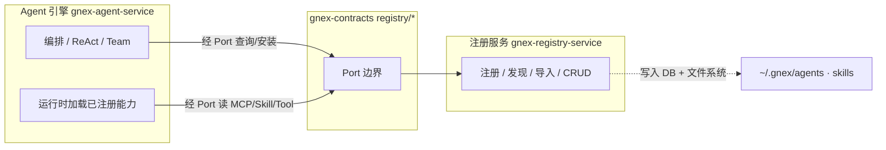
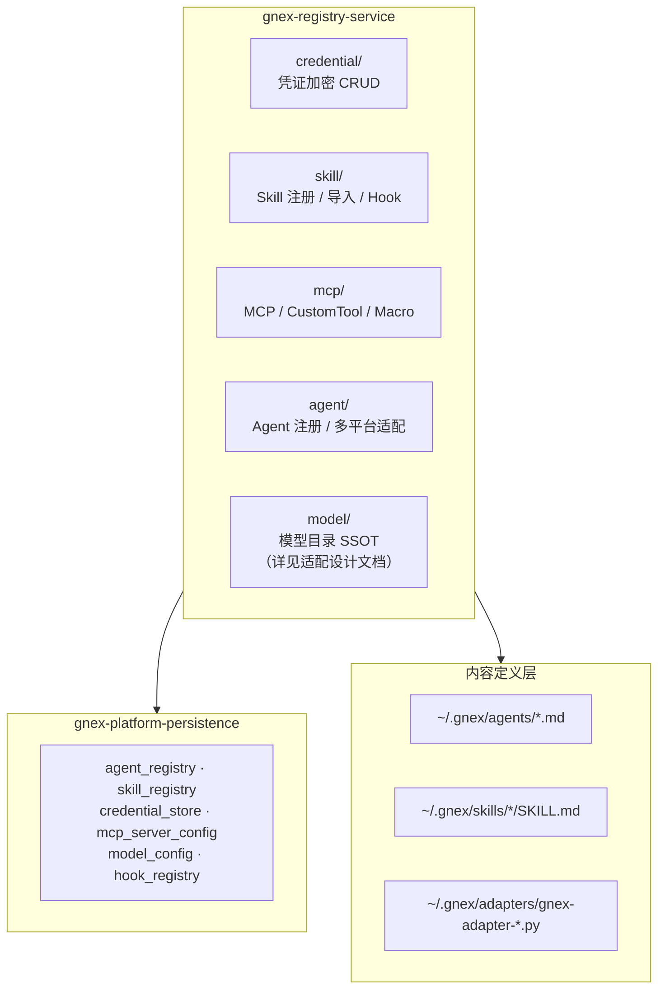
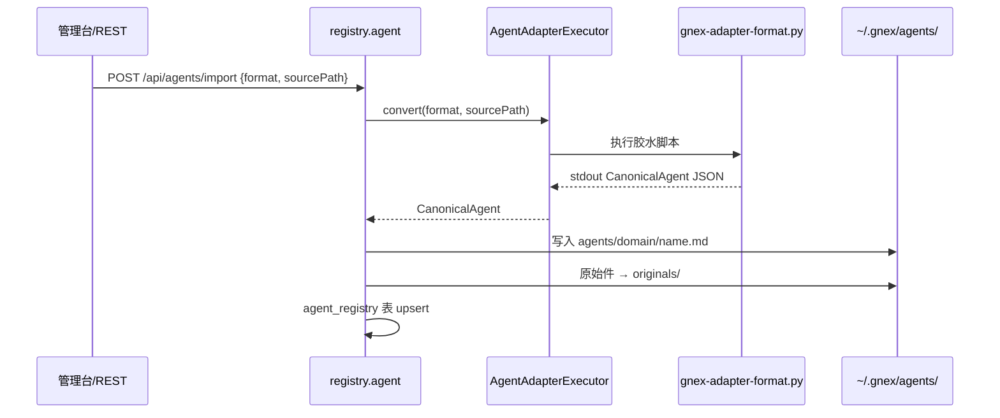
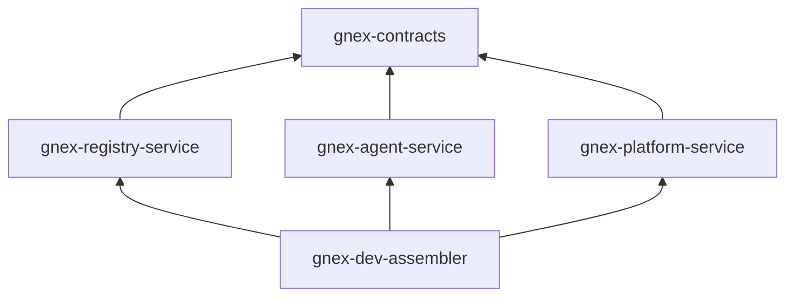
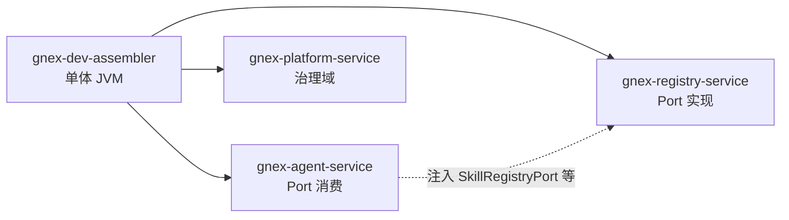

# 注册服务 v2.0 设计方案

> **版本**：v2.0 草案 · 2026-07-09
> **基底**：GNEX AgentOS 拆分（SPLIT）+ `gnex-registry-service` 物理服务拆分
> **范围**：Agent / Skill / Tool / MCP / Hook / 凭证 的注册、发现、加载、多平台导入与 CRUD。不含 ReAct 执行内核（`gnex-agent-service`）、不含用户/RBAC/计费（`gnex-platform-service` / `gnex-ops-service`）、不含 LLM 运行时调用（`libs/gnex-llm-adapt`，见 [大模型适配设计方案.md](./大模型适配设计方案.md)）。
> **上游依据**：[数据层设计方案.md](../数据层/数据层设计方案.md) §1.1「Agent注册与能力管理」· [INTELLIGENT-ENGINE-INTERFACES.md](../Agent核心/INTELLIGENT-ENGINE-INTERFACES.md) §6.2 · [AGENTOS-SPLIT.md](../Agent核心/AGENTOS-SPLIT.md) · [DEV-PLAN-Capability-Layer.md](../../DEV-PLAN-Capability-Layer.md)

### 命名规范

**部门要求**：跨服务共享接口统一使用 `XxxInterface` 命名。当前代码中存在 `XxxPort` 命名（历史遗留），注册域 Port 定义在 `libs/gnex-contracts/src/main/java/com/gnex/contracts/registry/`，后续迁移中逐步重命名为 `XxxInterface`。本文档正文使用 `XxxPort` 与代码现状对齐，括号内标注目标 Interface 名。

---

## 目录

1. [服务定位](#1-服务定位)
2. [总体架构](#2-总体架构)
3. [对外契约](#3-对外契约)
4. [包结构与模块落位](#4-包结构与模块落位)
5. [REST API](#5-rest-api)
6. [多平台导入](#6-多平台导入)
7. [数据模型与持久化](#7-数据模型与持久化)
8. [依赖关系与边界规则](#8-依赖关系与边界规则)
9. [代码迁移映射](#9-代码迁移映射)
10. [开发态装配与部署态](#10-开发态装配与部署态)
11. [演进路线](#11-演进路线)

---

## 1. 服务定位

注册服务是控制面的**能力超市**——平台的「Agent 注册与能力管理」组件。它负责「有什么能力、怎么装进来、装在哪」，不负责「能力怎么跑起来」。

**核心职责**：

| 注册服务负责 | 不负责 |
| --- | --- |
| Agent 注册 / 安装 / 卸载 / 多平台导入 | ReAct 执行循环（→ `gnex-agent-service`） |
| Skill 注册 / 导入 / 目录索引 | Skill 运行时按需加载执行（→ agent-sdk `SkillsTool`） |
| MCP Server 注册 / 连接 / 工具发现 | MCP 工具实际调用（→ agent 运行时 `McpTool`） |
| Custom Tool / Macro 注册 | 工具执行与沙箱门禁（→ agent 运行时 + sandbox） |
| Hook 注册与 PRE/POST 脚本编排 | Hook 触发时机决策（→ agent 运行时） |
| 凭证加密存储与注入元数据（AES-256-GCM） | 用户身份认证（→ `gnex-auth-service`） |
| Agent/Skill 定义文件落盘（`~/.gnex/agents/`、`~/.gnex/skills/`） | 会话/消息持久化（→ `gnex-agent-persistence`） |
| 行为契约（BehaviorContract）元数据管理 | 契约运行时校验执行（→ agent 运行时） |
| — | 用户 / 租户 / RBAC / 计费（→ platform / ops） |
| — | LLM 运行时调用与 ChatModel 构建（→ `gnex-llm-adapt`） |
| — | 模型目录 SSOT 只读查询（→ 本服务 `model` 子域，详见适配设计文档） |

**编排用能力，注册管能力**（架构核心约束）：



- **注册服务**管理能力的元数据、定义文件、连接配置
- **Agent 引擎**通过 `gnex-contracts` Port 消费已注册能力，不直接 import 注册服务实现类
- 开发态（`gnex-dev-assembler`）同 JVM InProcess 装配；部署态可独立镜像 + 远程 Adapter

---

## 2. 总体架构

### 2.1 在总体架构中的位置

GNEX 2.0 控制面（§数据层设计方案 §1.1）：

```
② 控制层 ─── Agent 引擎 · 沙箱调度器 · 认证服务 · Agent注册与能力管理 · 运营管理服务 · 状态同步器
                              ↑
                         本文档：注册服务
```

注册服务对应历史架构中的 **d5-registry / P7 能力层注册中心**，v2.0 以独立 Maven 模块 `services/gnex-registry-service/` 物理落位。

### 2.2 子域划分



### 2.3 与其他服务的交互

| 调用方 | 调用方式 | 使用的 Port | 场景 |
| --- | --- | --- | --- |
| `gnex-agent-service`（运行时） | InProcess / 远期 gRPC | `McpServerManagementPort`、`SkillRegistryPort`、`CredentialManagementPort` | 启动加载 MCP、工具执行前取凭证 |
| `gnex-agent-service`（管理 REST 代理） | 同上 | `AgentRegistryPort`、`SkillImportPort` | 编排层触发安装（过渡期） |
| `gnex-platform-service` | Port only | `SkillCatalogPort`（只读） | 管理台展示（如有） |
| `gnex-dev-assembler` | Spring 扫描装配 | 全部 registry Port 实现 | 开发单体 |
| 前端管理台 | REST `/api/*` | — | Agent/Skill/凭证/MCP 管理页 |

**禁止**：`gnex-agent-service` 或 `gnex-platform-service` 通过 Maven 依赖或直接 `import com.gnex.registry.*` 访问注册服务实现（[RUNTIME-CONTRACTS.md](../Agent核心/RUNTIME-CONTRACTS.md) R1/R5）。

---

## 3. 对外契约

Port 定义 SSOT：`libs/gnex-contracts/src/main/java/com/gnex/contracts/registry/`（当前 35 个文件）。

### 3.1 Agent 子域

| Port（目标 Interface） | 主要方法 | 实现类（迁入后） |
| --- | --- | --- |
| `AgentRegistryPort` | `listAll`, `installFromCanonical`, `uninstall`, `installAllFromPath` | `AgentRegistryPortAdapter` |
| `AgentPackagePort` | `uploadZip`, `evaluate`, `install` | `AgentPackagePortAdapter` |
| `AgentLoaderPort` | `loadAgent`, `resolveDefinition` | `AgentLoader`（运行时读盘，可留 agent-service） |
| `SkillTranslationPort` | `translateToSkillMd(format, originalPath)` | `SkillFormatTranslator` |

### 3.2 Skill 子域

| Port | 主要方法 | 实现类 |
| --- | --- | --- |
| `SkillRegistryPort` | `registerOrUpdate`, `findByName`, `listAll`, `delete` | `SkillRegistryPortAdapter` |
| `SkillImportPort` | `importExternalSkill(format, sourcePath)` | `SkillImportService` |
| `SkillCatalogPort` | `listCatalog`, `getSummary` | `SkillCatalogPortAdapter` |
| `ToolHookPort` / `AgentHookPort` | `executeToolHook`, `executeAgentHook` | `HookExecutor` |

### 3.3 MCP / Tool 子域

| Port | 主要方法 | 实现类 |
| --- | --- | --- |
| `McpServerManagementPort` | `listServers`, `connect`, `reconnectFromDb`, `disconnect` | `McpServerManagementPortAdapter` |
| `McpScenePackagePort` | 场景包 CRUD | `McpScenePackagePortAdapter` |
| `CustomToolManagementPort` | `listTools`, `registerTool`, `unregisterTool` | `CustomToolManagementPortAdapter` |
| `MacroManagementPort` | Macro CRUD | `MacroManagementPortAdapter` |
| `BehaviorContractManagementPort` | 行为契约 CRUD | `BehaviorContractManagementPortAdapter` |

### 3.4 凭证子域

| Port | 主要方法 | 实现类 |
| --- | --- | --- |
| `CredentialManagementPort` | `list`, `getById`, `store`, `updateCredential`, `delete` | `CredentialManagementPortAdapter` |
| `CredentialHandlerPort` | 运行时 Header 注入策略 | `ApiKeyCredentialHandler` 等 |

**加密规范**（R.1）：凭证明文经 `AesEncryptor`（AES-256-GCM，位于 `libs/gnex-persistence-common`）加密后写入 `credential_store`；运行时通过 `CredentialHandlerFactory` 按 `authType` 选择 Handler 注入 HTTP Header，明文不落日志。

#### 3.4.1 加密密钥生命周期

现状 `AesEncryptor` 已支持 `GNEX_ENCRYPTION_KEY`（环境变量优先）/ `gnex.crypto.encryption-key`（配置回退）、缺失 fail-fast、`ENC:` 前缀标记。以下为各维度现状与目标态对比（其中 🔴 失败语义为批次 1 阻塞项）：

| 维度 | 现状 | 目标态 |
| --- | --- | --- |
| **密钥来源** | 环境变量 / 配置项 | 生产经 KMS / Secret Manager 注入；禁止入库、禁止提交进 `application.yml` |
| **密钥派生** | 裸 `padOrTruncate` 直接补/截到 32 字节（无 KDF） | 原始密钥经 **PBKDF2 / HKDF + 固定盐** 派生 32 字节 AES key，抗弱口令 |
| **失败语义** 🔴 P0 | 加/解密异常时**静默返回原值**（**安全 bug，批次 1 阻塞**） | 加解密失败**必须抛异常**，禁止明文兜底落库或返回 |
| **密钥版本** | 无版本，换密钥即全量无法解密 | 密文格式升级为 `ENC:v{n}:{base64}`，`credential_store` 增 `key_version` 列 |
| **密钥轮换** | 换 key 需重启且旧密文失效 | 双密钥并存（旧解 + 新加）滚动重加密，后台任务逐行迁移 |
| **多环境隔离** | 依赖运维约定 | dev / test / staging / prod 各自独立密钥，禁止跨环境解密 |
| **审计** | 明文不落日志（已满足） | 凭证读写记 who / when / credentialId，明文永不落日志 |

##### 3.4.1.1 🔴 P0 失败语义修复（批次 1 阻塞项）

> **安全 bug 现状**：`AesEncryptor.encrypt()` catch 分支 `return plaintext`、`decrypt()` catch 分支 `return ciphertext`。加密失败时明文直接落库，整个加密保护被绕过；解密失败时返回密文而非明文，调用方拿到一个无法使用的值而非明确的错误。

**影响面**（全部经 `CredentialService` 使用 `AesEncryptor`）：

| 调用点 | 当前行为（bug） | 修复后 |
| --- | --- | --- |
| `CredentialService.store()` → `encrypt(plaintext)` | 加密失败 → **明文落库** | 抛 `CredentialEncryptionException`，事务回滚，不落库 |
| `CredentialService.resolve()` → `decrypt(ciphertext)` | 解密失败 → 返回密文（无法用于 Header 注入） | 抛 `CredentialDecryptionException`，调用方显式处理 |
| `CredentialService.resolveHeaders()` → 同上 | 解密失败 → Handler 拿到密文，Header 注入静默失败 | 同上 |
| `CredentialService.updateCredential()` → `encrypt()` | 加密失败 → **明文覆盖** | 抛异常，事务回滚 |

**修复要求**（批次 1 验收 gate，见 §9）：

1. `AesEncryptor.encrypt()` 异常分支改为 `throw new EncryptionException(...)`，**不得返回 plaintext**
2. `AesEncryptor.decrypt()` 异常分支改为 `throw new EncryptionException(...)`，**不得返回 ciphertext**
3. `decrypt()` 对**非 `ENC:` 前缀**的值仍原样返回（兼容历史明文迁移期），但日志告警一次（含 credentialId，不含明文）
4. 新增异常类 `CredentialEncryptionException`（或统一 `CredentialCryptoException`），为 `RuntimeException` 子类
5. `CredentialService` 写操作（`store` / `updateCredential`）加 `@Transactional`，加密异常触发事务回滚，DB 不产生半成品记录
6. 补单测：加密失败 → 抛异常 + DB 无写入；解密失败 → 抛异常 + 不返回密文

**例外处理**：迁移期可能存在历史明文记录（无 `ENC:` 前缀）。`decrypt()` 对非加密值原样返回，由数据迁移脚本（§7.0.1）统一加密补齐。迁入 registry-service 前所有新写入必须加密成功。批次 1 验收 gate 见 §9。

### 3.5 模型目录子域（摘要）

| Port | 职责 | 详见 |
| --- | --- | --- |
| `LlmModelCatalogPort` | 30 模型只读目录 + 连通性探测 | [大模型适配设计方案.md](./大模型适配设计方案.md) |
| `ModelConfigPersistencePort` | `model_config` 表 CRUD | 同上 |

> `LlmConfigPort`（运行时 ChatModel 构建）**不属于**注册服务，归属 `libs/gnex-llm-adapt`。

### 3.6 registry 包 Port 归属分类（全量）

`libs/gnex-contracts/.../registry/` 当前 35 个文件中，并非全部属于注册域。按归属分三类，明确迁入范围与待清理项：

| 类别 | 代表 Port / Record | 归属实现 | 处置 |
| --- | --- | --- | --- |
| **注册域**（本服务实现） | `AgentRegistryPort`、`AgentPackagePort`、`SkillRegistryPort`、`SkillImportPort`、`SkillCatalogPort`、`ToolHookPort`、`AgentHookPort`、`McpServerManagementPort`、`McpScenePackagePort`、`CustomToolManagementPort`、`MacroManagementPort`、`BehaviorContractManagementPort`、`CredentialManagementPort`、`CredentialHandlerPort`、`SkillTranslationPort` + 对应 Records | `gnex-registry-service` | 迁入（§9） |
| **模型目录域** | `LlmModelCatalogPort`、`ModelConfigPersistencePort`、`ModelConfigEntry`、`LlmModelCatalogRecords` | `gnex-registry-service` `model/` | 迁入 |
| **LLM 运行时域**（非注册） | `LlmConfigPort`、`AuthProfilePort`、`LlmModelInfo` | `gnex-llm-adapt` | 见大模型适配文档 |
| **运行时编排域（误放包内）** | `WorkerAgentFactoryPort`、`WorkerAgentPort`、`AgentLoaderPort`、`LoadedAgent`、`AgentMatch` | agent-sdk / agent-service 运行时 | **标注待迁 `contracts.runtime`**（Wave 2 破坏性变更，本批次不动） |

> **说明**：`WorkerAgentFactoryPort` / `WorkerAgentPort` 是 Coordinator-Worker 编排 + 沙箱 profile 的运行时关注点（见其 Javadoc），当前物理位于 `registry` 包属历史遗留。注册服务**不实现**这些 Port；迁包动作留待运行时契约整理（Wave 2），本期仅在文档标注归属，避免破坏现有 import。

---

## 4. 包结构与模块落位

### 4.1 Maven 模块

```
services/gnex-registry-service/
├── pom.xml
└── src/main/java/com/gnex/registry/
    ├── RegistryServiceApplication.java      # 可选独立启动入口
    ├── credential/
    │   ├── service/CredentialService.java
    │   ├── service/CredentialManagementPortAdapter.java
    │   ├── handler/ApiKeyCredentialHandler.java
    │   └── controller/CredentialController.java
    ├── skill/
    │   ├── service/SkillRegistryService.java
    │   ├── service/SkillImportService.java
    │   ├── service/HookService.java
    │   ├── service/HookExecutor.java
    │   └── controller/SkillController.java
    ├── mcp/
    │   ├── McpToolRegistry.java
    │   ├── McpServerConfigService.java
    │   ├── CustomToolRegistry.java
    │   └── controller/McpServerController.java
    ├── agent/
    │   ├── service/AgentRegistryService.java
    │   ├── service/AgentInstallService.java
    │   ├── service/AgentUninstallService.java
    │   ├── adapter/AgentAdapterExecutor.java
    │   ├── adapter/SkillFormatTranslator.java
    │   └── controller/AgentController.java
    └── model/
        ├── service/ModelCatalogService.java
        ├── service/ModelConfigService.java
        └── controller/ModelDiagnosticsController.java
```

### 4.2 POM 依赖（目标态）

```xml
<!-- gnex-registry-service 仅依赖 -->
gnex-contracts
gnex-platform-persistence
gnex-persistence-common
spring-boot-starter-web
mybatis-plus-spring-boot4-starter
```

**不依赖**：`gnex-agent-service`、`gnex-agent-sdk`、`gnex-llm-adapt`。

### 4.3 内容定义存储

| 类型 | 位置 | 格式 | 说明 |
| --- | --- | --- | --- |
| Agent 定义 | `~/.gnex/agents/{domain}/{name}.md` | Markdown | 运行时加载源（`definitionPath`） |
| Agent 原始件 | `~/.gnex/agents/originals/` | 各平台原格式 | 档案（`originalPath`），导入即转译 + 原始保留 |
| Skill 定义 | `~/.gnex/skills/{domain}/{name}/SKILL.md` | Markdown | 运行时 `SkillsTool` 扫描 |
| Skill 原始件 | `~/.gnex/skills/originals/` | 各平台原格式 | 同上 |
| Adapter 脚本 | `~/.gnex/adapters/gnex-adapter-{format}.py` | Python/Node | 多平台导入胶水脚本 |

---

## 5. REST API

注册域 REST 统一由 `gnex-registry-service` 提供（从 `gnex-agent-service` 迁入）。

### 5.1 Agent API

| 方法 | 路径 | 说明 |
| --- | --- | --- |
| `GET` | `/api/agents` | 列出已注册 Agent |
| `POST` | `/api/agents/install` | 从内置源安装 |
| `POST` | `/api/agents/import` | 多平台格式导入（`format` + `sourcePath`） |
| `DELETE` | `/api/agents/{name}` | 卸载 Agent |
| `POST` | `/api/agents/execute` | **过渡期留 agent-service**（执行非注册职责） |

### 5.2 Skill API

| 方法 | 路径 | 说明 |
| --- | --- | --- |
| `GET` | `/api/skills` | 列出 Skill |
| `POST` | `/api/skills/import` | 外部 Skill 导入（`format` + `sourcePath`） |
| `DELETE` | `/api/skills/{name}` | 删除 Skill |

### 5.3 凭证 API

| 方法 | 路径 | 说明 |
| --- | --- | --- |
| `GET` | `/api/credentials` | 列出**工具凭证**（脱敏）；**默认过滤保留命名空间 `provider="__llm_byok__"`**，不含 BYOK LLM Key |
| `GET` | `/api/credentials/{id}` | 单条详情 |
| `POST` | `/api/credentials` | 新建凭证（服务端加密存储）；校验拒绝 `provider="__llm_byok__"`（系统保留） |
| `PUT` | `/api/credentials/{id}` | 更新凭证 |
| `DELETE` | `/api/credentials/{id}` | 删除凭证 |

> **命名空间约定**：`credential_store` 同时承载工具凭证与 BYOK LLM Key，用 `provider="__llm_byok__"` 保留命名空间区分。BYOK 分两层：**用户层** `name=u:{userId}:{llmProvider}` 经 Settings / `/api/config` 管理；**租户层** `name=t:{tenantId}:{llmProvider}` 经租户管理台配置组织默认 Key。均不经 `/api/credentials` 工具凭证 API。详见 [大模型适配设计方案.md](./大模型适配设计方案.md) §7.6。

### 5.4 MCP API

| 方法 | 路径 | 说明 |
| --- | --- | --- |
| `GET` | `/api/mcp/servers` | 列出 MCP Server |
| `POST` | `/api/mcp/servers` | 注册并连接 MCP Server |
| `DELETE` | `/api/mcp/servers/{id}` | 断开并删除 |
| `POST` | `/api/mcp/servers/reconnect` | 从 DB 批量重连 |

### 5.5 模型诊断 API（摘要）

| 方法 | 路径 | 说明 |
| --- | --- | --- |
| `GET` | `/api/diagnostics/models` | 30 模型连通性自检 |

> `/api/config`（LLM 配置读写）留 `gnex-agent-service`，详见 [大模型适配设计方案.md](./大模型适配设计方案.md) §6。

---

## 6. 多平台导入

### 6.1 导入原则（DEV-PLAN §1.2）

1. **导入即转译**：各平台 agent/skill 导入时立即转译为 gnex 可运行 `.md` 交付件
2. **原始件保留**：`originalPath` 指向原样存盘的原始文件，便于查看与迭代
3. **聚焦平台**：Claude Code + OpenClaw 为正式支持；其余 adapter 标注实验性

### 6.2 Agent 适配流程



### 6.3 已支持的 Adapter 格式

| format | 脚本 | 状态 |
| --- | --- | --- |
| `claude-code` | `gnex-adapter-claude-code.py` | 正式 |
| `openclaw` | `gnex-adapter-openclaw.py` | 正式 |
| `dify` | `gnex-adapter-dify.py` | 实验性 |
| `coze` | `gnex-adapter-coze.py` | 实验性 |
| `crewai` | `gnex-adapter-crewai.py` | 实验性 |
| `openai-gpts` | `gnex-adapter-openai-gpts.py` | 实验性 |
| `autogen` | `gnex-adapter-autogen.py` | 实验性 |
| `agentformat` | `gnex-adapter-agentformat.py` | 实验性 |
| `hermes` | `gnex-adapter-hermes.py` | 实验性 |

脚本位置：`gnex-dev-assembler/src/main/resources/adapters/`（运行时复制到 `~/.gnex/adapters/`）。

### 6.4 安全约束

- 导入前经 `ExternalImportValidator` 校验路径与格式，防止目录穿越
- Adapter 脚本 stdout 反序列化为 `CanonicalAgent`，异常输出拒绝入库
- 凭证类敏感数据不经导入通道，走 `/api/credentials` 加密存储

### 6.5 失败语义与健壮性

#### Adapter 脚本执行

| 场景 | 处置 | 错误码 |
| --- | --- | --- |
| 执行超时（默认 30s，可配 `gnex.registry.import.timeout`） | 终止子进程，回滚入库 | `IMPORT_ADAPTER_TIMEOUT` |
| 非零退出 / stderr 异常 | 拒绝入库，透传 stderr 摘要 | `IMPORT_ADAPTER_FAILED` |
| stdout 非法 JSON / 缺字段 | 反序列化失败拒绝入库 | `IMPORT_PARSE_FAILED` |
| stdout 超大小上限（默认 10MB） | 截断并拒绝，防内存打爆 | `IMPORT_OUTPUT_TOO_LARGE` |

> 任一失败，**原始件仍归档到 `originals/`** 便于排错；`agent_registry` 表不产生半成品记录（事务回滚）。

#### 连通性探测（`checkConnectivity`）

- 单模型请求超时默认 5s（`gnex.registry.diagnostics.probe-timeout`）
- 30 模型**并发探测**（受限并发池，默认 8），避免串行阻塞
- 结果缓存 TTL（默认 60s），管理台高频刷新不重复打 provider

#### 注册 CRUD 并发

- 注册表增 `version` 列做**乐观锁**（MyBatis-Plus `@Version`）
- 并发更新冲突返回 `409 Conflict`，由调用方重试
- 安装/卸载走幂等键（`name + domain + tenant + project`），重复安装不产生脏数据

---

## 7. 数据模型与持久化

持久化实体位于 `libs/gnex-platform-persistence`，由注册服务通过 MyBatis Mapper 访问。

### 7.0 持久化模块决策

| 决策项 | 结论 |
| --- | --- |
| registry-service 是否新建独立 persistence | **否，复用 `gnex-platform-persistence`** —— 注册相关实体/Mapper 已齐全（`AgentRegistry`、`SkillRegistry`、`HookRegistry`、`McpServerConfig`、`CredentialStore`、`ModelConfig`），与「registry 仅依赖 contracts + persistence libs」一致 |
| 凭证实体去重 🔴 P0 | 见 §7.0.1 |
| 凭证加密失败语义 🔴 P0 | 见 §3.4.1.1（批次 1 阻塞，与凭证去重同 PR 完成） |
| 远期独立库 | 若 registry 独立部署且需独立 Schema，再抽 `gnex-registry-persistence`（列入 §11 演进），本期不做 |

#### 7.0.1 🔴 P0 凭证实体去重（批次 1 前置项）

**现状**：平台存在两套凭证实体与存储，语义重叠但模型不一致：

| 维度 | `CredentialStore`（✅ SSOT） | `AgentCredential`（❌ 废弃） |
| --- | --- | --- |
| 表 | `credential_store` | `agent_credential` |
| 包 | `com.gnex.credential.entity` | `com.gnex.agent.entity` |
| 加密 | AES-256-GCM（`AesEncryptor`，`ENC:` 前缀密文） | **明文存储**（`credentialValue`，注释"暂存明文以降低 MVP 复杂度"） |
| 作用域 | `name` + `provider` + `tenant` + `project` | `agent_name` + `credential_key` + `tenant` |
| 使用方 | `CredentialService` → `CredentialManagementPort` | `AgentIdentityService`（platform）→ 经 `TeamMcpTools` 的 `@Tool` 暴露 |
| 多租户 | `tenant_id` + `project_id` 双维度 | 仅 `tenant_id` |

**决策：SSOT = `credential_store` / `CredentialStore`。** 理由：① 已有 AES 加密（`AgentCredential` 明文存储是安全缺口）；② 多租户 + 项目隔离更完整；③ 已是 `CredentialManagementPort` 的底层实体，与注册服务迁移方向一致。

##### 去重迁移步骤（批次 1 阻塞）

| 步骤 | 内容 | 验证点 |
| --- | --- | --- |
| D1 | `AgentCredential` 标 `@Deprecated`，Javadoc 指向 `CredentialStore` | 编译通过 |
| D2 | `AgentIdentityService` 的 `storeCredential` / `resolveCredential` / `listCredentials` / `deleteCredential` 改为**委托 `CredentialManagementPort`**（经 Port 调用注册服务），不再直接操作 `AgentCredentialMapper` | 单测：store → credential_store 有记录 + agent_credential 无新写入 |
| D3 | `TeamMcpTools` 的 `@Tool`（`agent_credential_store` / `agent_credential_get`）签名不变，内部经 `AgentIdentityService` → `CredentialManagementPort` | TeamMcpTools E2E 不退化 |
| D4 | 数据迁移脚本：将 `agent_credential` 现有记录的 `credentialValue`（明文）经 `AesEncryptor.encrypt()` 加密后写入 `credential_store`，字段映射：**`agent_name + ":" + credential_key`→`name`**（与 D2 `storeCredential` 的 `name=agentName:key` 写入规则一致，确保 `resolveCredential` 的 `name LIKE agentName:%` 能匹配迁移行）、`credential_type`→`auth_type`、`agent_name` 写入 `description` 前缀 | 迁移后 credential_store 行数 = 原 agent_credential 有效行数；明文不再存在于任何表；`resolveCredential(agentName, key)` 能读到迁移行 |
| D5 | 迁移完成后 `agent_credential` 表保留但不再写入（只读兼容期），下一版本 Flyway 加 drop 迁移 | 旧表只读，无新写入 |

> **与 §3.4.1.1 的关联**：D2 改造 `AgentIdentityService` 时，`CredentialManagementPort.store()` 内部调用 `AesEncryptor.encrypt()`。若 P0 安全 bug 未修复，迁移后的 agent 凭证仍可能明文落库。两件事必须在同一 PR（批次 1）完成。

**`AgentIdentityService` 改造要点**（D2）：

- `storeCredential(agentName, key, value, type, desc)`：调 `credentialManagementPort.store(name=agentName+":"+key, provider="agent", authType=type, value, ...)`，不再写 `agent_credential` 表
- `resolveCredential(agentName, key)`：调 `credentialManagementPort.resolve(name)` 解密返回
- `listCredentials(agentName)`：调 `credentialManagementPort.list()` 按 `name LIKE agentName+:%` 过滤 + 脱敏
- `deleteCredential(id)`：调 `credentialManagementPort.delete(id)`
- `AgentCredentialMapper` 不再注入；`AgentIdentityService` 依赖从 `AgentCredentialMapper` 改为 `CredentialManagementPort`

### 7.1 核心表
| 表名 | 实体 | 关键字段 | 说明 |
| --- | --- | --- | --- |
| `agent_registry` | `AgentRegistry` | `name`, `domain`, `definition_path`, `original_path`, `tenant_id`, `project_id` | Agent 注册元数据 |
| `skill_registry` | `SkillRegistry` | `name`, `domain`, `definition_path`, `original_path` | Skill 注册元数据 |
| `credential_store` | `CredentialStore` | `name`, `provider`, `auth_type`, `credential`(加密), `ref_url` | 凭证库 |
| `mcp_server_config` | `McpServerConfig` | `name`, `transport`, `url`, `command`, `status` | MCP Server 配置 |
| `hook_registry` | `HookRegistry` | `name`, `phase`, `script_path`, `enabled` | Hook 定义 |
| `model_config` | `ModelConfig` | `name`, `context_window`, `provider`, `enabled` | 模型配置（DB 种子） |

### 7.2 多租户隔离

与全平台一致，经 `TenantContext` / `ProjectContext` + MyBatis 拦截器自动追加 `tenant_id` / `project_id` 条件（[数据层设计方案.md](../数据层/数据层设计方案.md) §10）。

### 7.3 隔离模型（注册资源）

```
租户 tenant_id
  └── 项目 project_id（X-Project-Id 请求头）
        └── 资源 Agent / Skill / MCP / Credential
              └── 创建者 created_by
```

---

## 8. 依赖关系与边界规则

### 8.1 Maven 依赖方向（目标态）



| 规则 | 说明 |
| --- | --- |
| R-REG-1 | `gnex-registry-service` 仅依赖 `gnex-contracts` + persistence libs |
| R-REG-2 | `gnex-agent-service` **不得** Maven 依赖 `gnex-registry-service` |
| R-REG-3 | `gnex-platform-service` **不得** Maven 依赖 `gnex-registry-service` |
| R-REG-4 | 跨服务调用**仅经** `gnex-contracts` Port |
| R-REG-5 | `gnex-dev-assembler` 负责 InProcess 装配全部 Port 实现 |

### 8.2 明确不归入注册服务

| 组件 | 归属 | 理由 |
| --- | --- | --- |
| `ActiveRunRegistry` / `LeaderRuntimeRegistry` | agent-service | 运行时活跃表 |
| `RedisSandboxRegistry` | sandbox-runtime | 沙箱执行面 |
| `Orchestrator` / `ReActLoop` | agent-sdk | 执行内核 |
| `UsageTracker` / 计费 | ops / platform | 治理域 |
| `LLMConfigManager` | gnex-llm-adapt | LLM 热路径 |

---

## 9. 代码迁移映射

从现状（platform + agent 混合）迁移到 `gnex-registry-service` 的批次计划：

### 批次 1：credential（最小切口）

| 源 | 目标 |
| --- | --- |
| `platform-service/.../CredentialService.java` | `registry/credential/service/` |
| `platform-service/.../CredentialManagementPortAdapter.java` | `registry/credential/service/` |
| `agent-service/.../CredentialController.java` | `registry/credential/controller/` |
| `platform-service/.../AgentIdentityService.java` | `registry/credential/service/`（改造为委托 `CredentialManagementPort`，§7.0.1 D2） |
| `agent-service/.../TeamMcpTools.java` | 留 agent-service（`@Tool` 签名不变，内部改调 `AgentIdentityService`→Port） |
| `libs/gnex-persistence-common/.../AesEncryptor.java` | 留原位（修复失败语义，§3.4.1.1） |

**批次 1 验收 gate**（🔴 P0 阻塞，不通过则批次 1 不可合并）：

- [ ] `AesEncryptor.encrypt()` 失败时抛 `CredentialEncryptionException`，不返回明文
- [ ] `AesEncryptor.decrypt()` 失败时抛 `CredentialDecryptionException`，不返回密文（非 `ENC:` 前缀值仍原样返回 + WARN 日志）
- [ ] `CredentialService.store()` 加密失败 → 事务回滚 → DB 无半成品记录
- [ ] `AgentCredential` 标 `@Deprecated`
- [ ] `AgentIdentityService.storeCredential()` 不再直接写 `agent_credential` 表，经 `CredentialManagementPort` 写 `credential_store`
- [ ] 数据迁移脚本将 `agent_credential` 现有明文记录加密迁入 `credential_store`（§7.0.1 D4）
- [ ] 单测：加密/解密失败均抛异常；store/resolve 链路走 credential_store 单一表
- [ ] `TeamMcpTools` E2E（`agent_credential_store` / `agent_credential_get`）不退化

### 批次 2：skill + hook

| 源 | 目标 |
| --- | --- |
| `platform-service/.../SkillRegistryService.java` | `registry/skill/service/` |
| `platform-service/.../SkillImportService.java` | `registry/skill/service/` |
| `platform-service/.../HookService.java` / `HookExecutor.java` | `registry/skill/service/` |
| `agent-service/.../SkillController.java` | `registry/skill/controller/` |

### 批次 3：mcp + custom-tool

| 源 | 目标 |
| --- | --- |
| `platform-service/.../McpToolRegistry.java` | `registry/mcp/` |
| `platform-service/.../CustomToolRegistry.java` | `registry/mcp/` |
| `agent-service/.../McpServerController.java` | `registry/mcp/controller/` |
| `agent-service/.../McpServerManagementPortAdapter.java` | `registry/mcp/` |

### 批次 4：agent + adapter

| 源 | 目标 |
| --- | --- |
| `agent-service/.../AgentRegistryService.java` | `registry/agent/service/` |
| `agent-service/.../AgentInstallService.java` | `registry/agent/service/` |
| `agent-service/.../AgentAdapterExecutor.java` | `registry/agent/adapter/` |
| `agent-service/.../AgentController.java` | `registry/agent/controller/` |
| `platform-service/.../AgentRegistryOperations.java` | `registry/agent/service/` |

### 批次 5：model catalog

| 源 | 目标 |
| --- | --- |
| `platform-service/.../ModelCatalogService.java` | `registry/model/service/` |
| `platform-service/resources/model-catalog.yml` | `registry-service/resources/` |
| `agent-service/.../DiagnosticsController` `/models` 端点 | `registry/model/controller/` |

每批次验收：`mvn compile` + 对应单测 + `d5-registry.spec.ts` 相关用例。

---

## 10. 开发态装配与部署态

### 10.1 开发态（gnex-dev-assembler）



- `gnex-dev-assembler/pom.xml` 增加 `gnex-registry-service` 依赖
- Spring `@ComponentScan` 覆盖 `com.gnex.registry`
- 零 RPC 开销，行为与迁移前一致

### 10.2 部署态（远期）

| 阶段 | 形态 | 说明 |
| --- | --- | --- |
| B 档（当前定稿） | platform 四域合一镜像 | 注册服务可独立镜像，也可与 platform 同镜像 |
| 独立镜像 | `gnex-registry-service` 单独容器 | 需 Remote Port Adapter（Feign/gRPC） |
| C 档（远期） | 注册域独立扩缩容 | 见 [AGENTOS-SPLIT.md](../Agent核心/AGENTOS-SPLIT.md) §2 |

#### Remote Port Adapter 契约（独立镜像态）

跨进程后，消费方（agent-service）注入的仍是同一 `gnex-contracts` Port，实现由 InProcess Adapter 换为 Remote Adapter，由 `gnex-dev-assembler` / 部署 profile 切换：

| Port | 远程调用语义 | 降级策略 |
| --- | --- | --- |
| `LlmModelCatalogPort`（只读） | Feign GET，超时默认 2s | 降级到**本地内嵌种子快照**（打包 `model-catalog.yml`），保证 `LLMConfigManager` 可启动（见大模型适配文档 §5.2） |
| `CredentialManagementPort` | Feign，超时 1s + 熔断 | 热路径取凭证失败 → 该次工具调用失败，不缓存明文 |
| `SkillRegistryPort` / `McpServerManagementPort` | 启动期批量拉取 | 失败重试（指数退避），就绪前阻塞对应能力加载 |

> 原则：**只读 Port 可降级到本地快照保可用；写/凭证 Port 失败即失败**，不做危险兜底。远程契约版本随 `gnex-contracts` 语义化版本演进，禁止在 Adapter 层私自扩展方法。

---

## 11. 演进路线

对齐 [v2-dev-plan-registry.md](../../v2.0-dev-plans/_examples/v2-dev-plan-registry.md) 子项：

| ID | 子项 | 状态 | 本文档章节 |
| --- | --- | --- | --- |
| R.1 | 凭证加密（AES-256-GCM） | 已实现，待迁入 registry-service | §3.4、§5.3 |
| R.2 | skill 补迁 + skill 注册 CRUD | 已实现，待迁入 | §3.2、§5.2 |
| R.3 | MCP 注入 | 已实现，待迁入 | §3.3、§5.4 |
| R.4 | Agent 适配层 + Agent 注册 | 已实现，待迁入 | §3.1、§6 |
| R.5 | LlmModelCatalog 模型目录 | 已实现，待迁入 | [大模型适配设计方案.md](./大模型适配设计方案.md) |
| R.6 | CRUD 全套联调 | 待 registry-service 落位后验收 | §9 批次 1–5 |
| R.7 | 加密密钥加固：**失败必抛 🔴 P0**（批次 1 阻塞）/ KDF·版本轮换（后续迭代） | 🔴 失败必抛：批次 1 阻塞（§3.4.1.1） / 其余后续 | §3.4.1 |
| R.8 | 凭证实体去重（SSOT=`credential_store`） | 🔴 P0 批次 1 前置（§7.0.1） | §7.0 |
| R.9 | 导入/探测/CRUD 失败语义 + 乐观锁 | 待办 | §6.5 |
| R.10 | Remote Port Adapter（独立镜像态） | 远期 | §10.2 |
| R.11 | `WorkerAgent*Port` 迁 `contracts.runtime` | Wave 2（破坏性） | §3.6 |

**里程碑验收**（Gate G1 注册域）：

- [ ] `services/gnex-registry-service/` 模块编译通过
- [ ] 全部注册 REST 由 registry-service 提供
- [ ] agent/platform 无对 registry 实现类的直接 import
- [ ] `d5-registry.spec.ts` E2E 全绿
- [ ] `gnex-dev-assembler` 单体启动不退化

---

**相关文档**：[大模型适配设计方案.md](./大模型适配设计方案.md) · [INTELLIGENT-ENGINE-INTERFACES.md](../Agent核心/INTELLIGENT-ENGINE-INTERFACES.md) · [RUNTIME-CONTRACTS.md](../Agent核心/RUNTIME-CONTRACTS.md) · [DEV-PLAN-Capability-Layer.md](../../DEV-PLAN-Capability-Layer.md)
