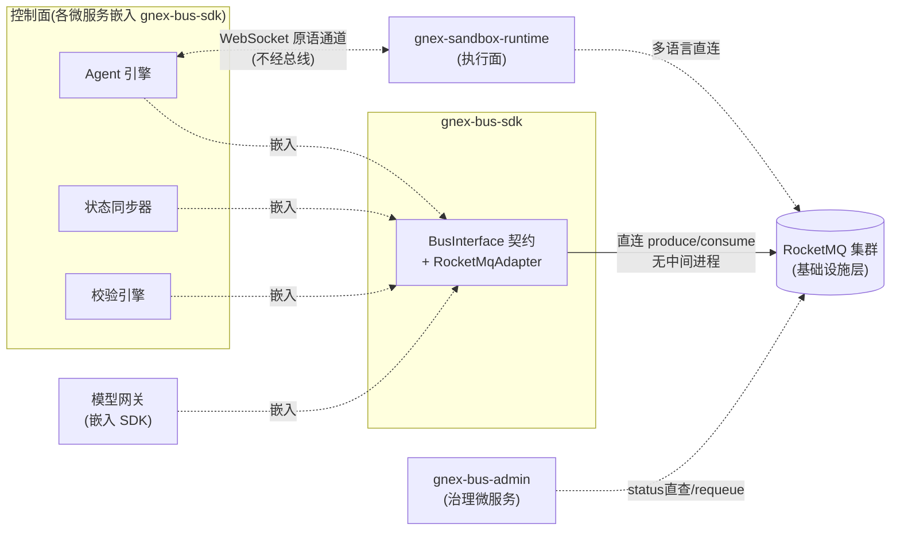

# gnex-bus 2.0 架构设计

> **定位**: gnex-bus 不是消息转发微服务,而是 **Java SDK + RocketMQ 集群 + admin 治理服务**。业务服务通过 `gnex-bus-sdk` 直连 RocketMQ;RocketMQ 承担消息存储、投递、重试、死信和消费位点;`gnex-bus-admin` 只做治理,不在消息投递热路径上。  
> **Topic 规范**: Topic 命名、`orderKey`、`filter`、消费组和新增 Topic 准入规则见 `topic-design.md`。  
> **通道边界**: 原语执行 `Action -> Observation` 走 WebSocket,不走 bus。bus 只承载沙箱生命周期、Agent 事件、A2A 协作、成本/质量事件和审计。

---

## 1. 总体模型

```text
业务服务
  ├─ agent-service
  ├─ sandbox-runtime
  ├─ platform-service
  ├─ model-gateway
  └─ verifier / sync worker
        ↓ 依赖 Java SDK 或跨语言信封
gnex-bus-sdk
        ↓ RocketMQ client
RocketMQ 集群
        ↑ 运维查询 / 受控操作
gnex-bus-admin
```



三个组成部分:

| 组件             | 形态         | 职责                                                         | 是否在投递热路径 |
| ---------------- | ------------ | ------------------------------------------------------------ | ---------------- |
| `gnex-bus-sdk`   | Java jar     | 统一信封、生产/订阅 API、序列化校验、Topic 契约校验、指标埋点、背压入口、RocketMQ 适配 | 是               |
| RocketMQ 集群    | 基础设施     | 消息存储、投递、offset、重试、死信、队列和副本               | 是               |
| `gnex-bus-admin` | 独立治理服务 | 状态总览、死信治理、订阅治理、pause/resume、requeue、告警聚合、治理审计 | 否               |

关键边界:

- SDK 不是 proxy,不单独部署,不转发消息。
- admin 不生产/消费业务消息,不参与业务投递链路。
- RocketMQ 是消息事实源;正常消息、offset、retry、DLQ 不落业务数据库。
- 业务语义不进入 SDK;SDK 只认 `topic`、`orderKey`、`filter`、`properties`、`payload`。
- Agent 原语执行不走 bus;bus 只记录必要的旁路事件和审计。

---

## 2. 职责边界

### 2.1 gnex-bus-sdk

SDK 负责“发和收”:

- 提供 `BusInterface`。
- 校验 `MessageEnvelope` 的必填字段、payload 大小、Topic 是否已注册。
- 将 `orderKey`、`filter`、properties 映射到 RocketMQ 消息。
- 暴露本进程 client metrics,如 produce QPS、consume latency、send failure、backpressure rejected。
- 提供生产侧本地 outbox/重试入口,但不自建全局消息状态机。
- 注入 `traceId`、`tenantId` 等约定属性,或校验调用方已传入。

### 2.2 RocketMQ 集群

RocketMQ 负责“存和投”:

- Topic、队列、offset。
- at-least-once 投递。
- 顺序消息能力。
- 原生 retry 和 DLQ。
- 消息留存。
- broker/nameServer 高可用。

RocketMQ 是消息事实源。gnex-bus 不再自建 `MessageStateStore`、retry scheduler 或消息状态表。

### 2.3 gnex-bus-admin

admin 负责“看、停、恢复、告警、审计”:

- 状态总览: RocketMQ 健康、Topic 积压、消费组 lag、QPS、消费延迟、背压次数。
- 死信治理: DLQ 统计、查询、详情、requeue、`audit_log` 死信自动归档。
- 订阅治理: 消费组、消费者实例、Topic 订阅、paused 状态、pause/resume。
- 运维审计: requeue、pause、resume、归档操作留痕。
- 告警聚合: DLQ 突增、lag 超阈值、RocketMQ 连接异常、audit 死信、背压持续触发。

---

## 3. 对外契约

### 3.1 MessageEnvelope

所有消息使用统一信封。SDK 只读取投递、过滤、可观测和演进字段;payload 对 SDK 不透明。

```text
MessageEnvelope
├─ msgId          String              可选。produce 时为空,发送成功后由 RocketMQ/SDK 返回
├─ dedupId        String              可选。生产者 outbox/本地重试幂等键(给机器去重)
├─ keys           String              可选。业务检索键,映射 RocketMQ msg keys(给人按 key 查消息)
├─ topic          String              必填。标准 Topic 之一
├─ orderKey       String              必填。格式见 Topic 规范,通常为 {tenant}:{entity}
├─ schemaVersion  String              必填。payload schema 版本
├─ payload        String              必填。业务正文,SDK 不解析,大小 <= 256KB
├─ filter         String              可选。同一 Topic 内的子类型
├─ properties     Map<String,String>  必填。tenantId、traceId、requestId、sessionId 等
└─ timestamp      Instant             发送时间,由 SDK 填充
```

必填属性:

| 属性                  | 要求                      |
| --------------------- | ------------------------- |
| `properties.tenantId` | 必填,消费者必须校验       |
| `properties.traceId`  | 必填,用于全链路追踪       |
| `schemaVersion`       | 必填,消费者按版本兼容处理 |

说明:

- `dedupId` 不是 broker 去重保证。它只用于生产者 outbox、本地重试或业务幂等识别;RocketMQ 不承诺按 `dedupId` 自动丢弃重复消息。
- `keys` 与 `dedupId` 分工:`keys` 面向人工/治理侧的按键检索(admin `queryByKey`),`dedupId` 面向机器幂等去重;两者可同值也可不同,互不替代。
- `msgId` 用于防重复投递的消费侧幂等;`requestId` 用于业务语义幂等,如请求/回应配对。
- payload 超过 256KB 时,调用方先上传对象存储,再在 payload 中放 `blob://...` 引用。

### 3.2 对外接口总览

gnex-bus 对外接口分四类:`BusInterface`(业务热路径)、`BusAdminInterface`(治理 Interface)、Admin REST(治理 HTTP)、Observability(可观测)。下表把四类接口的全部方法 / 端点汇总到一处,逐条对照;字段签名、DTO、约束见 §3.3–§3.6。

| 接口面              | 形式            | 接口 / 端点                                                  | 用途 / 语义                                                  | 使用方             |
| ------------------- | --------------- | ------------------------------------------------------------ | ------------------------------------------------------------ | ------------------ |
| `BusInterface`      | Java SDK        | `produce(MessageEnvelope)` → `ProduceResult`                 | 同步立即投递,等 broker ack。`accepted=false` 表示 SDK 拒绝(payload 超限 / 本地 outbox 满);broker 不可用抛 `BusUnavailableException` | 各业务服务         |
| `BusInterface`      | Java SDK        | `produceAsync(MessageEnvelope)` → `CompletableFuture<ProduceResult>` | 异步投递,不阻塞调用线程,回调/Future 拿结果;高频生产者(如 `agent_events`)用它避免同步 send 成瓶颈 | 各业务服务         |
| `BusInterface`      | Java SDK        | `produceBatch(List<MessageEnvelope>)` → `List<ProduceResult>` | 同一 Topic 批量投递,摊薄 RPC 开销;返回逐条结果               | 各业务服务         |
| `BusInterface`      | Java SDK        | `produceScheduled(MessageEnvelope, Duration)` → `ProduceResult` | 相对时长定时投递,走 5.x timer message;`delay` 超 `[0, maxDelay]` 直接 `accepted=false` | 各业务服务         |
| `BusInterface`      | Java SDK        | `produceAt(MessageEnvelope, Instant)` → `ProduceResult`      | 绝对时间点定时投递(超时补偿场景更直观),底层同 timer message  | 各业务服务         |
| `BusInterface`      | Java SDK        | `produceInTransaction(MessageEnvelope, LocalTransactionExecutor)` → `ProduceResult` | 事务消息(RocketMQ 独有):half-message + 本地事务 + broker 回查,保证"本地状态写 + 发消息"原子性(`cost_events`/`audit_log`) | 各业务服务         |
| `BusInterface`      | Java SDK        | `subscribe(SubscribeRequest, MessageHandler)` → `Subscription` | 声明式注册订阅,随服务生命周期存在;顺序/并发、Tag/SQL92、集群/广播、offset 起点均在 `SubscribeRequest` 声明 | 各业务服务         |
| `BusInterface`      | Java SDK        | `unsubscribe(String subscriptionId)` → void                  | 取消本进程内订阅                                             | 各业务服务         |
| `BusAdminInterface` | Java Interface  | `overview()` → `BusOverview`                                 | 状态总览:RocketMQ 健康、Topic 积压、死信数、outbox 拒绝数    | admin 内部 / 运维  |
| `BusAdminInterface` | Java Interface  | `backpressureStatus()` → `BackpressureStatus`                | 背压状态:`topicLag`、`outboxRejected`、水位档 `level`        | admin 内部 / 运维  |
| `BusAdminInterface` | Java Interface  | `deadLetterStats(tenantId)` → `DeadLetterStats`              | 死信统计:数量、按 Topic 聚合、最早时间                       | admin 内部 / 运维  |
| `BusAdminInterface` | Java Interface  | `listDeadLetters(tenantId, DeadLetterQuery)` → `DeadLetterPage` | 死信分页查询(topic / consumerGroup / page / size)            | admin 内部 / 运维  |
| `BusAdminInterface` | Java Interface  | `queryMessage(messageId)` → `Optional<MessageTrace>`         | 消息轨迹查询(出生时间 + 各消费点事件)                        | admin 内部 / 运维  |
| `BusAdminInterface` | Java Interface  | `queryById(messageId)` → `Optional<MessageDetail>`           | 按 msgId 精确查消息详情(topic / keys / 属性 / 首末投递)      | admin 内部 / 运维  |
| `BusAdminInterface` | Java Interface  | `queryByKey(topic, bizKey)` → `List<MessageDetail>`          | 按业务 `keys` 检索消息(RocketMQ queryMsgByKey)               | admin 内部 / 运维  |
| `BusAdminInterface` | Java Interface  | `queryByTimeRange(topic, from, to, limit)` → `List<MessageDetail>` | 按时间窗口检索消息(受 limit 约束,非 OLTP 全量扫)             | admin 内部 / 运维  |
| `BusAdminInterface` | Java Interface  | `resetOffsetByTime(topic, consumerGroup, timestamp)` → void | 按时间重置消费位点(回放/跳过毒消息),RocketMQ 强项            | admin 内部 / 运维  |
| `BusAdminInterface` | Java Interface  | `consumerProgress(topic, consumerGroup)` → `ConsumerProgress` | 消费进度:各队列 offset、lag、消费端点                        | admin 内部 / 运维  |
| `BusAdminInterface` | Java Interface  | `topicRoute(topic)` → `TopicRoute`                          | Topic 路由拓扑:队列数、broker 分布                           | admin 内部 / 运维  |
| `BusAdminInterface` | Java Interface  | `listSubscriptions(tenantId)` → `List<SubscriptionView>`     | 订阅列表:subscriptionId / topic / consumerGroup / paused / lag | admin 内部 / 运维  |
| `BusAdminInterface` | Java Interface  | `requeue(messageId, tenantId, operator)` → boolean           | 死信重投,必须审计(操作人 / 时间 / 目标 / 结果)               | admin 内部 / 运维  |
| `BusAdminInterface` | Java Interface  | `pause(subscriptionId, operator)` → boolean                  | 暂停订阅,只改治理状态,不动 offset / 消费组                   | admin 内部 / 运维  |
| `BusAdminInterface` | Java Interface  | `resume(subscriptionId, operator)` → boolean                 | 恢复订阅,必须审计                                            | admin 内部 / 运维  |
| Admin REST          | HTTP            | `GET /api/bus/overview`                                      | 总览:健康、积压、死信、背压(对应 `overview()`)               | 前端 / 运维 / 脚本 |
| Admin REST          | HTTP            | `GET /api/bus/backpressure`                                  | 背压状态(对应 `backpressureStatus()`)                        | 前端 / 运维 / 脚本 |
| Admin REST          | HTTP            | `GET /api/bus/dead-letters/stats`                            | 死信统计(对应 `deadLetterStats(tenantId)`)                   | 前端 / 运维 / 脚本 |
| Admin REST          | HTTP            | `GET /api/bus/dead-letters`                                  | 死信分页查询(对应 `listDeadLetters(...)`)                    | 前端 / 运维 / 脚本 |
| Admin REST          | HTTP            | `POST /api/bus/dead-letters/{messageId}/requeue`             | 死信重投(对应 `requeue(messageId, tenantId, operator)`)      | 前端 / 运维 / 脚本 |
| Admin REST          | HTTP            | `GET /api/bus/messages/{messageId}/trace`                    | 消息轨迹(对应 `queryMessage(messageId)`)                     | 前端 / 运维 / 脚本 |
| Admin REST          | HTTP            | `GET /api/bus/messages/{messageId}`                         | 消息详情(对应 `queryById(messageId)`)                        | 前端 / 运维 / 脚本 |
| Admin REST          | HTTP            | `GET /api/bus/messages?topic=&key=`                          | 按业务 key 检索(对应 `queryByKey(...)`)                      | 前端 / 运维 / 脚本 |
| Admin REST          | HTTP            | `GET /api/bus/messages?topic=&from=&to=&limit=`             | 按时间窗口检索(对应 `queryByTimeRange(...)`)                 | 前端 / 运维 / 脚本 |
| Admin REST          | HTTP            | `POST /api/bus/subscriptions/{consumerGroup}/reset-offset`   | 按时间重置位点(对应 `resetOffsetByTime(...)`)                | 前端 / 运维 / 脚本 |
| Admin REST          | HTTP            | `GET /api/bus/consumer-progress?topic=&group=`              | 消费进度(对应 `consumerProgress(...)`)                       | 前端 / 运维 / 脚本 |
| Admin REST          | HTTP            | `GET /api/bus/topics/{topic}/route`                         | Topic 路由(对应 `topicRoute(...)`)                           | 前端 / 运维 / 脚本 |
| Admin REST          | HTTP            | `GET /api/bus/subscriptions`                                 | 订阅列表(对应 `listSubscriptions(tenantId)`)                 | 前端 / 运维 / 脚本 |
| Admin REST          | HTTP            | `POST /api/bus/subscriptions/{subscriptionId}/pause`         | 暂停订阅(对应 `pause(...)`)                                  | 前端 / 运维 / 脚本 |
| Admin REST          | HTTP            | `POST /api/bus/subscriptions/{subscriptionId}/resume`        | 恢复订阅(对应 `resume(...)`)                                 | 前端 / 运维 / 脚本 |
| Observability       | HTTP (Actuator) | `/actuator/health`                                           | admin / SDK 所在服务健康检查                                 | 监控系统           |
| Observability       | HTTP (Actuator) | `/actuator/prometheus`                                       | Prometheus 指标采集                                          | 监控系统           |
| Observability       | Micrometer      | SDK metrics                                                  | 本进程 produce / consume / error / backpressure 指标         | 监控系统           |
| Observability       | Micrometer      | admin metrics                                                | 全局 lag / DLQ / requeue / subscription 指标                 | 监控系统           |

业务热路径只能依赖 `BusInterface`。治理、查询、requeue、pause/resume、offset 重置必须走 admin 接口。Admin REST 的 `BusAdminInterface` 治理操作(requeue / pause / resume / reset-offset)与 Interface 一一对应,只是多一层 HTTP 入口和 `X-Tenant-Id` 租户上下文。

> **能力边界说明(暴露能力,隐藏机制)**:`BusInterface` 有意暴露 RocketMQ 的**能力**(异步/批量/定时/事务/顺序/过滤/广播/位点起点),但不暴露其**内部机制**——handler 仍同步返回 `SUCCESS/RETRY`,不提供 `AckHandle`/心跳/pull 桥接;push 还是 pop、队列选择、rebalance、offset 提交时机都封在 transport 内部。**被有意排除的能力**:`produceOneway`(单向不等 ack)——当前 8 个标准 Topic 无可接受静默丢失的消费方(指标走 Micrometer,不过 bus),暴露即脚枪,按 YAGNI 待真出现可丢高频 Topic 再加。

### 3.3 BusInterface(Java SDK)

SDK 对业务服务暴露热路径接口。生产侧按「送达保证 + 投递形态」用显式命名方法展开(命名即意图),消费侧维度收进 `SubscribeRequest`(方法不爆炸):

```java
public interface BusInterface {

    // ============ 生产:送达保证 ============

    /**
     * 同步立即投递,等 broker ack 后返回。
     * accepted=false 表示 SDK 主动拒绝(payload 超限 / 本地 outbox 满)。
     * RocketMQ 不可用时抛 BusUnavailableException。
     * 适用:控制类 / A2A / audit 等不可丢消息。
     */
    ProduceResult produce(MessageEnvelope message);

    /**
     * 异步投递,不阻塞调用线程,通过 Future 拿结果。
     * 适用:高频生产者(如 agent_events ~5K/s),避免同步 send 成瓶颈。
     */
    CompletableFuture<ProduceResult> produceAsync(MessageEnvelope message);

    // ============ 生产:批量 ============

    /**
     * 同一 Topic 批量投递,一次 RPC 发多条,摊薄开销。
     * 返回逐条 ProduceResult,顺序与入参一致。
     * 约束:同批必须同 topic;整批总大小受 broker 上限约束。
     */
    List<ProduceResult> produceBatch(List<MessageEnvelope> messages);

    // ============ 生产:定时 ============

    /**
     * 相对时长定时投递。底层走 RocketMQ 5.x timer message。
     * SDK 校验 delay 落在 [0, maxDelay](maxDelay 由 broker 配置,默认 1 天),超限 accepted=false。
     */
    ProduceResult produceScheduled(MessageEnvelope message, Duration delay);

    /**
     * 绝对时间点定时投递(超时补偿场景更直观)。底层同 timer message。
     * deliverAt 已过或超 maxDelay 窗口时 accepted=false。
     */
    ProduceResult produceAt(MessageEnvelope message, Instant deliverAt);

    // ============ 生产:事务消息(RocketMQ 独有能力) ============

    /**
     * 事务消息:保证"本地状态写 + 发消息"的原子性。
     * 流程:发送 half-message(消费者不可见) → 执行 executor.execute() 本地事务
     *      → COMMIT 则消息可见 / ROLLBACK 则丢弃 / UNKNOWN 则 broker 回查 executor.check()。
     * 适用:cost_events(计费=钱)、audit_log(合规)等需要与本地库一致的场景,
     *      替代业务各自实现 transactional outbox。
     */
    ProduceResult produceInTransaction(MessageEnvelope message, LocalTransactionExecutor executor);

    // ============ 消费 ============

    /**
     * 注册订阅,随服务生命周期存在。
     * 顺序/并发、Tag/SQL92 过滤、集群/广播、offset 起点均在 SubscribeRequest 声明。
     */
    Subscription subscribe(SubscribeRequest request, MessageHandler handler);

    /**
     * 取消本进程内订阅。
     */
    void unsubscribe(String subscriptionId);
}
```

订阅请求与消费回调:

```java
public record SubscribeRequest(
    String topic,
    String consumerGroup,
    String consumerName,
    String filterExpression,   // TAG: "READY||FAILED";SQL92: "region='cn' AND level>3"
    FilterType filterType,      // TAG(默认) | SQL92(需 broker 开 enablePropertyFilter)
    OrderMode orderMode,        // CONCURRENT(默认,换吞吐) | ORDERLY(同 orderKey 强顺序)
    ConsumeModel consumeModel,  // CLUSTERING(默认,组内分担) | BROADCASTING(每实例全收)
    ConsumeFrom consumeFrom,    // LAST_OFFSET(默认) | FIRST_OFFSET | TIMESTAMP
    Instant consumeFromTime,    // consumeFrom=TIMESTAMP 时生效
    int maxBatchSize            // 批量消费单批上限
) {}

public enum FilterType { TAG, SQL92 }
public enum OrderMode { CONCURRENT, ORDERLY }
public enum ConsumeModel { CLUSTERING, BROADCASTING }
public enum ConsumeFrom { LAST_OFFSET, FIRST_OFFSET, TIMESTAMP }

public interface MessageHandler {
    ConsumeResult handle(List<ReceivedMessage> messages);
}

public enum ConsumeResult {
    SUCCESS,
    RETRY
}
```

事务消息执行器:

```java
public interface LocalTransactionExecutor {
    /** 发送 half-message 后执行本地事务,返回事务状态 */
    LocalTxState execute(MessageEnvelope message);

    /** broker 对 UNKNOWN 状态的未决事务发起回查 */
    LocalTxState check(MessageEnvelope message);
}

public enum LocalTxState {
    COMMIT,     // 本地事务成功,消息对消费者可见
    ROLLBACK,   // 本地事务失败,half-message 丢弃
    UNKNOWN     // 未决,等待 broker 回查
}
```

配套 DTO:

```java
public record ProduceResult(
    String messageId,
    boolean accepted,
    String reason
) {}

public record Subscription(
    String subscriptionId,
    String topic,
    String consumerGroup,
    String consumerName
) {}

public record ReceivedMessage(
    String messageId,
    MessageEnvelope envelope,
    Instant deliveredAt,
    int attempt
) {}
```

异常:

```java
public class BusUnavailableException extends RuntimeException {
}
```

设计取舍:

- **暴露能力,隐藏机制**:生产侧显式暴露 sync/async/batch/定时/事务,消费侧暴露顺序/并发、Tag/SQL92、集群/广播、offset 起点;但 handler 仍同步返回,不暴露 `AckHandle`/心跳/pull 桥接,push⇄pop、队列选择、rebalance、offset 提交时机封在 transport 内部。
- **有意排除 `produceOneway`**:当前 8 个标准 Topic 无可接受静默丢失的消费方(指标走 Micrometer 不过 bus),暴露即脚枪;YAGNI,真出现可丢高频 Topic 再加。
- 订阅是声明式的,服务启动时注册;`filterExpression`/`filterType` 是订阅属性,不是每次 poll 的参数。
- `filterType` 默认 `TAG`;`SQL92` 有 broker 侧成本,万级租户/Agent 下按 Topic 谨慎启用(A2A 目标路由默认仍走"消费后校验",见 §8)。
- `consumeModel=BROADCASTING` 属预留能力位,当前 8 个 Topic 无广播消费方,按需启用(配置热更 / 缓存失效等未来场景)。
- handler 必须快速返回。长任务消费者收到消息后,应先完成“可靠接管”,再返回 `SUCCESS`(见 §5.2)。
- 事务消息用于强一致场景;不需要一致性的普通投递仍用 `produce`/`produceAsync`,不要滥用事务消息(有 half-message + 回查开销)。

### 3.4 BusAdminInterface(Java Interface)

admin 暴露治理接口,可通过 Java Interface 或 REST 实现:

```java
public interface BusAdminInterface {
    BusOverview overview();

    BackpressureStatus backpressureStatus();

    DeadLetterStats deadLetterStats(String tenantId);

    DeadLetterPage listDeadLetters(String tenantId, DeadLetterQuery query);

    Optional<MessageTrace> queryMessage(String messageId);

    // —— 消息检索(体现 RocketMQ 查询能力)——
    Optional<MessageDetail> queryById(String messageId);

    List<MessageDetail> queryByKey(String topic, String bizKey);

    List<MessageDetail> queryByTimeRange(String topic, Instant from, Instant to, int limit);

    // —— 位点 / 进度 / 路由 ——
    void resetOffsetByTime(String topic, String consumerGroup, Instant timestamp);

    ConsumerProgress consumerProgress(String topic, String consumerGroup);

    TopicRoute topicRoute(String topic);

    // —— 订阅治理 ——
    List<SubscriptionView> listSubscriptions(String tenantId);

    boolean requeue(String messageId, String tenantId, String operator);

    boolean pause(String subscriptionId, String operator);

    boolean resume(String subscriptionId, String operator);
}
```

admin 接口只用于治理和运维。业务服务不得依赖 admin 完成正常消息投递。查询能力直接打 broker 原生 API,不建消息状态表:`queryByKey` 走 RocketMQ queryMsgByKey,`queryByTimeRange` 受 `limit` 约束(broker 不是 OLTP,不提供通用无界扫描),`resetOffsetByTime` 是治理操作,必须审计。

治理 DTO:

```java
public record BusOverview(
    boolean rocketMqHealthy,
    Map<String, Long> topicLag,
    long deadLetterCount,
    long outboxRejected,          // 生产侧 outbox 满的拒绝计数(见 BackpressureStatus)
    Instant sampledAt
) {}

public record BackpressureStatus(
    Map<String, Long> topicLag,   // 消费积压水位:直接读 broker 的 consumer lag
    long outboxRejected,          // 生产侧本地 outbox 满导致的 produce 拒绝计数(非 topic 积压背压)
    BackpressureLevel level       // 由 topicLag 换算的水位档
) {}

public enum BackpressureLevel {
    NORMAL,
    WARN,
    CRITICAL
}

public record DeadLetterQuery(
    String topic,
    String consumerGroup,
    int page,
    int size
) {}

public record DeadLetterStats(
    long count,
    Map<String, Long> byTopic,
    Instant oldestAt
) {}

public record DeadLetterPage(
    List<DeadLetterItem> items,
    int page,
    int size,
    long total
) {}

public record DeadLetterItem(
    String messageId,
    String topic,
    String consumerGroup,
    String reason,
    int attempts,
    Instant firstFailAt
) {}

public record MessageTrace(
    String messageId,
    String topic,
    Instant bornAt,
    List<TracePoint> tracePoints
) {}

public record TracePoint(
    String consumerGroup,
    String consumerName,
    String event,
    Instant at
) {}

public record SubscriptionView(
    String subscriptionId,
    String topic,
    String consumerGroup,
    boolean paused,
    long lag
) {}

public record MessageDetail(
    String messageId,
    String topic,
    String keys,                   // 业务检索键
    String tag,                    // filter 映射的 Tag
    Map<String, String> properties,
    Instant bornAt,
    Instant storeAt,
    int deliveredTimes             // broker 已投递次数
) {}

public record ConsumerProgress(
    String topic,
    String consumerGroup,
    long totalLag,
    List<QueueProgress> queues,    // 各队列 offset / lag
    Instant sampledAt
) {}

public record QueueProgress(
    int queueId,
    String brokerName,
    long consumerOffset,
    long maxOffset,
    long lag
) {}

public record TopicRoute(
    String topic,
    int queueCount,
    List<BrokerQueue> brokers      // 队列在各 broker 的分布
) {}

public record BrokerQueue(
    String brokerName,
    int readQueueNums,
    int writeQueueNums
) {}
```

### 3.5 Admin REST API

admin REST 面向前端、运维和自动化脚本。所有接口必须带租户上下文,可通过 `X-Tenant-Id` header 或显式 path/query 参数传入。

| 方法   | 路径                                             | 用途                        | 对应 Interface                     |
| ------ | ------------------------------------------------ | --------------------------- | ---------------------------------- |
| `GET`  | `/api/bus/overview`                              | 总览:健康、积压、死信、背压 | `overview()`                       |
| `GET`  | `/api/bus/backpressure`                          | 背压状态                    | `backpressureStatus()`             |
| `GET`  | `/api/bus/dead-letters/stats`                    | 死信统计                    | `deadLetterStats(tenantId)`        |
| `GET`  | `/api/bus/dead-letters`                          | 死信分页查询                | `listDeadLetters(tenantId, query)` |
| `POST` | `/api/bus/dead-letters/{messageId}/requeue`      | 死信重投                    | `requeue(messageId, tenantId, operator)` |
| `GET`  | `/api/bus/messages/{messageId}/trace`            | 消息轨迹                    | `queryMessage(messageId)`          |
| `GET`  | `/api/bus/messages/{messageId}`                  | 消息详情                    | `queryById(messageId)`             |
| `GET`  | `/api/bus/messages?topic=&key=`                  | 按业务 key 检索             | `queryByKey(topic, bizKey)`        |
| `GET`  | `/api/bus/messages?topic=&from=&to=&limit=`      | 按时间窗口检索              | `queryByTimeRange(topic, from, to, limit)` |
| `POST` | `/api/bus/subscriptions/{consumerGroup}/reset-offset` | 按时间重置消费位点     | `resetOffsetByTime(topic, group, timestamp)` |
| `GET`  | `/api/bus/consumer-progress?topic=&group=`       | 消费进度                    | `consumerProgress(topic, group)`   |
| `GET`  | `/api/bus/topics/{topic}/route`                  | Topic 路由拓扑              | `topicRoute(topic)`                |
| `GET`  | `/api/bus/subscriptions`                         | 订阅列表                    | `listSubscriptions(tenantId)`      |
| `POST` | `/api/bus/subscriptions/{subscriptionId}/pause`  | 暂停订阅                    | `pause(subscriptionId, operator)`  |
| `POST` | `/api/bus/subscriptions/{subscriptionId}/resume` | 恢复订阅                    | `resume(subscriptionId, operator)` |

REST 约束:

- 正常消息只能按 `messageId` 精确查、按 `keys` 检索,或受 `limit` 约束的时间窗口检索;**不提供通用无界分页扫**——broker 不是业务 OLTP 数据库。
- `requeue`、`pause`、`resume`、`reset-offset` 必须记录操作人、时间、目标和结果。
- `pause/resume` 只改变治理状态,不删除 Topic、不删除消费组、不移动 offset。
- `reset-offset` 会移动消费位点(回放 / 跳过毒消息),影响面大,必须审计并做操作确认。

### 3.6 Observability 接口

| 接口                   | 形式       | 用途                                                 |
| ---------------------- | ---------- | ---------------------------------------------------- |
| `/actuator/health`     | HTTP       | admin / SDK 所在服务健康检查                         |
| `/actuator/prometheus` | HTTP       | Prometheus 指标采集                                  |
| SDK metrics            | Micrometer | 本进程 produce / consume / error / backpressure 指标 |
| admin metrics          | Micrometer | 全局 lag / DLQ / requeue / subscription 指标         |

---

## 4. 生产语义

生产入口按送达保证分为 `produce`(同步)、`produceAsync`(异步)、`produceBatch`(批量),三者的 `accepted` / 异常语义一致,只是拿结果的方式不同:

- 返回 `accepted=true` 表示 SDK 已成功发送到 RocketMQ。
- 返回 `accepted=false` 表示 SDK 主动拒绝(区别于 broker 不可用,后者抛 `BusUnavailableException` / 走 Future 异常通道)。RocketMQ 生产侧没有“topic 积压即拒发”的原生概念(producer 不感知消费侧 lag),因此 **SDK 不做基于 topic 积压的生产背压**。`accepted=false` 的来源分两类:**背压**(payload 超限 / 本地 outbox 已满)与**契约 / 参数校验**(delay 超 maxDelay、deliverAt 无效、topic 未注册、缺 tenantId / targetAgentId 等)。唯一被禁止的来源是“基于 topic 积压的生产背压”。
- RocketMQ 不可用时:`produce`/`produceBatch` 直接抛 `BusUnavailableException`;`produceAsync` 的失败通过 Future 异常通道传递(`CompletableFuture` completeExceptionally)。调用方按消息类型决定重试、降级或告警。
- `produceAsync` 用于高频生产者(如 `agent_events`)避免同步 send 阻塞;`produceBatch` 同批必须同 topic,返回逐条结果,部分失败时对应条目的 `accepted=false`。
- 消费侧流控直接复用 RocketMQ 原生能力(`pullThresholdForQueue`、`consumeThreadMax`),SDK 不另建闸门。
- **事务一致性用 `produceInTransaction`**:需要“业务状态更新 + 发消息”原子性时(`cost_events` 计费、`audit_log` 合规),用事务消息(half-message + 本地事务 + broker 回查),而不是让业务各自实现 transactional outbox。普通 `produce`/`produceAsync` 不承诺这种一致性。

生产可靠性:

| 场景                 | 机制                                                         |
| -------------------- | ------------------------------------------------------------ |
| 短暂发送失败         | SDK 本地 outbox 或调用方重试                                 |
| 长时间 broker 不可用 | 不可丢消息写本地持久化 outbox,可丢事件降级采样并告警         |
| 业务状态与消息强一致 | `produceInTransaction` 事务消息,替代业务各自造 outbox        |
| 重复发送             | 生产者使用 `dedupId`,消费者仍必须用 `msgId` / `requestId` 幂等 |
| 大消息               | 调用方走对象存储旁路                                         |

---

## 5. 消费语义

> **消费模型取舍(与早期详细设计稿的差异)**:本定稿**放弃**了早期设计稿中的双模式消费与 `AckHandle`(ack/nack/heartbeat)。原因是"直接复用 RocketMQ":`MessageListener` 处理完一批**同步返回** `SUCCESS`/`RECONSUME_LATER` 正是 RocketMQ 的原生语义;而 `AckHandle` 靠 `CompletableFuture` 阻塞 listener 把 push 拧成 pull、再自造 per-message heartbeat(RocketMQ 并无此语义),是在与中间件对抗。因此只保留一个声明式 `subscribe(handler)`,handler 快速返回;长任务改用"快速接管 + 异步执行"范式(§5.2),不再持有 broker ack。

### 5.1 基本语义

bus 承诺:

- at-least-once,可能重复。
- 顺序保证 per-entity:通过 `SubscribeRequest.orderMode` 声明。需要保序的 Topic(`sandbox.request/events`、`agent_events`、`a2a.delegate/response`)用 `ORDERLY`(底层 RocketMQ `MessageListenerOrderly`),同一 `orderKey` 内提供强顺序;`audit_log` 只按 `{tenant}` 聚合、跨条无需保序,用 `CONCURRENT`(底层 `MessageListenerConcurrently`)换吞吐。SDK 据 `orderMode` 选择 listener,调用方不直接接触 RocketMQ listener 类型。
- 消费起点由 `consumeFrom` 声明(默认 `LAST_OFFSET`;`FIRST_OFFSET` 全量、`TIMESTAMP` 从指定时间起),配合 admin `resetOffsetByTime` 支持回放/跳过。
- 过滤由 `filterType` 声明:默认 `TAG`;`SQL92` 按 Topic 谨慎启用(broker 侧成本)。
- 投递模型由 `consumeModel` 声明:默认 `CLUSTERING`(组内分担);`BROADCASTING`(每实例全收)为预留能力位。
- handler 返回 `SUCCESS` 后提交消费成功。
- handler 返回 `RETRY` 或抛异常时,由 RocketMQ 原生重试,耗尽后进入 DLQ。

> **Orderly 的代价**:同队列内某条消息重试不成功会**队头阻塞**该队列,直到成功或耗尽进 DLQ。缓解靠两点(均为既有设计):① 合理的 `maxReconsumeTimes` 让毒消息尽快进 DLQ;② 主物化(`sync-cg`)与旁路校验(`verify-cg`)分属不同消费组,一个被卡不影响另一个。

消费者必须:

- 幂等处理。
- 校验 `properties.tenantId`。
- 对高版本 `schemaVersion` 做降级或拒绝处理。
- handler 内不要执行长时间阻塞任务。

### 5.2 长任务消费模型

A2A 委派、沙箱调度等长任务不能把 MQ ack 持有到任务完成。

推荐模型:

```text
收到消息
  ↓
校验 tenant / schema / payload
  ↓
写入本地任务表或可靠执行队列
  ↓
返回 SUCCESS,确认 MQ 消息已被可靠接管
  ↓
异步执行长任务
  ↓
通过 a2a.response / sandbox.events 发出结果
```

这样做的原因:

- 避免 RocketMQ listener 长时间阻塞。
- 避免 broker/client consume timeout 与业务耗时纠缠。
- 失败恢复由任务表/outbox 负责,而不是靠 MQ 消息一直未 ack。
- 结果通过新的消息表达,而不是把原消息生命周期拉长。

如果“写入本地任务表或可靠执行队列”失败,handler 返回 `RETRY`,让 RocketMQ 重投。

### 5.3 批量消费

handler 可以收到一批消息。批量消费的返回结果是整批级别:

- 全部可靠接管成功,返回 `SUCCESS`。
- 任一消息接管失败,返回 `RETRY`,整批可能重投。

因此批量消费者必须按 `msgId` 或业务幂等键去重。

---

## 6. Topic 与寻址

Topic 设计以 `gnex-bus-2-topic-design.md` 为准。架构层只依赖以下抽象:

| 字段                  | 作用           |
| --------------------- | -------------- |
| `topic`               | 消息业务类别   |
| `orderKey`            | 顺序键和路由键 |
| `filter`              | Topic 内子类型 |
| `consumerGroup`       | 消费角色       |
| `properties.tenantId` | 租户校验       |

当前标准 Topic:

```text
sandbox.request
sandbox.events
agent_events
cost_events
quality_events
a2a.delegate
a2a.response
audit_log
```

原语执行不新增 `actions` / `observations` Topic。

---

## 7. RocketMQ 映射

SDK 内部将 bus 抽象映射到 RocketMQ:

| bus 概念                     | RocketMQ 映射                                     |
| ---------------------------- | ------------------------------------------------- |
| `topic`                      | RocketMQ Topic                                    |
| `orderKey`                   | 顺序消息选择键 / sharding key                     |
| `keys`                       | RocketMQ msg keys(queryMsgByKey 检索)            |
| `filter` + `filterType=TAG`  | Tag 过滤表达式                                    |
| `filter` + `filterType=SQL92`| SQL92 属性过滤(需 broker enablePropertyFilter)   |
| `consumerGroup`              | RocketMQ consumer group                           |
| `msgId`                      | RocketMQ message id                               |
| `produce`                    | `producer.send`(同步)                            |
| `produceAsync`               | `producer.send(msg, SendCallback)`(异步)         |
| `produceBatch`               | `producer.send(Collection<Message>)`(批量)       |
| `produceScheduled/produceAt` | 5.x timer message(任意 Duration)                 |
| `produceInTransaction`       | `TransactionMQProducer`(half-message + 回查)     |
| `orderMode`                  | `MessageListenerOrderly` / `Concurrently`         |
| `consumeModel`               | `MessageModel.CLUSTERING` / `BROADCASTING`        |
| `consumeFrom`                | `ConsumeFromWhere`(LAST/FIRST/TIMESTAMP)          |
| `resetOffsetByTime`          | `admin.resetOffsetByTimestamp`                    |
| retry                        | RocketMQ 原生重试                                 |
| DLQ                          | RocketMQ 原生 DLQ                                 |

约束:

- 一等实现是 RocketMQ,锁定 **RocketMQ 5.x**:**broker 用 5.x**(原生 timer message 任意定时、Controller 模式自动选主、Pop 消费),**客户端用 classic remoting client**(`rocketmq-client`,非 5.x gRPC 新客户端)。`MessageListenerOrderly/Concurrently`、`consumer.suspend()/resume()`、`%DLQ%`、Tag 过滤等 API 面在 5.x broker 上完全不变,本文消费语义可直接兑现。
- 延迟投递用任意 `Duration`,底层走 5.x timer message(不再受 4.x 的 18 级固定 DelayLevel 约束)。
- broker 故障自动选主走 **Controller 模式**(5.x 原生),不依赖 DLedger。
- 中间件无关抽象(`orderKey`/`filter`/InProcess)仅为可测性与命名隔离,**不承诺多中间件对等,也不预留 Kafka/RabbitMQ 实现**——就用 RocketMQ,不为"换中间件"做额外设计。
- SDK 字段名保持中间件无关,但文档要诚实标注 RocketMQ 独有能力。
- 延迟投递、Tag 高效过滤、按时间窗口回放、DLQ 查询等能力都属于 RocketMQ 强相关能力。

---

## 8. A2A 协作

同集群 A2A 通过 `a2a.delegate` / `a2a.response`:

```text
Agent-A produce a2a.delegate
  properties.targetAgentId = Agent-B
  properties.requestId = req-1

Agent-B 消费并可靠接管任务
  写入本地任务表
  handler 返回 SUCCESS

Agent-B 异步执行任务

Agent-B produce a2a.response
  properties.sourceAgentId = Agent-A
  properties.requestId = req-1
```

目标路由规则:

- `a2a.delegate` 必须带 `properties.targetAgentId`。
- `a2a.response` 必须带 `properties.sourceAgentId`。
- 实现可用订阅过滤或消费后校验,但消费者必须拒绝不属于自己的消息。
- 不能只靠消费组名表达目标 Agent,否则多个 Agent 消费组订阅同一 Topic 时会形成广播。

跨集群 A2A 由 A2A 网关处理。网关可以把远端结果转换为本集群的 `a2a.response`,但 bus-sdk 不负责跨集群路由决策。

---

## 9. 沙箱生命周期与 WebSocket 边界

沙箱生命周期走 bus:

```text
agent-service produce sandbox.request
  ↓
sandbox scheduler consume sandbox.request
  ↓
sandbox scheduler 启动沙箱
  ↓
sandbox scheduler produce sandbox.events(filter=SANDBOX_READY)
  ↓
agent-service consume sandbox.events
  ↓
agent-service 与 sandbox-runtime 建立 WebSocket
```

沙箱就绪之后:

- 原语执行走 WebSocket。
- cancel / steer / progress / result 都走 WebSocket。
- 必要的旁路事件写入 `agent_events` 或 `audit_log`。
- WebSocket 断连后的重建、超时、重试属于 agent-service / sandbox-runtime 逻辑,不属于 bus-sdk。

---

## 10. admin 治理设计

### 10.1 状态总览

admin 聚合:

- RocketMQ 连接健康。
- Topic 积压。
- consumer group lag。
- produce / consume QPS。
- 消费延迟。
- 生产 outbox 拒绝次数。
- DLQ 数量和增长率。

### 10.2 死信治理

admin 提供:

- 按 tenant、topic、consumerGroup 查询 DLQ。
- 查看失败原因、重试次数、首次失败时间。
- 手动 requeue。
- `audit_log` 死信自动归档。
- requeue 操作审计。

`audit_log` 的长期合规不依赖人工 requeue。audit 消息进 DLQ 后,admin 自动归档到审计存储并告警。

### 10.3 订阅治理

admin 维护治理元数据:

- subscriptionId。
- topic。
- consumerGroup。
- paused 状态。
- 创建/更新时间。
- 操作人和操作审计。

pause/resume 作用于治理状态,不改 offset、不删消费组。落地机制(push 模型下,避免 admin 进入热路径):

- **状态获取**:SDK **不在每条消息的消费路径上**同步查 admin。paused 状态通过**低频通道**获取——启动时拉一次 + 之后定期轮询(如 30s)或订阅配置中心变更,结果缓存在本进程。
- **状态生效**:SDK 依据本地缓存的 paused,对 RocketMQ 消费者执行 `consumer.suspend()`(暂停拉取)/ `resume()`,而不是逐条丢弃已拉取的消息。因此 pause 有秒级生效延迟,属治理操作可接受范围。
- **故障降级**:admin 或配置中心不可用时,SDK 保持既有消费状态(默认继续消费),治理面故障不影响热路径。

### 10.4 运维审计

以下操作必须审计:

- requeue。
- pause。
- resume。
- audit 死信自动归档。
- Topic/队列治理操作。

---

## 11. 可观测性

SDK 暴露本进程指标:

```text
bus_produce_total{topic,tenant}
bus_produce_failed_total{topic,reason}
bus_consume_total{topic,consumerGroup}
bus_consume_duration_seconds{topic,consumerGroup}
bus_backpressure_rejected_total{topic}
bus_handler_retry_total{topic,consumerGroup}
```

admin 聚合全局指标:

```text
bus_topic_lag{topic,consumerGroup}
bus_dead_letter_total{topic,consumerGroup,tenant}
bus_requeue_total{topic,consumerGroup,result}
bus_subscription_paused{subscriptionId}
bus_rocketmq_health
```

告警建议:

| 场景                  | 级别  |
| --------------------- | ----- |
| RocketMQ 不可用       | P0    |
| `audit_log` 进入 DLQ  | P1    |
| DLQ 突增              | P2    |
| consumer lag 持续增长 | P2/P1 |
| 背压持续触发          | P2    |
| requeue 连续失败      | P2    |

---

## 12. 部署与配置

### 12.1 开发环境

开发期默认使用 InProcess 实现:

```yaml
gnex:
  message-bus:
    mode: inprocess
```

InProcess 只用于本地开发和单元测试,不验证 RocketMQ 原生 retry / DLQ / Tag / 顺序队列行为。

### 12.2 生产环境

生产使用 RocketMQ:

```yaml
gnex:
  message-bus:
    mode: rocketmq
    rocketmq:
      name-server: ${ROCKETMQ_NAMESERVER}
      producer-group: gnex-bus-producer
    payload:
      max-bytes: 262144
    retry:
      max-reconsume-times: 16
```

配置要求:

- nameserver 地址来自配置中心或环境变量,不得硬编码。
- Topic 初始化由基础设施脚本或 admin 自检完成。
- 队列数按规模规划,消费者副本数不得长期超过队列数。
- 强隔离租户可使用独立集群或独立命名空间。

---

## 13. 落地路径

推荐实施顺序:

1. **contracts**: `MessageEnvelope`(含 `keys`)、`BusInterface`、`SubscribeRequest`(含 orderMode/filterType/consumeModel/consumeFrom 枚举)、`MessageHandler`、`LocalTransactionExecutor`、`BusAdminInterface`。
2. **SDK core**: 信封校验、payload 大小校验、Topic 注册校验、metrics。
3. **InProcess transInterface**: 用于开发期闭环。
4. **RocketMQ transInterface**: produce(sync/async/batch)、定时(timer message)、事务消息、subscribe(orderly/concurrent × TAG/SQL92 × clustering/broadcasting × consumeFrom)、filter、orderKey、retry、DLQ。
5. **admin**: overview、DLQ 查询、requeue、subscription 元数据、pause/resume、审计。
6. **接入业务服务**: sandbox 生命周期、agent events、cost/quality、audit、A2A。
7. **生产验证**: RocketMQ 环境下验证顺序、重试、DLQ、requeue、lag、告警。

验收底线:

- SDK 不解析 payload。
- SDK 不保存正常消息正文。
- SDK 不实现全局 retry 状态机。
- admin 不参与业务消息投递。
- 长任务 handler 不持有 broker ack 到任务完成。
- A2A 消息显式携带目标路由字段。
- Topic 变更按 Topic 设计规范评审。

---

> **一句话总结**: gnex-bus 2.0 的核心不是“做一个 bus-service”,而是沉淀一套稳定的消息契约和 Java SDK,底层直接使用 RocketMQ 集群,治理能力由 admin 独立承载。SDK 负责发收契约,RocketMQ 负责可靠投递,admin 负责治理运维;三者边界清楚,系统才容易扩展和排错。
