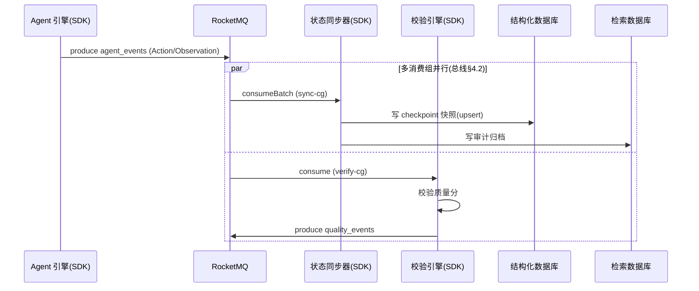
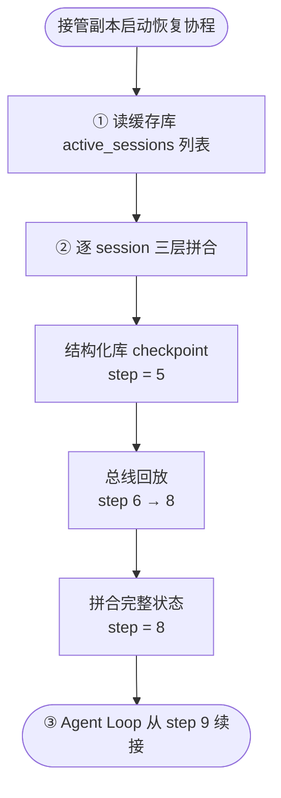

# 状态同步器 2.1 架构设计

> **本文描述** `状态同步器` —— 控制面的**状态物化管道**:一个嵌入 `gnex-bus-sdk` 的无状态消费方微服务,异步消费消息总线上的事件流,将增量状态物化到多种持久存储(结构化数据库 checkpoint / 检索数据库审计归档 / 成本与质量计量),并在故障时提供"快照 + 事件回放"的三层恢复能力。
>
> **本文与 [`d8-bus-service-2.1-architecture.md`](./d8-bus-service-2.1-architecture.md) 配套**:总线定义**管道契约**(produce/consume/ack/重试/死信),本文定义**消费方架构**(怎么消费、怎么物化、怎么恢复)。状态同步器**不重新定义任何投递契约**,凡涉及投递语义处一律引用总线文档章节。
>
> **实现状态**:本文是 2.1 目标态设计,对齐总体架构 §8(状态面设计)与 §4(消息总线)。当前代码尚未落地大部分机制(现状差异见附录 B)。

---

## 0. 与总线文档的职责边界(读者必读)

| 关注点                              | 归属文档              | 状态同步器的立场                |
| ----------------------------------- | --------------------- | ------------------------------- |
| 投递契约(produce/consume/ack)       | 总线 §2               | **引用**,不自定义               |
| 重试/死信/背压机制                  | 总线 §2.7 / §6.4      | **依赖总线原生**,只配置策略参数 |
| MessageEnvelope 结构                | 总线 §2.1             | **只读消费**,按字段取用         |
| 消费循环、幂等去重、物化管线        | **本文 §2 / §4 / §5** | 自身职责                        |
| Checkpoint 表、审计/成本物化 schema | **本文 §6**           | 自身职责                        |
| 三层恢复协议(快照+回放拼合)         | **本文 §7**           | 自身核心价值                    |

**一句话**:总线是"管道",状态同步器是挂在管道上的"消费者 + 物化器 + 恢复器"。管道怎么投递由总线定,状态同步器只决定"收到之后怎么处理"。

> ⚠️ **缓存库写入的措辞冲突**(架构内部):总线 §7.2 时序图与总体架构 §5.4 行文提到状态同步器"物化到缓存数据库/回灌热状态",但总体架构 §8.4 的**冷路径定义明确不含缓存库**(只列结构化库+检索库+成本)。本设计**采纳 §8.4 口径:状态同步器不写缓存库**(理由见 §12.1)。缓存库热状态由 Agent 引擎经 StatePort SDK 直写(热路径),仅在缓存库故障恢复时由**控制面**回灌(§7.5),不是状态同步器的常态投影。

---

## 1. 服务定位

### 1.1 是什么

状态同步器是控制面的**状态物化管道**(总体架构 §5.4),CQRS **冷路径**的执行者。它把"已经发生过"的状态变更(以事件形式沉淀在总线上)**异步、可靠、幂等地**写成各种持久存储的快照与投影,使任意时刻故障后都能精确恢复。

核心职责(总体架构 §5.4):

1. 消费 `agent_events`、`sandbox.events` Topic,物化 checkpoint 快照与沙箱生命周期状态;
2. 消费 `cost_events` / `quality_events` / `audit_log`,物化成本计量、质量数据、审计归档;
3. 注册表更新(沙箱生命周期状态投影)。

### 1.2 不是什么

| 不做的事                         | 谁来做                                                       |
| -------------------------------- | ------------------------------------------------------------ |
| 不写缓存数据库热状态             | Agent 引擎经 StatePort SDK 直写(热路径)                      |
| 不做原语执行(Action/Observation) | agent↔sandbox 的 WebSocket 通道(总线 §4)                     |
| 不转发消息、不在投递热路径上     | 那是总线 SDK + RocketMQ 的事                                 |
| 不参与故障恢复过程本身           | 控制面执行恢复;状态同步器的产出(快照+事件)只是恢复的**数据源** |

### 1.3 协作关系

**与 Agent 引擎互不阻塞**(总体架构 §5.4 / §8.4):

- Agent 引擎**不等**状态同步器——Agent 每步经 StatePort SDK 直写缓存库(μs 级),事件经 audit 旁路异步发总线;
- 状态同步器**不等** Agent 引擎——它只消费总线上的事件,物化延迟(秒级)不影响 Agent 运行;
- 状态同步器宕机**不影响** Agent 运行:事件积压在 MQ 中(总线保证不丢,§2.7),恢复后重放即可。

---

## 2. 消费契约(引用总线 + 消费方用法)

> 本节只讲"状态同步器作为消费方怎么用总线契约",投递契约本身见总线 §2。

### 2.1 消费循环(基于 ack 回调)

状态同步器用总线 §2.3 的 `consume` / `consumeBatch`,遵循总线 §2.10 的 **ack 延迟确认**机制:

```text
循环:
  1. consumeBatch(topic=agent_events, consumerGroup=sync-cg, maxMessages=50, pollTimeout=5s)
     → 返回 List<ReceivedMessage>(可能空,见 §2.4)
  2. 对每条 msg:
     a. 幂等检查(msg.msgId,§2.2)→ 命中则 msg.ack.run() 跳过(仍要 ack,否则总线重投)
     b. 物化(写结构化库,§5)
     c. 写幂等标记(在 ack 之前;失败进入 §4.4 降级)
     d. msg.ack.run()          ← 成功才确认;不调 → 总线按 §2.7 重投
```

**顺序正确性约束**:**先物化、再标记、最后 ack**(总线 §2.10)。若反过来(先 ack 后物化),进程崩溃在 ack 之后、物化之前 → 消息既不被重投、又没物化 → **丢消息**。

> **`attempt` 字段的用法**(总线 §2.3 ReceivedMessage):每条消息带 `attempt`(第几次投递,≥1)。`attempt > 1` 说明总线已重试过——状态同步器可据此**增强幂等**(如对高 attempt 消息优先走 DB 唯一索引双重校验),也可用于监控"重试占比"指标(§9)。

### 2.2 幂等键选择(对齐总线 §2.5)

总线**不去重**,消费者必须幂等。状态同步器的幂等键选择(总线 §2.5 明确):

| 场景                                  | 用哪个键               | 理由                                                         |
| ------------------------------------- | ---------------------- | ------------------------------------------------------------ |
| **常规物化去重**(防重复投递)          | `envelope.msgId`       | broker 分配、每条唯一、必填。状态同步器绝大多数场景用这个    |
| **跨 Topic 配对去重**(防重复业务语义) | `properties.requestId` | 仅当需要"同一业务请求只处理一次"时(状态同步器很少需要,主要是 sandbox.request↔events 配对场景) |

> **重要修正**:总线 §2.1 明确 `msgId` 是 **bus/broker 分配、produce 时 bus 回填**的,不是生产者生成的。状态同步器消费时直接从 `envelope.msgId` 取用,幂等集合存这个 ID。

### 2.3 顺序消费(orderKey)

状态同步器依赖总线 §2.5 / §5.2.3 的顺序保证:**同 orderKey 落同队列 → 同队列单消费者顺序消费**。

- orderKey 格式 `{tenant}:{entity}`(总线 §2.1),对 agent_events 取 `{tenant_id}:{session_id}`;
- 状态物化**对顺序敏感**(step 序号、消息追加顺序)——若 step 3 先于 step 2 物化,单行 upsert 各自正确,但跨步会话状态会错乱;
- 组内保序、组间独立并行(总线 §6.5):sync-cg 与 verify-cg 在同一 queue 上各一个消费者,互不阻塞。

> **顺序消费的代价:队头阻塞**(总线 §6.3.2)。单 queue 单消费者下,某条消息重试 16 次会卡住整个 session 的事件处理。**应对**:① 长耗时物化(审计归档到检索库)拆独立管线/独立消费组,不与 checkpoint 低延迟物化共用 queue;② 物化设超时,超时即让步(不 ack,交总线重试);③ 按 queue 维度监控消费延迟。

### 2.4 异常处理(对齐总线 §2.9)

**必须区分两类失败**(总线 §2.9 关键区分):

| 失败类型                             | 表现                                       | 状态同步器应对                                               |
| ------------------------------------ | ------------------------------------------ | ------------------------------------------------------------ |
| **连接级** `BusUnavailableException` | broker 不可达(consume/consumeBatch 抛异常) | **绝不能当作"无消息"**——捕获后重连,否则消费者静默停止。重连期间不物化、不 ack |
| **业务级** 物化失败                  | DB 写失败、超时                            | **不调 ack** → 总线按 §2.7 原生重试 → 16 次后进 %DLQ%        |
| **正常空轮询**                       | pollTimeout 到,返回空 List                 | 继续循环 poll(**非异常**)                                    |

> **绝不能把连接异常当业务正常**——这是消费者静默停止消费的最常见 bug(总线 §2.9)。状态同步器的 consume 循环必须 try-catch `BusUnavailableException` 并重连,空 List 与异常语义不同。

---

## 3. Topic 与消费组矩阵

### 3.1 状态同步器消费的 Topic

> Topic 寻址契约的完整规范见 [`d8-bus-service-2.1-topic-design.md`](./d8-bus-service-2.1-topic-design.md)。本节只列状态同步器消费的部分。

| Topic            | 消费组         | 物化目标                  | 用途                         | 背压类别(总线§6.4)  |
| ---------------- | -------------- | ------------------------- | ---------------------------- | ------------------- |
| `agent_events`   | **sync-cg**    | 结构化数据库(checkpoint)  | Agent 事件 → checkpoint 物化 | 事件类(可降级)      |
| `sandbox.events` | **sync-cg**    | 结构化数据库              | 沙箱生命周期状态物化         | 控制类(不丢)        |
| `cost_events`    | **cost-cg**    | 结构化数据库              | LLM 成本计量                 | 事件类(可降级)      |
| `quality_events` | **quality-cg** | 结构化数据库              | 质量数据归档                 | 事件类(可降级)      |
| `audit_log`      | **audit-cg**   | 检索数据库(+结构化库副本) | 审计归档                     | **审计类(不丢,P1)** |

### 3.2 一 Topic 多消费组(总线 §4.2 关键设计)

`agent_events` 同时被 sync-cg(物化 checkpoint,慢)和 verify-cg(校验质量分,快)消费——两个消费组**各自维护消费位点,互不阻塞**,进度可相差数秒,这是预期的。

> 这正是状态同步器(sync-cg)即使物化慢、积压,也不影响校验引擎(verify-cg)实时质量评分的原因。

### 3.3 不在状态同步器范围的消费组(声明)

| 消费组        | 消费者                                   | 是否本文范围                                           |
| ------------- | ---------------------------------------- | ------------------------------------------------------ |
| sched-cg      | 沙箱调度器(消费 sandbox.request)         | ❌ 调度器逻辑                                           |
| agent-cg      | Agent 引擎(消费 sandbox.events,恢复委派) | ❌ Agent 引擎逻辑                                       |
| verify-cg     | 校验引擎(消费 agent_events,质量评分)     | ❌ 校验引擎逻辑(但与 sync-cg 共享 agent_events,见 §3.2) |
| {agent_id}-cg | Agent 引擎(a2a.delegate/response)        | ❌ A2A 协作                                             |

---

## 4. 消费可靠性(基于总线原生能力)

> 本节的可靠性**完全依赖总线 RocketMQ 原生机制**(总线 §2.7 / §6.3),状态同步器只做幂等物化,不自建重试/死信状态机。

### 4.1 at-least-once + 幂等(ack 语义)

- **at-least-once 投递**(总线 §2.5):消息至少送达一次,**可能重复**——重复由幂等物化兜底。
- **幂等物化是硬约束**(总体架构级):因为幂等检查可能降级(§4.4),同一条消息可能被物化多次,所有物化操作必须**天然幂等**(upsert / 唯一约束,§5.3)。

### 4.2 幂等去重实现

| Topic 频率                         | 去重方式                  | 实现                                  | TTL      |
| ---------------------------------- | ------------------------- | ------------------------------------- | -------- |
| 高频(agent_events、sandbox.events) | 缓存库 Set                | `SISMEMBER` 检查 / `SADD` 标记        | 24h / 6h |
| 低频(cost_events、quality_events)  | 结构化库唯一索引          | `ON CONFLICT (msg_id) DO NOTHING`     | —        |
| 审计(audit_log)                    | 缓存库 Set + 结构化库副本 | 双重(审计有结构化库副本,去重窗口可短) | 1h       |

**per-消费组 TTL 矩阵**(按业务对重复的容忍度分级):

| 消费组     | Topic          | TTL         | 理由                                 |
| ---------- | -------------- | ----------- | ------------------------------------ |
| sync-cg    | agent_events   | 24h         | checkpoint 不能丢也不能重复,最长窗口 |
| sync-cg    | sandbox.events | 6h          | 沙箱事件量小                         |
| quality-cg | quality_events | DB 唯一索引 | 低频,不占缓存库                      |
| cost-cg    | cost_events    | DB 唯一索引 | 低频                                 |
| audit-cg   | audit_log      | 1h          | 审计在结构化库有副本                 |

**内存估算**(高频 Set):ID 本体约 64 字节,但 Redis Set 单成员含 dictEntry + SDS 开销约 60–80 字节,单条实际 100+ 字节。agent_events sync-cg 日均 1000 万条 → 稳态内存约 **1~1.5GB**(非仅按 ID 算的 640MB),容量规划按此预留。

> **并发竞态**(总线 §6.3.1):"check-then-mark" 有竞态,建议用 `SETNX` 原子置位或"先置 processing 标记再处理"。

### 4.3 重试与死信(引用总线原生)

- **重试**:物化失败(不 ack / 抛异常)由 RocketMQ **原生延迟等级重试**(总线 §2.7:18 级 `1s 5s 10s 30s 1m ... 2h`,`maxReconsumeTimes` 默认 16)。状态同步器**不自建重试计数**,只决定消费成功/失败(ack 与否)。
- **死信**:16 次耗尽 → 进 `%DLQ%{consumerGroup}`(总线 §2.7),持久化保留 72h,运维经总线 status 的 `requeue` 恢复(总线 §2.4)。
- **audit_log 死信特例**(总线 §2.4 / §6.4):audit_log 进 %DLQ% **必须 P1 告警 + 及时 requeue**——%DLQ% 默认保留 72h,过期即丢,而审计要 **90 天合规留存**。状态同步器的 audit-cg 消费者必须把 DLQ 告警接到 P1 通道。

### 4.4 降级策略

**缓存库不可用时**(幂等检查依赖缓存库):

- 幂等检查降级为"跳过"(返回未处理,允许消费),记录降级告警;
- 系统进入 at-least-once(可能重复物化),由 §5.3 的幂等物化兜底;
- 缓存库恢复后回灌。

**背压下的行为**(对齐总线 §6.4 背压分类):

| 管线                                | 背压类别   | 状态同步器行为                                               |
| ----------------------------------- | ---------- | ------------------------------------------------------------ |
| checkpoint / 沙箱状态 / 成本 / 质量 | 事件类     | 物化延迟可接受(秒级),积压在 MQ,恢复后重放                    |
| 审计归档                            | **审计类** | **不丢**——降级到磁盘持久化队列(生产部署须挂 PV,总线 §6.1);进 DLQ 必须 P1 |

### 4.5 effectively-once 语义(正确性证明)

> at-least-once + 幂等 ≠ exactly-once 投递,而是 **effectively-once(物化效果上恰好一次)**。

**正确表述**:每条消息**至少被投递一次**;物化操作幂等,故多次投递**产生相同的最终物化效果**。

证明:

- **至少一次**:物化失败 → 不 ack → 总线原生重投 → 重试物化;16 次失败 → DLQ,消息未物化但 MQ 中仍保有。
- **效果上一次**:
  - 正常:消费 → 物化 → 标记 → ack,效果一次;
  - 物化成功但标记失败:重投再次物化,upsert 保证结果不变;
  - 标记成功但未 ack:重投,幂等检查命中,跳过物化。

**不要写成"至多物化一次"**——物化动作可能执行多次,只是结果相同。exactly-once 投递需端到端分布式事务,代价大,本设计不采用(§12.4)。

---

## 5. CQRS 投影与物化管线

### 5.1 双路径定位(冷路径执行者)

总体架构 §8.4 的双路径写入机制,状态同步器是**冷路径**的执行者:

1. **热路径(同步)**:Agent 引擎每步经 StatePort SDK 直连缓存库读写热状态(μs 级),同时发事件到总线——**不经状态同步器**;
2. **冷路径(异步)**:**状态同步器**消费总线事件,写结构化库 checkpoint + 检索库审计归档 + 成本计量;
3. **checkpoint 触发**:Agent 引擎每 N 步同步触发 checkpoint(写缓存库 + 发 CheckpointSaved 事件),状态同步器异步持久化到结构化库;
4. **不丢数据保证**:MQ 事件持久化在前,结构化库投影在后;即使状态同步器崩溃,事件仍在 MQ(总线 §2.7 ISR 副本),恢复后重放即可。



### 5.2 物化管线设计

状态同步器内部按存储目标拆分多条物化管线,每条管线一个缓冲区,三个触发条件(谁先到谁生效):

| 管线       | 消费源         | 写入目标     | 批大小 | 时间阈值 |
| ---------- | -------------- | ------------ | ------ | -------- |
| checkpoint | agent_events   | 结构化数据库 | 50 条  | 200ms    |
| 沙箱状态   | sandbox.events | 结构化数据库 | 50 条  | 200ms    |
| 成本       | cost_events    | 结构化数据库 | 20 条  | 500ms    |
| 审计       | audit_log      | 检索数据库   | 100 条 | 1s       |
| 质量       | quality_events | 结构化数据库 | 20 条  | 500ms    |

**例外:CheckpointSaved 立即刷盘**(总体架构 §8.4 / §12.3)。CheckpointSaved 是 Agent 引擎主动触发的同步点,若状态同步器不立即刷盘而在缓冲区延迟 200ms,这 200ms 窗口内若崩溃,该 checkpoint 就丢——恢复时拿到稍旧一版 checkpoint,多一次回放步骤。故 CheckpointSaved 事件到达时**不等批次,立即刷盘**。

> **队头阻塞的应对**(§2.3):长耗时管线(审计归档到检索库,1s 批)与低延迟管线(checkpoint,200ms)分属不同消费组/不同 queue,避免审计慢查询拖累 checkpoint 物化。

### 5.3 物化的幂等性(架构级硬约束)

所有物化操作必须**天然幂等**:

- checkpoint 表:upsert(`ON CONFLICT DO UPDATE`);
- 审计表 / 成本表 / 质量表:唯一约束(`ON CONFLICT (msg_id) DO NOTHING`)。

第二次写入静默覆盖或忽略,结果与第一次完全相同——这是 effectively-once(§4.5)在存储层的落地。

---

## 6. 存储设计

### 6.1 状态分层(总体架构 §8.1)

| 层次   | 状态类型                         | 存储          | 持久性           | 状态同步器是否写         |
| ------ | -------------------------------- | ------------- | ---------------- | ------------------------ |
| 热状态 | 会话级 messages 尾部、注册表、锁 | 缓存数据库    | 可丢失(冷备兜底) | ❌ 不写(Agent 引擎热路径) |
| 温状态 | checkpoint 快照、配置            | 结构化数据库  | 必须持久         | ✅ 写(checkpoint 管线)    |
| 冷状态 | 历史事件流、审计日志             | 总线 → 检索库 | 永久(合规)       | ✅ 写(审计管线)           |

> **权威数据源原则**(总体架构 §8.1):缓存库是加速缓存**非权威源**。真正权威是「结构化库快照 + 总线增量事件」。这条原则直接决定三层恢复协议(§7)的存在——恢复不依赖缓存库。

### 6.2 Checkpoint 表 DDL(PG + SQLite 双方言)

> 代码现状:实际表名为 `react_checkpoint`(迁移脚本 `V58__react_checkpoint.sql`),由 Agent 引擎 JDBC 直写。本表为目标态投影表 schema,物化由状态同步器异步完成(附录 B)。

**PostgreSQL**(生产):

```sql
CREATE TABLE agent_checkpoints (
    session_id   TEXT        NOT NULL,
    step         INT         NOT NULL,
    messages     JSONB       NOT NULL,
    context_meta JSONB,
    agent_state  JSONB,
    tenant_id    TEXT        NOT NULL DEFAULT 'default',
    version      INT         NOT NULL DEFAULT 1,
    created_at   TIMESTAMPTZ NOT NULL DEFAULT now(),
    updated_at   TIMESTAMPTZ NOT NULL DEFAULT now(),
    PRIMARY KEY (session_id, step)
);

INSERT INTO agent_checkpoints (session_id, step, messages, context_meta, agent_state, tenant_id)
VALUES (?, ?, ?, ?, ?, ?)
ON CONFLICT (session_id, step)
DO UPDATE SET messages = EXCLUDED.messages,
              context_meta = EXCLUDED.context_meta,
              agent_state = EXCLUDED.agent_state,
              updated_at = now();
```

**SQLite**(开发/测试):

```sql
CREATE TABLE agent_checkpoints (
    session_id   TEXT    NOT NULL,
    step         INTEGER NOT NULL,
    messages     TEXT    NOT NULL,          -- JSON 文本
    context_meta TEXT,
    agent_state  TEXT,
    tenant_id    TEXT    NOT NULL DEFAULT 'default',
    version      INTEGER NOT NULL DEFAULT 1,
    created_at   TEXT    NOT NULL DEFAULT (datetime('now')),
    updated_at   TEXT    NOT NULL DEFAULT (datetime('now')),
    PRIMARY KEY (session_id, step)
);

INSERT INTO agent_checkpoints (session_id, step, messages, context_meta, agent_state, tenant_id)
VALUES (?, ?, ?, ?, ?, ?)
ON CONFLICT (session_id, step)
DO UPDATE SET messages = excluded.messages,
              context_meta = excluded.context_meta,
              agent_state = excluded.agent_state,
              updated_at = datetime('now');
```

### 6.3 审计 / 成本 / 质量表(唯一约束防重)

```sql
-- 审计表(msg_id 唯一约束,幂等物化)
CREATE TABLE audit_events (
    msg_id     UUID        NOT NULL PRIMARY KEY,   -- = envelope.msgId
    session_id TEXT        NOT NULL,
    event_type TEXT        NOT NULL,
    payload    JSONB       NOT NULL,
    event_time TIMESTAMPTZ NOT NULL,
    created_at TIMESTAMPTZ NOT NULL DEFAULT now()
);

-- 成本表 / 质量表同理:msg_id 唯一约束
```

> 检索数据库(审计归档的目标之一)选型待定——代码现状无 ES/向量库依赖(附录 B)。审计采用结构化库 + 检索库**双写**:结构化库满足 90 天合规查询,检索库满足全文/语义检索。

---

## 7. 三层恢复协议(核心价值)

> 架构出处:总体架构 §8.7。这是状态同步区别于"普通写库"的**唯一核心价值**。

### 7.1 三层恢复源

| 层                    | 恢复什么                      | 数据时效         | 恢复速度 | 角色                          |
| --------------------- | ----------------------------- | ---------------- | -------- | ----------------------------- |
| ① 缓存库热状态        | 当前会话实时状态              | 最新(可能丢几秒) | 毫秒     | **加速缓存**(有则快,无则降级) |
| ② 结构化库 checkpoint | 完整 messages 快照 + step     | checkpoint 时刻  | 十毫秒   | **权威快照**(恢复基线)        |
| ③ 总线事件流          | checkpoint 之后到故障前的增量 | 完整不丢         | 百毫秒   | **增量补齐**(补到故障前一刻)  |

三层**不是三选一**,而是**增量拼合**。状态同步器产出的是 ②③ 的数据源——它**不参与**恢复过程本身(工作已提前完成)。

### 7.2 确定性合并算法

```
merged_state = db_checkpoint(session_id)
             + replay(mq_events_after(step = db_checkpoint.last_step, session_id))
```

步骤:

1. 查结构化库,获取最近 checkpoint(含 step 编号和 messages 快照);
2. 从总线回放该 step 之后的所有事件(ActionDispatched、ObservationReturned 等),按时间戳顺序应用到 messages 上;
3. 若缓存库热状态存在且 step 更新,以缓存库为准覆盖 ②③ 的合并结果。

> **缓存库在合并中的角色澄清**(呼应 §6.1 "缓存库非权威源"):步骤③的"覆盖"是**有条件加速项**,非权威判断——仅当缓存库 step 比快照新时才取缓存库值。若缓存库缺失/过期(step 更旧)/主从切换中(§7.5),**直接采用 ②③ 结果**,绝不以缓存库为权威。

### 7.3 控制面故障恢复



恢复粒度是 **session**,不是控制面整体。1000 个 active session 逐个恢复、逐个续接,某个慢不影响其他。恢复是**主动**的——接管副本不等用户重新发请求。

### 7.4 沙箱故障恢复

**关键洞察**:沙箱本身无状态,真正的"状态"在控制面 checkpoint 里。沙箱崩溃后恢复的不是沙箱内部状态,而是控制面从 checkpoint 的下一步重新派发 Action 到新沙箱(总线 §7.1 时序)。

| 沙箱内状态             | 是否恢复             | 说明                  |
| ---------------------- | -------------------- | --------------------- |
| 执行环境(包、环境变量) | ✅ 重建               | 镜像 + 初始化脚本     |
| 临时文件(/tmp)         | ❌ 不恢复             | 随沙箱销毁            |
| Agent 执行进度         | ✅ 从 checkpoint 恢复 | 控制面持有,不依赖沙箱 |

> **幂等性是前提**:若崩溃前 Action 已执行但 Observation 没返回,新沙箱会重执行该步。必须保证重执行结果一致(覆盖写、带 idempotency_key)。

### 7.5 缓存库自身故障恢复

缓存库主从切换后,从库可能没同步完最新数据,热状态丢一部分:主库宕机 → 哨兵提升从库(秒级)→ 主从同步延迟丢失最近几秒 → 控制面读到部分热状态缺失 → 从结构化库 + 总线回灌重建热状态 → 完全恢复。

### 7.6 恢复边界与只读降级

| 场景                                                      | 恢复方式                                                     | 覆盖  |
| --------------------------------------------------------- | ------------------------------------------------------------ | ----- |
| 正常恢复(Pod 重启/滚动更新/OOM)                           | 结构化库 checkpoint + 总线增量重放                           | 99.9% |
| 缓存库主从切换/分片迁移                                   | 结构化库全量重建 + 总线重放,秒级                             | —     |
| **总线集群全不可用**(所有 Broker + ISR 同时失效,概率极低) | **只读降级**:拒绝新 Action 下发,已挂起 session 等待总线恢复。**绝不从不完整的结构化库快照续接执行** | 兜底  |

---

## 8. 故障恢复矩阵

> RTO 对齐总体架构 §12.1 容灾矩阵。

| 故障场景            | 影响                                  | 恢复机制                                                   | RTO            |
| ------------------- | ------------------------------------- | ---------------------------------------------------------- | -------------- |
| 状态同步器 Pod 重启 | 物化暂停,事件积压                     | 总线 SDK 从上次位点恢复(总线§2.7),幂等集合仍生效           | 秒级           |
| 处理崩溃未 ack      | 同一条消息重投                        | 幂等检查 + upsert 保证不重复                               | 即时           |
| 缓存库宕机          | 幂等检查降级                          | 跳过幂等检查,接受重复,恢复后回灌(§4.4)                     | 恢复后         |
| 结构化库不可用      | 物化失败,消息重投                     | 总线原生重试 16 次后进 DLQ,人工 requeue(总线§2.4)          | 取决于恢复     |
| 总线集群不可用      | 消费者阻塞(`BusUnavailableException`) | 生产者写本地持久队列(总线§6.1);消费者阻塞重连;进入只读降级 | 取决于总线恢复 |
| Agent 引擎 Pod 崩溃 | session 中断                          | 新 Pod 三层拼合恢复(§7.3)                                  | 秒级           |
| 沙箱节点故障        | 执行中断                              | 新沙箱 + checkpoint 续接(§7.4)                             | 秒~十秒级      |
| audit_log 进 DLQ    | 审计缺失(72h 后丢)                    | **P1 告警 + 及时 requeue**(总线§2.4)                       | 人工           |

---

## 9. 监控与运维

### 9.1 引用总线 status(总线 §2.4 / §8)

状态同步器的**消费侧运维**直接用总线 status 契约,不自建:

- `BackpressureStatus`:各 topic 积压数(消费位点滞后)——判断物化是否跟得上;
- `DeadLetterStats` / `listDeadLetters`:按租户查死信——audit-cg 的 DLQ 重点盯;
- `Subscription`:订阅关系 + lag——sync-cg / cost-cg 等消费组状态;
- `queryMessage(messageId)`:精确查消息轨迹——排查重投/幂等问题;
- `requeue(messageId)`:死信恢复——audit_log 死信的恢复路径。

### 9.2 物化指标(状态同步器自身导出)

- `consume_latency_seconds{topic, consumerGroup}`:消费处理耗时 P50/P90/P99;
- `materialize_latency_seconds{targetTable}`:写库延迟 P50/P90/P99;
- `materialize_batch_size{targetTable}`:批写入条数分布;
- `idempotent_hits_total{topic, consumerGroup}`:幂等命中(重复丢弃);
- `idempotent_degraded_total{topic, consumerGroup}`:降级次数;
- `retry_attempt_distribution`:基于 `attempt` 字段的重试占比(§2.1);
- `checkpoint_flush_immediate_total`:CheckpointSaved 立即刷盘次数。

### 9.3 告警与 HPA

| 条件                              | 级别   | 动作                        |
| --------------------------------- | ------ | --------------------------- |
| consumer_lag > 10 万条            | P2     | 通知 + HPA 扩容(总线§6.4.1) |
| consumer_lag > 50 万条            | P1     | 通知 + HPA 扩容 + 值班介入  |
| consume_latency_p99 > 5s          | P2     | 通知                        |
| idempotent_degraded > 100 次/5min | P2     | 通知(缓存库可能有问题)      |
| materialize_latency_p99 > 2s      | P2     | 通知(数据库可能有问题)      |
| **audit_log 进 DLQ**              | **P1** | 通知 + requeue(90 天合规)   |
| dlq_total(其他)> 0                | P3     | 通知,Dashboard 查看         |

HPA 绑定 `consumer_lag` 自定义指标(总线 §6.4.1),目标 lag < 1000 条。最小 2 副本,最大受队列数限制(消费者数 ≤ 队列数)。状态同步器多副本时,同 orderKey 仍落同队列、由组内单副本消费——**副本扩缩不破坏顺序**(总线 §9.1)。

---

## 10. 集群模式适配

> 状态同步器作为嵌入 SDK 的无状态消费方,集群能力完全继承总线 §9。

| 集群要素          | 状态同步器的表现                                             |
| ----------------- | ------------------------------------------------------------ |
| 多副本            | 每副本嵌入 SDK 连 RocketMQ;加副本 = 加消费者实例,broker 自动 rebalance 队列(总线§9.1) |
| HPA               | consumer_lag 涨 → HPA 加副本 → 新副本注册成消费者 → broker 分担(总线§9.1) |
| 顺序消费 + 多副本 | 同 orderKey 落同队列,同时只分给组内一个副本 → 同 session 始终同一副本消费,扩缩不破坏顺序(总线§9.1) |
| 状态外化          | 状态同步器自身无状态:所有状态在 RocketMQ(位点/死信)+ State Plane(物化结果)。任意副本挂了,其他副本接管(总线§9.1) |

**关键**:状态同步器从中小型到大型,**消费代码零改动**——只是 RocketMQ 从单机→集群→多集群,SDK 连接配置变(总线 §9.2)。

---

## 11. 落地路径(对齐总线 Phase)

> 状态同步器的落地**依赖总线 Phase3**(SPI + RocketMQ transport),自身工作在总线契约就绪后开展。

| Phase        | 内容                                                         | 依赖                     |
| ------------ | ------------------------------------------------------------ | ------------------------ |
| **P-sync-1** | 消费循环骨架(consumeBatch + ack 回调,§2.1)+ 异常处理(BusUnavailableException,§2.4) | 总线 Phase3-c(transport) |
| **P-sync-2** | 幂等去重引擎(Redis Set + DB 唯一索引,§4.2)+ 降级(§4.4)       | 总线 Phase3-c            |
| **P-sync-3** | 物化管线(checkpoint/沙箱/成本/质量,§5.2)+ 物化幂等(§5.3)     | P-sync-1/2               |
| **P-sync-4** | 审计管线 + 检索库选型(§6.3)+ audit_log DLQ P1 告警(§4.3)     | 检索库选型               |
| **P-sync-5** | 三层恢复协议(§7)+ checkpoint 表迁移(§6.2)                    | P-sync-3                 |
| **P-sync-6** | 监控指标 + HPA + status 集成(§9)                             | P-sync-3                 |

> 总线 Phase3-a(SPI 抽象)是**所有 transport/可靠性工作的硬障碍**(总线 §10),状态同步器的 P-sync-1 之后全部依赖它完成。

---

## 12. 关键设计决策

### 12.1 为什么状态同步器不写缓存库

缓存库由 Agent 引擎经 StatePort SDK 直写(热路径,同步,μs 级)。若状态同步器也写缓存库,两条写入路径会竞争同一份数据导致不一致。职责分离:Agent 引擎写缓存(热路径),状态同步器写持久存储(冷路径)。缓存库热状态仅在故障恢复时由**控制面**从结构化库 + 总线回灌(§7.5),不是状态同步器的常态投影。

> 本裁决采信总体架构 §8.4 冷路径定义;总线 §7.2 时序图与 §5.4 行文提到状态同步器"回灌热状态"系措辞冲突(见 §0)。

### 12.2 为什么是 upsert 而非 insert

幂等检查可能降级(缓存库不可用时跳过去重),同一条消息可能被物化多次。upsert 保证第二次写入静默覆盖,不报错、不阻塞消费流程——这是 effectively-once(§4.5)成立的物质基础。

### 12.3 为什么 CheckpointSaved 需立即刷盘

见 §5.2。崩溃窗口内丢失 checkpoint → 恢复时多一次回放步骤。

### 12.4 为什么是 at-least-once + 幂等而非 exactly-once

见 §4.5。exactly-once 需端到端分布式事务(两阶段提交、事务性消息),吞吐损失显著、复杂度高。at-least-once + 幂等物化把去重责任从 MQ 层移到消费者层,代价是物化必须幂等——在 upsert 场景下约束可接受。

### 12.5 为什么依赖总线原生重试/死信,不自建

总线 §2.7 已明确:2.1 删除 2.0 自建的 MessageStateStore + scheduler,重试/死信完全交给 RocketMQ 原生。状态同步器作为消费方,只决定消费成功/失败(ack 与否),重试计数与退避由总线/RocketMQ 执行——避免与总线状态机重复、冲突。

### 12.6 为什么必须保证顺序(§2.3)

幂等只保证"不重",不保证"不乱"。状态物化对顺序敏感。用 orderKey(总线抽象)保同 session 有序,是状态能被正确物化的前提,与幂等并列。

### 12.7 关于原子写入

物化 → 标记幂等 → ack 三步**不是原子操作**(总线 §2.10)。任一步失败都可能导致重投,但 upsert + 幂等检查的组合保证最终一致性。严格原子性可用本地事务表/outbox 模式,但 upsert 已够用。

---

## 附录 A:术语表

| 术语             | 定义                                                         | 出处            |
| ---------------- | ------------------------------------------------------------ | --------------- |
| 状态同步器       | 控制面的状态物化管道,冷路径执行者                            | 本文            |
| 热路径 / 冷路径  | Agent 引擎直连缓存库(热,同步)/ 状态同步器经总线物化(冷,异步) | 总体架构§8.4    |
| Event Sourcing   | 所有状态变更表示为不可变事件,可回放重建                      | 总体架构§8.3    |
| CQRS             | 读写分离:写路径走事件驱动,读路径走按需查询                   | 总体架构§8.4    |
| 物化             | 将事件流中的增量状态写入持久化存储                           | 本文            |
| effectively-once | 至少一次投递 + 幂等物化 = 物化效果上恰好一次                 | 本文§4.5        |
| Checkpoint       | Agent Loop 执行进度的完整快照                                | 总体架构§8.5    |
| 三层恢复         | 缓存库(加速)+ 结构化库快照(基线)+ 总线增量(补齐)拼合恢复     | 总体架构§8.7    |
| ack 延迟确认     | consume 返回时暂不确认,调用方 ack.run() 后才提交给 broker    | 总线§2.10       |
| orderKey         | 顺序键 {tenant}:{entity},映射 shardingKey 保序               | 总线§2.1/§5.2.3 |
| %DLQ%            | RocketMQ 原生死信队列 `%DLQ%{consumerGroup}`                 | 总线§2.7        |

---

## 附录 B:实现现状与迁移路径

> 本文为 2.1 目标态。当前代码与目标态差异(基于 2026-06-30 代码核查):

| 目标态机制                        | 当前代码现状                                                 | 迁移要点                                                  |
| --------------------------------- | ------------------------------------------------------------ | --------------------------------------------------------- |
| 嵌入 gnex-bus-sdk 消费(RocketMQ)  | 自研 database 模式(默认,status 字段抢占)+ Redis Streams(XACK),无 ack 回调/orderKey | 依赖总线 Phase3 迁移到 RocketMQ(总线§10)                  |
| consumeBatch + ack 回调           | 单条 poll + XACK                                             | 依赖总线 Phase3-c transport                               |
| 幂等去重(Set/唯一索引)            | 未实现,仅消费者组 XACK                                       | 新增幂等引擎 + msgId 去重(P-sync-2)                       |
| 状态同步器微服务(异步物化)        | 不存在。目标表已存在但由各引擎**同步直写**(`react_checkpoint`/`audit_log`/`token_usage`) | 新建独立消费者服务,把同步直写改为消费总线异步写(P-sync-3) |
| 三层恢复协议                      | 未实现,仅单点 checkpoint 恢复(`ReActCheckpointService`)      | 补快照+回放拼合(P-sync-5)                                 |
| 检索数据库(审计归档)              | 不存在,无 ES/向量库依赖                                      | 选型待定(P-sync-4)                                        |
| checkpoint 表 `agent_checkpoints` | 实际表名 `react_checkpoint`(`V58`),引擎 JDBC 直写            | 迁移 schema 或新建投影表(P-sync-5)                        |

**迁移顺序**(地基先行,对齐 §11):

1. **P-sync-2 消费可靠性地基**(幂等+顺序+DLQ)——状态同步能成立的前提,当前完全空白;
2. **P-sync-3 物化管线**——把引擎同步直写改为状态同步器异步物化;
3. **P-sync-5 三层恢复协议**——状态同步区别于普通写库的核心价值;
4. **P-sync-4 审计管线 + 检索库**——依赖检索库选型。

> 全部依赖总线 Phase3(SPI + RocketMQ transport)就绪——在当前自研 database/Redis 双传输下,P-sync-1 之后的工作无法落地。