# 认证服务 v2.0 设计方案

> **版本**：v2.0 终稿
> **基底**：GNEX AgentOS 拆分（SPLIT）。本文只描述 **认证服务** 本身。
> **范围**：从用户身份验证到 Token 签发/校验/吊销的完整链路。不含授权（运营管理服务职责）、不含网关面 Token 校验（API Gateway 职责），只在认证服务视角描述与它们的边界。
> **上游依据**：GNexCore 架构设计 §5.5 认证服务 + §6.1 API Gateway

---

## 1. 服务定位

认证服务是控制面的**身份认证中心**，负责"你是谁"（Authentication）。它是平台咽喉——每个请求都经过身份校验，性能与可靠性直接决定全平台可用性。

**职责**：

| 认证服务负责 | 不负责 |
| --- | --- |
| SSO 对接（作为 SP/RP 消费外部 IdP） | 授权（"你能做什么"→运营管理服务） |
| Token 签发（JWT + API Key） | Token 在线校验（→API Gateway 本地校验） |
| 密码管理（哈希存储·验证·重置） | 密码策略配置（→运营管理服务） |
| Token 吊销（黑名单） | 限流/路由（→API Gateway） |
| 刷新 Token（Refresh Token） | 审计日志写入（→消息总线旁路） |
| API Key 管理（程序化访问凭证） | Agent 工具/技能的 API Key/OAuth Token 管理（→运营管理服务/凭证服务） |
| | Agent 执行原语时的权限检查（→Agent 引擎 InspectorChain） |
| | Agent 间通信的双向认证 mTLS（→A2A 网关） |
| | 知识库文档 ACL 过滤（→状态面检索层） |

> **SSO 角色定位**：认证服务**只作为 SSO Consumer（SP/RP）**——对接企业已有的 Identity Provider（Keycloak、AD、企业微信等），完成身份验证后签发 GNEX Token。认证服务**不作为 SSO Provider 向第三方提供身份认证服务**——如果未来 GNEX 需要作为 IdP，那是另一个独立服务的职责，不在本文范围。
>
> **职责边界说明**（重要）：
> - **Agent 工具的凭证管理**（如 Skill 调用外部 API 时所需的 API Key / OAuth Token）不属于认证服务——这是"Agent 工具配置"而非"用户身份认证"，由运营管理服务或独立凭证服务管理，通过 `CredentialHandler` 策略模式在 Agent 运行时自动注入。
> - **Agent 执行原语时的权限检查**（工具白名单、三层门禁）由 Agent 引擎的 `InspectorChain` 执行，不是认证服务职责。
> - **Agent 间通信的双向认证**（A2A mTLS）由 A2A 网关负责。
> - **程序化访问的 API Key**（CI/CD Pipeline、自动化脚本）属于用户/租户身份的延伸——"谁在调用 API"——因此属于认证服务职责（详见 §2.4 ApiKeyInterface）。

**认证/授权/校验三分离**（架构核心约束）：

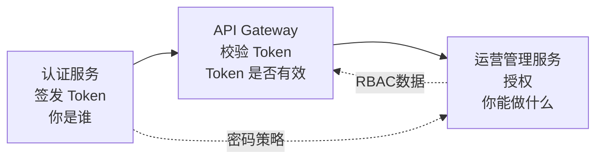

- **认证服务**签发 Token 后，不再参与请求热路径
- **API Gateway**在网关面本地校验签名+过期（毫秒级），同时查缓存数据库黑名单做在线吊销校验（亚毫秒级）
- **运营管理服务**管理 RBAC 权限数据，Gateway 据此做端点鉴权

> **关键**：网关面成为统一安全入口，**不反向依赖控制层**。认证服务只在登录/签发/吊销时被调用，不在每请求热路径上。

---

## 2. 对外契约

认证服务对外暴露四类 Port：认证 Port、Token Port、密码 Port、API Key Port。Port 接口定义在 `libs/gnex-contracts`，实现由认证服务提供。

### 2.1 认证 Port：AuthenticationInterface

```java
interface AuthenticationInterface {
    AuthResult authenticate(AuthRequest request);
    SsoAuthResult ssoAuthenticate(SsoAuthRequest request);
    LogoutResult logout(LogoutRequest request);
}
```

**AuthRequest / AuthResult**：

```
AuthRequest
├─ username     String   用户名
├─ password     String   明文密码（传输层 TLS 加密）
└─ tenantId     String   租户 ID（多租户登录隔离）

AuthResult
├─ success      boolean
├─ accessToken  String   JWT Access Token（短效，默认 30min）
├─ refreshToken String   Refresh Token（长效，默认 7d）
├─ expiresIn    long     Access Token 有效期（秒）
├─ userId       Long     用户 ID
├─ tenantId     String   租户 ID
└─ roles        List     角色列表
```

**SsoAuthRequest / SsoAuthResult**：

```
SsoAuthRequest
├─ provider     String   SSO 提供商标识（如 "keycloak", "ad"）
├─ code         String   OAuth2 authorization_code / SAML2 assertion
├─ redirectUri  String   回调地址
└─ tenantId     String   租户 ID

SsoAuthResult
├─ success      boolean
├─ accessToken  String   JWT Access Token（租户确定后签发；user_select 待选租户时为空）
├─ refreshToken String   Refresh Token（同上）
├─ userId       Long     关联的 GNEX 用户 ID（首次 SSO 自动创建）
├─ tenantId     String   租户 ID（bound/idp_claim 模式直接返回；user_select 待选时为空）
├─ roles        List
├─ linked       boolean  是否为本次 SSO 新创建的用户
├─ pendingNonce String   user_select 模式下的待选租户凭证（前端用于 select-tenant 请求）
└─ tenants      List     可选租户列表（仅 user_select 且需选租户时返回）
```

**LogoutRequest / LogoutResult**：

```
LogoutRequest
├─ accessToken  String   待吊销的 Access Token
└─ refreshToken String   待吊销的 Refresh Token

LogoutResult
└─ success      boolean  吊销是否成功
```

### 2.2 Token Port：TokenInterface

```java
interface TokenInterface {
    TokenPair issueToken(Long userId, String username, String tenantId, List<String> roles);
    TokenValidationResult validateToken(String token);
    RefreshResult refreshToken(String refreshToken);
    void revokeToken(String tokenId, TokenType type);
    void revokeAllTokensOfUser(Long userId);
}
```

**TokenPair**：

```
TokenPair
├─ accessToken    String   JWT Access Token
├─ refreshToken   String   JWT Refresh Token（独立签名，不同密钥）
├─ accessExpires  Instant  Access Token 过期时间
└─ refreshExpires Instant  Refresh Token 过期时间
```

**TokenValidationResult**：

```
TokenValidationResult
├─ valid        boolean
├─ userId       Long
├─ username     String
├─ tenantId     String
├─ roles        List<String>
├─ tokenId      String   Token 唯一标识（jti claim，用于吊销校验）
└─ expiresAt    Instant
```

### 2.3 密码 Port：PasswordInterface

```java
interface PasswordInterface {
    boolean verify(Long userId, String rawPassword);
    void changePassword(Long userId, String currentPassword, String newPassword);
    void resetPassword(PasswordResetRequest request);
    PasswordPolicyResult validatePolicy(String newPassword, Long tenantId);
}
```

**PasswordResetRequest**：

```
PasswordResetRequest
├─ userId       Long     目标用户 ID
├─ newPassword  String   新密码
└─ resetToken   String   重置凭证（由运营管理服务签发，有时效）
```

### 2.4 API Key Port：ApiKeyInterface

API Key 是面向**程序化访问**（CI/CD Pipeline、自动化脚本、后端服务）的长期凭证，与 JWT 互补：

| 特性 | JWT（Access + Refresh） | API Key |
| --- | --- | --- |
| 受众 | 人类用户、Web 前端 | 程序、脚本、CI/CD |
| 生命周期 | 30min + 7d 轮转 | 长期（默认 90d，可配置） |
| 刷新机制 | Refresh Token 轮转 | 提前续期（旧 Key 保留 24h 过渡期） |
| 吊销 | 黑名单（缓存数据库） | 直接删除（结构化数据库） |
| 租户绑定 | 签发时写入 `tid` claim | 创建时绑定 `tenant_id`，不可变更 |
| 权限范围 | 用户所有角色 | 创建时指定最小权限集（roles 子集） |

```java
interface ApiKeyInterface {
    ApiKey createApiKey(ApiKeyCreateRequest request);
    ApiKeyValidationResult validateApiKey(String apiKey);
    List<ApiKeyInfo> listApiKeysOfUser(Long userId, String tenantId);
    void revokeApiKey(String keyId);
    void revokeAllApiKeysOfUser(Long userId, String tenantId);
}
```

**ApiKeyCreateRequest / ApiKey**：

```
ApiKeyCreateRequest
├─ userId       Long     所有者用户 ID
├─ tenantId     String   绑定租户
├─ name         String   用途标识（如 "CI/CD Pipeline for project-x"）
├─ roles        List     授予的角色（必须为 userId 已有角色的子集）
├─ expireDays   int      有效期天数（默认 90，最长 365）
└─ ipWhitelist  List     可选 IP 白名单（CIDR 格式）

ApiKey
├─ keyId        String   唯一标识
├─ prefix       String   Key 前缀（如 "gnex_ak_"，用于日志脱敏）
├─ fullKey      String   完整 Key（仅在创建时返回一次，后续不可获取）
├─ hash         String   SHA-256 哈希（存储值，原始 Key 不落库）
├─ userId       Long
├─ tenantId     String
├─ roles        List
├─ expireAt     Instant
├─ lastUsedAt   Instant  最后一次使用时间
└─ enabled      boolean
```

**API Key 格式**：`gnex_ak_{32字节随机字符串}`，如 `gnex_ak_a1b2c3d4e5f6...`。前缀 `gnex_ak_` 用于 Gateway 区分 API Key 和 JWT。

**安全设计**：
- **只创建时返回一次**——fullKey 仅在 POST 响应中返回，数据库只存 SHA-256 哈希，无法事后查看
- **最小权限**——API Key 的 roles 必须为创建者已有角色的子集，不能越权
- **IP 白名单**——可选，Gateway 校验 API Key 时同时校验来源 IP
- **提前续期**——API Key 过期前 7 天允许创建新 Key，旧 Key 保留 24h 过渡期后自动回收
- **禁用不删除**——吊销后 `enabled=false`，保留审计记录

**Gateway 校验流程**：

```
请求头 Authorization: Bearer gnex_ak_xxx  （前缀 gnex_ak_ 区分于 JWT）
① Gateway 解析前缀识别为 API Key
② 调用 ApiKeyInterface.validateApiKey(fullKey)
③ 认证服务 SHA-256 哈希后查 api_key 表（索引查询，< 5ms）
④ 验证 enabled=true、未过期、IP 白名单匹配
⑤ 返回 userId、tenantId、roles → Gateway 注入请求头
```

### 2.5 契约语义约束

| 约束 | 说明 |
| --- | --- |
| **无状态签发** | Token 签发纯计算（JWT 自包含），不写数据库，不依赖外部状态 |
| **吊销走缓存数据库** | Token 吊销写入缓存数据库黑名单 Set（TTL = Token 剩余有效期），Gateway 亚毫秒级查询 |
| **密码单向哈希** | 只存 bcrypt/argon2id 哈希，不可逆；验证时比对哈希 |
| **SSO 只做 Consumer** | 认证服务作为 SP/RP 对接外部 IdP，不向第三方提供 SSO Provider 能力 |
| **SSO 自动关联** | 首次 SSO 登录自动创建 GNEX 用户并关联 IdP 账号；后续登录按 IdP subject 匹配 |
| **多租户隔离** | 认证请求必须携带 tenantId；Token claims 包含 tenantId；不同租户的 Token 空间隔离 |

---

## 3. 核心流程设计

### 3.1 用户名/密码登录

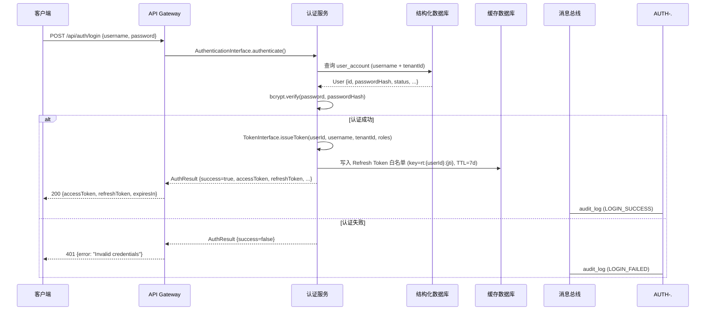

**关键设计**：

- **Access Token 不落库**——JWT 自包含，签发后不写数据库，校验纯靠签名+过期+黑名单
- **Refresh Token 白名单**——写入缓存数据库（`rt:{userId}:{jti}` → `1`，TTL = Refresh Token 有效期），刷新时校验白名单存在性；吊销时删除白名单 key
- **失败审计**——连续失败 5 次锁定账号 15 分钟（计数器存缓存数据库 `login_fail:{userId}`，TTL=15min），防止暴力破解

### 3.2 SSO 登录（以 OIDC idp_claim 模式为例）

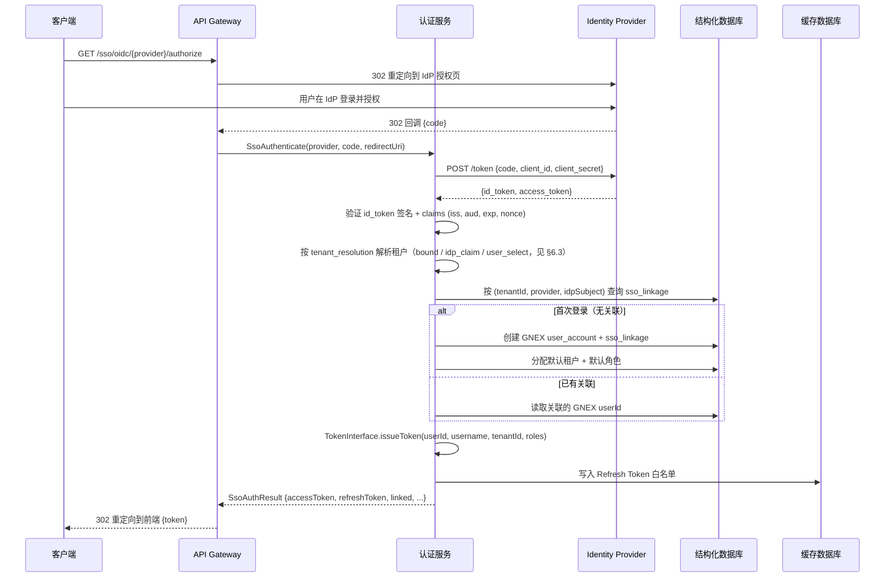

> `user_select` 模式下，SSO 回调后若需选租户，SsoAuthResult 返回 `pendingNonce` + `tenants` 列表，前端展示租户选择页面后调用 `POST /api/auth/sso/select-tenant` 完成登录。详见 §6.3 策略二。

**SSO 协议支持矩阵**（认证服务作为 SP/RP 对接外部 IdP）：

| 协议 | 实现方式 | 配置来源 | 当前状态 |
| --- | --- | --- | --- |
| **OIDC** | Spring Security OAuth2 Client + `DbClientRegistrationRepository` | `sso_config` 表 | ✅ 已实现 |
| **SAML2** | Spring Security SAML2 Service Provider + `DbRelyingPartyRegistrationRepository` | `sso_config` 表 | ✅ 已实现 |

> **不包含**：CAS、LDAP 直绑等——这些是 IdP 侧协议，认证服务作为 SP 只需对接 OIDC/SAML2 这两个标准协议即可覆盖绝大多数企业 IdP。若需对接非标 IdP，通过 OIDC 兼容层或 IdP 前置代理适配。

**SSO 配置动态加载**：`sso_config` 表存储各 IdP 的客户端配置（client_id、client_secret、issuer_uri 等），`DbClientRegistrationRepository` / `DbRelyingPartyRegistrationRepository` 从数据库动态构建 Spring Security 所需的 `ClientRegistration` / `RelyingPartyRegistration`，无需重启即可新增/修改 SSO 提供商。

### 3.3 Token 刷新

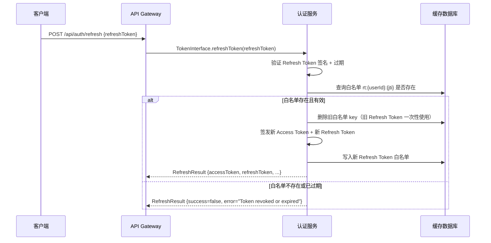

**Refresh Token 安全约束**：

| 约束 | 说明 |
| --- | --- |
| **一次性使用** | 每次 refresh 后旧 Refresh Token 立即失效（删除白名单），防止重放 |
| **旋转检测** | 若旧 Refresh Token 仍有效但白名单已删除，说明可能被盗用——吊销该用户所有 Token，触发安全告警 |
| **白名单 TTL** | 等于 Refresh Token 有效期，过期自动清理，无需后台任务 |
| **单用户上限** | 同一用户最多 5 个有效 Refresh Token（FIFO 淘汰最旧的），防止无限创建 |

### 3.4 Token 吊销与黑名单

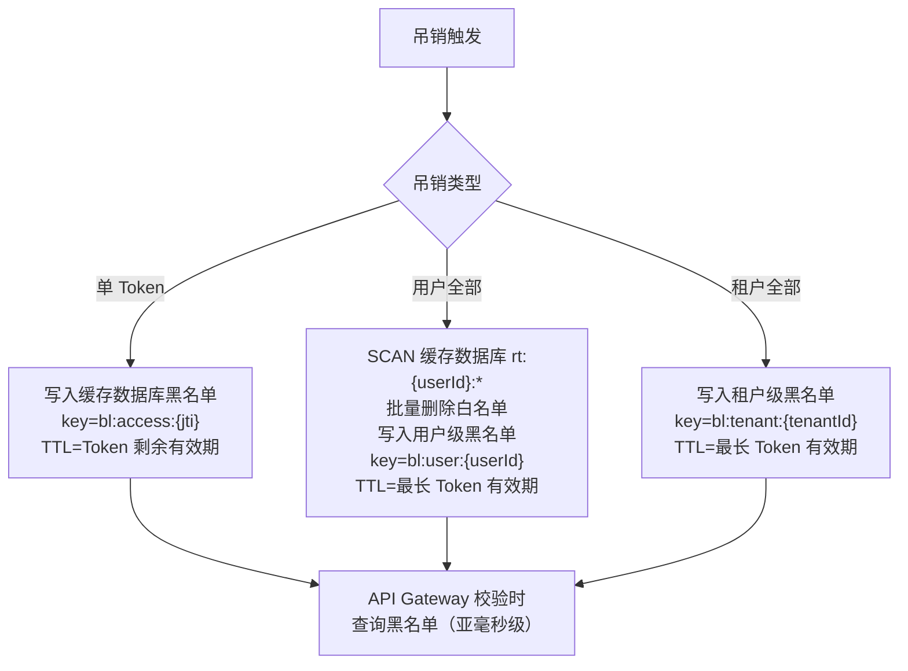

**黑名单校验优先级**（API Gateway 侧）：

```
① 本地 JWT 签名验证（μs 级，不依赖外部）
② 本地过期检查（μs 级）
③ 缓存数据库黑名单查询：
   - SISMEMBER bl:access:{jti}    （单 Token 吊销）
   - EXISTS bl:user:{userId}      （用户级吊销）
   - EXISTS bl:tenant:{tenantId}  （租户级吊销）
   任一命中 → 401 Unauthorized
```

**为什么用缓存数据库而非结构化数据库**：

- 缓存数据库 SISMEMBER / EXISTS 操作 O(1)，亚毫秒级
- 黑名单条目天然有 TTL（Token 过期后黑名单条目无意义），缓存数据库 TTL 自动清理
- 结构化数据库 需建索引+定时清理，且查询延迟 ms 级，不适合每请求热路径

### 3.5 设备会话管理：单浏览器登录

**需求**：同一用户在同一租户下只能保持一个活跃的浏览器会话——新浏览器登录时，踢出先前的浏览器设备。浏览器与移动端可共存（不互踢），移动端场景不在 v2.0 范围。

#### 设计决策

| 决策项 | 选择 | 行业参考 |
| --- | --- | --- |
| **设备类型识别** | User-Agent 模式匹配：含 `Mobi`/`Android`/`iPhone`/`iPad` 归类为 `mobile`，其余归类为 `browser` | 通用 SaaS 实践（Slack、GitHub） |
| **设备指纹** | `SHA-256(clientIpPrefix + userAgent)`，其中 clientIpPrefix 取 IP 前 2 段（如 `10.0.x.x`） | 避免同办公室 NAT 下多设备被误判为同一设备 |
| **踢出粒度** | 同用户 + 同租户 + 同设备类型（browser/mobile/api_key） | 浏览器互踢，移动端预留独立空间 |
| **踢出时机** | 登录成功后立即执行——扫描同类型设备下的旧会话，吊销所有旧 Token | 保证"登录即唯一" |
| **旧浏览器感知** | Access Token 自然过期（≤30min）+ Refresh Token 立即失效 | 标准 JWT 方案：无 WebSocket Push，不额外引入长连接依赖 |

#### 流程

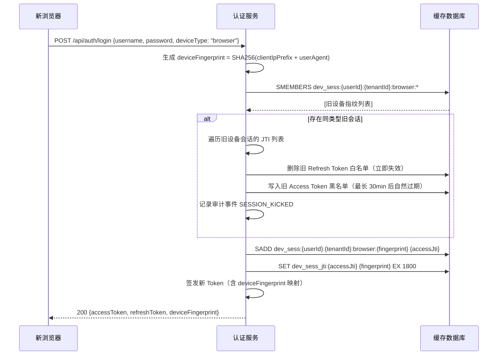

#### 关键实现细节

**① 设备类型判定规则**：

```
function detectDeviceType(userAgent):
    if userAgent contains "Mobi" | "Android" | "iPhone" | "iPad":
        return "mobile"
    else:
        return "browser"
```

API Key 登录（通过 `Authorization: Bearer gnex_ak_xxx`）归类为 `api_key`，与浏览器互不干扰。

**② 踢出的精确语义**：

| 操作 | 效果 | 旧浏览器感知 |
| --- | --- | --- |
| 删除旧 Refresh Token 白名单 (`rt:{userId}:{oldJti}`) | 旧浏览器无法刷新 Token | 下次 refresh 请求返回 401 → 前端重定向到登录页 |
| 写入旧 Access Token 黑名单 (`bl:access:{oldJti}`) | 旧浏览器的 API 请求立即失效 | 下一次请求返回 401 |
| 不主动推送 | 无需 WebSocket 长连接 | 旧浏览器在下次操作时感知被踢 |

**③ 清理机制**：

- `dev_sess:{userId}:{tenantId}:{deviceType}:{fingerprint}` → Set 存储该设备的活跃 JTI 列表，TTL = Refresh Token 有效期
- `dev_sess_jti:{jti}` → String，存储反向查找（JTI → 设备指纹），TTL = Access Token 有效期
- 两个 Key 均依赖 TTL 自动过期，无需后台清理任务

**④ 用户感知**：被踢出的旧浏览器在下次请求时收到 `401 {"error": "SESSION_TERMINATED", "message": "您的账号已在其他设备登录"}`。前端据此展示提示并跳转登录页。

**⑤ 预设设备数上限**：当 `browser` 类型设备数 > 3 时（异常情况——如脚本自动登录），登录成功但输出 WARN 审计事件 `SESSION_FLOOD`，不阻塞登录（避免用户因异常无法登录）。

---

## 4. Token 设计

### 4.1 Access Token（JWT 结构）

```json
{
  "sub": "42",
  "name": "zhangsan",
  "tid": "tenant-001",
  "roles": ["ADMIN", "PROJECT_MANAGER"],
  "jti": "a1b2c3d4-e5f6-7890-abcd-ef1234567890",
  "dev": "browser:a1b2c3d4",
  "iat": 1750000000,
  "exp": 1750001800,
  "type": "access"
}
```

| Claim | 含义 | 必填 | 说明 |
| --- | --- | --- | --- |
| `sub` | 用户 ID | ✅ | 数字转字符串 |
| `name` | 用户名 | ✅ | 用于审计日志展示 |
| `tid` | 租户 ID | ✅ | 多租户隔离核心字段 |
| `roles` | 角色列表 | ✅ | 用于 Gateway 端点鉴权 |
| `jti` | Token 唯一标识 | ✅ | UUID v4，吊销校验键 |
| `dev` | 设备标识 | ✅ | `{deviceType}:{fingerprint前8位}`，用于会话关联与审计 |
| `iat` | 签发时间 | ✅ | Unix timestamp |
| `exp` | 过期时间 | ✅ | Unix timestamp |
| `type` | Token 类型 | ✅ | `access` / `refresh`，防止混用 |

### 4.2 Refresh Token（JWT 结构）

```json
{
  "sub": "42",
  "tid": "tenant-001",
  "jti": "f0e1d2c3-b4a5-6789-0abc-def123456789",
  "iat": 1750000000,
  "exp": 1750604800,
  "type": "refresh"
}
```

- Refresh Token **不包含 roles**——角色可能在 Refresh 周期内变更，刷新时从数据库重新读取
- Refresh Token 使用**独立签名密钥**（`gnex.jwt.refresh-secret`），与 Access Token 密钥隔离

### 4.3 签名与密钥管理

| 项目 | Access Token | Refresh Token |
| --- | --- | --- |
| 算法 | HMAC-SHA256 | HMAC-SHA256 |
| 密钥来源 | `gnex.jwt.secret`（环境变量注入） | `gnex.jwt.refresh-secret`（环境变量注入） |
| 密钥长度 | ≥ 256 bit | ≥ 256 bit |
| 密钥轮换 | 支持双密钥过渡期（新旧密钥均可校验） | 同左 |
| 有效期 | 30 min（可配置） | 7 d（可配置） |

**密钥轮换机制**：

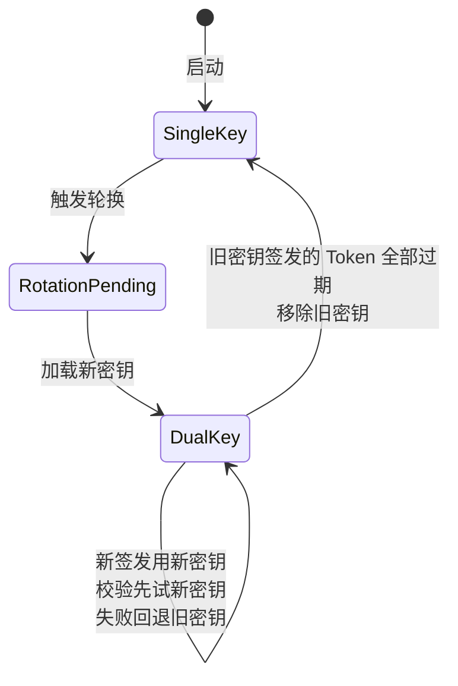

- 轮换触发：运维 API 或定时任务（默认每 90 天）
- 双密钥过渡期 = Access Token 有效期（30 min），过渡期内新旧密钥均可校验
- 密钥**禁止硬编码**，必须通过环境变量注入

### 4.4 Token 有效期配置

| 配置项 | 默认值 | 说明 | 配置来源 |
| --- | --- | --- | --- |
| `gnex.jwt.access-expiration` | 1800 (30min) | Access Token 有效期（秒） | application.yml |
| `gnex.jwt.refresh-expiration` | 604800 (7d) | Refresh Token 有效期（秒） | application.yml |
| `gnex.jwt.max-refresh-per-user` | 5 | 单用户最大有效 Refresh Token 数 | application.yml |
| `gnex.auth.login-fail-threshold` | 5 | 连续登录失败锁定阈值 | 运营管理服务密码策略 |
| `gnex.auth.login-lock-duration` | 900 (15min) | 锁定时长（秒） | 运营管理服务密码策略 |

---

## 5. 密码管理

### 5.1 哈希算法

| 算法 | 当前状态 | 适用场景 | 说明 |
| --- | --- | --- | --- |
| **bcrypt** | ✅ 默认 | 通用 | cost factor=10，约 100ms/次，抗 GPU 暴力破解 |
| **argon2id** | 🔜 未来 | 高安全要求 | 抗 GPU/ASIC，需引入 Bouncy Castle |
| **PBKDF2** | ❌ 不采用 | — | 抗性弱于 bcrypt/argon2，仅作兼容备选 |

**哈希存储格式**：`{algorithm}${cost}${salt}${hash}`，如 `$bcrypt$10$xxxxx$yyyyy`。支持算法标识前缀，未来切换算法时旧哈希仍可验证，登录成功后自动升级为新算法哈希。

### 5.2 密码策略

密码策略由**运营管理服务**管理（复杂度、过期规则、历史密码等），认证服务在密码变更时调用运营管理服务的策略 Port 校验。

| 策略项 | 默认值 | 校验时机 | 管理方 |
| --- | --- | --- | --- |
| 最小长度 | 8 | 注册/修改/重置 | 运营管理服务 |
| 复杂度 | 大写+小写+数字+特殊字符中至少3类 | 注册/修改/重置 | 运营管理服务 |
| 过期天数 | 90 | 登录时检查 | 运营管理服务 |
| 历史密码 | 不重复最近5次 | 修改密码时 | 运营管理服务 |
| 初始密码 | 首次登录强制修改 | 登录时检查 | 运营管理服务 |

### 5.3 密码重置流程

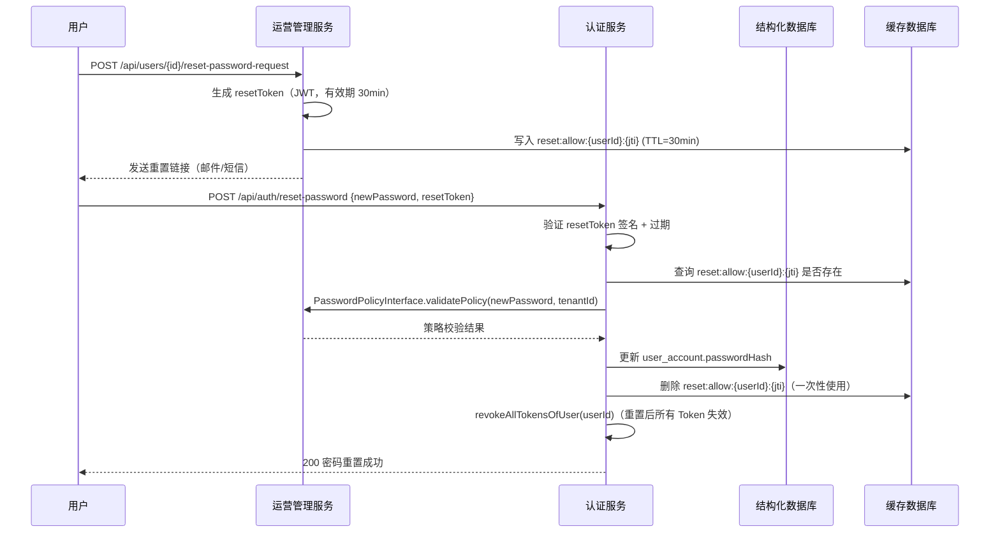

**安全约束**：

- 重置 Token 一次性使用，用后立即删除
- 重置 Token 有短 TTL（30min），过期自动失效
- 密码重置后**所有已签发 Token 立即吊销**，强制重新登录
- 重置 Token 由运营管理服务签发（管理员操作），认证服务只负责执行重置

---

## 6. SSO 集成设计

### 6.1 角色定位：GNEX 是 SSO Consumer，不是 Provider

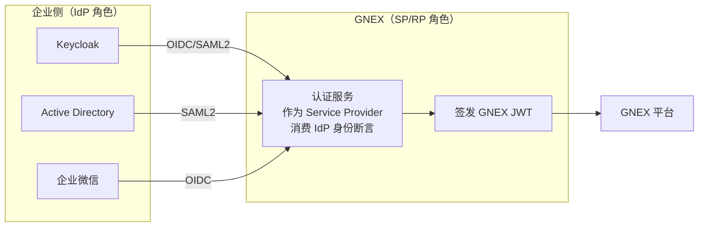

- GNEX 认证服务**只消费**外部 IdP 的身份断言（OIDC id_token / SAML2 Assertion），**不对外提供**身份认证服务
- 企业用户在 IdP 侧完成认证，GNEX 验证断言后签发自己的 JWT——GNEX Token 与 IdP Token 生命周期独立

### 6.2 多租户 × SSO：核心问题

GNEX 是多租户平台，当认证服务对接一个外部 IdP 时，必须解决**"IdP 用户归哪个租户"**的问题。现实存在三种拓扑：

| 拓扑 | 描述 | 举例 | 核心问题 |
| --- | --- | --- | --- |
| **1:1 专属** | 一个 IdP 只服务一个 GNEX 租户 | 企业 A 自建 Keycloak，只给企业 A 用 | 最简单，sso_config.tenant_id 直接绑定 |
| **1:N 共享** | 一个 IdP 服务多个 GNEX 租户 | 集团统一 Keycloak，下面有子公司 A/B/C 各自是独立租户 | IdP 的同一个 `sub` 在不同租户对应不同 GNEX 用户；**登录时需要确定归哪个租户** |
| **N:1 多源** | 一个租户配多个 IdP | 企业同时接 AD（内网）+ 企业微信（外网） | 同一用户可能从两个 IdP 登录，需跨 IdP 关联到同一个 GNEX 用户 |

### 6.3 租户解析策略

"1:N 共享"拓扑下，用户从共享 IdP 登录后，认证服务必须确定该用户属于哪个 GNEX 租户。**两种策略，由 sso_config 配置决定**：

#### 策略一：IdP 声明租户（IdP 侧分组映射）

IdP 在用户身份断言中携带租户标识（OIDC claim / SAML2 attribute），认证服务直接读取。

| 协议 | IdP 侧配置 | GNEX 侧读取 |
| --- | --- | --- |
| OIDC | IdP 在 id_token 中添加 custom claim（如 `gnex_tenant`） | 认证服务从 id_token 读取 `gnex_tenant` claim |
| SAML2 | IdP 在 AttributeStatement 中添加 attribute（如 `gnex-tenant`） | 认证服务从 Assertion 读取 `gnex-tenant` attribute |

**前提**：企业 IdP 管理员愿意配合配置 custom claim/attribute——集团 IdP 通常可以做到。

**流程**：

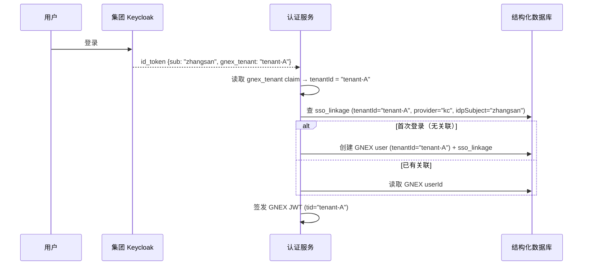

#### 策略二：用户自选租户（登录后选择）

IdP 不携带租户信息时，认证服务在 SSO 断言验证通过后，让用户选择归入哪个租户。

**流程**：

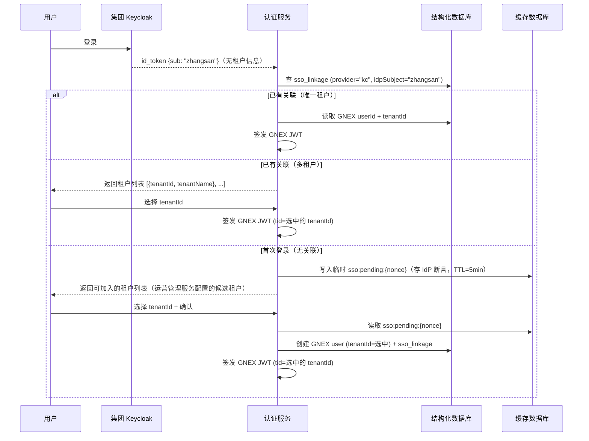

#### 策略二的安全性：租户选择的合法性校验

user_select 模式下存在风险——用户可能选择无权加入的租户（如子公司 A 的员工选子公司 B）。**三层校验机制**从源头上限制可选租户：

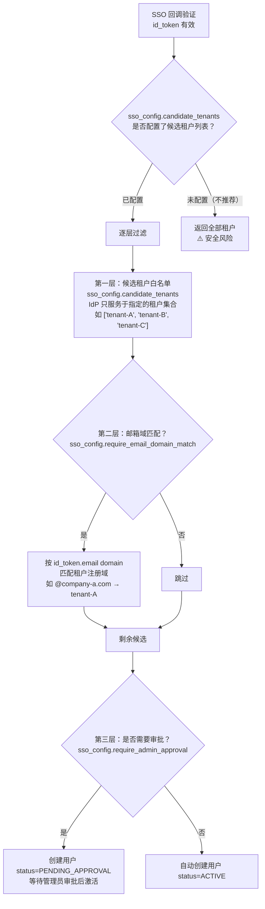

**三层校验说明**：

| 层 | 配置字段 | 机制 | 效果 |
| --- | --- | --- | --- |
| **第一层：候选租户** | `candidate_tenants` | sso_config 配置此 IdP 只服务于指定的租户集合。列表外的租户**根本不出现在选择页面**。1:N 共享 IdP 必配 | 源头限制——从 100 个租户缩到 3~5 个 |
| **第二层：邮箱域匹配** | `require_email_domain_match` | 按 id_token 中 email 的 domain 匹配租户的注册域。如 `@company-a.com` 只能选租户 A。域不匹配的租户不出现在选择页面 | 防止跨企业误操作——同一集团 Keycloak 下，子公司 A 的员工不会看到子公司 B 的租户 |
| **第三层：管理员审批** | `require_admin_approval` | 首次 SSO 选租户后，用户状态设为 `PENDING_APPROVAL`，需租户管理员审批通过后才激活。审批前无法登录 | 防御最后一层——即使前两层被绕过或配置不当 |

**配置组合建议**：

| 场景 | candidate_tenants | require_email_domain_match | require_admin_approval |
| --- | --- | --- | --- |
| 集团内严格隔离（推荐默认） | ✅ 配置子公司列表 | ✅ 启用 | ❌ 自动通过 |
| 集团内宽松（公开注册） | ✅ 配置子公司列表 | ❌ | ✅ 启用 |
| 专属 IdP（1:1 bound 模式） | ❌（bound 已绑死） | ❌ | ❌ |
| SaaS 公开租户 | ❌（所有租户可选） | ❌ | ✅ **必须启用** |

> **安全底线**：`candidate_tenants` 未配置且 `require_admin_approval` 未启用的 user_select 配置，认证服务启动时输出 **WARN 日志**——"共享 IdP [{provider}] 未配置候选租户列表且未启用管理员审批，存在跨租户冒用风险"。

```

sso_config 表中 `tenant_resolution` 字段控制使用哪种策略：

| `tenant_resolution` 值 | 含义 | 适用场景 | 前提 |
| --- | --- | --- | --- |
| `idp_claim` | 从 IdP 断言中读取租户标识 | 1:N 共享，IdP 可配置 custom claim | IdP 管理员配合配置 claim/attribute |
| `user_select` | 用户登录后自选租户 | 1:N 共享，IdP 不携带租户信息 | 无前提，但用户体验多一步 |
| `bound`（默认） | IdP 与租户 1:1 绑定 | 1:1 专属 | sso_config.tenant_id 直接指定 |

### 6.4 跨 IdP 用户关联（N:1 拓扑）

同一租户下，同一自然人可能从不同 IdP 登录（如内网用 AD、外网用企业微信）。关联策略：

| 关联方式 | 机制 | 说明 |
| --- | --- | --- |
| **邮箱匹配**（推荐） | 不同 IdP 的 id_token 中 email 相同 → 关联到同一 GNEX 用户 | 前提：企业 IdP 的 email 可信且唯一 |
| **管理员手动关联** | 运营管理服务提供关联操作界面，将多个 sso_linkage 记录合并到同一 userId | 适用于邮箱不一致或 IdP 不返回邮箱的场景 |
| **自动关联** | sso_config 配置 `link_by_email=true`，首次 SSO 登录时按 tenantId + email 查找已有用户 | 找到则关联，未找到则创建新用户 |

**sso_linkage 表设计支持 N:1**：

```sql
sso_linkage
├─ id                BIGINT       主键
├─ user_id           BIGINT       GNEX 用户 ID（FK → user_account）
├─ tenant_id         VARCHAR(32)  租户 ID
├─ provider          VARCHAR(32)  SSO 提供商（如 "keycloak", "ad", "wechat_work"）
├─ idp_subject       VARCHAR(256) IdP 中的唯一标识（OIDC sub / SAML2 NameID）
├─ idp_email         VARCHAR(128) IdP 中的邮箱（用于跨 IdP 关联匹配）
├─ idp_username      VARCHAR(128) IdP 中的用户名（用于展示）
├─ created_at        TIMESTAMP    首次关联时间
└─ UNIQUE(tenant_id, provider, idp_subject)  同租户同提供商下 IdP subject 唯一
```

- 同一 `user_id` 可以有多条 sso_linkage 记录（不同 provider）——这就是 N:1
- `idp_email` 字段用于跨 IdP 的邮箱匹配关联

### 6.5 SSO 配置模型

```sql
sso_config
├─ id                    BIGINT       主键
├─ tenant_id             VARCHAR(32)  绑定租户（bound 模式下必填；idp_claim/user_select 模式下可为空，表示共享）
├─ provider              VARCHAR(32)  提供商标识（oidc / saml2）
├─ display_name          VARCHAR(64)  显示名称
├─ enabled               BOOLEAN      是否启用
├─ client_id             VARCHAR(128) OAuth2 client_id / SAML2 entityID
├─ client_secret         VARCHAR(256) OAuth2 client_secret（加密存储）
├─ issuer_uri            VARCHAR(256) OIDC issuer
├─ authorization_uri     VARCHAR(256) 授权端点
├─ token_uri             VARCHAR(256) Token 端点
├─ userinfo_uri          VARCHAR(256) UserInfo 端点
├─ jwk_set_uri           VARCHAR(256) JWKS 端点
├─ sso_url               VARCHAR(256) SAML2 SSO URL
├─ slo_url               VARCHAR(256) SAML2 SLO URL
├─ scopes                VARCHAR(256) OAuth2 scopes（逗号分隔）
├─ tenant_resolution     VARCHAR(16)  租户解析策略：bound / idp_claim / user_select
├─ tenant_claim_name     VARCHAR(64)  IdP 断言中租户标识的 claim/attribute 名（idp_claim 模式必填）
├─ candidate_tenants     VARCHAR(512) 候选租户 ID 列表（逗号分隔，user_select 模式限制可选范围）
├─ require_email_domain_match BOOLEAN 是否启用邮箱域匹配（user_select 模式，限制可选租户）
├─ require_admin_approval BOOLEAN    首次 SSO 创建用户是否需要管理员审批
├─ link_by_email         BOOLEAN      是否按邮箱自动跨 IdP 关联
├─ auto_create_user      BOOLEAN      首次登录是否自动创建 GNEX 用户
├─ default_role          VARCHAR(32)  自动创建用户的默认角色
├─ created_at            TIMESTAMP
└─ updated_at            TIMESTAMP
```

**与 v1 的关键差异**：

| 字段 | v1 无 | v2 新增 | 说明 |
| --- | --- | --- | --- |
| `tenant_resolution` | — | ✅ | 多租户 × SSO 的核心配置，解决 IdP 共享时租户归属问题 |
| `tenant_claim_name` | — | ✅ | idp_claim 模式下 IdP 断言中租户标识的字段名 |
| `candidate_tenants` | — | ✅ | user_select 模式下候选租户白名单，安全防线第一层 |
| `require_email_domain_match` | — | ✅ | 邮箱域匹配校验，安全防线第二层 |
| `require_admin_approval` | — | ✅ | 首次 SSO 用户管理员审批，安全防线第三层 |
| `link_by_email` | — | ✅ | 跨 IdP 邮箱匹配关联开关 |
| `tenant_id` 约束 | NOT NULL | **允许 NULL** | 共享 IdP 场景下 tenant_id 为空，表示该 IdP 不绑定特定租户 |

**client_secret 加密存储**：使用 AES-256-GCM 加密后存储，解密密钥通过环境变量注入（`gnex.sso.encryption-key`）。数据库中不存明文 client_secret。

### 6.6 三种拓扑的配置示例

#### 1:1 专属（最常见）

```
企业 A 自建 Keycloak，只给租户 A 用
sso_config: {tenant_id: "A", provider: "keycloak", tenant_resolution: "bound", ...}
→ 登录时直接归入租户 A，无需选租户
```

#### 1:N 共享（集团统一 IdP）

**方式一：IdP 声明租户（推荐）**

```
集团 Keycloak 服务子公司 A/B/C，IdP 配置 custom claim "gnex_tenant"
sso_config: {tenant_id: NULL, provider: "keycloak", tenant_resolution: "idp_claim",
             tenant_claim_name: "gnex_tenant", ...}
→ 张三登录后 id_token 含 gnex_tenant="A"，认证服务自动归入租户 A
```

**方式二：用户自选租户**

```
集团 Keycloak 不配置 custom claim
sso_config: {tenant_id: NULL, provider: "keycloak", tenant_resolution: "user_select",
             candidate_tenants: "A,B,C",
             require_email_domain_match: true,
             require_admin_approval: false, ...}
→ 张三(@company-a.com)登录后只看到租户 A（邮箱域匹配过滤）
→ 若域匹配失败（如 @contractor.com），走管理员审批流程
```

#### N:1 多源

```
企业 A 同时配了 AD（内网）+ 企业微信（外网）
sso_config: {tenant_id: "A", provider: "ad", tenant_resolution: "bound", link_by_email: true, ...}
sso_config: {tenant_id: "A", provider: "wechat_work", tenant_resolution: "bound", link_by_email: true, ...}
→ 张三从 AD 登录 → 首次创建用户 + sso_linkage(provider=ad, idp_email=zhangsan@a.com)
→ 张三从企业微信登录 → 按邮箱匹配到同一用户 + 新增 sso_linkage(provider=wechat_work, idp_email=zhangsan@a.com)
→ 两条 sso_linkage 指向同一个 GNEX userId
```

### 6.7 SSO 登出（SLO）

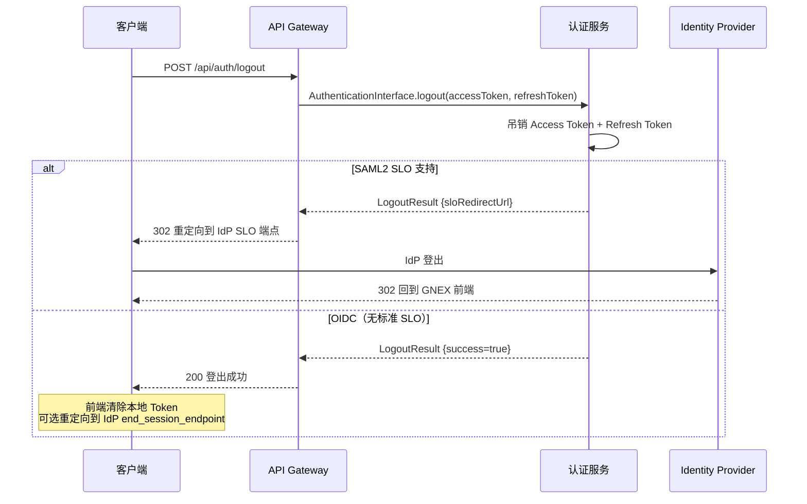

---

## 7. 数据模型

### 7.1 核心表

认证服务直接管理的表（其他表由运营管理服务管理，认证服务只读）：

| 表 | 管理方 | 认证服务操作 | 说明 |
| --- | --- | --- | --- |
| `user_account` | 运营管理服务 | 读（认证时查）+ 写（SSO 自动创建） | 用户账号，含 passwordHash |
| `sso_config` | 运营管理服务 | 读 | SSO 提供商配置（含租户解析策略） |
| `sso_linkage` | 认证服务 | 读写 | SSO 用户关联（支持跨 IdP 关联） |
| `api_key` | 认证服务 | 读写 | 程序化访问 API Key（存 SHA-256 哈希） |
| `user_tenant` | 运营管理服务 | 读 | 用户-租户关联 |
| `user_role` | 运营管理服务 | 读 | 用户角色（签发 Token 时读取） |

### 7.2 缓存数据库键空间

| Key 模式 | 类型 | TTL | 用途 |
| --- | --- | --- | --- |
| `rt:{userId}:{jti}` | String | Refresh Token 有效期 | Refresh Token 白名单 |
| `bl:access:{jti}` | String | Access Token 剩余有效期 | 单 Token 黑名单 |
| `bl:user:{userId}` | String | 最长 Token 有效期 | 用户级黑名单 |
| `bl:tenant:{tenantId}` | String | 最长 Token 有效期 | 租户级黑名单 |
| `login_fail:{userId}` | String | 15min | 登录失败计数器 |
| `reset:allow:{userId}:{jti}` | String | 30min | 密码重置凭证白名单 |
| `sso:nonce:{nonce}` | String | 5min | OIDC nonce 防重放 |
| `sso:pending:{nonce}` | String | 5min | SSO 待选租户的临时 IdP 断言缓存（user_select 模式） |
| `apikey:last_used:{keyId}` | String | 1h | API Key 最后使用时间（防频繁写 DB） |
| `dev_sess:{userId}:{tenantId}:{deviceType}:{fingerprint}` | Set | Refresh Token 有效期 | 设备级活跃 JTI 列表（按 userId+租户+设备类型隔离） |
| `dev_sess_jti:{jti}` | String | Access Token 有效期 | JTI → 设备指纹反向查找 |

### 7.3 API Key 表结构

```sql
api_key
├─ id              BIGINT       主键
├─ key_id          VARCHAR(32)  唯一标识（UUID，对外暴露）
├─ prefix          VARCHAR(16)  Key 前缀（固定 "gnex_ak_"）
├─ hash            VARCHAR(64)  SHA-256 哈希（原始 Key 不落库）
├─ user_id         BIGINT      所有者用户 ID（FK → user_account）
├─ tenant_id       VARCHAR(32)  绑定租户
├─ name            VARCHAR(128) 用途标识
├─ roles           VARCHAR(256) 授予的角色（逗号分隔，为用户已有角色的子集）
├─ ip_whitelist    VARCHAR(512) IP 白名单（CIDR 逗号分隔，NULL 表示不限）
├─ enabled         BOOLEAN      是否启用
├─ expire_at       TIMESTAMP    过期时间
├─ last_used_at    TIMESTAMP    最后使用时间
├─ created_at      TIMESTAMP
├─ updated_at      TIMESTAMP
└─ UNIQUE(key_id)
└─ INDEX(user_id, tenant_id)
└─ INDEX(hash)              ← Gateway 校验时按 hash 查，< 5ms

---

## 8. 服务架构

### 8.1 包结构

```
services/gnex-auth-service/com/gnex/auth/
├── port/                 ← Port 实现（AuthenticationInterface, TokenInterface, PasswordInterface）
├── core/                 ← 核心领域逻辑
│   ├── token/            ← JWT 签发/验证/刷新/吊销
│   ├── password/         ← 密码哈希/验证/策略校验
│   ├── sso/              ← SSO 认证/关联/租户解析/SLO
│   └── apikey/           ← API Key 创建/校验/续期/吊销
├── infrastructure/       ← 基础设施
│   ├── persistence/      ← MyBatis-Plus Mapper（sso_linkage）
│   ├── cache/            ← 缓存数据库操作（黑名单/白名单/计数器）
│   └── event/            ← 审计事件发布（消息总线旁路）
├── controller/           ← REST 门面：/api/auth/*
└── config/               ← Spring 配置
```

### 8.2 依赖关系

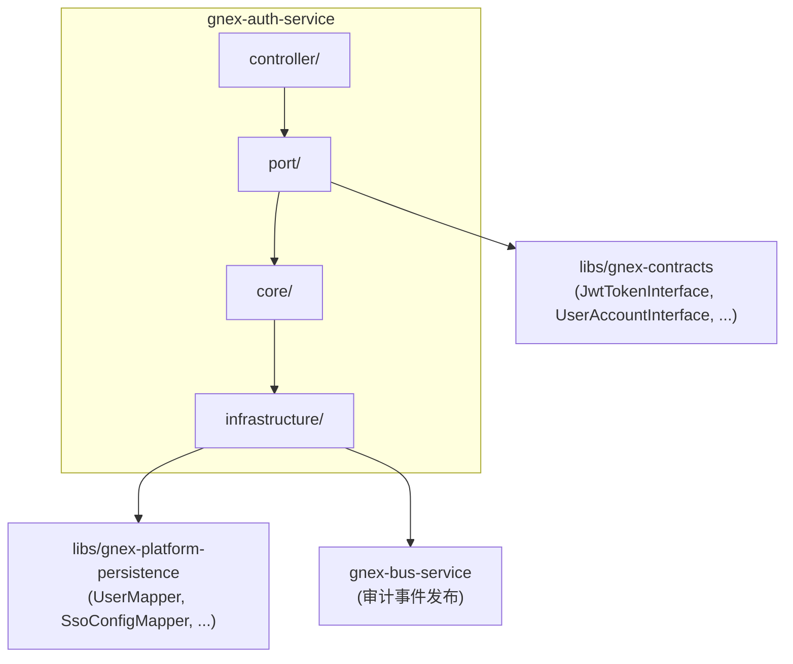

**依赖约束**：

- 认证服务**不依赖**运营管理服务的实现类，只通过 contracts Port 接口交互（密码策略校验调用 `PasswordPolicyInterface`）
- 认证服务**不依赖** API Gateway——Gateway 调用认证服务的 Port，方向单向
- 认证服务对 `gnex-platform-persistence` 的依赖仅限于读 `user_account` / `sso_config` / `user_tenant` / `user_role`，写操作限于 `sso_linkage`

### 8.3 与 v1 的迁移关系

| v1 组件 | v1 位置 | v2 归属 | 变更 |
| --- | --- | --- | --- |
| `AuthController` | gnex-platform-service | gnex-auth-service controller/ | 迁移，新增 refresh/revoke/select-tenant 端点 |
| `JwtService` | gnex-platform-service service/ | gnex-auth-service core/token/ | 重构：双 Token 体系 + 密钥轮换 + jti |
| `JwtTokenInterfaceAdapter` | gnex-platform-service service/ | gnex-auth-service port/ | 适配新 TokenInterface 契约 |
| `UserService` | gnex-platform-service service/ | 拆分：认证逻辑→auth，管理逻辑→platform | 认证部分迁移，管理部分留 platform |
| `SsoAuthenticationSuccessHandler` | gnex-platform-service auth/ | gnex-auth-service core/sso/ | 迁移，增强租户解析与自动关联逻辑 |
| `SloLogoutHandler` | gnex-platform-service auth/ | gnex-auth-service core/sso/ | 迁移 |
| `DbClientRegistrationRepository` | gnex-platform-service auth/ | gnex-auth-service infrastructure/ | 迁移 |
| `DbRelyingPartyRegistrationRepository` | gnex-platform-service auth/ | gnex-auth-service infrastructure/ | 迁移 |
| `api_key` 表 + ApiKeyInterface | — | gnex-auth-service | **新增**：程序化访问凭证管理 |
| `JwtAuthenticationFilter` | gnex-dev-assembler | 留在 Gateway 层 | 不迁移，属于网关面职责 |
| `SecurityConfig` | gnex-dev-assembler | 拆分：Gateway 侧留 JWT filter，Auth 侧留 SSO filter | 按面拆分 |

---

## 9. API 设计

### 9.1 认证 API

| 方法 | 路径 | 说明 | 认证 |
| --- | --- | --- | --- |
| POST | `/api/auth/login` | 用户名/密码登录 | 无 |
| POST | `/api/auth/sso/{provider}` | SSO 登录回调 | 无 |
| POST | `/api/auth/sso/select-tenant` | SSO 租户选择（user_select 模式） | 无 |
| POST | `/api/auth/refresh` | 刷新 Token | 无（携带 Refresh Token） |
| POST | `/api/auth/logout` | 登出（吊销 Token） | 需认证 |
| POST | `/api/auth/change-password` | 修改密码 | 需认证 |
| POST | `/api/auth/reset-password` | 密码重置 | 无（携带 resetToken） |
| GET | `/api/auth/sso/providers` | 获取可用 SSO 提供商列表 | 无 |
| POST | `/api/auth/api-keys` | 创建 API Key | 需认证 |
| GET | `/api/auth/api-keys` | 获取当前用户的 API Key 列表 | 需认证 |
| DELETE | `/api/auth/api-keys/{keyId}` | 吊销指定 API Key | 需认证 |

### 9.2 Token API（内部 Port，不直接暴露 REST）

| 方法 | 说明 | 调用方 |
| --- | --- | --- |
| `issueToken()` | 签发双 Token | 认证服务内部 |
| `validateToken()` | 校验 Token | API Gateway（通过 Port 调用） |
| `refreshToken()` | 刷新 Token | 认证服务内部 |
| `revokeToken()` | 吊销单 Token | 认证服务内部 / 运营管理服务 |
| `revokeAllTokensOfUser()` | 吊销用户所有 Token | 运营管理服务（禁用用户时） |

### 9.3 请求/响应示例

**登录请求**：

```json
POST /api/auth/login
{
  "username": "zhangsan",
  "password": "P@ssw0rd!",
  "tenant_id": "tenant-001"
}
```

**登录成功响应**：

```json
{
  "success": true,
  "access_token": "eyJhbGciOiJIUzI1NiJ9...",
  "refresh_token": "eyJhbGciOiJIUzI1NiJ9...",
  "expires_in": 1800,
  "user_id": 42,
  "tenant_id": "tenant-001",
  "roles": ["ADMIN"]
}
```

**Token 刷新请求**：

```json
POST /api/auth/refresh
{
  "refresh_token": "eyJhbGciOiJIUzI1NiJ9..."
}
```

**API Key 创建请求**：

```json
POST /api/auth/api-keys
Authorization: Bearer {jwt}
{
  "name": "CI/CD Pipeline for project-x",
  "roles": ["PROJECT_READER"],
  "expire_days": 90,
  "ip_whitelist": ["10.0.0.0/8"]
}
```

**API Key 创建响应**（完整 Key 仅在创建时返回一次）：

```json
{
  "key_id": "ak_01abc...",
  "api_key": "gnex_ak_a1b2c3d4e5f6...",
  "prefix": "gnex_ak_",
  "name": "CI/CD Pipeline for project-x",
  "roles": ["PROJECT_READER"],
  "expire_at": "2026-09-28T10:00:00Z",
  "warning": "请立即保存 API Key，离开此页面后无法再次查看完整 Key"
}
```

---

## 10. 安全设计

### 10.1 威胁模型与对策

| 威胁 | 对策 | 实现层 |
| --- | --- | --- |
| **暴力破解** | 连续失败 5 次锁定 15min + bcrypt 慢哈希 | 认证服务 |
| **Token 盗用** | 短效 Access Token + 一次性 Refresh Token + 旋转检测 | 认证服务 + Gateway |
| **重放攻击** | jti 唯一标识 + 黑名单 + OIDC nonce | 认证服务 + Gateway |
| **中间人攻击** | 全链路 TLS 1.3 + HSTS | 基础设施层 |
| **XSS 窃取 Token** | HttpOnly + Secure Cookie（可选模式）或 Authorization Header | 前端 + Gateway |
| **CSRF** | JWT 无状态 + SameSite Cookie + Origin 校验 | Gateway |
| **密码泄露** | bcrypt 单向哈希 + 密码不明文日志 + client_secret AES 加密存储 | 认证服务 |
| **IdP 伪造** | OIDC id_token 签名验证（JWKS）+ SAML2 签名验证 + issuer/aud 校验（SP/RP 必须验证 IdP 断言的真实性） | 认证服务 |
| **越权访问** | Token claims 含 tenantId + roles，Gateway 强制校验 | Gateway |

### 10.2 审计事件

认证服务在以下操作后异步发布审计事件到消息总线 `audit_log` Topic：

| 事件 | 审计内容 | 级别 |
| --- | --- | --- |
| LOGIN_SUCCESS | userId, tenantId, loginMethod(password/sso), ip, userAgent | INFO |
| LOGIN_FAILED | username, tenantId, failReason, ip | WARN |
| ACCOUNT_LOCKED | userId, tenantId, failCount | WARN |
| TOKEN_REFRESHED | userId, oldJti, newJti | INFO |
| TOKEN_REVOKED | userId, jti, revokeReason | INFO |
| PASSWORD_CHANGED | userId, tenantId | INFO |
| PASSWORD_RESET | userId, tenantId, resetBy(operatorId) | INFO |
| SSO_USER_LINKED | userId, provider, idpSubject, tenantId | INFO |
| SSO_LOGIN_FAILED | provider, failReason, ip | WARN |
| SSO_TENANT_RESOLVED | idpSubject, tenantId, resolution(bound/idp_claim/user_select) | INFO |
| SSO_IDP_LINKED | userId, provider, idpSubject, linkMethod(email/manual) | INFO |
| ROTATION_DETECTED | userId, suspiciousJti | **CRITICAL** |
| SESSION_KICKED | userId, tenantId, deviceType(browser/mobile), oldFingerprint, newFingerprint | INFO |
| SESSION_FLOOD | userId, tenantId, deviceType, deviceCount | WARN |
| APIKEY_CREATED | userId, tenantId, keyId, name, expireAt | INFO |
| APIKEY_USED | keyId, tenantId, sourceIp | DEBUG |
| APIKEY_REVOKED | userId, keyId | INFO |
| APIKEY_EXPIRED | keyId, lastUsedAt | INFO |

---

## 11. 高可用与性能

### 11.1 无状态水平扩展

认证服务是**准无状态**服务：

| 状态 | 存储位置 | 说明 |
| --- | --- | --- |
| JWT 签发 | 纯计算，无状态 | 不写数据库，多副本可并行签发 |
| Refresh Token 白名单 | 缓存数据库 | 外化存储，多副本共享 |
| Token 黑名单 | 缓存数据库 | 外化存储，多副本共享 |
| 登录失败计数 | 缓存数据库 | 外化存储，多副本共享 |
| SSO 关联数据 | 结构化数据库 | 持久化，多副本共享 |

> **结论**：进程内无状态，所有共享状态外化到缓存数据库/结构化数据库，可任意水平扩展。

### 11.2 性能基线

| 操作 | 目标延迟 | 说明 |
| --- | --- | --- |
| JWT 签发 | < 1ms | 纯 HMAC 计算 |
| JWT 本地校验（Gateway 侧） | < 0.5ms | 签名验证 + 过期检查 |
| 黑名单查询（Gateway 侧） | < 1ms | 缓存数据库 SISMEMBER / EXISTS |
| 密码验证 | ~100ms | bcrypt cost=10（故意慢，抗暴力破解） |
| SSO 认证 | < 500ms | 含 IdP 网络往返（1~2 次） |
| Token 刷新 | < 5ms | 含缓存数据库读写 |

### 11.3 部署规格

| 指标 | 值 | 说明 |
| --- | --- | --- |
| 副本数 | ≥ 3 | 跨 AZ 部署，单副本故障不影响 |
| HPA | CPU > 60% 扩容 | 无状态，扩容零预热 |
| 资源请求 | CPU 200m / Memory 256Mi | 认证服务轻量 |
| 资源限制 | CPU 1000m / Memory 512Mi | 防止异常 OOM |
| 健康检查 | /actuator/health + 缓存数据库/结构化数据库 连通性 | 深度检查 |

### 11.4 降级策略

| 故障场景 | 降级行为 | 用户感知 |
| --- | --- | --- |
| 缓存数据库不可用 | 黑名单校验跳过（降级为纯签名+过期校验）+ 告警 | 已吊销 Token 短暂可能通过（窗口期 ≤ Access Token 有效期） |
| 结构化数据库不可用 | SSO 登录拒绝（无法查关联）+ 本地密码登录走缓存数据库热数据 | SSO 用户无法登录，本地账号可登录 |
| IdP 不可用 | SSO 登录返回 503 + 前端降级为本地密码登录 | SSO 用户切换到本地账号 |
| 认证服务全挂 | 新登录不可用；已持有有效 Token 的用户不受影响（Gateway 本地校验） | 新用户无法登录，已登录用户无感知 |

---

## 12. 多租户设计

### 12.1 租户隔离层级

| 维度 | 隔离方式 | 说明 |
| --- | --- | --- |
| Token 空间 | Token claims 含 `tid` | 不同租户的 Token 不可互换（Gateway 校验 tid 匹配） |
| SSO 配置 | `sso_config.tenant_id` + `tenant_resolution` | 1:1 专属直接绑定；1:N 共享通过 IdP 声明或用户自选解析（§6.3） |
| SSO 关联 | `sso_linkage.tenant_id` | 同一 IdP subject 在不同租户关联不同 GNEX 用户 |
| 密码策略 | 按租户配置 | 不同租户可有不同密码复杂度/过期规则 |
| 黑名单 | key 含 tenantId 前缀 | 租户级吊销互不影响 |
| 登录锁定 | key 含 userId | 用户级锁定，不跨租户 |
| 资源权限 | 资源授权表按 tenant_id + resource_id 隔离 | Gateway 两层校验（JWT roles + 缓存数据库资源授权），DB 拦截器兜底（§12.3） |

### 12.2 租户上下文传播

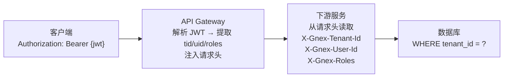

- 认证服务签发 Token 时写入 `tid` claim
- Gateway 校验 Token 后将 `tid`/`sub`/`roles` 注入请求头
- 下游服务从请求头读取，设置 `TenantContext` / `UserContext` ThreadLocal
- 数据库层通过 MyBatis-Plus 拦截器自动追加 `tenant_id` 条件

### 12.3 功能角色与资源授权：两套独立体系

#### 12.3.1 设计决策：为什么拆分为两套体系

GNEX 的权限模型拆分为**两套正交的独立体系**——功能角色定义"用户是组织中的谁"，资源授权定义"用户能碰哪些具体资源"。两者通过 `user_id` 关联，但**非层叠关系**——拥有某个功能角色**不自动附带**任何资源权限。

| 为什么不能合并 | 场景 | 后果 |
| --- | --- | --- |
| 同一用户在不同项目中有不同权限 | 张三在项目 A 是负责人（可管理所有 agent），在项目 B 是观察者（只能看） | 若资源权限绑定在功能角色上，张三要么在两个项目都是 DEVELOPER，要么需要两套账号 |
| 临时跨角色授权 | 管理员想临时让 VIEWER 李四执行 agent_123 | 若权限绑定角色，必须临时升级李四为 DEVELOPER，连带泄露不该给的其他权限 |
| 资源类型增长 | 未来新增 `prompt_template` 等资源类型 | 若每种资源类型都需要定义对应角色，角色矩阵爆炸 |

**行业参考**：

| 系统 | 功能角色体系 | 资源授权体系 | 两者关系 |
| --- | --- | --- | --- |
| AWS IAM | User/Group | Policy (`{Resource, Action, Condition}`) | Policy attach 到 User/Group，不等于 User 的"角色" |
| GitHub | Organization Role (Owner/Member) | Repository Permission (Admin/Write/Read/Triage) | 完全独立——Org Owner 默认不是任何 repo 的 Admin |
| Keycloak | Realm Role | Authorization Resource + Permission + Policy | 三层独立，通过 Policy 关联 |
| Casbin | `g(r.sub, r.role)` | `p(r.sub, r.obj, r.act)` | 两个独立规则集，通过 `sub` 关联 |

#### 12.3.2 功能角色体系（认证服务参与）

**定义**：用户在组织中的身份标签，如 `tenant_admin`、`project_manager`、`developer`、`viewer`。一个用户在一个租户下只有一个功能角色。

**管理方**：**运营管理服务**（CRUD `role_def` / `user_role` 表）。

**认证服务角色**：**只读消费端**——签发 JWT 时从 `user_role` 表读取用户的角色名，写入 JWT `roles` claim：

```
JWT.roles = ["developer"]
```

**Gateway 角色**：从 JWT 解析 `roles`，做端点级粗粒度校验——如 `/api/admin/**` 需 `tenant_admin` 角色。

**认证服务不负责**：功能角色的定义、创建、修改、删除、分配——这些全部由运营管理服务管理。

#### 12.3.3 资源授权体系（认证服务完全不参与）

**定义**：用户与具体资源的操作许可关系，如"张三可以执行 agent_123"、"李四可以读知识库 kb_456"。

**管理方**：**运营管理服务**——管理 `resource_grant` 表的 CRUD，授权变更时同步写入缓存数据库热缓存：

```
缓存数据库 Key: grant:{userId}:{tenantId}:{resourceType}:{resourceId}
Value: {read,write,execute,manage} 中的授权动作集合
TTL: 5min
```

**Gateway 角色**：每请求校验时，先从缓存数据库查询资源授权缓存。命中则直接判断；未命中则回源运营管理服务查询后回填缓存。

**认证服务角色**：**完全不参与**——不读 `resource_grant` 表、不写资源授权缓存、不感知资源类型和授权动作。

**为什么认证服务不参与**：
- 资源授权表与用户身份认证无关——它是"授权"而非"认证"
- 资源类型（agent/skill/kb/mcp）会随产品迭代增长，认证服务不应感知业务资源细节
- JWT 体量约束——若将资源授权写入 JWT claims，用户拥有 100 个 agent 的执行权限时 JWT 会膨胀到数 KB，每次请求都携带不可接受

#### 12.3.4 三层防线职责分工总表

| 防线 | 机制 | 数据拥有者 | 校验方 | 认证服务参与？ |
| --- | --- | --- | --- | --- |
| **第一道：租户级** | 数据库拦截器 `WHERE tenant_id=?` | 全域 | MyBatis-Plus 拦截器 | ✅ 签发 JWT 时写入 `tid` claim |
| **第二道：功能角色** | JWT `roles` claim → Gateway 端点鉴权 | **运营管理服务** | Gateway | ✅ **只读** user_role 表，写入 JWT |
| **第三道：资源授权** | 缓存数据库 `grant:{uid}:{tid}:{type}:{rid}` | **运营管理服务** | Gateway（查缓存） | ❌ 完全不参与 |

---

## 13. 可观测性：审计事件驱动，不独立建指标

### 13.1 设计决策：不暴露 Prometheus 业务指标

认证服务**不独立定义 Prometheus 业务指标和告警规则**，理由：

| 论点 | 说明 |
| --- | --- |
| **HTTP 通用指标已覆盖** | 认证端点（`/api/auth/*`）是 API Gateway 下的 HTTP 路由，Gateway/基础设施层的通用 HTTP 指标（QPS、延迟 P99、4xx/5xx 错误率）已自动覆盖认证服务的调用链 |
| **业务指标与审计事件重复** | `auth_login_total{result=fail}` 与审计事件 `LOGIN_FAILED` 是同一件事的两种表达——审计事件写入消息总线 → 结构化数据库后，可 SQL 聚合和趋势分析，无需再维护一套 Prometheus Counter |
| **实时告警由审计事件消费端触发** | 安全告警（如 Token 旋转检测）由 `ROTATION_DETECTED` 审计事件的消费端（运营管理服务/状态同步器）触发，不需要认证服务自己暴露指标再配告警规则 |
| **健康检查已覆盖可用性** | K8s 健康检查（`/actuator/health` + 缓存数据库/结构化数据库连通性）已覆盖"服务是否活着"，不需要 Prometheus 告警重复 |

### 13.2 可观测性如何实现

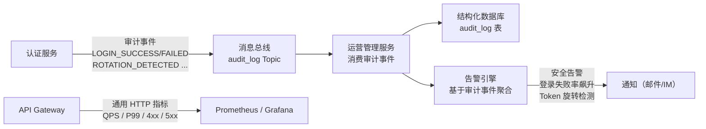

**三层可观测性分工**：

| 层级 | 覆盖什么 | 谁负责 | 机制 |
| --- | --- | --- | --- |
| **基础设施层** | 认证服务的 HTTP QPS、延迟、错误率、Pod 健康 | Gateway + K8s | Prometheus 抓取 Gateway 指标 + K8s 健康检查 |
| **审计层** | 登录/登出/Token 吊销/密码变更/SSO 关联等安全事件 | 认证服务 → 消息总线 → 运营管理服务 | §10.2 审计事件表 |
| **告警层** | 登录失败率飙升、Token 旋转检测、SSO IdP 不可达 | 运营管理服务告警引擎 | 基于审计事件的时间窗口聚合 |

### 13.3 审计事件驱动的安全告警规则

告警由**运营管理服务的告警引擎**基于审计事件实现，认证服务自身不感知告警逻辑：

| 规则 | 审计事件源 | 条件 | 级别 | 动作 |
| --- | --- | --- | --- | --- |
| 登录失败率飙升 | `LOGIN_FAILED` + `LOGIN_SUCCESS` | 5min 内失败占比 > 30% | P2 | 通知安全团队 |
| Token 旋转检测 | `ROTATION_DETECTED` | 事件产生即触发 | P1 | 运营管理服务调用 `TokenInterface.revokeAllTokensOfUser()` + 通知安全团队 |
| 账号频繁锁定 | `ACCOUNT_LOCKED` | 同用户 1h 内锁定 ≥ 3 次 | P2 | 通知安全团队 |
| SSO IdP 不可达 | `SSO_LOGIN_FAILED` (failReason=provider_error) | 5min 内 > 50 次 | P2 | 通知运维 |

---

## 14. 落地路径

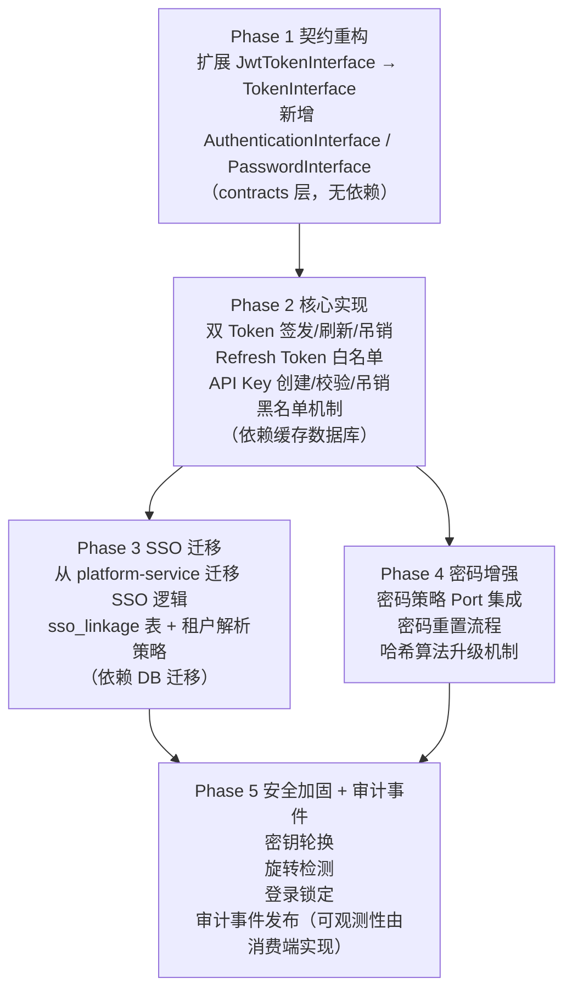

**Phase 依赖说明**：

- **Phase 1**：纯契约层改动，可立即开工，无任何运行时依赖
- **Phase 2**：核心 Token 逻辑，依赖缓存数据库（已有基础设施）
- **Phase 3**：SSO 迁移需新增 `sso_linkage` 表 + `sso_config` 新增字段（DB 迁移脚本），与运营管理服务的 `sso_config` 表共享读取
- **Phase 4**：密码策略依赖运营管理服务的 `PasswordPolicyInterface`（需运营管理服务先实现该 Port）
- **Phase 5**：安全加固依赖 Phase 2/3/4 的基础能力；审计事件发布为可观测性的唯一出口，告警由消费端（运营管理服务）基于审计事件实现

---

## 15. 与其他服务的边界

| 交互方 | 边界 | 协议 | 说明 |
| --- | --- | --- | --- |
| **API Gateway** | Gateway → Auth | Port 调用 | Gateway 调用 `TokenInterface.validateToken()` 校验 Token；调用 `TokenInterface.revokeToken()` 吊销 |
| **运营管理服务** | Auth ↔ Platform | Port 双向 | Auth **只读** `user_account`/`sso_config`/`user_tenant`/`user_role`（用于签发 JWT 时写入 roles claim）；Platform 调用 `TokenInterface.revokeAllTokensOfUser()` 禁用用户时吊销 Token；Auth 调用 `PasswordPolicyInterface.validatePolicy()` 校验密码策略。**认证服务不参与资源授权**——`resource_grant` 表由 Platform 独立管理，Gateway 查缓存数据库做细粒度资源校验 |
| **消息总线** | Auth → Bus | produce | 审计事件发布（LOGIN_SUCCESS/FAILED 等），异步不阻塞 |
| **缓存数据库** | Auth ↔ Cache | 读写 | 黑名单/白名单/登录计数器/SSO nonce/SSO 待选租户缓存/API Key 最后使用时间 |
| **结构化数据库** | Auth ↔ PG | 读写 | `sso_linkage` + `api_key` 读写；`user_account`/`sso_config` 只读 |

> **核心边界原则**：认证服务**不反向依赖 API Gateway**（Gateway 是上游），**不依赖运营管理服务的实现类**（只依赖 contracts Port 接口），**不参与请求热路径**（只在登录/签发/吊销时被调用），**不作为 SSO Provider 对外提供身份认证服务**。

---

## 16. 暂不纳入的设计项

以下能力在企业级平台中常见，但经评估后**不在认证服务 v2.0 范围**——列入此处以明确边界，避免后续设计歧义。

### 16.1 服务间内部认证（internal service-to-service auth）

| 维度 | 说明 |
| --- | --- |
| **问题** | Gateway 调用 Auth Service 的 Port、Platform Service 调用 Auth Service 的 Port——调用方身份如何验证？ |
| **当前状态** | GNEX v2.0 架构本身就是微服务——各服务独立部署，Port 调用跨越进程/网络 |
| **决策** | **暂不设计**。理由：① SPLIT 阶段约束——当前 Phase 1 只做代码搬迁与模块边界，不引入新中间件，服务间认证方案依赖底层基础设施（Service Mesh / SPIFFE / 内部 mTLS），过早引入会拖慢拆分节奏。② 方案待定——微服务间认证的实现方式取决于生产环境 Kubernetes 选型（Istio mTLS + AuthorizationPolicy 还是自建内部 JWT 体系），现阶段定死方案是过度设计。③ 非关键路径——所有 Port 调用（Gateway→Auth、Platform→Auth）都是 **trusted internal call**——流量限定在集群内不走公网，与面向公网请求的 API Gateway 安全模型完全不同，暂时无认证不会造成安全漏洞 |
| **风险** | 低——集群内流量天然隔离，Port 调用方均为 GNEX 自有服务；未来基础设施就绪后统一补齐 |

### 16.2 MFA 多因素认证

| 维度 | 说明 |
| --- | --- |
| **问题** | 企业安全合规常要求 TOTP / SMS / 硬件 Key 等第二因素认证 |
| **当前状态** | GNEX 架构范围说明（§1 边界）未包含 MFA 需求，架构文档 §5.5 认证服务定义中也未提及 |
| **决策** | **暂不设计**。MFA 最佳实现方式是在 IdP 侧完成（Keycloak/AD 已内置 MFA 能力）——GNEX 作为 SP/RP 只需消费 IdP 已通过 MFA 的断言。若未来有"GNEX 本地账号的 MFA"需求，再作为认证服务 v2.1 扩展 |
| **风险** | 低——SSO 用户的 MFA 由 IdP 保证；本地密码用户的 MFA 需求目前产品规划中未出现 |

### 16.3 移动端设备会话管理

| 维度 | 说明 |
| --- | --- |
| **问题** | 移动端（App/小程序）登录时是否与浏览器互踢？是否允许多移动设备？ |
| **当前状态** | v2.0 产品不包含移动端 |
| **决策** | §3.5 设备会话管理的 `deviceType` 维度已预留 `mobile` 类型——当前 mobile 会话不参与浏览器互踢逻辑。未来引入移动端时，只需补充 mobile 类型的踢出策略（如单 mobile vs 多 mobile 共存），Token 签发/吊销基础机制无需改动 |
| **风险** | 无——mobile 类型当前无实际流量 |
