# 运营管理服务 v2.0 设计方案

> **版本**：v2.0 终稿
> **基底**：GNEX AgentOS 拆分（SPLIT）。本文只描述 **运营管理服务** 本身。
> **范围**：租户管理、用户管理、RBAC 权限管理、SSO 应用管理、密码策略、系统配置管理、计费管理、沙箱资源管理。不含认证热路径（认证服务职责）、不含 Token 校验（API Gateway 职责）、不含模型路由/降级（模型网关职责）、不含审计查询/归档（可观测性与审计服务职责）、不含沙箱调度执行（沙箱调度器职责），只在运营管理服务视角描述与它们的边界。
> **上游依据**：GNexCore 架构设计 §5.6 运营管理服务 + §6.1 API Gateway + §6.2 模型网关

---

## 1. 服务定位

运营管理服务是控制面的**后台管理中枢**，负责"平台怎么管"（Administration & Operations）。它是中低频后台服务——不参与请求处理热路径，但管理着全平台的组织结构、权限策略、配置数据和运营数据。

**核心职责**：

| 运营管理服务负责 | 不负责 |
| --- | --- |
| 租户管理（创建·配额·禁用·配置） | Token 签发/校验（→认证服务/API Gateway） |
| 用户管理（CRUD·角色分配·部门归属） | 密码哈希存储/验证（→认证服务） |
| RBAC 权限管理（角色·权限·策略定义） | 请求级鉴权拦截（→API Gateway） |
| 资源授权管理（用户→资源级操作许可） | 资源级授权校验（→Gateway 查缓存数据库） |
| SSO 应用管理（IdP 配置 CRUD） | SSO 认证流程执行（→认证服务） |
| 密码策略（复杂度·过期·历史规则） | 密码哈希计算（→认证服务） |
| 系统配置管理（平台级/租户级配置） | Agent 运行时配置热加载（→Agent 引擎） |
| 计费管理（用量聚合·账单·预算告警） | Token 成本实时计量（→模型网关旁路写入） |
| 沙箱资源管理（资源模板·类型定义·配额规划·成本归集） | 沙箱调度执行（→沙箱调度器） |
| — | 审计查询/归档（→可观测性与审计服务） |

**认证/授权/管理三分离**（架构核心约束）：

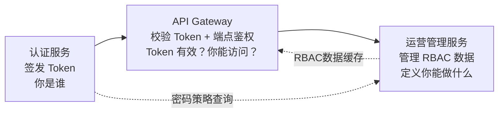

- **认证服务**签发 Token 后不再参与热路径
- **API Gateway**在网关面本地校验签名+过期+黑名单，同时查 RBAC 缓存做端点鉴权
- **运营管理服务**管理 RBAC 权限数据、密码策略、租户配额等管理域数据，Gateway 据此做端点鉴权

> **关键**：运营管理服务**不在请求热路径上**。它只被管理操作调用（管理员 CRUD）和被认证服务/Gateway 按需读取配置数据。RBAC 数据通过缓存数据库缓存到 Gateway 侧，管理变更后异步刷新缓存。

---

## 2. 对外契约

运营管理服务对外暴露九类 Interface：租户 Interface、用户 Interface、RBAC Interface、资源授权 Interface、SSO 管理 Interface、密码策略 Interface、配置 Interface、计费 Interface、沙箱资源 Interface。Interface 接口定义在 `libs/gnex-contracts`，实现由运营管理服务提供。

### 2.1 租户 Interface：TenantManagementInterface

```java
interface TenantManagementInterface {
    Tenant createTenant(TenantCreateRequest request);
    Tenant updateTenant(String tenantId, TenantUpdateRequest request);
    TenantDetail getTenant(String tenantId);
    PageResult<Tenant> listTenants(TenantQueryRequest request);
    void disableTenant(String tenantId);
    void enableTenant(String tenantId);
    TenantQuota updateQuota(String tenantId, TenantQuota quota);
    TenantUsage getTenantUsage(String tenantId);
}
```

**TenantCreateRequest / Tenant**：

```
TenantCreateRequest
├─ id            String     租户唯一标识（VARCHAR 自然键，如域名缩写）
├─ name          String     租户名称
├─ adminEmail    String     初始管理员邮箱
├─ adminUsername String     初始管理员用户名
├─ quota         TenantQuota  初始配额
└─ config        TenantConfig 初始配置

Tenant
├─ id            String     租户唯一标识（同 code）
├─ name          String
├─ code          String     冗余可读字段（等于 id）
├─ status        Enum       ACTIVE / DISABLED / SUSPENDED
├─ createdAt     Instant
└─ updatedAt     Instant

TenantQuota
├─ maxAgents         int    最大 Agent 数（-1 = 无限）
├─ maxProjects       int    最大项目数
├─ maxMembers        int    最大成员数
├─ maxSandboxes      int    最大并发沙箱数
├─ monthlyTokenBudget BigDecimal  月度 Token 预算（USD）
├─ storageQuotaMb    long   存储配额（MB）
└─ vectorQuotaMb     long   向量库配额（MB）
```

### 2.2 用户 Interface：UserManagementInterface

```java
interface UserManagementInterface {
    UserDetail createUser(UserCreateRequest request);
    UserDetail updateUser(Long userId, UserUpdateRequest request);
    UserDetail getUser(Long userId);
    PageResult<UserSummary> listUsers(UserQueryRequest request);
    void deleteUser(Long userId);
    void assignRole(Long userId, Long roleId, String tenantId);
    void removeRole(Long userId, Long roleId, String tenantId);
    void assignToTenant(Long userId, String tenantId, String role);
    void removeFromTenant(Long userId, String tenantId);
    void resetPasswordRequest(Long userId);
    void disableUser(Long userId);
    void enableUser(Long userId);
}
```

**UserCreateRequest / UserDetail**：

```
UserCreateRequest
├─ username      String
├─ password      String     初始密码（传输层 TLS 加密）
├─ email         String
├─ displayName   String
├─ deptId        Long       部门 ID（可选）
├─ tenantId      String     归属租户
└─ roleIds       List<Long> 初始角色

UserDetail
├─ id            Long
├─ username      String
├─ email         String
├─ displayName   String
├─ status        Enum       ACTIVE / DISABLED / LOCKED
├─ deptId        Long
├─ tenants       List<UserTenantInfo>  归属租户列表
├─ roles         List<RoleInfo>        角色列表
├─ lastLoginAt   Instant
├─ createdAt     Instant
└─ updatedAt     Instant
```

### 2.3 RBAC Interface：RbacManagementInterface

```java
interface RbacManagementInterface {
    RoleDetail createRole(RoleCreateRequest request);
    RoleDetail updateRole(Long roleId, RoleUpdateRequest request);
    void deleteRole(Long roleId);
    RoleDetail getRole(Long roleId);
    List<RoleDetail> listRoles(String tenantId);
    List<PermissionInfo> listPermissions();
    void assignPermissions(Long roleId, List<Long> permissionIds);
    List<PermissionInfo> getRolePermissions(Long roleId);
    boolean checkPermission(Long userId, String permissionCode, String tenantId);
}
```

**RoleCreateRequest / RoleDetail**：

```
RoleCreateRequest
├─ name          String     角色名称（如 PROJECT_MANAGER）
├─ displayName   String     显示名称
├─ description   String
├─ tenantId      String     所属租户（null = 全局角色）
├─ permissionIds List<Long> 关联权限
└─ isGlobal      boolean    是否全局角色

RoleDetail
├─ id            Long
├─ name          String
├─ displayName   String
├─ description   String
├─ tenantId      String
├─ isGlobal      boolean
├─ permissions   List<PermissionInfo>
├─ userCount     int        关联用户数
├─ createdAt     Instant
└─ updatedAt     Instant
```

### 2.4 资源授权 Interface：ResourceGrantInterface

资源授权（Resource Grant）是独立于功能角色的第二套权限体系——定义"哪个用户"对"哪个具体资源"拥有"哪些操作许可"。详见 §3.3.2 资源授权管理。

```java
interface ResourceGrantInterface {
    ResourceGrant createGrant(GrantCreateRequest request);
    void revokeGrant(Long grantId);
    List<ResourceGrant> listGrantsByUser(Long userId, String tenantId);
    List<ResourceGrant> listGrantsByResource(String resourceType, Long resourceId, String tenantId);
    List<ResourceGrant> listGrantsByUserAndType(Long userId, String resourceType, String tenantId);
    boolean checkGrant(Long userId, String resourceType, Long resourceId, String permission, String tenantId);
}
```

**GrantCreateRequest / ResourceGrant**：

```
GrantCreateRequest
├─ userId         Long       被授权用户 ID
├─ tenantId       String     租户 ID
├─ resourceType   String     资源类型（agent / skill / knowledge_base / mcp_config / tool / workflow / project）
├─ resourceId     Long       资源 ID
├─ permission     String     操作许可（read / write / delete / execute / manage）
└─ scope          String     授权范围（tenant / project:{id} / resource:{id}）

ResourceGrant
├─ id             Long
├─ userId         Long
├─ tenantId       String
├─ resourceType   String
├─ resourceId     Long
├─ permission     String
├─ scope          String
├─ grantedBy      Long       授权人 ID
├─ createdAt      Instant
└─ UNIQUE(userId, tenantId, resourceType, resourceId, permission)
```

**设计原则**：

| 原则 | 说明 |
| --- | --- |
| **与功能角色完全独立** | resource_grant 表不引用 role_def——用户授权直接绑定 user_id，不通过角色间接关联。DEVELOPER 不自动拥有任何资源权限，VIEWER 也可以被单独授权执行特定 agent |
| **运营管理服务是唯一真相源** | 所有资源授权通过本 Interface 管理，认证服务不参与（不详见、不读、不写、不缓存） |
| **授权变更实时生效** | createGrant / revokeGrant 写结构化数据库后同步刷新缓存数据库 `grant:{userId}:{tenantId}:{resourceType}:{resourceId}`，Gateway 下一次请求即生效 |
| **检查由 Gateway 执行** | `checkGrant()` 是内部分析/运维用的查询接口，不在请求热路径上。运行时每请求的资源授权校验由 Gateway 查缓存数据库完成 |

### 2.5 SSO 管理 Interface：SsoConfigManagementInterface

```java
interface SsoConfigManagementInterface {
    SsoConfigDetail create(SsoConfigCreateRequest request);
    SsoConfigDetail update(Long configId, SsoConfigUpdateRequest request);
    void delete(Long configId);
    SsoConfigDetail getById(Long configId);
    List<SsoConfigSummary> listAll(Long tenantId);
    List<SsoConfigSummary> listEnabledProviders(Long tenantId);
    SsoConnectionTestResult testConnection(Long configId);
}
```

> **注意**：SSO 管理 Interface 只负责 IdP 配置的 CRUD。SSO 认证流程（authorization_code 交换、id_token 验证、用户关联）由认证服务负责。

### 2.6 密码策略 Interface：PasswordPolicyInterface

```java
interface PasswordPolicyInterface {
    PasswordPolicy getPolicy(String tenantId);
    void updatePolicy(String tenantId, PasswordPolicyUpdateRequest request);
    PasswordValidationResult validatePolicy(String password, String tenantId);
}
```

**PasswordPolicy / PasswordValidationResult**：

```
PasswordPolicy
├─ minLength         int     最小长度（默认 8）
├─ requireUppercase  boolean 需要大写字母
├─ requireLowercase  boolean 需要小写字母
├─ requireDigit      boolean 需要数字
├─ requireSpecial    boolean 需要特殊字符
├─ minCategories     int     至少满足的字符类别数（默认 3）
├─ expirationDays    int     过期天数（0 = 不过期）
├─ historyCount      int     历史密码不重复数（默认 5）
├─ lockoutThreshold  int     连续失败锁定阈值（默认 5）
├─ lockoutDuration   int     锁定时长秒（默认 900）
└─ forceChangeOnFirst boolean 首次登录强制修改（默认 true）

PasswordValidationResult
├─ valid       boolean
└─ violations  List<String>  不满足的策略描述
```

### 2.7 配置 Interface：SystemConfigInterface

```java
interface SystemConfigInterface {
    String getConfig(String key, String tenantId);
    void setConfig(String key, String value, String tenantId);
    Map<String, String> listConfigs(String tenantId, String prefix);
    void deleteConfig(String key, String tenantId);
}
```

**配置键命名规范**：`gnex.{domain}.{subdomain}.{property}`，如 `gnex.sandbox.default-timeout-seconds`、`gnex.billing.cost-alert-threshold`。平台级配置 `tenantId = null`，租户级配置指定 `tenantId`，租户级覆盖平台级。

### 2.8 计费 Interface：BillingManagementInterface

```java
interface BillingManagementInterface {
    BillingOverview getOverview(String tenantId, String month);
    PageResult<ProjectUsage> getProjectUsage(String tenantId, String month, PageRequest page);
    List<UsageByModel> getUsageByModel(String tenantId, String month);
    BillingBudget getBudget(String tenantId);
    void updateBudget(String tenantId, BillingBudget budget);
    PageResult<CostAlert> listCostAlerts(String tenantId, PageRequest page);
}
```

**BillingOverview / BillingBudget**：

```
BillingOverview
├─ tenantId         String
├─ month            String    "2026-06"
├─ totalTokens      long
├─ totalCostUsd     BigDecimal
├─ budgetUsd        BigDecimal
├─ budgetUsagePercent BigDecimal  预算使用百分比
└─ topProjects      List<ProjectCost>  消费 Top N 项目

BillingBudget
├─ monthlyBudgetUsd   BigDecimal  月度预算
├─ alertThresholdPct  int         告警阈值百分比（默认 80）
├─ hardLimitPct       int         硬限百分比（默认 120）
└─ autoDowngrade      boolean     超预算是否自动降级
```

### 2.9 沙箱资源 Interface：SandboxResourceInterface

```java
interface SandboxResourceInterface {
    SandboxTemplate createTemplate(SandboxTemplateCreateRequest request);
    SandboxTemplate updateTemplate(Long templateId, SandboxTemplateUpdateRequest request);
    void deleteTemplate(Long templateId);
    SandboxTemplate getTemplate(Long templateId);
    List<SandboxTemplate> listTemplates(String tenantId);
    SandboxTypeDetail createSandboxType(SandboxTypeCreateRequest request);
    void updateSandboxType(Long typeId, SandboxTypeUpdateRequest request);
    void deleteSandboxType(Long typeId);
    List<SandboxTypeDetail> listSandboxTypes(String tenantId);
    SandboxPoolStats getPoolStats(String tenantId);
    SandboxCostSummary getSandboxCost(String tenantId, String month);
    UserSandboxQuota getUserQuota(Long userId, String tenantId);
    UserSandboxQuota upsertUserQuota(Long userId, String tenantId, UserSandboxQuota quota);
    void deleteUserQuota(Long userId, String tenantId);
    List<UserSandboxQuota> listUserQuotas(String tenantId, PageRequest page);
}
```

**SandboxTemplate / SandboxTypeDetail**：

```
SandboxTemplate
├─ id            Long
├─ name          String     模板名称（如 "Python 标准环境"）
├─ tenantId      String     所属租户（null = 平台模板）
├─ type          Enum       SCRIPT / BROWSER / DATABASE
├─ isolationLevel Enum      DOCKER / GVISOR / FIRECRACKER
├─ runtime       String     运行时（如 "python3.11+node20"）
├─ cpuLimit      String     CPU 限制（如 "2"）
├─ memoryLimit   String     内存限制（如 "4Gi"）
├─ diskLimit     String     磁盘限制（如 "10Gi"）
├─ imageRef      String     镜像引用
├─ preinstalledPkgs List<String>  预装包列表
├─ enabled       boolean
├─ createdAt     Instant
└─ updatedAt     Instant

SandboxTypeDetail
├─ id            Long
├─ name          String     类型名称（如 "代码沙箱"、"浏览器沙箱"）
├─ tenantId      String
├─ description   String
├─ allowedTemplates List<Long>  关联模板 ID
├─ defaultTemplateId Long      默认模板
├─ networkPolicy Enum       FULL / WHITELIST / NONE
├─ maxConcurrent int        单租户最大并发数
├─ costPerHour   BigDecimal 每小时成本（USD）
├─ enabled       boolean
├─ failureDetection SandboxFailureDetection  故障检测画像
└─ priority      int        调度优先级（0=最低，越大越优先，默认 0）

SandboxFailureDetection
├─ heartbeatIntervalSeconds   int  心跳间隔秒数（默认 10，沙箱调度器按此频率发送健康检查 ping）
├─ missedHeartbeatThreshold   int  遗漏心跳阈值（默认 3，连续 N 次无响应判定为 dead）
├─ startupTimeoutSeconds      int  启动超时秒数（默认 120，沙箱 created → ready 最大等待时间）
└─ executionTimeoutSeconds    int  执行超时秒数（默认 1800，单次 exec 原语最大执行时长）

SandboxPoolStats
├─ tenantId        String
├─ total           int      总沙箱数
├─ executing       int      执行中
├─ idle            int      空闲
├─ creating        int      创建中
└─ error           int      异常

SandboxCostSummary
├─ tenantId        String
├─ month           String
├─ totalHours      BigDecimal  总运行时长（小时）
├─ totalCostUsd    BigDecimal  总成本
└─ byType          Map<String, TypeCost>  按类型分成本

UserSandboxQuota
├─ userId             Long
├─ tenantId           String
├─ maxConcurrent      int    单用户最大并发沙箱数（-1 = 不限，默认继承租户级）
├─ defaultTemplateId  Long   默认沙箱模板（null = 继承类型默认模板）
├─ priority           int    调度优先级（-1 = 继承类型设置，≥0 = 覆盖）
├─ enabled            boolean  用户沙箱是否启用
├─ updatedBy          Long
└─ updatedAt          Instant
```

> **注意**：`UserSandboxQuota` 是**可选覆盖**——如果用户没有独立配置，则继承租户级 `SandboxTypeDetail` 的设置。解析优先级：**用户覆盖 > 租户覆盖 > 平台默认**。`maxConcurrent` 同时受限于 `tenant_quota.maxSandboxes` 的上限。

> **沙箱故障检测参数的应用链路**：`SandboxFailureDetection` 配置写入 `sandbox_type` 表 → 运营管理服务写入缓存数据库 → 沙箱调度器在创建沙箱时读取该类型的检测参数 → 注入到沙箱的运行时配置（通过环境变量或沙箱 SDK）。沙箱调度器按 `heartbeatIntervalSeconds` 频率发送 ping，连续 `missedHeartbeatThreshold` 次无响应判定为 dead 并触发故障恢复流程。

> **注意**：SandboxResourceInterface 只负责沙箱资源的**管理面**（模板定义、类型配置、配额规划、成本归集）。沙箱的**调度执行**（池化管理、生命周期、路由、Workspace）由沙箱调度器负责。两者关系类似"人力资源部管理编制和预算"与"项目经理调度人员"的分工。

### 2.10 契约语义约束

| 约束 | 说明 |
| --- | --- |
| **管理操作走 REST** | 运营管理服务对外暴露 REST API 供管理控制台调用；内部 Interface 供认证服务/Gateway 按需调用 |
| **RBAC 数据缓存到 Gateway** | 角色-权限映射写入结构化数据库后，异步刷新到缓存数据库（Gateway 侧本地缓存 + 缓存数据库二级缓存），管理变更后 ≤5s 生效 |
| **资源授权实时生效** | 资源授权变更（createGrant / revokeGrant）写结构化数据库后同步刷新缓存数据库 `grant:{userId}:{tenantId}:{resourceType}:{resourceId}`，Gateway 下一次请求即生效（无异步延迟） |
| **资源授权与功能角色独立** | `resource_grant` 表不引用 `role_def`，用户授权直接绑定 user_id。认证服务完全不参与资源授权体系——不读、不写、不缓存 |
| **密码策略按租户隔离** | 每个租户独立配置密码策略；平台级提供默认策略，租户级可覆盖 |
| **计费数据只读聚合** | 运营管理服务的计费模块**不产生**成本数据，只从 `token_usage` 表聚合查询；成本数据由模型网关旁路写入 |
| **沙箱资源管理面与调度面分离** | 运营管理服务管理沙箱模板/类型/配额（管理面），沙箱调度器执行调度/生命周期（执行面）；两者通过缓存数据库（模板配置）和消息总线（配置变更事件）间接交互，运营管理服务不直接调用沙箱调度器 |
| **沙箱成本由调度器旁路写入** | 沙箱运行时长和成本数据由沙箱调度器旁路写入 `sandbox_usage` 表，运营管理服务只做聚合查询 |
| **沙箱配额三级覆盖** | 平台默认 → 租户级覆盖（`sandbox_type.tenantId`） → 用户级覆盖（`user_sandbox_quota`），最具体层优先；用户级不配置时继承租户级 |
| **沙箱故障检测按类型配置** | 每种沙箱类型定义独立的 `SandboxFailureDetection` 画像（心跳间隔·遗漏阈值·启动超时·执行超时），沙箱调度器在创建时注入运行时配置 |
| **配置变更异步生效** | 系统配置变更后发布事件到消息总线，消费端（Agent 引擎/沙箱调度器/模型网关）按需刷新本地缓存 |

---

## 3. 核心流程设计

### 3.1 租户管理

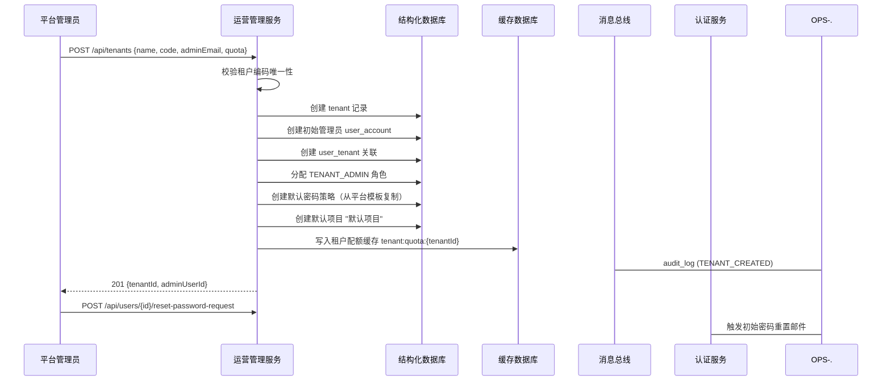

**租户状态机**：

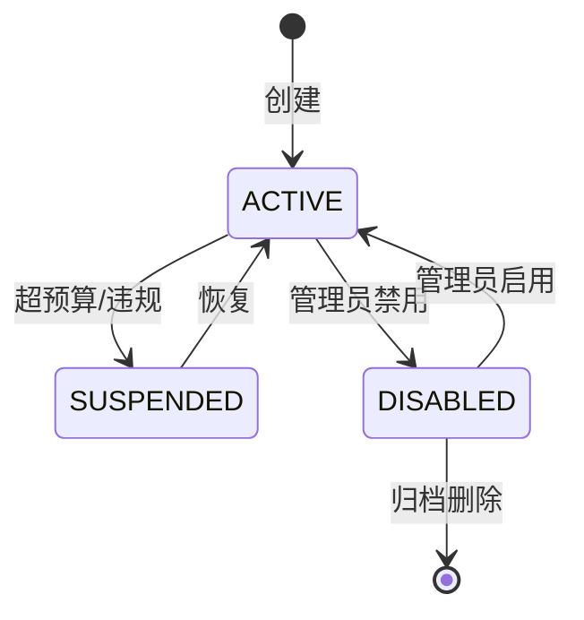

| 状态 | 含义 | 对运行中的 Agent 的影响 |
| --- | --- | --- |
| ACTIVE | 正常运营 | 无影响 |
| SUSPENDED | 暂停（超预算/违规） | 已运行 Agent 继续完成；**新请求拒绝**（Gateway 查缓存返回 403） |
| DISABLED | 禁用（管理员操作） | **所有 Token 立即吊销**（调用认证服务 `revokeAllTokensOfUser`）；新请求拒绝 |

### 3.2 用户管理

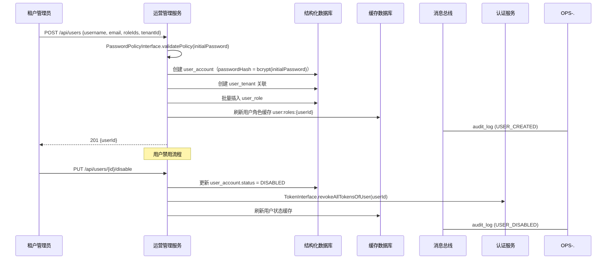

**用户与租户的多对多关系**：一个用户可属于多个租户（通过 `user_tenant` 关联表），登录时选择租户上下文。同一用户在不同租户可有不同角色。

### 3.3 权限管理

GNEX 的权限模型是**两套正交的独立体系**——功能角色定义"用户是组织中的谁"，资源授权定义"用户能碰哪些具体资源"。详见认证服务设计方案 §12.3.1 的设计决策。

#### 3.3.1 功能角色管理

**定位**：定义用户在组织中的身份标签（tenant_admin / project_manager / developer / viewer）。一个用户在一个租户下只有一个功能角色。功能角色不绑定任何具体资源——DEVELOPER 不自动拥有任何 agent 的执行权限。

**权限模型**：RBAC（基于角色的访问控制），采用"全局角色 + 租户角色"双层结构。

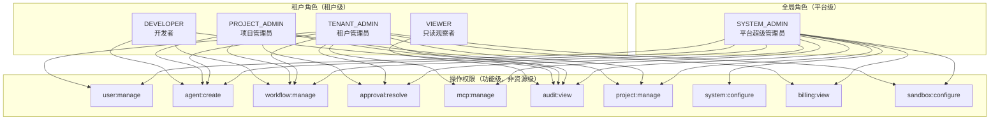

> **注意**：以上 permissions 定义的是**操作权限**（如 `agent:create` = 能创建 Agent），不是**资源授权**（如能执行 agent_123）。"能执行哪个具体 agent"由 §3.3.2 资源授权管理负责。

**认证服务参与**：签发 JWT 时从 `user_role` 表读取用户的角色名，写入 JWT `roles` claim。Gateway 从 JWT 解析 roles 做端点级粗粒度校验。

**RBAC 缓存刷新机制**：

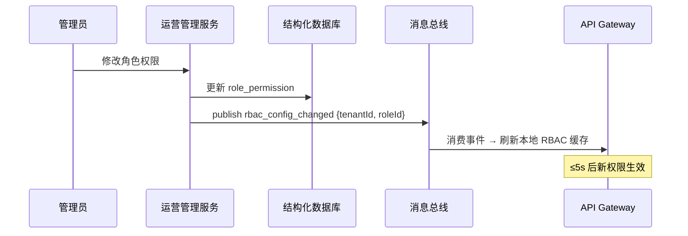

#### 3.3.2 资源授权管理

**定位**：定义"哪个用户"对"哪个具体资源"拥有"哪些操作许可"。资源授权独立于功能角色——VIEWER 可以被单独授权执行 agent_123，DEVELOPER 不自动拥有任何资源的执行权限。

**资源类型与动作矩阵**：

| 资源类型 | 标识 | 支持的动作 | 说明 |
| --- | --- | --- | --- |
| **项目** | `project` | read / write / delete / manage | manage 包含该项目下所有子资源的管理权 |
| **Agent** | `agent` | read / write / delete / execute / manage | execute = 可调用 Agent 运行 |
| **Skill** | `skill` | read / write / delete / manage | — |
| **知识库** | `knowledge_base` | read / write / delete / manage | read = 可检索文档；write = 可上传/编辑 |
| **MCP 连接** | `mcp_config` | read / write / delete / manage | — |
| **工具** | `tool` | read / write / delete / manage | — |
| **工作流** | `workflow` | read / write / delete / execute / manage | execute = 可触发运行 |

**创建资源授权流程**：

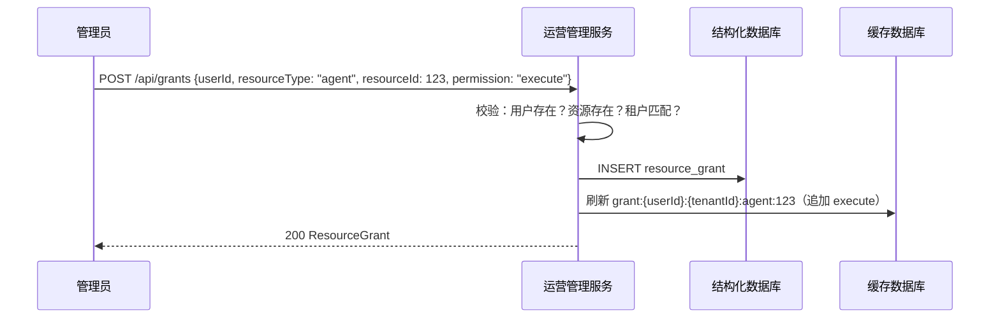

**撤销资源授权流程**：

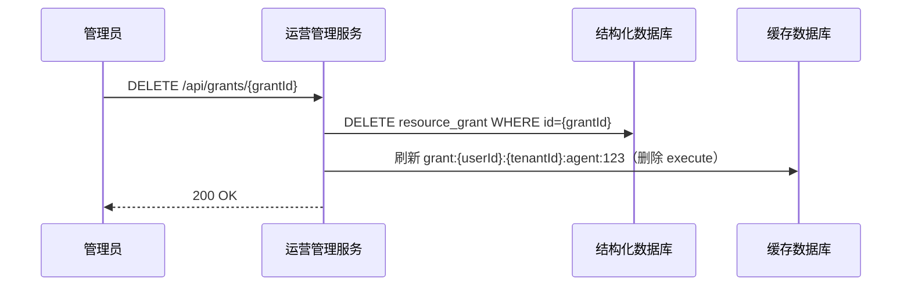

**运行时授权校验链路**（请求热路径，运营管理服务不参与）：

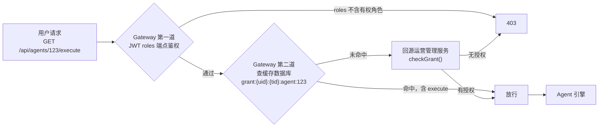

> **与功能角色校验的区别**：功能角色校验是**端点级**（"这个 URL 你能不能访问"），资源授权校验是**实例级**（"这个具体的 agent_123 你能不能执行"）。两者在 Gateway 按序执行，任一不通过返回 403。

**数据隔离兜底**：即使 Gateway 的资源授权校验被跳过（bug/配置错误），底层 MyBatis-Plus 拦截器强制追加 `WHERE tenant_id=?`，确保租户 A 的用户绝不可能读取租户 B 的资源数据。

### 3.4 密码策略管理

密码策略按租户独立配置，平台提供默认模板。认证服务在密码变更时调用 `PasswordPolicyInterface.validatePolicy()` 校验。

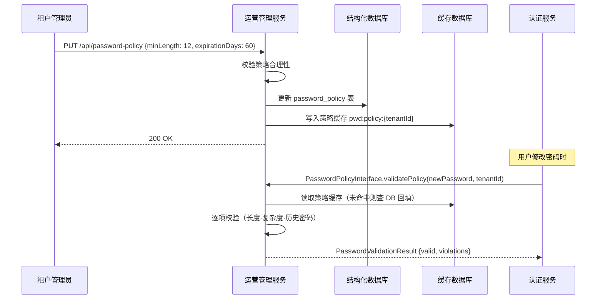

**历史密码校验**：用户最近 N 次密码哈希存 `password_history` 表，修改时比对是否与历史重复。

### 3.5 系统配置管理

配置采用"平台默认 + 租户覆盖"双层模型，支持配置版本控制和变更回滚。

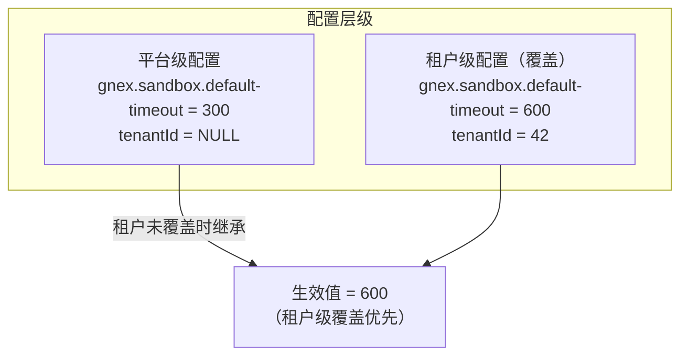

**配置变更传播**：

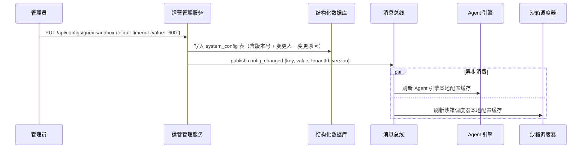

### 3.6 计费管理

计费模块**不产生**成本数据，只做聚合查询和预算管控。

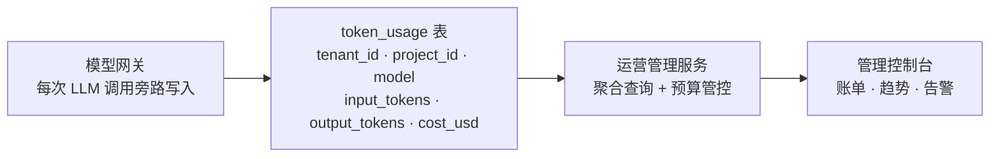

**预算管控三级告警**：

| 阶段 | 条件 | 动作 |
| --- | --- | --- |
| 预警 | 月消耗 ≥ 80% 预算 | P2 告警通知租户管理员 |
| 超限 | 月消耗 ≥ 100% 预算 | P1 告警 + 非关键 Agent 自动降级到 cost_aware 策略 |
| 熔断 | 月消耗 ≥ 120% 预算 | P0 告警 + 新请求拒绝（Gateway 查缓存拦截） |

**预算检查时序**：

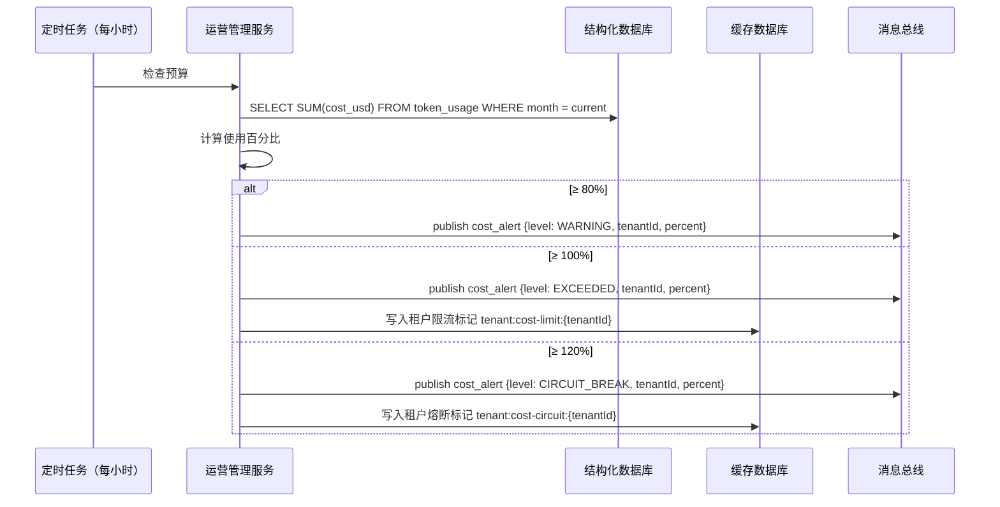

### 3.7 沙箱资源管理

沙箱资源管理是运营管理服务与沙箱调度器之间的**管理面/执行面分离**。运营管理服务定义"沙箱应该长什么样、能用多少、花多少钱、故障怎么检测"；沙箱调度器根据这些定义执行"创建、调度、回收、健康检查"。

**三级配置覆盖模型**：

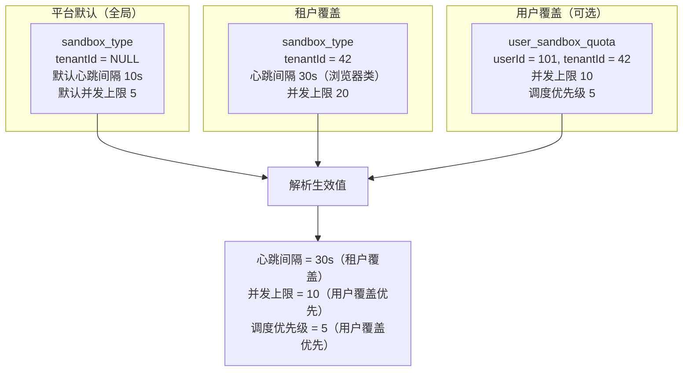

```mermaid
flowchart TB
    subgraph MGMT["管理面 · 运营管理服务"]
        TPL["沙箱模板<br/>定义镜像·运行时·资源规格"]
        TYPE["沙箱类型<br/>定义隔离级别·网络策略·并发上限<br/>故障检测画像（心跳·超时阈值）"]
        QUOTA["租户沙箱配额<br/>tenant_quota.maxSandboxes"]
        USERQ["用户沙箱配额<br/>user_sandbox_quota<br/>（可选覆盖）"]
        COST["沙箱成本归集<br/>sandbox_usage 聚合"]
    end
    subgraph EXEC["执行面 · 沙箱调度器"]
        POOL["池化管理<br/>预热池·Cold/Warm/Hot"]
        SCHED["路由调度<br/>模板匹配·亲和性·优先级"]
        LIFE["生命周期<br/>创建→执行→空闲→回收"]
        HB["健康检查<br/>按 failureDetection 画像<br/>发送心跳 ping"]
    end

    TPL -->|"模板配置<br/>写入缓存数据库"| POOL
    TYPE -->|"类型约束 + 故障检测<br/>写入缓存数据库"| SCHED
    TYPE -->|"故障检测参数<br/>注入沙箱运行时"| HB
    QUOTA -->|"租户配额上限<br/>写入缓存数据库"| POOL
    USERQ -->|"用户配额覆盖<br/>写入缓存数据库"| SCHED
    COST <-|"运行时长旁路写入<br/>sandbox_usage"| LIFE
```

**沙箱模板 CRUD 流程**：

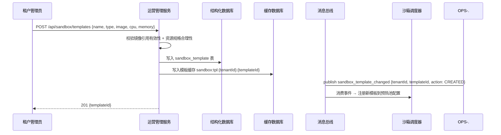

**沙箱类型与模板的关系**：

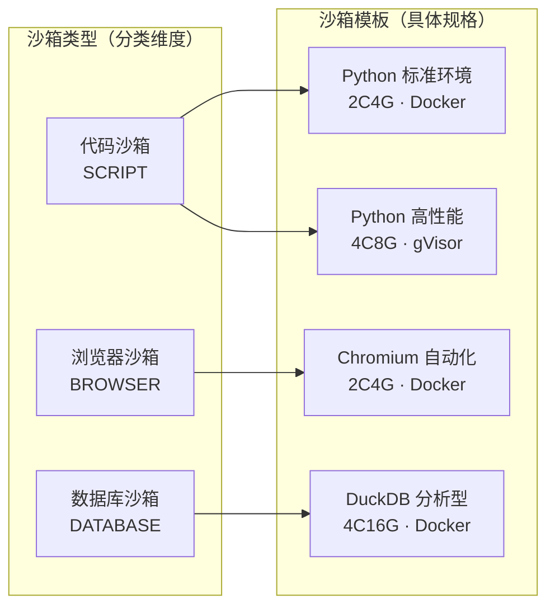

**用户级沙箱配额配置流程**：

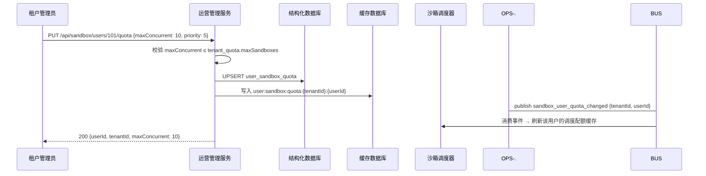

**故障检测配置流程**：管理员更新 `SandboxTypeDetail.failureDetection` → 运营管理服务写入 `sandbox_type` 表 + 缓存数据库 → 消息总线广播 `sandbox_type_changed` 事件 → 沙箱调度器消费后在**下一次创建该类型沙箱时**注入新的检测参数。已运行的沙箱**不受影响**——心跳配置变更仅对新创建的沙箱生效，避免修改运行中沙箱的检测参数导致误判。

**配额管控链路（三级校验）**：沙箱调度器在分配沙箱前按以下次序校验——① 确认该用户是否有 `user_sandbox_quota` 且 `enabled = true`，取用户级 `maxConcurrent`；② 若无用户级配置，取租户级 `sandbox_type.maxConcurrent`；③ 再与 `tenant_quota.maxSandboxes` 取最小值作为最终上限。超配额时返回 `QUOTA_EXCEEDED` → Agent 引擎降级（排队/转人工）。

**沙箱成本归集**：沙箱调度器在沙箱状态变更时旁路写入 `sandbox_usage` 表（每次状态流转记录时间戳和资源用量），运营管理服务按月/租户/类型聚合查询。

### 3.8 审计事件说明

运营管理服务**不承担审计查询职责**——审计日志的查询、导出、归档由独立的**可观测性与审计服务**负责。运营管理服务的角色是**审计事件的生产者**：在执行管理操作（租户/用户/角色/配置变更等）后，异步发布审计事件到消息总线 `audit_log` Topic，由状态同步器消费写入 `audit_log` 表，可观测性与审计服务从该表提供查询和归档服务。

---

## 4. 数据模型

### 4.1 核心表

运营管理服务管理的表（标注管理方，标注认证服务共享的表）：

| 表 | 管理方 | 说明 |
| --- | --- | --- |
| `tenant` | 运营管理服务 | 租户主表（v2.0 新增，v1 中 tenant 仅为 String ID） |
| `tenant_quota` | 运营管理服务 | 租户配额 |
| `tenant_config` | 运营管理服务 | 租户级配置覆盖 |
| `user_account` | 运营管理服务（写）/ 认证服务（读+SSO 写） | 用户账号，含 passwordHash |
| `user_profile` | 运营管理服务 | 用户扩展信息（邮箱·显示名·头像·部门） |
| `user_tenant` | 运营管理服务 | 用户-租户多对多关联 |
| `user_role` | 运营管理服务 | 用户-角色关联 |
| `dept` | 运营管理服务 | 部门/组织架构 |
| `role_def` | 运营管理服务 | 角色定义 |
| `permission_def` | 运营管理服务 | 权限定义（系统预置，不可删除） |
| `role_permission` | 运营管理服务 | 角色-权限关联 |
| `resource_grant` | 运营管理服务 | 资源级授权（用户→具体资源操作许可） |
| `sso_config` | 运营管理服务（写）/ 认证服务（读） | SSO 提供商配置 |
| `password_policy` | 运营管理服务 | 密码策略（按租户） |
| `password_history` | 运营管理服务 | 密码历史记录 |
| `system_config` | 运营管理服务 | 系统配置（平台级+租户级） |
| `token_usage` | 模型网关（写）/ 运营管理服务（读） | Token 用量明细 |
| `model_pricing` | 运营管理服务 | 模型定价 |
| `billing_budget` | 运营管理服务 | 租户计费预算 |
| `cost_alert` | 运营管理服务 | 成本告警记录 |
| `sandbox_template` | 运营管理服务（写）/ 沙箱调度器（读） | 沙箱资源模板 |
| `sandbox_type` | 运营管理服务 | 沙箱类型定义（含故障检测画像） |
| `sandbox_usage` | 沙箱调度器（写）/ 运营管理服务（读） | 沙箱运行时长与成本明细 |
| `user_sandbox_quota` | 运营管理服务（写）/ 沙箱调度器（读） | 用户级沙箱配额覆盖 |

### 4.2 新增表 DDL（v2.0）

**tenant 表**（v1 中不存在，v2.0 新增）：

```sql
CREATE TABLE tenant (
    id            VARCHAR(32)  PRIMARY KEY,
    name          VARCHAR(128) NOT NULL,
    code          VARCHAR(64)  NOT NULL UNIQUE,
    status        VARCHAR(16)  NOT NULL DEFAULT 'ACTIVE',
    created_by    BIGINT,
    created_at    TIMESTAMP    NOT NULL DEFAULT CURRENT_TIMESTAMP,
    updated_at    TIMESTAMP    NOT NULL DEFAULT CURRENT_TIMESTAMP
);
```

> **约定**：`id` 为租户唯一标识（VARCHAR 自然键），由创建方传入（如域名缩写），与 `code` 取值一致。`code` 保留为冗余可读字段，`id` 作为所有外键引用的目标。

**tenant_quota 表**：

```sql
CREATE TABLE tenant_quota (
    id                  BIGINT       PRIMARY KEY AUTOINCREMENT,
    tenant_id           VARCHAR(32)  NOT NULL,
    max_agents          INT          NOT NULL DEFAULT -1,
    max_projects        INT          NOT NULL DEFAULT 10,
    max_members         INT          NOT NULL DEFAULT 50,
    max_sandboxes       INT          NOT NULL DEFAULT 5,
    monthly_token_budget DECIMAL(12,2) DEFAULT 100.00,
    storage_quota_mb    BIGINT       DEFAULT 10240,
    vector_quota_mb     BIGINT       DEFAULT 5120,
    updated_at          TIMESTAMP    NOT NULL DEFAULT CURRENT_TIMESTAMP,
    UNIQUE(tenant_id)
);
```

**password_policy 表**：

```sql
CREATE TABLE password_policy (
    id                  BIGINT       PRIMARY KEY AUTOINCREMENT,
    tenant_id           VARCHAR(32)  NOT NULL,
    min_length          INT          NOT NULL DEFAULT 8,
    require_uppercase   BOOLEAN      NOT NULL DEFAULT TRUE,
    require_lowercase   BOOLEAN      NOT NULL DEFAULT TRUE,
    require_digit       BOOLEAN      NOT NULL DEFAULT TRUE,
    require_special     BOOLEAN      NOT NULL DEFAULT FALSE,
    min_categories      INT          NOT NULL DEFAULT 3,
    expiration_days     INT          NOT NULL DEFAULT 90,
    history_count       INT          NOT NULL DEFAULT 5,
    lockout_threshold   INT          NOT NULL DEFAULT 5,
    lockout_duration    INT          NOT NULL DEFAULT 900,
    force_change_on_first BOOLEAN    NOT NULL DEFAULT TRUE,
    updated_at          TIMESTAMP    NOT NULL DEFAULT CURRENT_TIMESTAMP,
    UNIQUE(tenant_id)
);
```

**password_history 表**：

```sql
CREATE TABLE password_history (
    id            BIGINT       PRIMARY KEY AUTOINCREMENT,
    user_id       BIGINT       NOT NULL,
    password_hash VARCHAR(256) NOT NULL,
    created_at    TIMESTAMP    NOT NULL DEFAULT CURRENT_TIMESTAMP,
    INDEX idx_ph_user (user_id, created_at)
);
```

**dept 表**：

```sql
CREATE TABLE dept (
    id            BIGINT       PRIMARY KEY AUTOINCREMENT,
    tenant_id     VARCHAR(32)  NOT NULL,
    name          VARCHAR(128) NOT NULL,
    parent_id     BIGINT,
    sort_order    INT          DEFAULT 0,
    created_at    TIMESTAMP    NOT NULL DEFAULT CURRENT_TIMESTAMP,
    updated_at    TIMESTAMP    NOT NULL DEFAULT CURRENT_TIMESTAMP
);
```

**system_config 表**：

```sql
CREATE TABLE system_config (
    id            BIGINT       PRIMARY KEY AUTOINCREMENT,
    config_key    VARCHAR(256) NOT NULL,
    config_value  TEXT,
    tenant_id     VARCHAR(32),
    version       INT          NOT NULL DEFAULT 1,
    description   VARCHAR(512),
    updated_by    BIGINT,
    updated_at    TIMESTAMP    NOT NULL DEFAULT CURRENT_TIMESTAMP,
    UNIQUE(config_key, COALESCE(tenant_id, ''))
);
```

**billing_budget 表**：

```sql
CREATE TABLE billing_budget (
    id                  BIGINT       PRIMARY KEY AUTOINCREMENT,
    tenant_id           VARCHAR(32)  NOT NULL,
    monthly_budget_usd  DECIMAL(12,2) NOT NULL DEFAULT 100.00,
    alert_threshold_pct INT          NOT NULL DEFAULT 80,
    hard_limit_pct     INT          NOT NULL DEFAULT 120,
    auto_downgrade     BOOLEAN      NOT NULL DEFAULT TRUE,
    updated_at          TIMESTAMP    NOT NULL DEFAULT CURRENT_TIMESTAMP,
    UNIQUE(tenant_id)
);
```

**cost_alert 表**：

```sql
CREATE TABLE cost_alert (
    id            BIGINT       PRIMARY KEY AUTOINCREMENT,
    tenant_id     VARCHAR(32)  NOT NULL,
    level         VARCHAR(16)  NOT NULL,
    percent       DECIMAL(5,2) NOT NULL,
    month         VARCHAR(7)   NOT NULL,
    message       VARCHAR(512),
    created_at    TIMESTAMP    NOT NULL DEFAULT CURRENT_TIMESTAMP,
    INDEX idx_ca_tenant_month (tenant_id, month)
);
```

**sandbox_template 表**：

```sql
CREATE TABLE sandbox_template (
    id                BIGINT       PRIMARY KEY AUTOINCREMENT,
    name              VARCHAR(128) NOT NULL,
    tenant_id         VARCHAR(32),
    type              VARCHAR(16)  NOT NULL,
    isolation_level   VARCHAR(16)  NOT NULL DEFAULT 'DOCKER',
    runtime           VARCHAR(128),
    cpu_limit         VARCHAR(16)  NOT NULL DEFAULT '2',
    memory_limit      VARCHAR(16)  NOT NULL DEFAULT '4Gi',
    disk_limit        VARCHAR(16)  NOT NULL DEFAULT '10Gi',
    image_ref         VARCHAR(256) NOT NULL,
    preinstalled_pkgs TEXT,
    enabled           BOOLEAN      NOT NULL DEFAULT TRUE,
    created_at        TIMESTAMP    NOT NULL DEFAULT CURRENT_TIMESTAMP,
    updated_at        TIMESTAMP    NOT NULL DEFAULT CURRENT_TIMESTAMP
);
```

**sandbox_type 表**：

```sql
CREATE TABLE sandbox_type (
    id                  BIGINT       PRIMARY KEY AUTOINCREMENT,
    name                VARCHAR(128) NOT NULL,
    tenant_id           VARCHAR(32),
    description         VARCHAR(512),
    allowed_template_ids TEXT,
    default_template_id BIGINT,
    network_policy      VARCHAR(16)  NOT NULL DEFAULT 'WHITELIST',
    max_concurrent      INT          NOT NULL DEFAULT 5,
    cost_per_hour       DECIMAL(10,4) DEFAULT 0.05,
    priority            INT          NOT NULL DEFAULT 0,
    heartbeat_interval_sec    INT    NOT NULL DEFAULT 10,
    missed_heartbeat_threshold INT  NOT NULL DEFAULT 3,
    startup_timeout_sec      INT    NOT NULL DEFAULT 120,
    execution_timeout_sec    INT    NOT NULL DEFAULT 1800,
    enabled             BOOLEAN      NOT NULL DEFAULT TRUE,
    created_at          TIMESTAMP    NOT NULL DEFAULT CURRENT_TIMESTAMP,
    updated_at          TIMESTAMP    NOT NULL DEFAULT CURRENT_TIMESTAMP
);
```

**sandbox_usage 表**（沙箱调度器写入，运营管理服务只读聚合）：

```sql
CREATE TABLE sandbox_usage (
    id            BIGINT       PRIMARY KEY AUTOINCREMENT,
    tenant_id     VARCHAR(32)  NOT NULL,
    project_id    BIGINT,
    sandbox_id    VARCHAR(64)  NOT NULL,
    template_id   BIGINT,
    type          VARCHAR(16)  NOT NULL,
    status_from   VARCHAR(16)  NOT NULL,
    status_to     VARCHAR(16)  NOT NULL,
    cpu_seconds   REAL,
    memory_mb_seconds REAL,
    cost_usd      DECIMAL(10,6),
    created_at    TIMESTAMP    NOT NULL DEFAULT CURRENT_TIMESTAMP,
    INDEX idx_su_tenant_month (tenant_id, created_at)
);
```

**user_sandbox_quota 表**：

```sql
CREATE TABLE user_sandbox_quota (
    id                  BIGINT       PRIMARY KEY AUTOINCREMENT,
    user_id             BIGINT       NOT NULL,
    tenant_id           VARCHAR(32)  NOT NULL,
    max_concurrent      INT          NOT NULL DEFAULT -1,
    default_template_id BIGINT,
    priority            INT          NOT NULL DEFAULT -1,
    enabled             BOOLEAN      NOT NULL DEFAULT TRUE,
    updated_by          BIGINT,
    updated_at          TIMESTAMP    NOT NULL DEFAULT CURRENT_TIMESTAMP,
    UNIQUE(user_id, tenant_id)
);
```

**resource_grant 表**（资源授权——独立于功能角色的第二套权限体系）：

```sql
CREATE TABLE resource_grant (
    id              BIGINT       PRIMARY KEY AUTOINCREMENT,
    user_id         BIGINT       NOT NULL,
    tenant_id       VARCHAR(32)  NOT NULL,
    resource_type   VARCHAR(32)  NOT NULL,
    resource_id     BIGINT       NOT NULL,
    permission      VARCHAR(16)  NOT NULL,
    scope           VARCHAR(64)  NOT NULL DEFAULT 'resource:{id}',
    granted_by      BIGINT       NOT NULL,
    created_at      TIMESTAMP    NOT NULL DEFAULT CURRENT_TIMESTAMP,
    UNIQUE(user_id, tenant_id, resource_type, resource_id, permission),
    INDEX idx_rg_user (user_id, tenant_id),
    INDEX idx_rg_resource (tenant_id, resource_type, resource_id)
);
```

### 4.3 缓存数据库键空间

| Key 模式 | 类型 | TTL | 用途 |
| --- | --- | --- | --- |
| `tenant:quota:{tenantId}` | Hash | 1h | 租户配额缓存（Gateway/调度器读取） |
| `tenant:status:{tenantId}` | String | 5min | 租户状态缓存（Gateway 拦截判断） |
| `tenant:cost-limit:{tenantId}` | String | 月末自动过期 | 租户成本超限标记 |
| `tenant:cost-circuit:{tenantId}` | String | 月末自动过期 | 租户成本熔断标记 |
| `user:roles:{userId}` | Hash | 10min | 用户角色缓存（Gateway 鉴权） |
| `user:status:{userId}` | String | 5min | 用户状态缓存（禁用/锁定） |
| `role:permissions:{roleId}` | Set | 10min | 角色-权限映射缓存 |
| `grant:{userId}:{tenantId}:{resourceType}:{resourceId}` | Set | 5min | 用户资源授权缓存（Gateway 每请求查询，§3.3.2） |
| `pwd:policy:{tenantId}` | Hash | 30min | 密码策略缓存 |
| `config:{key}:{tenantId}` | String | 5min | 系统配置缓存 |
| `sandbox:tpl:{tenantId}:{templateId}` | Hash | 30min | 沙箱模板缓存（沙箱调度器读取） |
| `sandbox:type:{tenantId}:{typeId}` | Hash | 30min | 沙箱类型缓存（含故障检测画像，沙箱调度器读取） |
| `user:sandbox:quota:{tenantId}:{userId}` | Hash | 15min | 用户沙箱配额缓存（沙箱调度器读取，优先级覆盖） |

---

## 5. 服务架构

### 5.1 包结构

```
services/gnex-ops-service/com/gnex/ops/
├── port/                     ← Interface 实现（八类 Interface）
│   ├── TenantManagementInterfaceAdapter.java
│   ├── UserManagementInterfaceAdapter.java
│   ├── RbacManagementInterfaceAdapter.java
│   ├── ResourceGrantInterfaceAdapter.java
│   ├── SsoConfigManagementInterfaceAdapter.java
│   ├── PasswordPolicyInterfaceAdapter.java
│   ├── SystemConfigInterfaceAdapter.java
│   ├── BillingManagementInterfaceAdapter.java
│   └── SandboxResourceInterfaceAdapter.java
├── tenant/                   ← 租户模块
│   ├── controller/           ← REST: /api/tenants
│   ├── service/              ← 租户管理逻辑
│   └── model/                ← Tenant, TenantQuota, TenantConfig
├── user/                     ← 用户模块
│   ├── controller/           ← REST: /api/users, /api/depts
│   ├── service/              ← 用户管理逻辑
│   └── model/                ← UserDetail, Dept
├── rbac/                     ← RBAC 模块
│   ├── controller/           ← REST: /api/roles, /api/permissions
│   ├── service/              ← 角色/权限管理逻辑
│   └── model/                ← RoleDetail, PermissionInfo
├── grant/                    ← 资源授权模块
│   ├── controller/           ← REST: /api/grants
│   ├── service/              ← 资源授权 CRUD + 缓存刷新
│   └── model/                ← ResourceGrant
├── sso/                      ← SSO 管理模块
│   ├── controller/           ← REST: /api/sso/configs
│   └── service/              ← SSO 配置 CRUD
├── policy/                   ← 密码策略模块
│   ├── controller/           ← REST: /api/password-policy
│   └── service/              ← 策略管理 + 校验
├── config/                   ← 配置模块
│   ├── controller/           ← REST: /api/configs
│   └── service/              ← 配置管理 + 变更传播
├── billing/                  ← 计费模块
│   ├── controller/           ← REST: /api/billing
│   ├── service/              ← 聚合查询 + 预算管控
│   └── scheduler/            ← 预算检查定时任务
├── sandbox/                  ← 沙箱资源管理模块
│   ├── controller/           ← REST: /api/sandbox/templates, /api/sandbox/types
│   ├── service/              ← 模板/类型管理 + 成本归集
│   └── model/                ← SandboxTemplate, SandboxTypeDetail
└── infrastructure/           ← 基础设施
    ├── persistence/           ← MyBatis-Plus Mapper
    ├── cache/                 ← 缓存数据库操作
    └── event/                 ← 消息总线事件发布
```

### 5.2 依赖关系

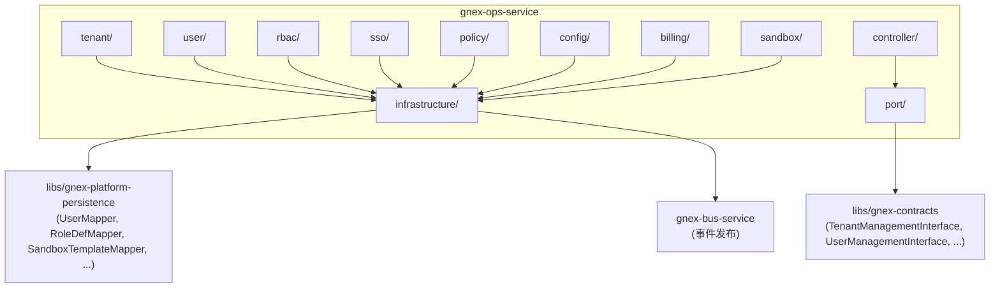

**依赖约束**：

- 运营管理服务**不依赖**认证服务的实现类，只通过 contracts Interface 接口交互（禁用用户时调用 `TokenInterface.revokeAllTokensOfUser()`）
- 运营管理服务**不依赖** API Gateway——Gateway 读取运营管理服务写入的缓存数据库 RBAC 数据，方向单向
- 运营管理服务对 `gnex-platform-persistence` 的依赖涵盖 `user_account` / `role_def` / `permission_def` / `sso_config` / `token_usage` / `sandbox_template` / `sandbox_type` / `sandbox_usage` 等表的读写

### 5.3 与 v1 的迁移关系

| v1 组件 | v1 位置 | v2 归属 | 变更 |
| --- | --- | --- | --- |
| `UserController` | gnex-platform-service user/controller/ | gnex-ops-service user/controller/ | 迁移，新增角色分配/部门管理端点 |
| `UserService` | gnex-platform-service user/service/ | gnex-ops-service user/service/ | 迁移，增强多租户用户管理 |
| `RbacService` | gnex-platform-service user/service/ | gnex-ops-service rbac/service/ | 迁移，新增角色/权限 CRUD Interface |
| `SsoConfigController` | gnex-platform-service user/controller/ | gnex-ops-service sso/controller/ | 迁移，新增连接测试端点 |
| `SsoConfigService` | gnex-platform-service user/service/ | gnex-ops-service sso/service/ | 迁移 |
| `AuditLogController` | gnex-platform-service user/controller/ | 可观测性与审计服务 | 迁移到独立服务，不在运营管理服务 |
| `AuditLogService` | gnex-platform-service user/service/ | 可观测性与审计服务 | 迁移到独立服务 |
| `BillingService` | gnex-platform-service billing/service/ | gnex-ops-service billing/service/ | 迁移，新增预算管控/告警 |
| `AuthController` | gnex-platform-service user/controller/ | 拆分：认证逻辑→gnex-auth-service | 管理部分（注册）留 ops |
| `JwtService` | gnex-platform-service user/service/ | gnex-auth-service | 全部迁移到认证服务 |
| — | — | gnex-ops-service tenant/ | **新增**：租户管理模块（v1 无租户实体） |
| — | — | gnex-ops-service policy/ | **新增**：密码策略模块 |
| — | — | gnex-ops-service config/ | **新增**：系统配置模块 |
| — | — | gnex-ops-service sandbox/ | **新增**：沙箱资源管理模块（v1 沙箱模板/类型硬编码在调度器） |

---

## 6. API 设计

### 6.1 租户 API

| 方法 | 路径 | 说明 | 权限 |
| --- | --- | --- | --- |
| POST | `/api/tenants` | 创建租户 | SYSTEM_ADMIN |
| GET | `/api/tenants` | 列出租户（分页） | SYSTEM_ADMIN |
| GET | `/api/tenants/{id}` | 获取租户详情 | SYSTEM_ADMIN / TENANT_ADMIN |
| PUT | `/api/tenants/{id}` | 更新租户信息 | SYSTEM_ADMIN |
| PUT | `/api/tenants/{id}/quota` | 更新租户配额 | SYSTEM_ADMIN |
| GET | `/api/tenants/{id}/usage` | 获取租户资源用量 | SYSTEM_ADMIN / TENANT_ADMIN |
| PUT | `/api/tenants/{id}/disable` | 禁用租户 | SYSTEM_ADMIN |
| PUT | `/api/tenants/{id}/enable` | 启用租户 | SYSTEM_ADMIN |

### 6.2 用户 API

| 方法 | 路径 | 说明 | 权限 |
| --- | --- | --- | --- |
| POST | `/api/users` | 创建用户 | TENANT_ADMIN |
| GET | `/api/users` | 列出用户（分页·过滤） | TENANT_ADMIN |
| GET | `/api/users/{id}` | 获取用户详情 | TENANT_ADMIN |
| PUT | `/api/users/{id}` | 更新用户信息 | TENANT_ADMIN |
| DELETE | `/api/users/{id}` | 删除用户（软删除） | TENANT_ADMIN |
| PUT | `/api/users/{id}/disable` | 禁用用户 | TENANT_ADMIN |
| PUT | `/api/users/{id}/enable` | 启用用户 | TENANT_ADMIN |
| POST | `/api/users/{id}/roles` | 分配角色 | TENANT_ADMIN |
| DELETE | `/api/users/{id}/roles/{roleId}` | 移除角色 | TENANT_ADMIN |
| POST | `/api/users/{id}/reset-password-request` | 请求密码重置 | TENANT_ADMIN |

### 6.3 部门 API

| 方法 | 路径 | 说明 | 权限 |
| --- | --- | --- | --- |
| POST | `/api/depts` | 创建部门 | TENANT_ADMIN |
| GET | `/api/depts` | 列出部门树 | TENANT_ADMIN |
| PUT | `/api/depts/{id}` | 更新部门 | TENANT_ADMIN |
| DELETE | `/api/depts/{id}` | 删除部门 | TENANT_ADMIN |

### 6.4 RBAC API

| 方法 | 路径 | 说明 | 权限 |
| --- | --- | --- | --- |
| POST | `/api/roles` | 创建角色 | TENANT_ADMIN |
| GET | `/api/roles` | 列出角色 | TENANT_ADMIN |
| GET | `/api/roles/{id}` | 获取角色详情 | TENANT_ADMIN |
| PUT | `/api/roles/{id}` | 更新角色 | TENANT_ADMIN |
| DELETE | `/api/roles/{id}` | 删除角色 | TENANT_ADMIN |
| POST | `/api/roles/{id}/permissions` | 分配权限 | SYSTEM_ADMIN |
| GET | `/api/roles/{id}/permissions` | 获取角色权限 | TENANT_ADMIN |
| GET | `/api/permissions` | 列出所有权限定义 | TENANT_ADMIN |

### 6.5 资源授权 API

| 方法 | 路径 | 说明 | 权限 |
| --- | --- | --- | --- |
| POST | `/api/grants` | 创建资源授权 | TENANT_ADMIN / PROJECT_ADMIN |
| DELETE | `/api/grants/{id}` | 撤销资源授权 | TENANT_ADMIN / PROJECT_ADMIN |
| GET | `/api/users/{id}/grants` | 获取用户所有资源授权 | TENANT_ADMIN |
| GET | `/api/grants` | 按资源类型+资源ID查询授权列表 | TENANT_ADMIN |

### 6.6 SSO 管理 API

| 方法 | 路径 | 说明 | 权限 |
| --- | --- | --- | --- |
| POST | `/api/sso/configs` | 创建 SSO 配置 | TENANT_ADMIN |
| GET | `/api/sso/configs` | 列出 SSO 配置 | TENANT_ADMIN |
| GET | `/api/sso/configs/{id}` | 获取 SSO 配置 | TENANT_ADMIN |
| PUT | `/api/sso/configs/{id}` | 更新 SSO 配置 | TENANT_ADMIN |
| DELETE | `/api/sso/configs/{id}` | 删除 SSO 配置 | TENANT_ADMIN |
| POST | `/api/sso/configs/{id}/test` | 测试 SSO 连接 | TENANT_ADMIN |

### 6.7 密码策略 API

| 方法 | 路径 | 说明 | 权限 |
| --- | --- | --- | --- |
| GET | `/api/password-policy` | 获取当前租户密码策略 | TENANT_ADMIN |
| PUT | `/api/password-policy` | 更新密码策略 | TENANT_ADMIN |

### 6.8 系统配置 API

| 方法 | 路径 | 说明 | 权限 |
| --- | --- | --- | --- |
| GET | `/api/configs` | 列出配置（支持 prefix 过滤） | SYSTEM_ADMIN / TENANT_ADMIN |
| GET | `/api/configs/{key}` | 获取配置值 | SYSTEM_ADMIN / TENANT_ADMIN |
| PUT | `/api/configs/{key}` | 设置配置值 | SYSTEM_ADMIN / TENANT_ADMIN |
| DELETE | `/api/configs/{key}` | 删除配置（恢复继承） | SYSTEM_ADMIN |

### 6.9 计费 API

| 方法 | 路径 | 说明 | 权限 |
| --- | --- | --- | --- |
| GET | `/api/billing/overview` | 获取计费概览 | TENANT_ADMIN |
| GET | `/api/billing/projects` | 获取项目用量明细 | TENANT_ADMIN |
| GET | `/api/billing/models` | 获取按模型用量 | TENANT_ADMIN |
| GET | `/api/billing/budget` | 获取预算配置 | TENANT_ADMIN |
| PUT | `/api/billing/budget` | 更新预算配置 | TENANT_ADMIN |
| GET | `/api/billing/alerts` | 获取成本告警列表 | TENANT_ADMIN |

### 6.10 沙箱资源 API

| 方法 | 路径 | 说明 | 权限 |
| --- | --- | --- | --- |
| POST | `/api/sandbox/templates` | 创建沙箱模板 | SYSTEM_ADMIN / TENANT_ADMIN |
| GET | `/api/sandbox/templates` | 列出沙箱模板 | TENANT_ADMIN |
| GET | `/api/sandbox/templates/{id}` | 获取模板详情 | TENANT_ADMIN |
| PUT | `/api/sandbox/templates/{id}` | 更新模板 | SYSTEM_ADMIN / TENANT_ADMIN |
| DELETE | `/api/sandbox/templates/{id}` | 删除模板 | SYSTEM_ADMIN / TENANT_ADMIN |
| POST | `/api/sandbox/types` | 创建沙箱类型（含故障检测画像） | SYSTEM_ADMIN |
| GET | `/api/sandbox/types` | 列出沙箱类型 | TENANT_ADMIN |
| PUT | `/api/sandbox/types/{id}` | 更新沙箱类型（含故障检测参数） | SYSTEM_ADMIN |
| DELETE | `/api/sandbox/types/{id}` | 删除沙箱类型 | SYSTEM_ADMIN |
| GET | `/api/sandbox/pool-stats` | 获取沙箱池统计 | TENANT_ADMIN |
| GET | `/api/sandbox/cost` | 获取沙箱成本归集 | TENANT_ADMIN |
| GET | `/api/sandbox/users/{userId}/quota` | 获取用户沙箱配额 | TENANT_ADMIN |
| PUT | `/api/sandbox/users/{userId}/quota` | 设置用户沙箱配额（覆盖租户默认） | TENANT_ADMIN |
| DELETE | `/api/sandbox/users/{userId}/quota` | 删除用户沙箱配额（恢复继承） | TENANT_ADMIN |
| GET | `/api/sandbox/users-quotas` | 列出用户沙箱配额（分页） | TENANT_ADMIN |

---

## 7. 多租户设计

### 7.1 租户隔离层级

| 维度 | 隔离方式 | 说明 |
| --- | --- | --- |
| 数据隔离 | `tenant_id` 列 + MyBatis-Plus 拦截器 | 所有核心表强制追加 `WHERE tenant_id = ?` |
| RBAC 隔离 | 角色按 `tenant_id` 隔离 | 租户 A 的自定义角色对租户 B 不可见；全局角色（SYSTEM_ADMIN）跨租户 |
| 配置隔离 | 租户级覆盖平台级 | 同一配置键，不同租户可有不同值 |
| 配额隔离 | `tenant_quota` 独立配额 | CPU/内存/沙箱/Token 预算按租户独立核算 |
| 沙箱隔离 | `sandbox_template.tenant_id` + `sandbox_type.tenant_id` | 租户自定义模板/类型对其他租户不可见；平台模板（tenant_id=null）全局共享 |
| 计费隔离 | `token_usage.tenant_id` + `sandbox_usage.tenant_id` | LLM 成本和沙箱成本按租户独立生成 |

### 7.2 租户上下文传播

```mermaid
flowchart LR
    CLIENT["客户端<br/>Authorization: Bearer {jwt}"] --> GW["API Gateway<br/>解析 JWT → 提取 tid/uid/roles<br/>注入请求头"]
    GW --> OPS["运营管理服务<br/>从请求头读取<br/>X-Gnex-Tenant-Id<br/>X-Gnex-User-Id<br/>X-Gnex-Roles"]
    OPS --> DB["数据库<br/>WHERE tenant_id = ?"]
```

- 管理操作必须携带租户上下文（JWT claims 中的 `tid`）
- SYSTEM_ADMIN 可跨租户操作（不追加 `tenant_id` 条件）
- 租户管理员只能操作本租户数据（拦截器强制追加）

---

## 8. 安全设计

### 8.1 威胁模型与对策

| 威胁 | 对策 | 实现层 |
| --- | --- | --- |
| **越权管理操作** | Gateway 端点鉴权 + 服务级 @PreAuthorize 细粒度校验 | Gateway + 运营管理服务 |
| **租户数据泄露** | MyBatis-Plus 拦截器强制追加 tenant_id + 数据库 RLS | 运营管理服务 + 数据库 |
| **密码策略绕过** | 密码变更必须经过 PasswordPolicyInterface 校验（认证服务调用） | 认证服务 |
| **配置注入攻击** | 配置值类型校验 + 敏感配置禁止通过 API 修改（仅环境变量） | 运营管理服务 |
| **成本数据篡改** | token_usage 表运营管理服务只读（写权限仅模型网关） | 数据库层 |
| **沙箱模板滥用** | 模板变更需 SYSTEM_ADMIN/TENANT_ADMIN 权限 + 变更前校验（网络策略不允许 NONE） | 运营管理服务 |
| **沙箱资源超占** | 配额上限由租户配额表定义，沙箱调度器在分配前校验缓存数据库配额缓存 | 运营管理服务 + 沙箱调度器 |
| **暴力管理操作** | 管理操作限流（按用户 QPS）+ 敏感操作二次确认 | Gateway + 运营管理服务 |

### 8.2 审计事件

运营管理服务在以下管理操作后异步发布审计事件到消息总线 `audit_log` Topic：

| 事件 | 审计内容 | 级别 |
| --- | --- | --- |
| TENANT_CREATED | tenantId, name, adminUserId | INFO |
| TENANT_DISABLED | tenantId, operatorId, reason | WARN |
| TENANT_QUOTA_CHANGED | tenantId, oldQuota, newQuota, operatorId | INFO |
| USER_CREATED | userId, tenantId, operatorId | INFO |
| USER_DISABLED | userId, tenantId, operatorId | WARN |
| USER_ROLE_ASSIGNED | userId, roleId, tenantId, operatorId | INFO |
| USER_ROLE_REMOVED | userId, roleId, tenantId, operatorId | INFO |
| ROLE_CREATED | roleId, tenantId, operatorId | INFO |
| ROLE_PERMISSION_CHANGED | roleId, addedPerms, removedPerms, operatorId | INFO |
| SSO_CONFIG_CREATED | configId, provider, tenantId, operatorId | INFO |
| SSO_CONFIG_DELETED | configId, provider, tenantId, operatorId | WARN |
| PASSWORD_POLICY_CHANGED | tenantId, operatorId | INFO |
| PASSWORD_RESET_REQUESTED | userId, operatorId | INFO |
| SYSTEM_CONFIG_CHANGED | key, tenantId, operatorId | INFO |
| BUDGET_CHANGED | tenantId, oldBudget, newBudget, operatorId | INFO |
| COST_ALERT_TRIGGERED | tenantId, level, percent | WARN |
| SANDBOX_TEMPLATE_CREATED | templateId, name, type, tenantId, operatorId | INFO |
| SANDBOX_TEMPLATE_UPDATED | templateId, changedFields, operatorId | INFO |
| SANDBOX_TEMPLATE_DELETED | templateId, name, tenantId, operatorId | WARN |
| SANDBOX_TYPE_CREATED | typeId, name, tenantId, operatorId | INFO |
| SANDBOX_TYPE_UPDATED | typeId, changedFields, operatorId | INFO |
| SANDBOX_TYPE_DELETED | typeId, name, tenantId, operatorId | WARN |
| SANDBOX_FAILURE_DETECTION_CHANGED | typeId, oldProfile, newProfile, operatorId | INFO |
| USER_SANDBOX_QUOTA_CHANGED | userId, tenantId, maxConcurrent, priority, operatorId | INFO |
| USER_SANDBOX_QUOTA_DELETED | userId, tenantId, operatorId | INFO |

---

## 9. 高可用与性能

### 9.1 准无状态水平扩展

运营管理服务是**准无状态**服务：

| 状态 | 存储位置 | 说明 |
| --- | --- | --- |
| 管理操作 | 结构化数据库 | 持久化，多副本共享 |
| RBAC 缓存 | 缓存数据库 | 外化存储，Gateway 读取 |
| 配置缓存 | 缓存数据库 | 外化存储，多副本共享 |
| 密码策略缓存 | 缓存数据库 | 外化存储，认证服务读取 |

> **结论**：进程内无状态，所有共享状态外化到缓存数据库/结构化数据库，可任意水平扩展。

### 9.2 性能基线

| 操作 | 目标延迟 | 说明 |
| --- | --- | --- |
| RBAC 缓存查询（Gateway 侧） | < 1ms | 缓存数据库 Hash 读取 |
| 密码策略查询 | < 2ms | 缓存数据库优先，未命中查结构化数据库 |
| 用户 CRUD | < 50ms | 结构化数据库 读写 |
| 计费聚合查询 | < 500ms | 结构化数据库 聚合查询（按月索引） |
| 沙箱模板/类型 CRUD | < 50ms | 结构化数据库 读写 |
| 沙箱成本归集查询 | < 300ms | sandbox_usage 表按月聚合 |
| 沙箱池状态查询 | < 5ms | 缓存数据库 读取沙箱注册表聚合 |
| 配置变更传播 | < 5s | 异步事件，消费端刷新缓存 |

### 9.3 部署规格

| 指标 | 值 | 说明 |
| --- | --- | --- |
| 副本数 | 1~2 | 中低频后台服务，不需要高副本数 |
| HPA | CPU > 70% 扩容 | 无状态，扩容零预热 |
| 资源请求 | CPU 200m / Memory 256Mi | 管理操作轻量 |
| 资源限制 | CPU 1000m / Memory 512Mi | 防止聚合查询 OOM |
| 健康检查 | /actuator/health + 缓存数据库/结构化数据库 连通性 | 深度检查 |

### 9.4 降级策略

| 故障场景 | 降级行为 | 用户感知 |
| --- | --- | --- |
| 缓存数据库不可用 | RBAC 鉴权降级为结构化数据库 直查（ms 级）+ 告警 | 请求延迟略增，功能不受影响 |
| 结构化数据库不可用 | 管理操作拒绝（无法持久化）+ RBAC 缓存仍可用 | 管理控制台不可用，运行中的 Agent 不受影响 |
| 消息总线不可用 | 审计事件本地缓冲（内存队列，上限 1 万条）+ 配置变更事件本地缓冲 + 告警 | 审计/配置事件短暂延迟，管理操作不受影响 |
| 运营管理服务全挂 | 管理控制台不可用；运行中的 Agent 不受影响（Gateway 使用缓存数据库 RBAC 缓存） | 管理员无法操作，普通用户无感知 |

---

## 10. 可观测性

### 10.1 设计决策：审计事件驱动

运营管理服务**不独立定义 Prometheus 业务指标和告警规则**，与认证服务保持一致的设计原则：

| 论点 | 说明 |
| --- | --- |
| **HTTP 通用指标已覆盖** | 管理端点（`/api/tenants/*`、`/api/users/*` 等）的 QPS/延迟/错误率由 Gateway/基础设施层覆盖 |
| **业务指标与审计事件重复** | `ops_user_created_total` 与审计事件 `USER_CREATED` 是同一件事的两种表达 |
| **实时告警由审计事件消费端触发** | 安全告警（如频繁禁用用户）由审计事件消费端触发 |

### 10.2 可观测性实现

```mermaid
flowchart LR
    OPS["运营管理服务"] -->|"审计事件<br/>USER_CREATED / ROLE_CHANGED ..."| BUS["消息总线<br/>audit_log Topic"]
    BUS --> SY["状态同步器<br/>消费审计事件"]
    SY --> DB["结构化数据库<br/>audit_log 表"]
    SY --> OBS["可观测性与审计服务<br/>查询/归档/告警"]
    OBS --> ALERT["告警引擎<br/>基于审计事件聚合"]
    ALERT -->|"安全告警<br/>频繁禁用用户<br/>权限批量变更"| NOTIFY["通知（邮件/IM）"]
```

**特殊指标**（运营管理服务独有，需 Prometheus 暴露）：

| 指标 | 类型 | 说明 |
| --- | --- | --- |
| `gnex_billing_monthly_cost_usd` | Gauge | 当前月度累计成本（按租户 label） |
| `gnex_billing_budget_usage_percent` | Gauge | 预算使用百分比（按租户 label） |
| `gnex_sandbox_pool_total` | Gauge | 沙箱池总容量（按租户 label） |
| `gnex_sandbox_pool_idle` | Gauge | 沙箱池空闲数（按租户 label） |

---

## 11. 落地路径

```mermaid
flowchart TD
    P1["Phase 1 契约重构<br/>扩展 contracts 新增八类 Interface<br/>（TenantManagementInterface, UserManagementInterface,<br/>RbacManagementInterface, PasswordPolicyInterface,<br/>SystemConfigInterface, BillingManagementInterface,<br/>SandboxResourceInterface,<br/>SsoConfigManagementInterface 扩展）<br/>（contracts 层，无运行时依赖）"]

    P2["Phase 2 租户实体化<br/>新增 tenant / tenant_quota 表<br/>TenantManagementInterface 实现<br/>租户状态机 + 配额管理<br/>（依赖 DB 迁移）"]

    P3["Phase 3 用户管理增强<br/>UserManagementInterface 实现<br/>dept 表 + 部门管理<br/>user_profile 扩展<br/>多租户用户关联增强"]

    P4["Phase 4 RBAC 独立化<br/>RbacManagementInterface 实现<br/>角色/权限 CRUD API<br/>RBAC 缓存刷新机制<br/>Gateway 缓存集成"]

    P5["Phase 5 密码策略<br/>password_policy / password_history 表<br/>PasswordPolicyInterface 实现<br/>与认证服务集成"]

    P6["Phase 6 配置管理<br/>system_config 表<br/>SystemConfigInterface 实现<br/>配置变更事件传播"]

    P7["Phase 7 计费增强<br/>billing_budget / cost_alert 表<br/>预算管控定时任务<br/>三级告警<br/>BillingManagementInterface 实现"]

    P8["Phase 8 沙箱资源管理<br/>sandbox_template / sandbox_type 表<br/>（含故障检测画像 heartbeat/missed/startup/execution timeout）<br/>user_sandbox_quota 表<br/>SandboxResourceInterface 实现<br/>三级覆盖模型（平台→租户→用户）<br/>沙箱成本归集<br/>与沙箱调度器缓存集成"]

    P1 --> P2
    P1 --> P3
    P1 --> P4
    P2 --> P5
    P3 --> P5
    P4 --> P6
    P5 --> P7
    P6 --> P7
    P7 --> P8
```

**Phase 依赖说明**：

- **Phase 1**：纯契约层改动，可立即开工，无任何运行时依赖
- **Phase 2**：租户实体化是 v2.0 核心增量，需新增 DB 迁移脚本
- **Phase 3**：用户管理增强依赖 Phase 1 的 UserManagementInterface 契约
- **Phase 4**：RBAC 独立化需与 Gateway 协同（缓存刷新机制）
- **Phase 5**：密码策略依赖 Phase 2（租户上下文）和认证服务的 `PasswordPolicyInterface` 调用集成
- **Phase 6**：配置管理依赖消息总线事件传播机制
- **Phase 7**：计费增强依赖 Phase 2（租户配额）和 Phase 6（配置管理）
- **Phase 8**：沙箱资源管理依赖 Phase 2（租户配额）和 Phase 6（配置变更事件传播），与沙箱调度器协同（模板缓存集成）

---

## 12. 与其他服务的边界

| 交互方 | 边界 | 协议 | 说明 |
| --- | --- | --- | --- |
| **API Gateway** | OPS → GW（间接） | 缓存数据库 | 运营管理服务写 RBAC/配置/资源授权到缓存数据库，Gateway 读取；方向单向（OPS 不依赖 Gateway） |
| **认证服务** | OPS ↔ Auth | Interface 双向 | Auth 读 `user_account`/`sso_config`/`password_policy`；OPS 调用 `TokenInterface.revokeAllTokensOfUser()` 禁用用户时吊销 Token；Auth 调用 `PasswordPolicyInterface.validatePolicy()` 校验密码策略 |
| **Agent 引擎** | OPS → AE（间接） | 消息总线 | 配置变更事件通过消息总线传播，Agent 引擎消费刷新本地缓存 |
| **沙箱调度器** | OPS → SCH（间接） | 消息总线 + 缓存数据库 | 配置变更事件传播；租户配额/用户配额通过缓存数据库读取（三级覆盖：用户>租户>平台）；沙箱模板/类型配置（含故障检测画像）写入缓存数据库供调度器读取；沙箱成本数据由调度器旁路写入 `sandbox_usage` |
| **模型网关** | OPS → MG（间接） | 缓存数据库 | 租户成本限流标记写入缓存数据库，模型网关读取拦截 |
| **状态同步器** | SY → OPS（间接） | 结构化数据库 | 状态同步器写入 `audit_log`/`token_usage`，可观测性与审计服务读取查询 |
| **可观测性与审计服务** | OPS → Obs（间接） | 消息总线 + 结构化数据库 | 运营管理服务发布审计事件到消息总线；可观测性与审计服务消费并写入 `audit_log` 表，提供查询/归档服务 |
| **消息总线** | OPS → Bus | produce | 审计事件发布 + 配置变更事件发布 + 沙箱模板变更事件发布，异步不阻塞 |
| **缓存数据库** | OPS ↔ Cache | 读写 | RBAC 缓存/资源授权缓存/配置缓存/配额缓存/成本限流标记/沙箱模板缓存 |
| **结构化数据库** | OPS ↔ PG | 读写 | 所有管理域持久化数据 |

> **核心边界原则**：运营管理服务**不在请求热路径上**——它只被管理操作调用和被按需读取配置数据。所有对运行中 Agent 的控制（RBAC 鉴权/配额限流/成本拦截/沙箱配额）通过**缓存数据库间接作用**——运营管理服务写缓存，Gateway/调度器/模型网关读缓存，方向严格单向。审计查询/归档职责归属于独立的可观测性与审计服务，运营管理服务仅作为审计事件的生产者。
